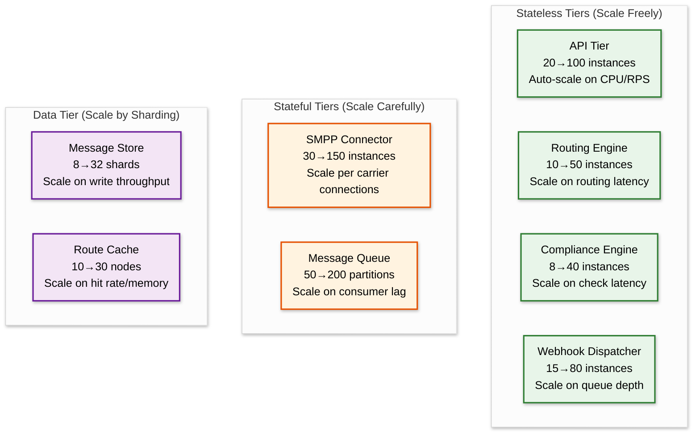
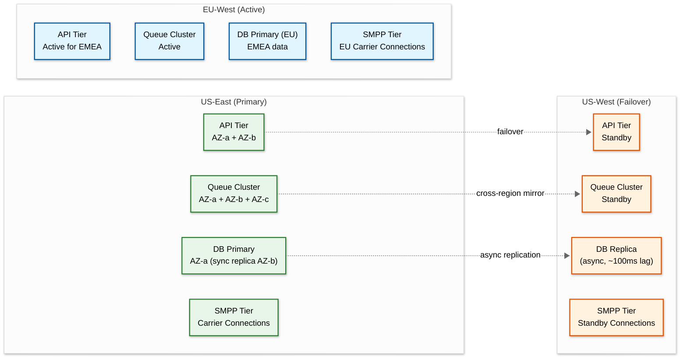

# Scalability & Reliability — SMS Gateway

## Scalability

### Horizontal Scaling Strategy



### Tier-by-Tier Scaling

| Tier | Scaling Dimension | Trigger | Mechanism | Constraint |
|---|---|---|---|---|
| **API Gateway** | Compute (CPU/memory) | CPU > 70% or RPS > threshold | Auto-scale group, 60s cooldown | Stateless; no constraint |
| **Routing Engine** | Compute + cache | Routing p99 > 5ms | Auto-scale; pre-warm route cache on new instances | Cache warm-up takes ~10s |
| **Compliance Engine** | Compute | Check latency > 10ms | Auto-scale; opt-out data replicated to all instances | Opt-out cache sync lag ~100ms |
| **SMPP Connector** | Connections | New carrier added or carrier TPS increased | Manual scaling; each instance manages specific carrier pools | SMPP connections are stateful (sticky) |
| **Message Queue** | Partitions + consumers | Consumer lag > 5 min | Add partitions + consumers; rebalance | Partition rebalance causes brief pause |
| **Webhook Dispatcher** | Compute + I/O | Queue depth > 10K or dispatch latency > 5s | Auto-scale; async I/O handles slow endpoints | Outbound connection limits per host |
| **Message Store** | Storage + write IOPS | Write throughput > 70% capacity | Add shards (online resharding with dual-write) | Resharding requires careful data migration |
| **Route Cache** | Memory | Hit rate < 95% or memory > 80% | Add nodes; consistent hashing redistributes | Brief cache miss spike during rebalance |

### Database Scaling Strategy

#### Write Path Optimization

```
Message write path (per message):
  1. INSERT message record → Primary shard (by hash(message_sid))
  2. INSERT carrier_id mapping → Correlation cache + async DB write
  3. UPDATE message status → Same shard (co-located by message_sid)
  4. INSERT DLR record → Same shard (co-located by message_sid)
  5. INSERT event log → Append-only (partition by time)

Total writes per message: 4-5 (amortized with batching)
```

**Write amplification mitigation:**
- Batch status updates every 100ms (group updates to same shard)
- Event log is append-only with sequential writes (optimal for LSM-trees)
- DLR records are write-once (no updates after initial insert)
- Use async replication for read replicas (analytics queries)

#### Read Path Optimization

```
Hot reads (sub-millisecond from cache):
  - Route decisions (carrier scores, route maps)
  - Opt-out checks (sender-recipient pairs)
  - Number metadata (type, capabilities, owner)
  - Carrier health scores

Warm reads (10ms from primary DB):
  - Message status lookups by message_sid
  - DLR correlation by carrier_message_id
  - Recent message history per account

Cold reads (100ms from read replicas):
  - Message search/filter queries
  - Campaign analytics
  - Billing aggregations
```

### Caching Architecture

| Cache Layer | Data | TTL | Size | Hit Rate Target |
|---|---|---|---|---|
| **L1: In-process** | Route table, carrier configs | 30s | 500 MB per instance | 99% |
| **L2: Distributed cache** | DLR correlation, opt-out lists, idempotency keys | 24-72h | 1.2 TB total | 97% |
| **L3: Read replicas** | Message records, account data | Real-time replication | Full dataset | 100% (it's the DB) |

### Hot Spot Mitigation

| Hot Spot | Cause | Mitigation |
|---|---|---|
| **Popular short code** | Bank OTP codes via single number | Partition by message_sid (random), not by number; secondary index for number queries |
| **Single carrier saturation** | Major US carrier during holiday | Pre-allocate burst TPS; spread across sub-accounts if carrier supports |
| **Webhook endpoint (slow)** | Customer endpoint degraded | Per-endpoint circuit breaker; queue webhooks during outage |
| **DLR flood from carrier** | Carrier sends batch of delayed DLRs | DLR processing has independent scaling; auto-scale on ingestion rate |
| **Campaign blast** | 10M messages from single customer | Customer-level rate limiting; campaign messages enqueued at marketing priority |

---

## Reliability & Fault Tolerance

### Single Points of Failure (SPOF) Analysis

| Component | SPOF Risk | Mitigation | Recovery Time |
|---|---|---|---|
| **API Gateway** | Low | Multi-AZ deployment, health-check-based routing | < 10s (instance replacement) |
| **Routing Engine** | Low | Stateless; multiple instances; route cache replicated | < 5s (traffic shifts to healthy instances) |
| **SMPP Connector** | Medium | Per-carrier connection pools on multiple instances; failover pools | 15-60s (reconnect to carrier) |
| **Message Queue** | Low | 3x replication, multi-AZ; no single broker failure loses data | < 30s (leader election) |
| **Message Database** | Low | Synchronous replication (2/3 quorum); multi-AZ | < 30s (automated failover) |
| **Carrier SMSC** | High (external) | Multi-carrier routing; automatic failover | Carrier-dependent (minutes to hours) |
| **DLR Cache** | Medium | Replicated across nodes; cache miss falls through to DB | < 10s (node replacement) |

### Redundancy Architecture



### Carrier Failover Strategy

```
FUNCTION carrier_failover(failed_carrier_id, destination_country):
    // 1. Get all alternate routes for this destination
    alternates = routing_table.get_routes(
        country=destination_country,
        exclude=[failed_carrier_id]
    )

    IF alternates IS EMPTY:
        ALERT_CRITICAL("No alternate routes for {destination_country}")
        RETURN QUEUE_WITH_RETRY  // Hold messages until carrier recovers

    // 2. Score alternates considering current load redistribution
    FOR each route IN alternates:
        current_utilization = get_carrier_utilization(route.carrier_id)
        available_tps = route.max_tps * (1 - current_utilization)
        route.overflow_score = available_tps * route.delivery_rate

    // 3. Distribute overflow traffic proportionally
    alternates.SORT_BY(overflow_score, DESC)
    overflow_tps = get_carrier_tps(failed_carrier_id)

    FOR each route IN alternates:
        allocated = MIN(route.available_tps * 0.8, overflow_tps)
        routing_engine.add_overflow_allocation(route, allocated)
        overflow_tps -= allocated
        IF overflow_tps <= 0:
            BREAK

    // 4. If overflow exceeds all alternate capacity
    IF overflow_tps > 0:
        ALERT_WARNING("Partial failover: {overflow_tps} TPS unallocated")
        // Queue excess at marketing priority (OTP/transactional still flows)

    // 5. Monitor and rebalance every 60 seconds
    SCHEDULE rebalance_check(failed_carrier_id, interval=60s)
```

### Circuit Breaker Implementation

| Component | Failure Threshold | Open Duration | Half-Open Behavior |
|---|---|---|---|
| **Carrier SMPP** | 5 consecutive failures or error rate > 30% in 60s | 60 seconds | Send 1 test message; if success → close, if fail → reopen |
| **Customer webhook** | 5 consecutive 5xx or timeouts | 60 seconds | Send 1 webhook; if success → close |
| **Database write** | 3 consecutive timeouts | 30 seconds | Single test write |
| **Cache node** | 2 consecutive timeouts | 15 seconds | Single test read |

### Retry Strategies

| Operation | Strategy | Schedule | Max Retries | Backoff |
|---|---|---|---|---|
| **SMPP submission** | Retry on same carrier, then failover | Immediate, 1s, 5s | 3 (same carrier) + 2 (alternate) | Exponential with jitter |
| **Webhook delivery** | Retry to same endpoint | 5s, 30s, 5m, 30m, 4h | 5 | Exponential |
| **Database write** | Retry to same shard | 100ms, 500ms, 2s | 3 | Exponential |
| **DLR processing** | Re-enqueue on failure | 1s, 5s, 30s | 3 | Exponential |
| **SMPP reconnection** | Reconnect to same carrier | 1s, 2s, 4s, ... 120s | 50 | Exponential capped at 120s |

### Graceful Degradation Modes

| Mode | Trigger | Behavior | Customer Impact |
|---|---|---|---|
| **Normal** | All systems healthy | Full functionality | None |
| **Carrier Degraded** | Single carrier down | Automatic rerouting via alternates | Slightly higher cost; possible 1-2% lower delivery rate |
| **Multi-Carrier Degraded** | Multiple carriers down | Priority-based queuing; OTP first | Marketing messages delayed 5-30 min |
| **Database Degraded** | Primary shard slow/down | Reads from replica; writes to WAL buffer | Status queries may show stale data for ~30s |
| **Queue Degraded** | Queue broker down | In-memory buffer (5-minute capacity); backpressure to API | API returns 503 if buffer full; messages in buffer safe for 5 min |
| **Emergency** | Major outage affecting 50%+ capacity | Accept only OTP/transactional; reject marketing | Marketing API returns 503 with Retry-After |

---

## Disaster Recovery

### Recovery Objectives

| Metric | Target | Justification |
|---|---|---|
| **RTO (Recovery Time Objective)** | 5 minutes (intra-region), 30 minutes (cross-region) | Messaging is time-sensitive; long outages lose message value |
| **RPO (Recovery Point Objective)** | 0 messages lost (intra-region), < 1 minute data lag (cross-region) | Synchronous replication within region; async cross-region |
| **MTTR (Mean Time to Recovery)** | < 15 minutes | Automated failover for most scenarios |

### Backup Strategy

| Data | Backup Frequency | Backup Method | Retention | Recovery Test |
|---|---|---|---|---|
| **Message database** | Continuous (WAL shipping) | Streaming replication + hourly snapshots | 30 days snapshots, 7 days WAL | Weekly automated restore test |
| **Configuration database** | Every 6 hours | Full snapshot + WAL | 90 days | Monthly |
| **Queue data** | Continuous (3x replication) | In-queue replication | In-queue (ephemeral by design) | N/A |
| **Carrier configurations** | On change (GitOps) | Version-controlled config repo | Indefinite (git history) | Every deployment |
| **Opt-out lists** | Daily full + continuous CDC | Snapshot + change data capture | Indefinite (compliance) | Weekly |

### Multi-Region Failover Procedure

```
AUTOMATIC FAILOVER (intra-region, AZ failure):
  1. Health check detects AZ-a failure (3 consecutive failures, 15s)
  2. Load balancer drains AZ-a instances (30s)
  3. Auto-scaler launches replacement instances in AZ-b/c (60s)
  4. Database promotes AZ-b synchronous replica (10s)
  5. SMPP connections re-established from healthy AZ (30-60s)
  Total RTO: ~2-3 minutes

MANUAL FAILOVER (cross-region, full region failure):
  1. On-call confirms region failure (not a monitoring false positive)
  2. DNS failover triggered (Route 53 health check or manual)
  3. Standby region promoted to active
  4. Database in standby region promoted to primary
  5. SMPP connections established from new region
  6. Queue consumers start processing from cross-region mirror
  Total RTO: ~15-30 minutes
  RPO: < 1 minute (async replication lag)
```

### Data Consistency During Failover

| Scenario | Consistency Risk | Mitigation |
|---|---|---|
| **Message accepted but not yet queued** | Message in API tier memory, not yet persisted | API returns 202 only after queue insertion confirmed |
| **Message queued but not submitted** | Queue replication handles this | 3x replication ensures 0 message loss for AZ failure |
| **Message submitted, DLR pending** | DLR may arrive at old region | DLR re-routing takes effect within 60s of failover |
| **Cross-region failover with async lag** | Last ~1 min of messages may be missing in DR region | Reconciliation job runs post-failover, replaying missing messages from source WAL |

---

## Capacity Planning for Growth

### Scaling Milestones

| Scale Point | Daily Volume | Key Changes Needed |
|---|---|---|
| **Startup** | 1M msgs/day | Single-region, 2-3 carriers, monolithic service |
| **Growth** | 100M msgs/day | Microservices split, 20+ carriers, multi-AZ |
| **Scale** | 1B msgs/day | Multi-region, 100+ carriers, dedicated SMPP tier |
| **Hyper-scale** | 5B msgs/day | Edge routing, 400+ carriers, per-country routing engines |
| **Global** | 10B+ msgs/day | Full geo-distributed architecture, carrier-local PoPs |

### Cost Optimization at Scale

| Strategy | Savings | Implementation |
|---|---|---|
| **Volume-committed carrier pricing** | 20-40% per message | Negotiate annual volume commitments with top 10 carriers |
| **Intelligent route selection** | 10-15% cost reduction | LCR algorithm continuously optimizes cost vs. delivery rate |
| **Off-peak scheduling** | 5-10% infrastructure savings | Encourage customers to schedule non-urgent messages during off-peak |
| **Concatenation optimization** | 5-8% segment savings | Smart truncation suggestions; GSM-7 character substitution (é → e) |
| **Connection pooling efficiency** | 15-20% infra savings | Right-size SMPP connections per carrier based on actual utilization |

---

*Next: [Security & Compliance ->](./06-security-and-compliance.md)*
