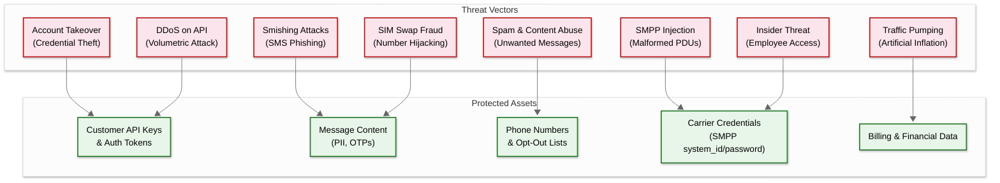
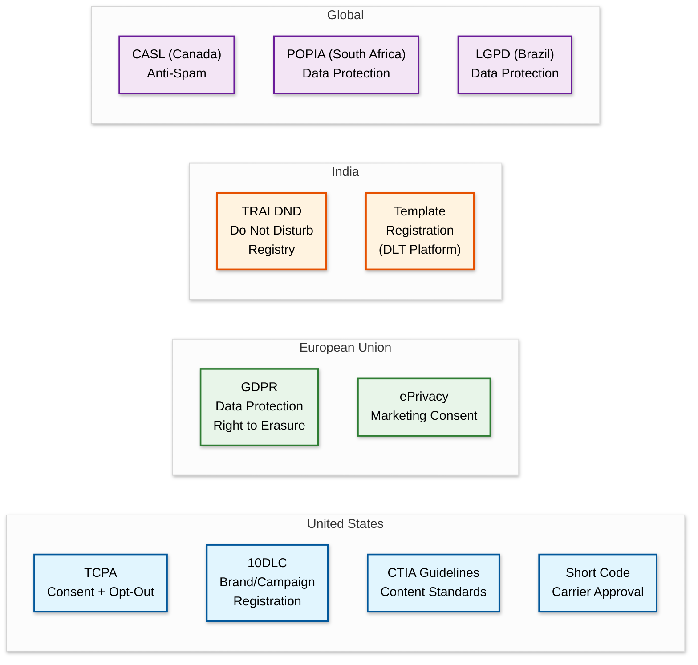

# Security & Compliance — SMS Gateway

## Threat Model

### System Threat Landscape



### Top Attack Vectors

| # | Attack | Likelihood | Impact | Risk Score |
|---|---|---|---|---|
| 1 | **Traffic Pumping (Artificially Inflated Traffic)** | High | High | Critical |
| 2 | **Smishing (SMS Phishing)** | High | High | Critical |
| 3 | **Account Credential Compromise** | Medium | High | High |
| 4 | **Spam / Unsolicited Messaging** | High | Medium | High |
| 5 | **DDoS on Message API** | Medium | Medium | Medium |
| 6 | **SMPP Connection Hijacking** | Low | Critical | Medium |
| 7 | **Message Content Interception** | Low | High | Medium |

### Attack Details and Mitigations

#### 1. Traffic Pumping (Artificially Inflated Traffic)

**How it works:** A fraudster creates an account, sends SMS to premium-rate numbers or specific international destinations. The receiving carrier gets paid per message and shares revenue with the fraudster. The platform (and its customer) bears the cost.

**Mitigation stack:**
- **Velocity checks**: Alert on accounts sending > 1000 messages/hour to known pumping destinations
- **Destination analysis**: Maintain a dynamic list of high-risk number ranges (premium-rate, satellite, certain country codes)
- **New account limits**: Progressive trust model—new accounts limited to 100 messages/day, increasing with verified identity
- **ML anomaly detection**: Model trained on normal traffic patterns flags deviations (e.g., sudden spike to unusual destinations)
- **Fraud scoring**: Real-time per-message fraud score combining account age, destination risk, volume, and time pattern
- **Financial controls**: Pre-paid accounts for unverified customers; spending alerts and hard caps

#### 2. Smishing (SMS Phishing)

**How it works:** Attackers use the platform to send phishing messages impersonating banks, delivery services, or government agencies to trick recipients into clicking malicious links or sharing credentials.

**Mitigation stack:**
- **URL scanning**: All URLs in message bodies checked against phishing databases in real-time
- **Content classification**: ML model classifies messages into categories (OTP, transactional, marketing) and flags suspicious content patterns
- **Brand impersonation detection**: Check for known brand names used by unverified senders
- **Sender verification**: 10DLC/TCR registration verifies sender identity and use case
- **Post-send monitoring**: Track click-through rates on URLs; abnormal patterns trigger review
- **Regulatory reporting**: Automated reporting of confirmed smishing to carrier abuse teams

#### 3. Account Credential Compromise

**Mitigation:**
- API key rotation support with zero-downtime key rollover
- IP allowlisting per API key
- Anomaly detection on API usage patterns (unusual source IPs, volume spikes)
- Webhook signing with HMAC-SHA256 to prevent spoofing
- Two-factor authentication for dashboard access
- Audit logs for all credential changes

---

## Authentication & Authorization

### Customer Authentication

| Method | Use Case | Implementation |
|---|---|---|
| **API Key + Secret** | Server-to-server API calls | Account SID + Auth Token in HTTP Basic header |
| **OAuth 2.0** | Third-party integrations, dashboard SSO | Authorization code flow with PKCE |
| **API Key (scoped)** | Limited-permission keys for specific services | Fine-grained permissions (send-only, read-only, admin) |
| **Webhook Signature** | Verify webhooks are from platform | HMAC-SHA256 of payload with account's signing secret |

### API Key Architecture

```
API Request Authentication Flow:

1. Extract credentials from Authorization header
   - Basic Auth: base64(account_sid:auth_token)
   - Bearer Token: JWT for OAuth 2.0 flow

2. Validate credentials:
   - Hash auth_token with bcrypt
   - Compare against stored hash
   - Check key is active and not expired

3. Load account permissions:
   - Account tier (determines TPS limits)
   - Key-specific permissions (send, read, admin)
   - IP allowlist (if configured)

4. Rate limit check:
   - Per-account sliding window
   - Per-key sliding window (if stricter)
   - Return 429 if exceeded

5. Request proceeds to service layer
```

### Authorization Model (RBAC)

| Role | Permissions | Typical User |
|---|---|---|
| **Owner** | Full access: send, read, admin, billing, user management | Account creator |
| **Admin** | Send, read, admin (no billing) | DevOps engineer |
| **Developer** | Send, read (no admin) | Application developer |
| **Viewer** | Read-only (no send, no admin) | Business analyst |
| **API Key (scoped)** | Custom subset per key | Service-specific integration |

### Carrier Authentication

| Protocol | Auth Method | Credential Storage |
|---|---|---|
| **SMPP** | system_id + password in bind PDU | Encrypted at rest in HSM-backed secret manager |
| **SMPP over TLS** | Mutual TLS + SMPP credentials | Client certificates rotated quarterly |
| **HTTP carrier APIs** | OAuth 2.0 client credentials | Tokens rotated automatically on expiry |
| **SS7/SIGTRAN** | Network-level (IP allowlisting + point codes) | Carrier-managed |

---

## Data Security

### Encryption

| Layer | Mechanism | Details |
|---|---|---|
| **In transit (customer → platform)** | TLS 1.3 | Minimum TLS 1.2; HSTS enforced; certificate pinning for SDKs |
| **In transit (platform → carrier)** | SMPP over TLS where supported | Fallback to plain SMPP with IP-restricted connections |
| **At rest (message content)** | AES-256-GCM | Message bodies encrypted with per-account keys; key managed by HSM |
| **At rest (credentials)** | AES-256 with envelope encryption | Master key in HSM; data encryption keys rotated monthly |
| **Database backups** | AES-256 | Server-side encryption on object storage; separate keys from primary |
| **Log sanitization** | PII redaction | Phone numbers truncated (+1415***1234); message bodies stripped from logs |

### PII Handling

| Data Element | Classification | Handling | Retention |
|---|---|---|---|
| **Phone numbers** | PII | Stored in E.164 format; masked in logs; encrypted at rest | Duration of account + 30 days |
| **Message body** | PII/Sensitive | Encrypted at rest; not logged; not included in analytics | 30 days then purged |
| **OTP codes** | Highly sensitive | Never logged; encrypted in transit and at rest; auto-purge after delivery | 24 hours max |
| **Customer IP addresses** | PII | Logged for security; excluded from analytics | 90 days |
| **Opt-out records** | Compliance data | Stored indefinitely per TCPA | Indefinite |

### Data Isolation

- **Multi-tenant isolation**: Account data isolated by `account_sid` prefix on all queries; no cross-account data access
- **Carrier credential isolation**: Each carrier's SMPP credentials stored in separate secret manager paths; access audited
- **Regional data residency**: EU customer message data stays in EU region; configurable per account for GDPR compliance

---

## Compliance Framework

### Regulatory Landscape



### TCPA Compliance (United States)

| Requirement | Implementation |
|---|---|
| **Prior express consent** | Platform requires customers to attest consent; provides consent management APIs |
| **Opt-out honored within 10 business days** | Instant opt-out processing (< 1 second); exceeds legal requirement |
| **STOP keyword processing** | Automatic: STOP, STOPALL, UNSUBSCRIBE, CANCEL, END, QUIT |
| **HELP keyword processing** | Automatic: HELP, INFO → sends configured help message |
| **Time-of-day restrictions** | No marketing messages before 8 AM or after 9 PM recipient's local time |
| **Caller ID / Sender identification** | All messages must identify the sender |
| **Record keeping** | Consent records retained for duration of customer relationship + 4 years |
| **Penalty exposure** | $500-$1,500 per message for violations |

### 10DLC Registration Pipeline

```
FUNCTION register_10dlc_campaign(account, brand_info, campaign_info):
    // Step 1: Register brand with The Campaign Registry (TCR)
    brand = tcr_api.create_brand({
        company_name: brand_info.name,
        ein: brand_info.ein,
        vertical: brand_info.vertical,
        website: brand_info.website,
        country: "US"
    })
    // Brand vetting: 1-7 business days
    // Vetting score: 0-100 (higher = more trust = higher TPS)

    // Step 2: Register campaign
    campaign = tcr_api.create_campaign({
        brand_id: brand.id,
        use_case: campaign_info.use_case,  // marketing, transactional, otp, etc.
        sample_messages: campaign_info.samples,
        message_flow: campaign_info.flow_description,
        opt_in_keywords: ["START", "YES"],
        opt_out_keywords: ["STOP"],
        help_keywords: ["HELP"],
        subscriber_opt_in: TRUE,
        embedded_link: campaign_info.has_links,
        embedded_phone: campaign_info.has_phones,
        age_gated: FALSE
    })
    // Campaign review: 1-3 business days

    // Step 3: Register with carriers (automatic via TCR)
    // Each carrier (AT&T, T-Mobile, Verizon) reviews independently
    // Approval grants carrier-specific TPS limits

    // Step 4: Associate phone numbers with campaign
    FOR each number IN campaign_info.phone_numbers:
        tcr_api.assign_number(campaign.id, number)

    RETURN {
        brand_id: brand.id,
        campaign_id: campaign.id,
        status: "pending_review",
        estimated_completion: "5-10 business days"
    }
```

### 10DLC TPS Limits by Trust Score

| Brand Vetting Score | AT&T TPS | T-Mobile TPS | Use Case |
|---|---|---|---|
| 0-24 (Low) | 1 msg/sec | 2,000 msgs/day | Small/unverified businesses |
| 25-49 (Medium) | 4 msg/sec | 10,000 msgs/day | Standard businesses |
| 50-74 (High) | 10 msg/sec | Unlimited* | Verified enterprises |
| 75-100 (Very High) | 75 msg/sec | Unlimited* | Top-tier brands |

*Subject to network capacity

### GDPR Compliance (European Union)

| Requirement | Implementation |
|---|---|
| **Right to erasure (Article 17)** | API endpoint to delete all message records, phone numbers, and metadata for a given recipient |
| **Data minimization** | Message body purged after 30 days; only metadata retained for billing |
| **Lawful basis for processing** | Customer attests legal basis (consent or legitimate interest) per campaign |
| **Data processing agreement** | Standard DPA available; platform is data processor, customer is data controller |
| **Data residency** | EU accounts' data stored exclusively in EU region |
| **Breach notification** | Automated detection and notification within 72 hours |
| **Data portability** | Export API for all account data in machine-readable format |

### Content Filtering Engine

```
FUNCTION filter_message_content(message, account, campaign):
    violations = []

    // 1. Opt-out check (highest priority)
    IF is_opted_out(message.from, message.to, account.sid):
        violations.APPEND({
            code: "OPT_OUT",
            severity: "BLOCK",
            message: "Recipient has opted out from this sender"
        })
        RETURN {pass: FALSE, violations: violations}

    // 2. Time-of-day check (TCPA)
    IF campaign.use_case == "marketing":
        recipient_tz = lookup_timezone(message.to)
        recipient_local_time = convert_to_tz(now(), recipient_tz)
        IF recipient_local_time.hour < 8 OR recipient_local_time.hour >= 21:
            violations.APPEND({
                code: "TCPA_TIME",
                severity: "BLOCK",
                message: "Marketing messages prohibited outside 8AM-9PM"
            })

    // 3. URL scanning
    urls = extract_urls(message.body)
    FOR each url IN urls:
        IF is_phishing_url(url) OR is_malware_url(url):
            violations.APPEND({
                code: "MALICIOUS_URL",
                severity: "BLOCK",
                message: "Message contains blocked URL"
            })

    // 4. Content classification
    content_score = classify_content(message.body)
    IF content_score.spam_probability > 0.9:
        violations.APPEND({
            code: "SPAM_DETECTED",
            severity: "BLOCK",
            message: "Message classified as spam"
        })

    // 5. Prohibited content categories
    IF contains_prohibited_content(message.body):
        // SHAFT: Sex, Hate, Alcohol, Firearms, Tobacco
        violations.APPEND({
            code: "PROHIBITED_CONTENT",
            severity: "BLOCK",
            message: "Message contains prohibited content category"
        })

    // 6. 10DLC campaign compliance
    IF message.sender_type == "10dlc":
        IF NOT campaign.tcr_approved:
            violations.APPEND({
                code: "10DLC_NOT_REGISTERED",
                severity: "BLOCK",
                message: "10DLC campaign not yet approved"
            })

    // 7. Rate limit per sender number
    IF exceeds_number_rate_limit(message.from):
        violations.APPEND({
            code: "NUMBER_RATE_LIMIT",
            severity: "THROTTLE",
            message: "Sender number exceeding carrier rate limit"
        })

    has_blocking = ANY(v.severity == "BLOCK" FOR v IN violations)
    RETURN {pass: NOT has_blocking, violations: violations}
```

---

## Fraud Detection

### Traffic Pumping Detection

```
FUNCTION detect_traffic_pumping(account_sid, time_window=1h):
    recent_messages = get_recent_messages(account_sid, time_window)

    // Signal 1: High concentration to known pumping ranges
    dest_distribution = group_by_prefix(recent_messages, prefix_length=5)
    FOR each prefix, count IN dest_distribution:
        IF prefix IN known_pumping_ranges AND count > PUMPING_THRESHOLD:
            RETURN ALERT("Traffic pumping suspected",
                         account=account_sid, prefix=prefix, count=count)

    // Signal 2: Unusually high international traffic from domestic account
    intl_ratio = count_international(recent_messages) / len(recent_messages)
    IF intl_ratio > 0.8 AND account.primary_use == "domestic":
        RETURN ALERT("Unusual international traffic pattern",
                     account=account_sid, intl_ratio=intl_ratio)

    // Signal 3: Sequential number dialing
    sorted_numbers = sort(recent_messages.to_numbers)
    sequential_count = count_sequential_numbers(sorted_numbers)
    IF sequential_count > 50:
        RETURN ALERT("Sequential number pattern detected",
                     account=account_sid, sequential=sequential_count)

    // Signal 4: New account with sudden high volume
    IF account.age_days < 30 AND len(recent_messages) > NEW_ACCOUNT_THRESHOLD:
        RETURN ALERT("New account high volume",
                     account=account_sid, volume=len(recent_messages))
```

### Audit Logging

| Event Category | Events Logged | Retention |
|---|---|---|
| **Authentication** | Login attempts, API key usage, key creation/rotation | 1 year |
| **Authorization** | Permission changes, role assignments | 2 years |
| **Message operations** | Send, receive, status changes (metadata only, no content) | 7 years |
| **Compliance** | Opt-out events, content blocks, campaign registrations | 7 years |
| **Administrative** | Account changes, number provisioning, carrier config changes | 7 years |
| **Security** | Suspicious activity alerts, fraud blocks, IP blocklist changes | 5 years |

---

*Next: [Observability ->](./07-observability.md)*
