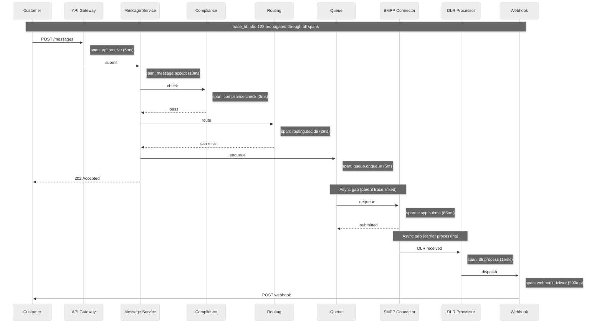

# Observability — SMS Gateway

## Observability Philosophy

SMS gateway observability must answer three questions at all times:
1. **Are messages flowing?** (System health)
2. **Are messages arriving?** (Delivery effectiveness)
3. **Where are messages stuck?** (Bottleneck identification)

The unique challenge is that the system's most important outcome—message delivery—is confirmed by external systems (carriers) via asynchronous DLRs. Observability must account for this delayed feedback loop.

---

## Key Metrics (USE/RED Framework)

### API Tier Metrics (RED)

| Metric | Description | Good | Warning | Critical |
|---|---|---|---|---|
| **Request Rate** | API requests per second | < 40K/sec | 40-45K/sec | > 45K/sec |
| **Error Rate** | 4xx + 5xx responses / total | < 1% | 1-5% | > 5% |
| **Duration (p50)** | API response latency | < 50ms | 50-100ms | > 100ms |
| **Duration (p99)** | API tail latency | < 200ms | 200-500ms | > 500ms |
| **Acceptance Rate** | Messages accepted / submitted | > 98% | 95-98% | < 95% |

### Carrier Tier Metrics (USE)

| Metric | Description | Good | Warning | Critical |
|---|---|---|---|---|
| **Utilization (TPS)** | Current TPS / Max TPS per carrier | < 70% | 70-90% | > 90% |
| **Saturation (Queue Depth)** | Messages waiting per carrier | < 1,000 | 1K-10K | > 10K |
| **Errors (Submission)** | Failed submit_sm / total per carrier | < 2% | 2-5% | > 5% |
| **Connection Health** | Active connections / expected per carrier | > 95% | 80-95% | < 80% |
| **SMPP Latency (p50)** | Time for submit_sm_resp | < 100ms | 100-500ms | > 500ms |
| **SMPP Latency (p99)** | Tail latency per carrier | < 1s | 1-3s | > 3s |
| **Window Utilization** | In-flight PDUs / window size | < 60% | 60-85% | > 85% |

### Delivery Metrics (Business)

| Metric | Description | Good | Warning | Critical |
|---|---|---|---|---|
| **Delivery Rate** | Messages delivered / submitted (within 60s) | > 95% | 90-95% | < 90% |
| **DLR Coverage** | Messages with final DLR / total submitted | > 90% | 80-90% | < 80% |
| **Time to Deliver (p50)** | Submission to delivery confirmation | < 5s | 5-30s | > 30s |
| **Time to Deliver (p99)** | Tail delivery time | < 60s | 60-300s | > 300s |
| **Unknown Rate** | Messages stuck in "unknown" (no DLR) | < 5% | 5-15% | > 15% |
| **Reroute Rate** | Messages rerouted due to carrier failure | < 2% | 2-5% | > 5% |

### Webhook Metrics

| Metric | Description | Good | Warning | Critical |
|---|---|---|---|---|
| **Dispatch Rate** | Webhooks dispatched per second | < 25K/sec | 25-28K/sec | > 28K/sec |
| **Success Rate** | 2xx responses / total dispatched | > 98% | 95-98% | < 95% |
| **Dispatch Latency (p50)** | Time from DLR to webhook delivery | < 1s | 1-5s | > 5s |
| **Retry Rate** | Webhooks requiring retry / total | < 5% | 5-15% | > 15% |
| **DLQ Volume** | Webhooks in dead letter queue | < 1,000 | 1K-10K | > 10K |

---

## Dashboard Design

### Executive Dashboard

```
┌─────────────────────────────────────────────────────────────┐
│  SMS Gateway — Executive Overview                           │
├─────────────────────────────────────────────────────────────┤
│                                                             │
│  Messages Today:  847M / 1B target    ████████░░ 84.7%     │
│  Delivery Rate:   96.2%               ████████████████████  │
│  API Availability: 99.997%            ████████████████████  │
│  Revenue Today:   $634K               ███████████████░░░░░  │
│                                                             │
├─────────────┬──────────────┬────────────────────────────────┤
│  Top Routes │  Carrier     │  Volume    │ Delivery │ Cost   │
│  US→AT&T    │  Carrier A   │  152M      │ 97.1%    │ $0.006 │
│  US→T-Mob   │  Carrier A   │  138M      │ 96.8%    │ $0.007 │
│  UK→Voda    │  Carrier C   │  45M       │ 94.5%    │ $0.035 │
│  IN→Reli    │  Aggregator  │  89M       │ 92.1%    │ $0.012 │
├─────────────┴──────────────┴────────────────────────────────┤
│  Alerts: 2 Warning (Carrier B latency elevated)             │
│          0 Critical                                         │
└─────────────────────────────────────────────────────────────┘
```

### Carrier Health Dashboard

```
┌─────────────────────────────────────────────────────────────┐
│  Carrier Health — Real-Time                                 │
├─────────────────────────────────────────────────────────────┤
│                                                             │
│  Carrier A  [●] HEALTHY   TPS: 3,400/5,000  Queue: 234     │
│    ├─ Connections: 48/50 active                             │
│    ├─ Delivery Rate (1h): 97.2%                             │
│    ├─ Avg Latency: 85ms                                     │
│    └─ Error Rate: 0.3%                                      │
│                                                             │
│  Carrier B  [◐] DEGRADED  TPS: 1,200/3,000  Queue: 8,432   │
│    ├─ Connections: 28/30 active                             │
│    ├─ Delivery Rate (1h): 89.1%  ⚠ Below threshold         │
│    ├─ Avg Latency: 2,340ms  ⚠ Elevated                     │
│    └─ Error Rate: 4.7%  ⚠ Elevated                         │
│                                                             │
│  Carrier C  [●] HEALTHY   TPS: 890/2,000   Queue: 56       │
│    ├─ Connections: 20/20 active                             │
│    ├─ Delivery Rate (1h): 95.8%                             │
│    ├─ Avg Latency: 120ms                                    │
│    └─ Error Rate: 0.8%                                      │
│                                                             │
│  Aggregator X [●] HEALTHY TPS: 450/1,000   Queue: 12       │
│    └─ All metrics nominal                                   │
└─────────────────────────────────────────────────────────────┘
```

### Message Pipeline Dashboard

```
┌─────────────────────────────────────────────────────────────┐
│  Message Pipeline — Flow Visualization                      │
├─────────────────────────────────────────────────────────────┤
│                                                             │
│  API Ingest ──► Compliance ──► Routing ──► Queue ──► SMPP   │
│    35K/s         34.8K/s       34.5K/s     34.5K/s  33.2K/s│
│   [████]         [████]        [████]      [████]   [███░]  │
│                                                             │
│  Drop Points:                                               │
│    Compliance blocks: 200/sec (0.6%)                        │
│    Routing failures:  50/sec  (0.1%)                        │
│    SMPP errors:       300/sec (0.9%)                        │
│    Total drop rate:   1.6%                                  │
│                                                             │
│  Queue Depths:                                              │
│    OTP:           45 messages   (avg wait: 0.1s)            │
│    Transactional: 1,230 messages (avg wait: 2.1s)           │
│    Marketing:     34,500 messages (avg wait: 45s)           │
│                                                             │
│  DLR Pipeline:                                              │
│    Ingest: 51K/sec | Process: 50.8K/sec | Lag: 200ms       │
│    Orphaned DLRs: 12/min | Timeout (72h): 4.2%             │
└─────────────────────────────────────────────────────────────┘
```

---

## Logging Strategy

### Log Categories

| Category | Level | Content | Volume | Retention |
|---|---|---|---|---|
| **API Access** | INFO | Method, path, status, latency, account_sid | 45K events/sec | 30 days |
| **Message Lifecycle** | INFO | message_sid, status transitions, carrier_id | 35K events/sec | 90 days |
| **SMPP Protocol** | DEBUG | PDU details, sequence numbers, carrier responses | 100K events/sec | 7 days |
| **Compliance Blocks** | WARN | message_sid, block reason, violation details | 200 events/sec | 1 year |
| **Carrier Errors** | ERROR | carrier_id, error code, connection state | 500 events/sec | 90 days |
| **Security Events** | WARN/ERROR | Auth failures, fraud alerts, rate limit hits | 50 events/sec | 1 year |
| **System Health** | INFO | Component heartbeats, resource utilization | 1K events/sec | 30 days |

### Structured Log Format

```
{
    "timestamp": "2026-03-09T14:30:00.123Z",
    "level": "INFO",
    "service": "smpp-connector",
    "instance": "smpp-us-east-01",
    "trace_id": "abc123def456",
    "span_id": "789ghi",
    "message_sid": "SM1234567890",
    "carrier_id": "carrier-a",
    "event": "submit_sm_resp_received",
    "carrier_message_id": "4567890",
    "command_status": "0x00000000",
    "latency_ms": 85,
    "connection_id": "conn-42",
    "sequence_number": 12345,
    "window_utilization": 0.35
}
```

### What NOT to Log

| Data | Reason | Alternative |
|---|---|---|
| Message body content | PII; legal liability | Log message length and encoding only |
| Full phone numbers | PII | Log truncated: +1415***1234 |
| SMPP passwords | Security | Never log credentials; use references only |
| API auth tokens | Security | Log key_id only, never the secret |
| OTP codes | Security | Log "OTP message sent" without the code |

---

## Distributed Tracing

### Trace Propagation



### Key Spans to Instrument

| Span | Service | Key Attributes | SLO |
|---|---|---|---|
| `api.receive` | API Gateway | account_sid, method, status_code | p99 < 200ms |
| `message.accept` | Message Service | message_sid, segment_count, encoding | p99 < 50ms |
| `compliance.check` | Compliance Engine | check_type, result (pass/block), block_reason | p99 < 10ms |
| `routing.decide` | Routing Engine | carrier_id, route_score, alternatives_count | p99 < 5ms |
| `queue.enqueue` | Message Queue | carrier_partition, queue_depth, priority | p99 < 20ms |
| `smpp.submit` | SMPP Connector | carrier_id, connection_id, command_status, latency | p99 < 1s |
| `dlr.correlate` | DLR Processor | carrier_message_id, correlation_hit (cache/db) | p99 < 50ms |
| `dlr.normalize` | DLR Processor | carrier_status, normalized_status, is_final | p99 < 5ms |
| `webhook.deliver` | Webhook Dispatcher | endpoint_url, http_status, attempt_number | p99 < 5s |

### Async Trace Linking

SMS message processing spans two asynchronous boundaries:
1. **API acceptance → carrier submission** (queue-mediated): The trace_id is embedded in the queue message as a header, allowing the SMPP connector to create child spans linked to the original trace.
2. **Carrier submission → DLR receipt** (external system): The `(carrier_id, carrier_message_id) → message_sid` mapping also stores the original trace_id, enabling DLR processing spans to link back to the submission trace.

This creates an end-to-end trace from API receipt through carrier delivery and back to webhook dispatch, despite crossing two async boundaries and an external system.

---

## Alerting Strategy

### Critical Alerts (Page-Worthy)

| Alert | Condition | Response Time | Runbook |
|---|---|---|---|
| **Platform API down** | Availability < 99.9% for 5 min | Immediate (auto-page) | Verify LB health → check API instances → check DB connectivity |
| **All carrier connections down** | 0 healthy SMPP connections for any major carrier for 5 min | Immediate (auto-page) | Check carrier status → verify credentials → attempt manual rebind |
| **Message queue growing unbounded** | Queue depth > 100K and increasing for 10 min | 5 min response | Check consumer health → verify SMPP submission → check carrier TPS |
| **Delivery rate crash** | Delivery rate < 80% for 15 min | 5 min response | Check carrier DLR patterns → verify routing → check for carrier issues |
| **Fraud spike detected** | Traffic pumping score > 0.95 for any account | 5 min response | Review account → block if confirmed → notify customer |
| **Database primary down** | Primary shard unreachable for 30s | Immediate | Verify replica promotion → check data consistency → notify |

### Warning Alerts (Team Channel)

| Alert | Condition | Evaluation |
|---|---|---|
| **Carrier degraded** | Single carrier delivery rate < 90% or latency > 2s for 10 min | Every 1 min |
| **DLR processing lag** | DLR consumer lag > 5 min | Every 1 min |
| **Webhook failure rate high** | Single customer webhook > 50% failure rate for 30 min | Every 5 min |
| **Approaching TPS limit** | Any carrier > 85% TPS utilization for 15 min | Every 1 min |
| **Cache hit rate declining** | Route cache hit rate < 90% for 10 min | Every 5 min |
| **Queue priority inversion** | OTP messages queued > 10s while marketing flowing | Every 30s |
| **Certificate expiration** | Carrier TLS cert expiring within 14 days | Daily check |

### Informational Alerts (Dashboard Only)

| Alert | Condition |
|---|---|
| **New carrier route activated** | First message successfully routed through new carrier path |
| **Carrier TPS adjustment** | Carrier TPS limit changed (auto-tuned or manual) |
| **10DLC campaign approved** | Customer campaign registration approved by TCR |
| **Daily volume milestone** | Daily volume crosses 500M, 750M, 1B thresholds |

---

## Health Check Endpoints

### Service Health

```
GET /health
Response: 200 OK
{
    "status": "healthy",
    "timestamp": "2026-03-09T14:30:00Z",
    "components": {
        "api": "healthy",
        "message_queue": "healthy",
        "message_database": "healthy",
        "cache": "healthy",
        "smpp_connections": "degraded",  // one carrier has issues
        "webhook_dispatcher": "healthy"
    },
    "carriers": {
        "total": 42,
        "healthy": 41,
        "degraded": 1,
        "down": 0
    }
}
```

### Deep Health Check (Internal Only)

```
GET /health/deep
Response: 200 OK
{
    "database_write_latency_ms": 3.2,
    "database_read_latency_ms": 1.1,
    "cache_hit_rate": 0.973,
    "queue_consumer_lag_ms": 450,
    "smpp_active_connections": 1287,
    "smpp_total_expected": 1300,
    "dlr_processing_lag_ms": 200,
    "webhook_queue_depth": 342,
    "uptime_seconds": 864000
}
```

---

## Anomaly Detection

### Automated Anomaly Detection Signals

| Signal | Method | Baseline | Anomaly Threshold |
|---|---|---|---|
| **Volume per account** | Rolling 7-day average | Per-account historical | > 3x baseline for 30 min |
| **Destination distribution** | Entropy analysis | Normal traffic entropy | Entropy drop > 50% (concentration) |
| **Delivery rate per carrier** | EWMA (exponential weighted moving average) | 7-day weighted average | > 2 standard deviations below |
| **Error code distribution** | Chi-squared test | Historical error code frequencies | p-value < 0.01 |
| **API latency** | Percentile tracking | 7-day p99 baseline | Current p99 > 2x baseline |

### Capacity Forecasting

- **Short-term (hours)**: Exponential smoothing on per-carrier queue depth to predict queue overflow
- **Medium-term (days)**: Trend analysis on daily volume to anticipate carrier TPS increases needed
- **Long-term (months)**: Linear regression on monthly volume growth for capacity planning

---

*Next: [Interview Guide ->](./08-interview-guide.md)*
