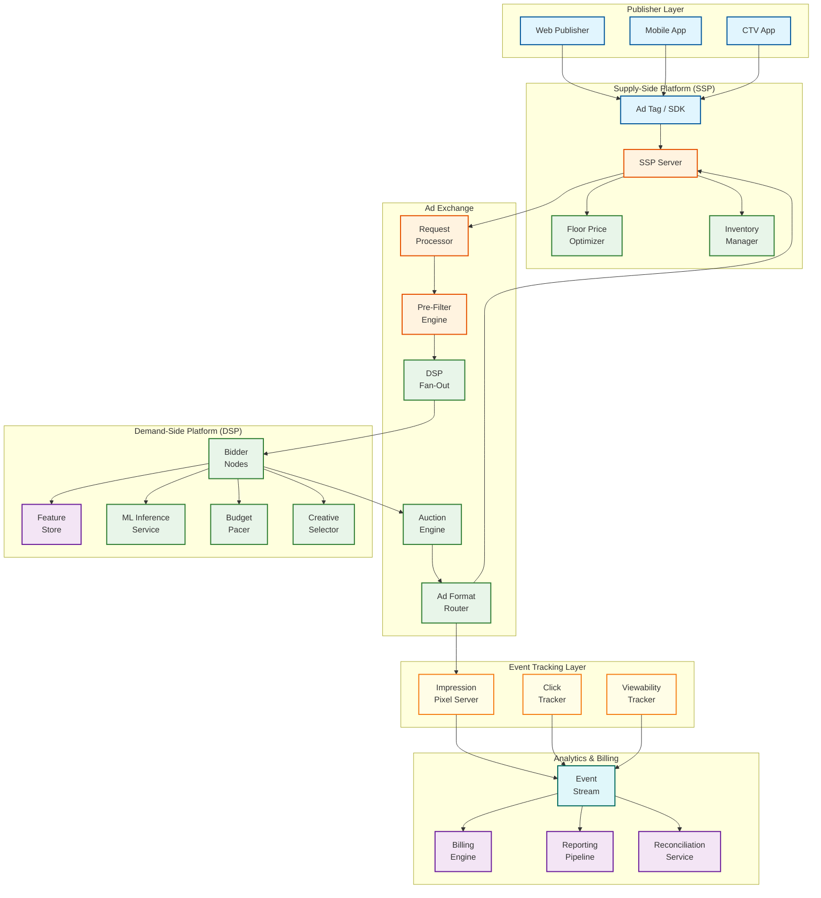
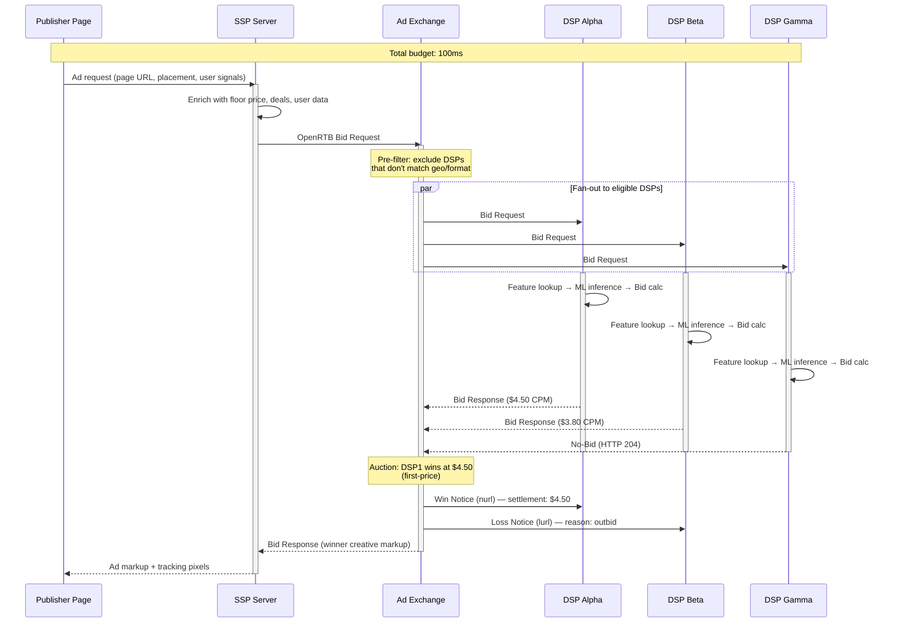
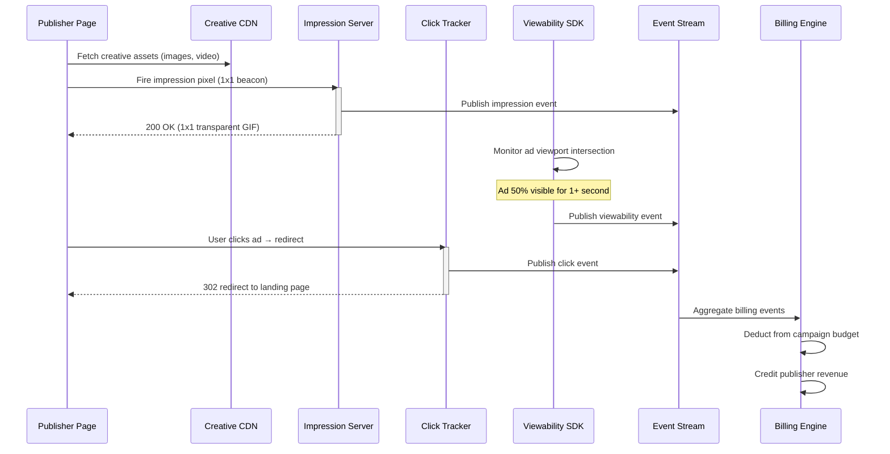
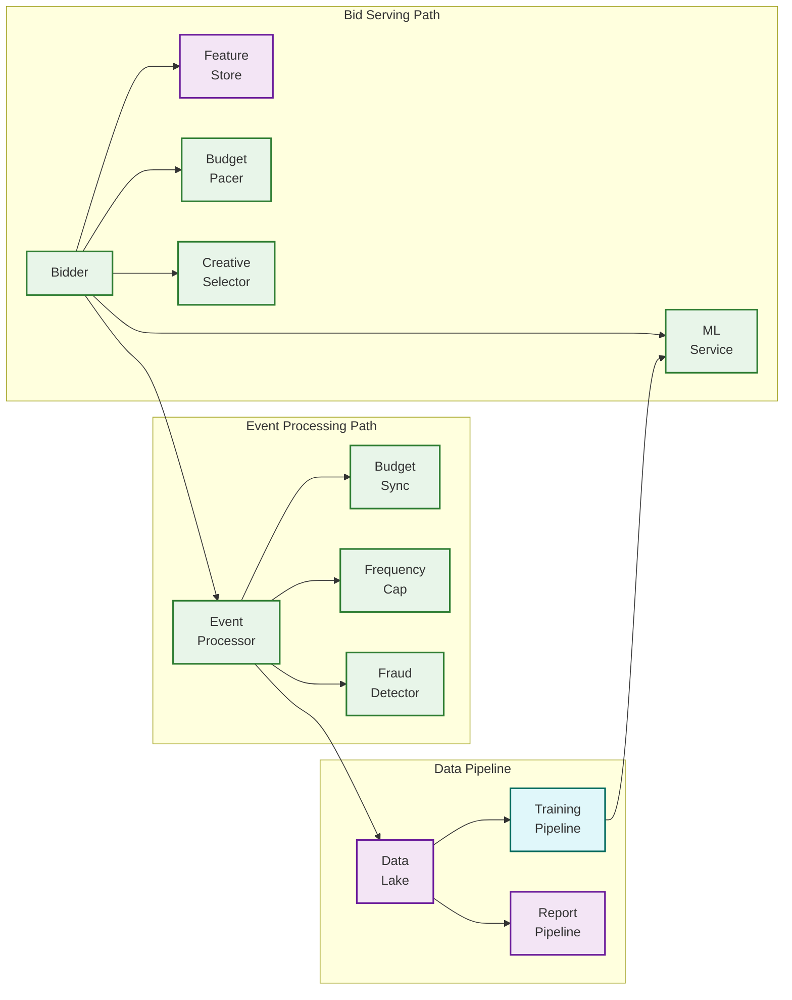

# High-Level Design — RTB System

## 1. Architecture Overview

The RTB system operates as a multi-party distributed marketplace with three primary domains: the **Supply Side** (publishers and SSPs), the **Exchange** (auction execution), and the **Demand Side** (DSPs and advertisers). Each domain is an independent system, but they interoperate via the OpenRTB protocol within a strict 100ms latency envelope.



---

## 2. Bid Request Lifecycle

The complete lifecycle of a single ad impression spans three phases: **auction** (synchronous, <100ms), **rendering** (client-side, 100-500ms), and **tracking** (asynchronous, seconds to days).

### 2.1 Phase 1 — Auction (Synchronous)



### 2.2 Phase 2 — Rendering & Tracking (Asynchronous)



---

## 3. Component Responsibilities

### 3.1 Supply-Side Platform (SSP)

| Component | Responsibility |
|---|---|
| **Ad Tag / SDK** | JavaScript snippet (web) or mobile SDK that initiates ad request from publisher's page/app |
| **SSP Server** | Receives ad requests, enriches with publisher data, constructs OpenRTB bid requests |
| **Floor Price Optimizer** | Dynamically sets minimum bid price per impression based on historical clearing prices and inventory value |
| **Inventory Manager** | Manages publisher ad slots, formats, blocking rules, and direct deal configurations |

### 3.2 Ad Exchange

| Component | Responsibility |
|---|---|
| **Request Processor** | Validates incoming OpenRTB bid requests, normalizes fields, applies exchange-level policies |
| **Pre-Filter Engine** | Eliminates DSPs that cannot possibly win (wrong geo, wrong format, blocked advertiser) to reduce fan-out |
| **DSP Fan-Out** | Broadcasts bid requests to eligible DSPs in parallel with per-DSP timeout tracking |
| **Auction Engine** | Collects responses, validates bids against floor price, executes first-price auction, determines winner |
| **Ad Format Router** | Validates winning creative format, applies creative review policies, returns markup to SSP |

### 3.3 Demand-Side Platform (DSP)

| Component | Responsibility |
|---|---|
| **Bidder Nodes** | Stateless compute nodes that receive bid requests, orchestrate evaluation pipeline, return bid responses |
| **Feature Store** | Low-latency key-value store holding user profiles, audience segments, and contextual features |
| **ML Inference Service** | Serves CTR/CVR prediction models; returns probability scores used in bid price calculation |
| **Budget Pacer** | PID-controller-based system that adjusts bid multipliers to distribute spend evenly across the day |
| **Creative Selector** | Chooses optimal creative variant based on ad slot dimensions, format, and dynamic creative rules |

### 3.4 Event Tracking

| Component | Responsibility |
|---|---|
| **Impression Pixel Server** | Receives impression beacons; produces immutable impression events |
| **Click Tracker** | Handles click redirects; records click events with anti-fraud validation |
| **Viewability Tracker** | Client-side SDK measuring ad visibility per MRC standards |

### 3.5 Analytics & Billing

| Component | Responsibility |
|---|---|
| **Event Stream** | Distributed log ingesting all impression, click, viewability, and conversion events |
| **Billing Engine** | Aggregates billable events; computes charges per campaign; produces invoices |
| **Reporting Pipeline** | Processes event stream into materialized views for real-time and historical reporting |
| **Reconciliation Service** | Compares SSP and DSP event counts; detects and resolves discrepancies |

---

## 4. Key Architectural Decisions

### 4.1 Synchronous vs Asynchronous Boundaries

| Boundary | Decision | Rationale |
|---|---|---|
| **Bid request → Bid response** | Synchronous HTTP | Must complete within 100ms; no async alternative |
| **Win notice delivery** | Asynchronous fire-and-forget | Can tolerate brief delays; retried on failure |
| **Impression tracking** | Asynchronous event stream | High volume; write-optimized pipeline |
| **Budget deduction** | Asynchronous with local cache | Synchronous deduction would add 10-20ms; eventual consistency acceptable with reconciliation |
| **Reporting aggregation** | Batch / micro-batch | Minutes of lag acceptable; enables efficient columnar processing |

### 4.2 First-Price vs Second-Price Auction

The industry transitioned from second-price to first-price auctions by 2019-2021, driven by header bidding transparency. In a first-price auction:

- **Bidders pay exactly what they bid** — no discount to second-highest price
- **Bid shading becomes critical** — DSPs must estimate market clearing price and shade bids downward
- **Publishers benefit** from higher realized CPMs
- **DSPs need more sophisticated bidding algorithms** to avoid overpayment

### 4.3 Edge Bidding vs Centralized

| Approach | Latency | Data Freshness | Cost |
|---|---|---|---|
| **Centralized** | Higher (cross-region RTT) | Best (single data source) | Lower infra cost |
| **Edge-deployed bidders** | Lowest (co-located with exchange) | Slightly stale (replicated cache) | Higher infra, operational cost |
| **Hybrid** | Low for major geos; medium for tail | Good for hot data; batch sync for cold | Balanced |

**Decision:** Hybrid edge deployment. Bidder nodes deployed in 3-5 major exchange PoPs. Feature store replicated with <5 second lag. ML models synced hourly.

### 4.4 Protocol Format

| Format | Size | Parse Speed | Ecosystem Support | Decision |
|---|---|---|---|---|
| **JSON** | Larger (~2 KB/request) | Slower | Universal OpenRTB support | External API |
| **Protobuf** | Compact (~800 bytes) | Faster | Growing adoption | Internal services |

**Decision:** JSON for OpenRTB inter-company communication (standard compliance). Protobuf for internal DSP service-to-service calls (performance).

---

## 5. Data Flow Summary

### 5.1 Hot Path (Real-Time, <100ms)

```
Publisher → SSP → Exchange → [Pre-filter → Fan-out → DSP Bidders → Auction] → SSP → Publisher
                                                ↓
                              Feature Store + ML Service + Budget Pacer
```

- **Optimized for:** Latency
- **Data access:** In-memory caches, pre-computed features
- **Failure mode:** Graceful degradation (bid with default features, skip ML if slow)

### 5.2 Warm Path (Near-Real-Time, seconds to minutes)

```
Impression/Click events → Event Stream → Budget Reconciliation
                                       → Frequency Cap Updates
                                       → Fraud Detection Pipeline
                                       → Real-Time Dashboard Materialization
```

- **Optimized for:** Throughput and freshness
- **Data access:** Stream processing with windowed aggregations
- **Failure mode:** Buffered replay from event stream

### 5.3 Cold Path (Batch, minutes to hours)

```
Event Stream → Data Lake → ETL Pipeline → Reporting Tables
                                        → ML Training Pipeline
                                        → Billing Reconciliation
                                        → Attribution Modeling
```

- **Optimized for:** Completeness and accuracy
- **Data access:** Columnar storage, SQL-on-lake engines
- **Failure mode:** Reprocessable from immutable event log

---

## 6. Integration Points

### 6.1 External Integrations

| Integration | Protocol | Direction | Purpose |
|---|---|---|---|
| **SSP ↔ Exchange** | OpenRTB 2.6 / HTTP | Bidirectional | Bid request/response |
| **Exchange ↔ DSP** | OpenRTB 2.6 / HTTP | Bidirectional | Bid request/response |
| **Creative CDN** | HTTPS | Outbound | Ad asset delivery |
| **Data Management Platform** | Batch/API | Inbound | Audience segment sync |
| **Brand Safety Vendor** | Pre-bid API | Outbound | Page-level brand safety classification |
| **Fraud Detection Vendor** | Pre-bid API | Outbound | IVT scoring per request |
| **Measurement Partners** | Pixel/API | Bidirectional | Third-party viewability and attribution |

### 6.2 Internal Service Mesh



---

## 7. Failure Modes & Graceful Degradation

| Failure | Impact | Mitigation |
|---|---|---|
| **Feature store unavailable** | Cannot personalize bids | Bid with default/contextual features only; lower bid price to reflect uncertainty |
| **ML service timeout** | Cannot predict CTR/CVR | Fall back to rule-based bidding (historical average CPM per category) |
| **Budget pacer unavailable** | Cannot enforce pacing | Apply conservative static bid multiplier (0.5x); resume pacing when service recovers |
| **Exchange timeout** | DSP bid discarded | Shed non-critical processing steps; respond with simplified bid |
| **Impression tracker down** | Revenue tracking gap | Client-side retry with exponential backoff; events buffered in local write-ahead log |
| **Event stream backpressure** | Delayed budget updates | Budget pacer enters conservative mode; reduces bid rate proactively |
| **Single region failure** | Loss of regional bidding capacity | DNS-based failover to nearest healthy region; SSP re-routes to surviving endpoints |
