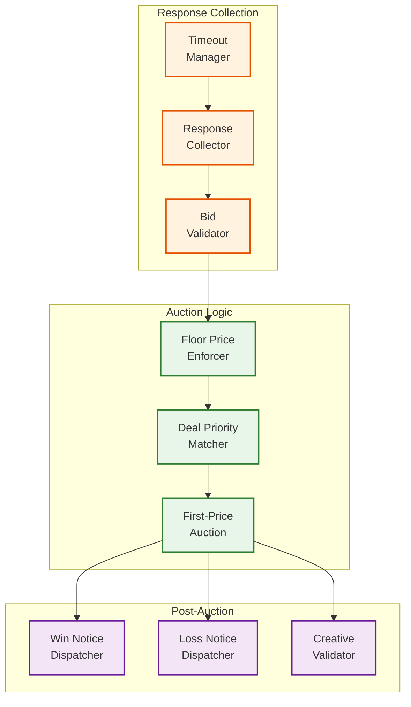
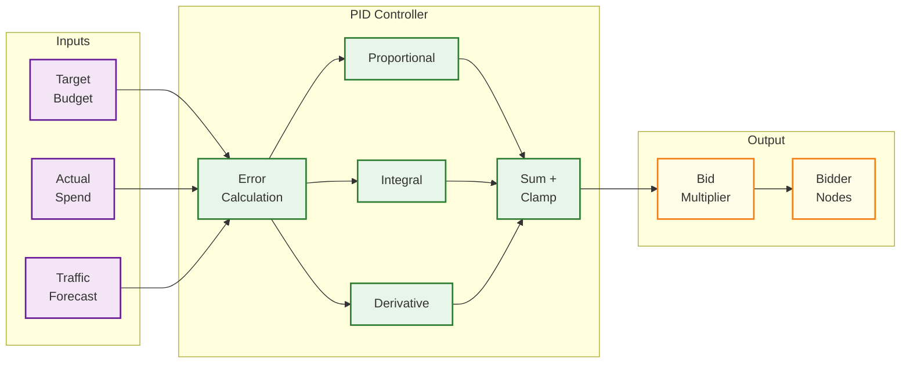
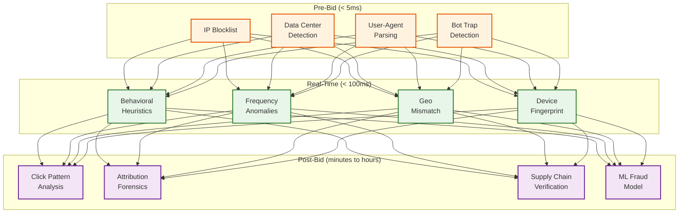

# Deep Dive & Bottlenecks — RTB System

## 1. Deep Dive: Auction Engine

### 1.1 Architecture

The auction engine is the heart of the ad exchange, sitting on the critical path between DSP fan-out and ad delivery. It must collect bid responses from dozens of DSPs, validate each bid, execute the auction, and return the winner—all within ~5ms of its own time budget after the DSP timeout expires.



### 1.2 Timeout Management

The exchange sets a global timeout (e.g., 100ms) but must handle the reality that DSPs respond at different speeds:

```
FUNCTION CollectBids(bidRequest, eligibleDSPs[], timeout):
    startTime = NOW()
    deadline = startTime + timeout
    responses = ConcurrentMap()
    remaining = AtomicCounter(eligibleDSPs.length)

    // Fan-out to all eligible DSPs
    FOR EACH dsp IN eligibleDSPs:
        ASYNC:
            response = HTTP_POST(dsp.bidEndpoint, bidRequest, timeout=deadline - NOW())
            IF response.status == 200:
                responses.PUT(dsp.id, ParseBidResponse(response.body))
            remaining.DECREMENT()

    // Early termination optimization:
    // If all DSPs respond before deadline, proceed immediately
    WHILE NOW() < deadline AND remaining > 0:
        WAIT(1ms)

    // After deadline: any DSP that hasn't responded is excluded
    RETURN responses.VALUES()
```

**Key optimization:** The exchange tracks per-DSP latency percentiles. DSPs that consistently respond in 30ms are given priority in the collection queue, while slow DSPs (p95 > 90ms) may be deprioritized or dropped from fan-out during traffic spikes to reduce infrastructure load.

### 1.3 Deal Priority Resolution

Private marketplace (PMP) deals add complexity to the auction. A deal bid may have a higher effective priority than an open-exchange bid, even at a lower CPM:

```
Auction Priority Tiers (descending):
  1. Guaranteed deals (programmatic guaranteed) — pre-negotiated fixed price
  2. Preferred deals (first-look) — fixed price, but buyer can pass
  3. PMP auction deals — private auction among invited buyers
  4. Open exchange auction — all eligible DSPs compete

Within each tier: highest CPM wins (first-price)
```

### 1.4 Exchange Fees and Revenue Share

```
Settlement Flow:
  DSP pays:     $5.00 CPM (winning bid)
  Exchange fee:  $0.75 (15% take rate)
  SSP fee:       $0.50 (10% of remaining)
  Publisher:     $3.75 (net revenue)

  Total supply-chain cost: 25% of DSP spend
```

---

## 2. Deep Dive: Budget Pacing

### 2.1 The Pacing Problem

Budget pacing must solve a multi-objective optimization problem:
1. **Spend the daily budget fully** — under-delivery wastes advertiser investment
2. **Spend evenly across the day** — front-loading burns budget on low-quality early impressions
3. **Respond to traffic fluctuations** — impression supply varies by hour, day-of-week, and season
4. **Coordinate across distributed bidders** — multiple bidder nodes simultaneously spending from the same budget

### 2.2 PID Controller Architecture



### 2.3 Distributed Budget Coordination

The core challenge: 80 bidder nodes simultaneously making spend decisions for the same campaign.

```
Approach: Distributed Budget Leasing

Central Budget Service:
  - Holds authoritative budget state per campaign
  - Issues "spend leases" to bidder nodes

Bidder Node (on startup or lease expiry):
  1. REQUEST lease from Central Budget Service
     → Receives: lease_amount = remaining_budget / active_bidder_count / lease_periods_remaining
     → Example: $1000 remaining / 80 nodes / 20 periods = $0.625 per node per period
  2. Bid using local lease balance (no network call per bid)
  3. When lease exhausted or period expires:
     → Report actual spend
     → Request new lease (adjusted for over/under spend)

Lease period: 30-60 seconds
  Short enough to limit overspend risk
  Long enough to avoid lease request storms

Race condition mitigation:
  - Optimistic: Allow slight overspend (reconcile at period boundary)
  - Budget headroom: Reserve 5% as buffer, released in final hour
  - Hard stop: Circuit breaker at 105% of daily budget
```

### 2.4 Pacing Failure Modes

| Failure | Symptom | Recovery |
|---|---|---|
| **Front-loading** | 80% budget spent by noon | Increase Kd (derivative gain) to react faster to overspend velocity |
| **Under-delivery** | Only 60% budget spent by end of day | Reduce bid shading aggressiveness in final hours; expand targeting |
| **Oscillation** | Budget alternates between overspend/underspend | Reduce Kp; increase damping; lengthen PID update interval |
| **Budget leak** | Spend exceeds budget despite pacing | Bidder node crashed mid-lease without reporting; central service didn't reclaim lease |
| **Stale multiplier** | Bidders using outdated pacing signal | Reduce lease period; implement push notifications for emergency budget changes |

---

## 3. Deep Dive: Fraud Detection

### 3.1 Multi-Layer Architecture

Ad fraud prevention operates at three stages, each with different latency constraints and detection capabilities:



### 3.2 Pre-Bid Detection (GIVT)

General Invalid Traffic can be detected before bidding with simple lookups:

```
FUNCTION PreBidFraudCheck(bidRequest):
    score = 0.0

    // Check 1: Known bot IP ranges (data center IPs)
    IF IPBlocklist.Contains(bidRequest.device.ip):
        RETURN BLOCK, reason="known_bot_ip"

    // Check 2: Data center IP detection
    IF DataCenterIPRange.Contains(bidRequest.device.ip):
        score += 0.7    // High suspicion but not certain (some VPNs use DC IPs)

    // Check 3: User agent analysis
    ua = ParseUserAgent(bidRequest.device.ua)
    IF ua.isKnownBot:    // "Googlebot", "bingbot", etc.
        RETURN BLOCK, reason="declared_bot"
    IF ua.isEmpty OR ua.isObviously_Fabricated:
        score += 0.5

    // Check 4: Missing or suspicious device signals
    IF bidRequest.device.ip IS EMPTY AND bidRequest.device.ua IS EMPTY:
        RETURN BLOCK, reason="no_device_signals"

    IF score > THRESHOLD:
        RETURN BLOCK, reason="givt_high_score"

    RETURN PASS, score=score
```

### 3.3 Sophisticated IVT Detection

SIVT requires behavioral analysis and ML models:

```
Behavioral Signals:
  - Click-to-impression ratio per IP (> 5% is suspicious)
  - Time between impression and click (< 100ms physically impossible for human)
  - Mouse movement patterns (absent or perfectly linear = bot)
  - Session depth (single-page sessions with ad clicks = incentivized traffic)
  - Geographic consistency (IP says New York, timezone says Moscow)
  - Device fingerprint reuse across different user IDs (identity fraud)

ML Model Features:
  - Request frequency per IP/device (rolling 1-hour window)
  - Hour-of-day distribution (bots operate 24/7; humans show diurnal patterns)
  - Publisher-level fraud rate (some publishers generate disproportionate IVT)
  - Creative interaction patterns (click coordinates, dwell time)
  - Referrer chain validity (spoofed referrers)
```

### 3.4 Fraud Economics

| Fraud Type | Prevalence | Financial Impact | Detection Difficulty |
|---|---|---|---|
| **Bot traffic** | ~10% of all traffic | Wasted ad spend on non-human impressions | Medium — behavioral patterns differ |
| **Domain spoofing** | ~3% of inventory | Premium CPMs paid for low-quality inventory | Low — ads.txt validates authorized sellers |
| **Click fraud** | ~15% of clicks | Inflated CPC costs | Medium — timing and pattern analysis |
| **Ad stacking** | ~5% of display | Multiple ads rendered in single slot; only top visible | Medium — viewability measurement detects |
| **Pixel stuffing** | ~2% of display | Ads rendered at 1x1 pixel; technically "served" | Low — size validation catches most |
| **Attribution fraud** | ~8% of mobile | Click injection before organic install to steal credit | High — requires cross-device attribution graph |

---

## 4. Race Conditions & Concurrency Issues

### 4.1 Budget Overspend Race

**The Problem:** Two bidder nodes simultaneously check budget availability and both decide to bid, causing overspend.

```
Timeline:
  T=0ms:   Node A reads budget_remaining = $10.00
  T=1ms:   Node B reads budget_remaining = $10.00
  T=5ms:   Node A bids $8.00, wins, deducts → remaining = $2.00
  T=6ms:   Node B bids $7.00, wins, deducts → remaining = -$5.00 (OVERSPEND!)
```

**Solution:** Budget leasing (see section 2.3). Each node has a local lease:
- Node A has a $5.00 lease, Node B has a $5.00 lease
- Node A can only spend up to $5.00 from its lease
- Overspend bounded to one lease period's worth (~$5-10)

### 4.2 Frequency Cap Race

**The Problem:** User loads two ads simultaneously; both bidder nodes check frequency count before either can increment.

```
Timeline:
  T=0ms:   Node A: freq_count(user_123, campaign_X) = 2, cap = 3 → ELIGIBLE
  T=0ms:   Node B: freq_count(user_123, campaign_X) = 2, cap = 3 → ELIGIBLE
  T=50ms:  Both win auctions → user sees 4 impressions (cap was 3)
```

**Solution:** Accept slight over-delivery (1-2 extra impressions) as a trade-off for avoiding synchronous distributed locks. Reasons this is acceptable:
- Frequency caps are a quality signal, not a billing constraint
- Cross-region synchronous locks would add 20-50ms latency (unacceptable)
- Probabilistic counters with 60-second reconciliation keep drift minimal
- Alternative: Reserve last cap slot (cap=3, bid only if count <= 1) — more conservative

### 4.3 Auction Double-Spend

**The Problem:** Exchange sends win notice; DSP deducts budget. Exchange also fires impression pixel. If win notice and impression event arrive at different times, budget may be deducted twice.

**Solution:** Idempotent budget deduction using auction_id as deduplication key:
```
FUNCTION DeductBudget(auctionId, campaignId, amount):
    IF DeduplicationCache.Contains(auctionId):
        RETURN ALREADY_PROCESSED
    DeduplicationCache.Set(auctionId, TTL=24h)
    BudgetLedger.Deduct(campaignId, amount)
    RETURN SUCCESS
```

### 4.4 Stale Campaign State

**The Problem:** Advertiser pauses a campaign, but bidder nodes still have the campaign cached as ACTIVE and continue bidding.

**Solution:** Multi-layer propagation with bounded staleness:
1. Campaign service writes to database (source of truth)
2. Publishes event to campaign state stream
3. Each bidder node subscribes to stream; updates local cache within 5-30 seconds
4. For critical state changes (pause, budget exhausted): push notification with explicit acknowledgment
5. **Circuit breaker:** Win notices for paused campaigns trigger immediate cache invalidation

---

## 5. Bottleneck Analysis

### 5.1 Bid Timeout Pressure

**The Bottleneck:** The 100ms hard deadline means any single slow component causes a bid loss, not just a delayed response.

```
Latency Budget Breakdown (DSP, 80ms total):
  Network RTT (exchange → DSP):     15-25ms   (varies by geo)
  Request parsing:                    1-2ms
  Targeting evaluation:               3-5ms
  Feature store lookup:               5-10ms   ← BOTTLENECK #1
  ML model inference:                10-15ms   ← BOTTLENECK #2
  Bid calculation + shading:          2-3ms
  Response serialization:             1-2ms
  Network RTT (DSP → exchange):     15-25ms

  Total: 52-87ms (tight!)
  Headroom: 0-28ms
```

**Mitigations:**
- Feature store: In-process cache for hot users; pre-warm cache at bid request arrival
- ML inference: Use lightweight models; batch inference for similar requests; model distillation
- Timeout cascade: If feature store takes >8ms, skip personalization; if ML takes >12ms, fall back to rule-based bidding
- Tail latency: p99 matters more than average; shed the 1% of requests with expensive features

### 5.2 Feature Store Lookup Latency

**The Bottleneck:** Looking up user profiles in a distributed feature store adds 5-10ms. At 1M QPS, even sub-ms improvement matters.

```
Optimization Layers:
  L1: In-process cache (LRU, ~1M entries)     — <0.1ms, ~30% hit rate
  L2: Local SSD cache (~100M entries)          — <1ms,   ~60% hit rate
  L3: Remote distributed store                 — 5-10ms, ~99% hit rate
  Miss: Return empty features (contextual-only bidding)

Cache warming strategy:
  - On bid request arrival, start feature lookup BEFORE targeting evaluation
  - Pre-fetch profiles for users frequently seen on high-value publishers
  - Regional cache replication with <5s staleness
```

### 5.3 Budget Contention Under High Spend

**The Bottleneck:** During flash sales or major events, many campaigns simultaneously hit peak spend velocity. The central budget service becomes a contention point.

```
Contention Scenario:
  100K active campaigns × 80 bidder nodes = 8M lease requests/minute
  (if lease period = 60 seconds)

Mitigation:
  1. Tiered lease periods:
     - High-budget campaigns ($10K+/day): 60s lease, larger amounts
     - Medium campaigns ($1K-10K/day): 120s lease
     - Small campaigns (<$1K/day): 300s lease

  2. Coalesced lease requests:
     - Bidder node requests leases for ALL its campaigns in one batch RPC
     - Reduces request count from 100K to 1 per node per period

  3. Predictive leasing:
     - Budget service pre-computes next lease amount based on pacing curve
     - Pushes lease renewal proactively (no pull needed)

  4. Graceful degradation:
     - If budget service is slow (>50ms), use last known multiplier
     - Conservative bias: if uncertain, bid lower
```

### 5.4 Event Stream Backpressure

**The Bottleneck:** 2M+ impression events/second flowing into the event stream. Consumer lag causes stale budget data, delayed fraud detection, and inaccurate reporting.

```
Backpressure Cascade:
  Event stream consumer lag increases
  → Budget reconciliation delayed
  → Bidder nodes operate on stale budget data
  → Risk of overspend increases
  → Pacer enters conservative mode
  → Under-delivery begins

Mitigation:
  1. Priority partitioning: Budget events on high-priority partitions
     with dedicated consumer groups
  2. Sampling: Reporting consumers process 10% sample during backpressure
     (extrapolate for dashboards)
  3. Write-ahead buffer: Bidder nodes buffer events locally if stream is
     slow; replay when stream recovers
  4. Consumer autoscaling: Scale consumer instances based on lag metric
```

---

## 6. Anti-Pattern Analysis

| Anti-Pattern | Symptom | Root Cause | Fix |
|---|---|---|---|
| **Synchronous budget check per bid** | p99 latency +20ms; reduced win rate | Network round-trip to central budget service on every bid | Budget leasing with local deduction |
| **Shared ML model endpoint** | Model inference latency spikes at peak | Single inference service shared across all bidder nodes | Co-locate model with bidder (model sidecar) or in-process inference |
| **Monolithic auction + tracking** | Tracking failures block auctions | Impression tracking in same process as auction engine | Separate tracking to async fire-and-forget path |
| **Exact frequency counting** | Cross-region locks add 50ms latency | Trying to maintain exactly-once semantics for frequency caps | Accept approximate counts with periodic reconciliation |
| **JSON everywhere** | 30% of latency budget spent on serialization | Using JSON for internal service-to-service communication | Protobuf for internal calls; JSON only for OpenRTB external API |
| **Unbounded DSP fan-out** | Exchange infrastructure costs scale linearly with DSP count | Sending every request to every DSP regardless of match likelihood | Pre-filter engine eliminates non-matching DSPs; adaptive QPS throttling |
