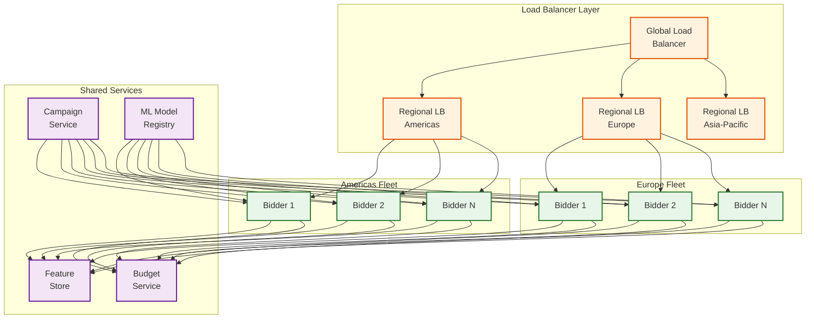
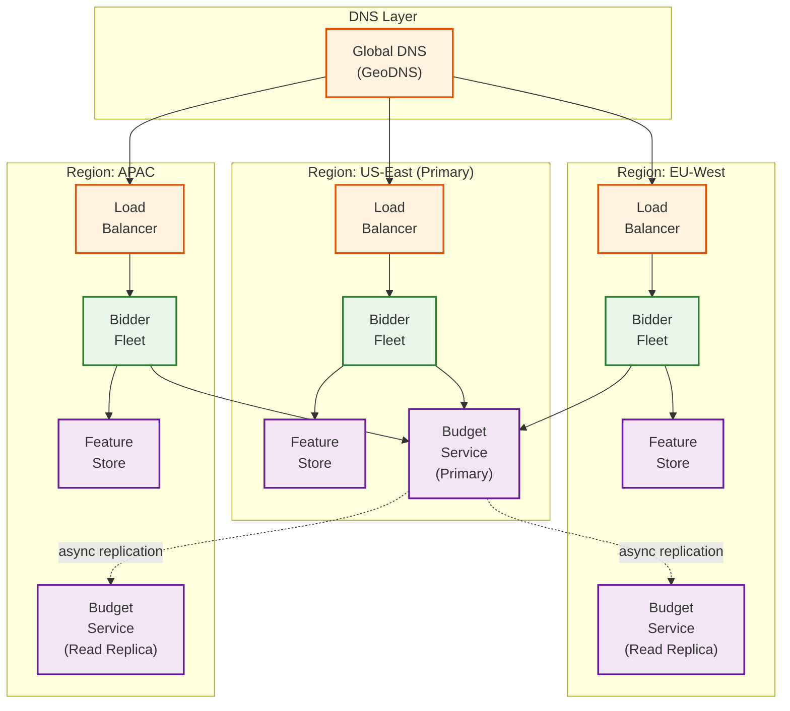

# Scalability & Reliability — RTB System

## 1. Horizontal Scaling of Bidder Nodes

### 1.1 Stateless Bidder Architecture

Bidder nodes are designed to be completely stateless with respect to individual bid requests. All state they depend on (campaigns, user features, budget multipliers) is loaded from external stores and cached locally.



### 1.2 Scaling Dimensions

| Dimension | Scale Trigger | Scaling Approach | Limits |
|---|---|---|---|
| **QPS** | Bid request volume increases | Add bidder nodes behind load balancer | Near-linear until shared services saturate |
| **Campaigns** | More campaigns to evaluate per request | Increase per-node memory for campaign cache; optimize targeting index | Campaign index must fit in memory (~5 GB for 100K campaigns) |
| **User base** | Feature store grows beyond single cluster | Shard feature store by user_id hash; add replicas per shard | Network bandwidth for cache warming |
| **Ad formats** | CTV/video require heavier processing | Dedicated bidder pools per format (banner pool, video pool) | Video bid evaluation is 3-5x heavier than banner |
| **Geographic reach** | New exchange partnerships in new regions | Deploy regional bidder fleet; replicate feature store to new region | Data residency requirements may constrain user data replication |

### 1.3 Autoscaling Strategy

```
Scaling Signals:
  Primary:   bid_request_qps (target: 70% of node capacity)
  Secondary: p99_bid_latency (target: <60ms; scale-up if >70ms)
  Tertiary:  cpu_utilization (target: 60%; scale-up if >75%)

Scale-Up Policy:
  IF bid_request_qps > 0.7 × node_capacity FOR 2 minutes:
    ADD ceil(current_nodes × 0.2) new nodes    // 20% increase
    COOLDOWN 5 minutes

Scale-Down Policy:
  IF bid_request_qps < 0.4 × node_capacity FOR 10 minutes:
    REMOVE floor(current_nodes × 0.1) nodes    // 10% decrease
    COOLDOWN 15 minutes
    NEVER scale below minimum_fleet_size (per region)

Pre-Scaling (Predictive):
  Historical traffic patterns are highly predictable (diurnal curve)
  Pre-scale 30 minutes before predicted peak based on day-of-week model
  Special events (holidays, sports events): manual capacity boost
```

---

## 2. Geo-Distributed Edge Bidding

### 2.1 Why Edge Deployment Matters

Network round-trip time (RTT) between the exchange and DSP directly eats into the 100ms auction deadline. Deploying bidder nodes in the same data center (or geographic region) as the exchange reduces RTT from 50-100ms (cross-continent) to 1-5ms (same region).

```
Latency Impact of Geographic Distance:
  Same data center:     <1ms RTT
  Same region (100km):   2-5ms RTT
  Cross-continent:      50-100ms RTT
  Intercontinental:     100-200ms RTT

Available bid computation time (80ms deadline):
  Same DC:     80 - 1  = 79ms for processing  ✓ comfortable
  Same region: 80 - 5  = 75ms for processing  ✓ comfortable
  Cross-cont:  80 - 100 = -20ms               ✗ impossible!
```

### 2.2 Edge Deployment Topology

```
Region Strategy:
  Tier 1 (full bidder fleet + feature store replica):
    - US-East (primary exchange PoPs)
    - US-West (secondary)
    - EU-West (EMEA traffic)
    - APAC-East (Asia-Pacific traffic)

  Tier 2 (lightweight bidder + contextual-only features):
    - South America
    - Middle East
    - India

  Tier 1: Full ML inference, personalized bidding, complete feature set
  Tier 2: Rule-based bidding, contextual features only, simplified models
  Fallback: If no local bidder, route to nearest Tier 1 (accept latency penalty)
```

### 2.3 Data Replication for Edge

| Data Type | Replication Strategy | Staleness Tolerance | Size per Region |
|---|---|---|---|
| **Campaign metadata** | Async replication from primary DB, 10-30s lag | 30 seconds | ~5 GB |
| **User profiles** | Regional sharding; each region holds profiles for users typically seen there | 1 hour | ~1-2 TB |
| **ML models** | Model artifacts synced to all regions on deploy | 1 hour | ~20 GB |
| **Budget state** | Lease-based; central service in primary region | 60 seconds | N/A (RPC-based) |
| **Frequency caps** | Regional counters with cross-region reconciliation | 60 seconds | ~50 GB |
| **Fraud blocklists** | Full replication to all regions | 5 minutes | ~1 GB |

---

## 3. Feature Cache Warming Strategies

### 3.1 The Cold-Cache Problem

When a bidder node starts (or a new region activates), its local caches are empty. Every bid request requires remote feature store lookups, adding 5-10ms latency and potentially causing timeout losses.

### 3.2 Warming Approaches

```
Strategy 1: Eager Pre-Loading
  On node startup:
    1. Fetch "hot users" list (top 1M users by recent impression frequency)
    2. Bulk-load their profiles into local cache
    3. Load all active campaign metadata
    4. Node enters "warming" state — accepts traffic but at reduced QPS
    5. After cache hit rate > 80%, node enters "ready" state — full QPS

  Time to warm: 2-5 minutes
  Trade-off: Delays node availability; may load profiles that aren't needed

Strategy 2: Shadow Traffic Warming
  On node startup:
    1. Node receives bid requests but does NOT return bids
    2. Uses requests to populate caches (feature lookups, campaign evaluation)
    3. After 2-3 minutes of shadow traffic, switch to active bidding

  Time to warm: 2-3 minutes
  Trade-off: Temporarily over-provisions fleet (shadow nodes consume resources)

Strategy 3: Lazy Loading with Graceful Degradation
  On node startup:
    1. Node immediately accepts traffic
    2. Cache misses use contextual-only features (no personalization)
    3. Cache populates organically from actual bid requests
    4. Within 5-10 minutes, cache hit rate stabilizes at 60-80%

  Time to warm: 0 (but degraded quality for first 5-10 min)
  Trade-off: Lower bid quality initially; acceptable for gradual scaling events
```

### 3.3 Cache Invalidation

```
Invalidation Triggers:
  Campaign state change (pause, resume, budget update):
    → Push notification via campaign event stream
    → All bidder nodes in all regions receive within 5-30 seconds
    → Critical changes (pause) use dedicated high-priority channel

  User profile update (new segment assignment):
    → Lazy invalidation — profiles have TTL (30 min to 1 hour)
    → Acceptable because user segments change infrequently

  Model update:
    → Rolling deployment — 10% of nodes at a time
    → Canary: 1 node runs new model for 15 minutes, compare performance
    → If CTR prediction accuracy degrades >5%, auto-rollback

  Blocklist update (new fraud IPs):
    → Immediate push to all nodes
    → TTL: None — blocklist entries persist until explicitly removed
```

---

## 4. Multi-Region Failover

### 4.1 Failure Scenarios

| Scenario | Impact | Detection | Recovery |
|---|---|---|---|
| **Single bidder node failure** | <1% QPS impact | Health check failure (3 consecutive misses) | Load balancer removes node; autoscaler replaces |
| **Feature store partition** | Degraded bid quality (contextual-only) | Feature lookup latency > 15ms p99 | Fall back to contextual features; alert on-call |
| **Regional network partition** | Region loses connectivity to exchanges | Exchange-side timeout rate spikes | Exchange stops sending to affected region; routes to healthy regions |
| **Full region outage** | 25-33% capacity loss | Synthetic monitoring failure | DNS failover to nearest region (2-5 min); pre-scaled headroom absorbs traffic |
| **Budget service outage** | Cannot issue new leases | Lease renewal failures | Bidders continue with existing leases in conservative mode; stop bidding when lease expires |
| **Event stream failure** | Delayed budget/analytics updates | Consumer lag metric > threshold | Buffer locally; replay from durable log when recovered |

### 4.2 Failover Architecture



### 4.3 Budget Service Failover

Budget service is the most critical shared dependency. Its failure mode requires special attention:

```
Normal Operation:
  All regions → Budget Service Primary (US-East) via RPC
  Lease requests: ~1400/sec (80 nodes × 100K campaigns / 60s period × batch)

Primary Failure:
  1. Detection: Health check fails for 10 seconds
  2. Promotion: EU-West read replica promoted to primary (30-60 seconds)
  3. Lease gap: Bidders in all regions use existing leases (up to 60s of runway)
  4. Risk window: 60-90 seconds of slightly stale budget data
  5. Recovery: New primary begins issuing leases; bidders renew

  Worst case during failover:
    - Campaigns could overspend by up to 1 lease period's budget per node
    - Hard stop circuit breaker limits overspend to 5% of daily budget
    - Reconciliation corrects next day's allocation
```

---

## 5. Load Shedding Strategies

When total traffic exceeds capacity, the system must degrade gracefully rather than fail catastrophically.

### 5.1 Shedding Hierarchy

```
Level 1 — Optimization Shedding (>80% capacity):
  Skip bid shading (bid at raw calculated value)
  Skip creative dynamic optimization (use default creative)
  Reduce targeting evaluation depth (skip low-priority ad groups)

Level 2 — Feature Shedding (>90% capacity):
  Skip user feature lookup (contextual-only bidding)
  Skip ML inference (use pre-computed average CPM per category)
  Reduce evaluation to top 10 campaigns by budget

Level 3 — Traffic Shedding (>95% capacity):
  Probabilistically drop low-value bid requests
  Formula: drop_probability = (current_qps - target_qps) / current_qps
  Priority: Keep requests for high-CPM publishers, PMP deals
  Drop: Low-floor open exchange, unknown publishers

Level 4 — Circuit Breaker (>100% capacity):
  Return HTTP 204 (no-bid) for all requests
  Duration: 5-second intervals, then re-evaluate
```

### 5.2 Request Prioritization

```
Priority Scoring:
  score = base_priority
        + deal_bonus        (PMP deal = +100, open exchange = 0)
        + floor_bonus       (floor > $5 CPM = +50, < $1 = 0)
        + publisher_bonus   (premium publisher = +30, unknown = 0)
        + format_bonus      (video = +20, banner = 0)

Under load shedding, process requests in score order.
Requests below threshold score are dropped with HTTP 204.
```

---

## 6. Capacity Planning

### 6.1 Infrastructure Right-Sizing

```
DSP Infrastructure (for 1M QPS peak):

Bidder Fleet:
  Target: 25K QPS per node
  Nodes needed: 1M / 25K = 40 nodes
  With 2x headroom: 80 nodes per region
  Across 3 regions: 240 bidder nodes total
  Instance type: 16-core, 32 GB RAM, 10 Gbps network

Feature Store:
  Data volume: 2B user profiles × 2 KB = 4 TB
  Target: sub-ms reads at 1M QPS
  Cluster: 200 nodes with 20 GB RAM each
  Replication: 2x per region (400 nodes per region for HA)
  Across 3 regions: 1,200 nodes

ML Inference:
  Model: Lightweight CTR model (~100 MB)
  Target: <15ms p99 inference
  Option A: Co-located with bidder (in-process, zero network hop)
  Option B: Dedicated inference fleet with GPU acceleration
  Recommendation: Option A for lightweight models; Option B for deep models

Event Stream:
  Throughput: 2M events/sec × 500 bytes = 1 GB/s
  Retention: 7 days for replay
  Storage: 1 GB/s × 86400 × 7 = 600 TB
  Partitions: 1000 (2K events/sec per partition)

Data Lake:
  Daily ingestion: ~25 TB/day (impressions) + 86 TB/day (bid-level)
  30-day retention: ~3.3 PB
  Compressed (5:1): ~660 TB stored
```

### 6.2 Cost Optimization

| Strategy | Savings | Trade-off |
|---|---|---|
| **Spot/preemptible instances for bidders** | 60-70% compute cost reduction | Need robust draining; 2-minute shutdown notice |
| **Feature store tiered storage** | 40% storage cost | Slightly higher latency for cold users |
| **Bid request sampling for analytics** | 80% analytics compute cost | Statistical accuracy; 10% sample sufficient for most queries |
| **Off-peak auto-scaling** | 30% average compute cost | Need accurate traffic prediction; cold-start latency |
| **Protobuf over JSON internally** | 20% bandwidth savings | Debugging complexity; need human-readable fallback |
| **Regional traffic shaping** | 15% by avoiding cross-region costs | Slight latency increase for edge cases |

---

## 7. Data Pipeline Reliability

### 7.1 Impression Event Pipeline

```
Reliability Guarantees:

Publisher Page → Impression Pixel Server:
  Delivery: At-most-once (browser may not fire pixel)
  Mitigation: Client-side retry (3 attempts with 1s backoff)
  Expected loss rate: <0.1%

Impression Pixel Server → Event Stream:
  Delivery: At-least-once (server writes to WAL before ack)
  Deduplication: event_id used downstream for exactly-once semantics
  Expected duplicate rate: <0.01%

Event Stream → Billing Engine:
  Delivery: Exactly-once (via consumer offset + deduplication)
  Reconciliation: Hourly batch job cross-references stream counts
  Expected accuracy: 99.99%

End-to-End:
  From ad render to billing record: 99.95% accuracy
  Remaining 0.05%: resolved via monthly publisher reconciliation
```

### 7.2 Data Integrity Checksums

```
Each impression event carries:
  event_id:     UUID (idempotency key)
  auction_id:   Links to auction record (cross-reference)
  checksum:     HMAC of (auction_id + price + timestamp + campaign_id)
  source_node:  Which bidder node originated this event

Reconciliation detects:
  - Missing events (auction won but no impression event)
  - Duplicate events (same auction_id counted twice)
  - Tampered events (checksum mismatch)
  - Ghost events (impression event with no corresponding auction)
```
