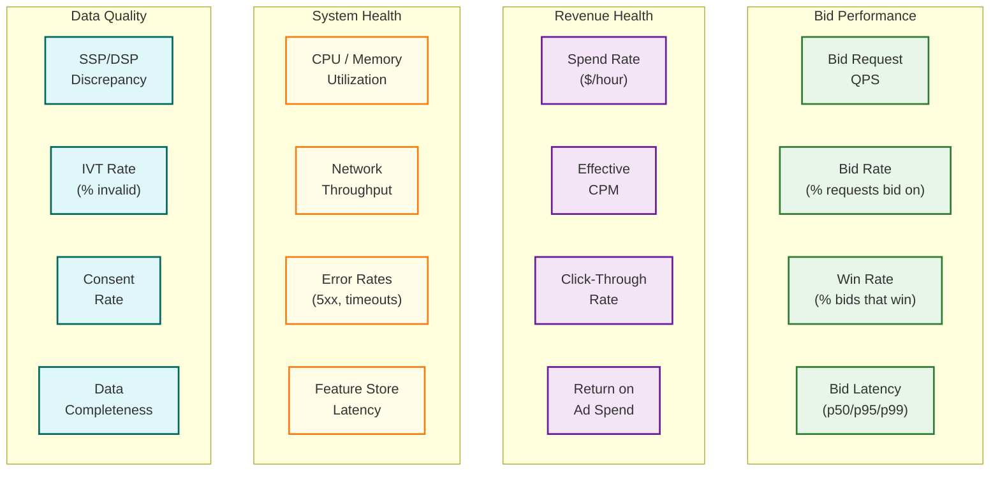

# Observability — RTB System

## 1. Key Metrics Framework

### 1.1 Metric Categories

RTB observability requires tracking metrics across four domains: **bid performance**, **revenue health**, **system health**, and **data quality**.



### 1.2 Bid Performance Metrics

| Metric | Definition | Granularity | Alert Threshold |
|---|---|---|---|
| **bid_request_qps** | Incoming bid requests per second | Per region, per exchange | Drop >20% from expected baseline |
| **bid_rate** | % of requests where DSP returns a bid | Per campaign, per exchange, per geo | Drop >15% from trailing 1-hour average |
| **win_rate** | % of bids that win the auction | Per campaign, per publisher | Drop >25% (likely being outbid) |
| **no_bid_rate** | % of requests with no eligible campaign | Per exchange, per format | Rise >50% (targeting too narrow or budgets exhausted) |
| **timeout_rate** | % of bids that exceed exchange deadline | Per region, per exchange | Rise >2% (latency regression) |
| **bid_price_cpm** | Average bid price in CPM | Per campaign, per geo | Deviation >20% from 24-hour trailing average |
| **bid_shading_ratio** | shaded_bid / raw_bid | Per campaign | Drop below 0.5 (too aggressive) or above 0.95 (insufficient shading) |

### 1.3 Revenue Metrics

| Metric | Definition | Granularity | Alert Threshold |
|---|---|---|---|
| **spend_rate** | Dollars spent per hour | Per campaign, per advertiser | Deviation >20% from pacing target |
| **effective_cpm** | Actual cost per 1000 impressions won | Per campaign, per publisher | Rise >30% (market price inflation or shading failure) |
| **click_through_rate** | Clicks / impressions | Per campaign, per creative | Drop >40% from baseline (creative fatigue or fraud) |
| **conversion_rate** | Conversions / clicks | Per campaign | Drop >50% (landing page issue or attribution break) |
| **daily_budget_utilization** | actual_spend / daily_budget | Per campaign | <80% by 6 PM (under-delivery) or >100% (overspend) |
| **revenue_per_impression** | Total revenue / total impressions (exchange) | Per publisher | Drop >15% (demand reduction or floor misconfig) |

---

## 2. Latency Monitoring

### 2.1 Latency Budget Breakdown

Track each component of the bid serving path independently to identify which stage degrades:

```
Latency Histogram Buckets (milliseconds):
  [0.5, 1, 2, 5, 10, 15, 20, 30, 50, 80, 100, 150, 200]

Per-Stage Tracking:
  ┌─────────────────────────────────┬──────────┬──────────┬──────────┐
  │ Stage                           │ p50 (ms) │ p95 (ms) │ p99 (ms) │
  ├─────────────────────────────────┼──────────┼──────────┼──────────┤
  │ Request deserialization         │      0.5 │      1.0 │      2.0 │
  │ Pre-filter (targeting index)    │      1.0 │      3.0 │      5.0 │
  │ Feature store lookup            │      3.0 │      7.0 │     10.0 │
  │ ML model inference              │      5.0 │     12.0 │     15.0 │
  │ Bid calculation + shading       │      1.0 │      2.0 │      3.0 │
  │ Response serialization          │      0.5 │      1.0 │      2.0 │
  │ Network RTT (exchange→DSP→exch) │     10.0 │     20.0 │     30.0 │
  ├─────────────────────────────────┼──────────┼──────────┼──────────┤
  │ Total end-to-end                │     21.0 │     46.0 │     67.0 │
  └─────────────────────────────────┴──────────┴──────────┴──────────┘
```

### 2.2 Latency Alerting

```
Alert Rules:

Critical (Page immediately):
  bid_latency_p99 > 80ms for 2 minutes
  → Likely: Feature store degradation, ML service issue, or network problem
  → Action: Investigate per-stage breakdown; consider load shedding

Warning (Alert on-call):
  bid_latency_p95 > 50ms for 5 minutes
  → Likely: Gradual degradation — cache eviction, GC pressure, traffic increase
  → Action: Check cache hit rates, memory utilization, traffic volume

Info (Dashboard only):
  bid_latency_p50 increase > 20% from 24-hour baseline
  → Likely: Model update, campaign change, or traffic mix shift
  → Action: Correlate with recent deployments or campaign changes
```

---

## 3. Dashboards

### 3.1 Real-Time Operations Dashboard

```
┌──────────────────────────────────────────────────────────────┐
│  RTB OPERATIONS DASHBOARD — Real-Time                        │
├──────────────────────────┬───────────────────────────────────┤
│  Bid Request QPS         │  ████████████████░░░░  8.2M/10M  │
│  Bid Rate                │  ████████░░░░░░░░░░░░  42%       │
│  Win Rate                │  ████░░░░░░░░░░░░░░░░  18%       │
│  Timeout Rate            │  █░░░░░░░░░░░░░░░░░░░  0.8%      │
├──────────────────────────┼───────────────────────────────────┤
│  Hourly Spend            │  $45,230 / $52,000 target (87%)  │
│  Daily Spend             │  $380,500 / $500,000 budget      │
│  Active Campaigns        │  12,453                          │
│  Campaigns Pacing Well   │  11,200 (90%)                    │
├──────────────────────────┼───────────────────────────────────┤
│  p50 Latency             │  21ms ✅                          │
│  p95 Latency             │  46ms ✅                          │
│  p99 Latency             │  67ms ✅                          │
│  Feature Store Hit Rate  │  78% (L1: 32%, L2: 46%)         │
├──────────────────────────┼───────────────────────────────────┤
│  Bidder Fleet (US-East)  │  76/80 nodes healthy ✅           │
│  Bidder Fleet (EU-West)  │  79/80 nodes healthy ✅           │
│  Bidder Fleet (APAC)     │  80/80 nodes healthy ✅           │
│  Feature Store Lag       │  2.3 seconds ✅                   │
└──────────────────────────┴───────────────────────────────────┘
```

### 3.2 Revenue & Performance Dashboard

```
┌──────────────────────────────────────────────────────────────┐
│  REVENUE DASHBOARD — Daily                                    │
├──────────────────────────────────────────────────────────────┤
│                                                              │
│  Spend Pacing Chart (actual vs target, 24-hour):             │
│  $500K ┤                                           ╱ target │
│  $400K ┤                                       ╱··╱         │
│  $300K ┤                                 ╱··╱··             │
│  $200K ┤                           ╱··╱··                   │
│  $100K ┤                     ╱··╱··                         │
│      0 ┤  ╱··╱··╱··╱··╱··╱··                               │
│        └───────────────────────────────────────────────────  │
│         12am    4am    8am    12pm    4pm    8pm    12am     │
│         ── actual spend   ·· target pacing curve             │
│                                                              │
├──────────────────────────────────────────────────────────────┤
│  Top Campaigns by Spend:                                     │
│  1. Campaign "Holiday Sale" — $42,300 (pacing: 98%) ✅       │
│  2. Campaign "Q4 Branding" — $38,100 (pacing: 105%) ⚠️      │
│  3. Campaign "App Install" — $29,800 (pacing: 82%) ⚠️       │
├──────────────────────────────────────────────────────────────┤
│  Win Price Distribution (CPM):                               │
│  $0-1  ████████████████████████ 35%                         │
│  $1-3  ████████████████ 25%                                 │
│  $3-5  ██████████ 18%                                       │
│  $5-10 ████████ 14%                                         │
│  $10+  █████ 8%                                             │
└──────────────────────────────────────────────────────────────┘
```

### 3.3 Fraud & Quality Dashboard

```
┌──────────────────────────────────────────────────────────────┐
│  FRAUD & QUALITY DASHBOARD                                    │
├──────────────────────────┬───────────────────────────────────┤
│  GIVT Rate (pre-bid)     │  3.2% ✅ (industry avg: 5%)       │
│  SIVT Rate (post-bid)    │  1.8% ✅ (industry avg: 3%)       │
│  Total IVT Rate          │  5.0% ✅                           │
│  IVT Cost Savings        │  $8,400 saved today               │
├──────────────────────────┼───────────────────────────────────┤
│  ads.txt Match Rate      │  97.2% ✅                          │
│  Supply Chain Complete   │  89.3% ⚠️ (target: 95%)           │
│  Avg Chain Length         │  1.8 hops                         │
├──────────────────────────┼───────────────────────────────────┤
│  SSP/DSP Discrepancy     │  2.1% ✅ (threshold: 5%)          │
│  Click Fraud Rate        │  4.3% ⚠️ (threshold: 5%)          │
│  Viewability Rate        │  62% (MRC standard)               │
└──────────────────────────┴───────────────────────────────────┘
```

---

## 4. Discrepancy Detection

### 4.1 SSP vs DSP Count Discrepancies

Discrepancies between SSP-reported and DSP-reported impression counts are inevitable in a multi-party system. Understanding and monitoring them is critical for billing accuracy.

```
Common Discrepancy Sources:

1. Counting methodology difference:
   SSP counts when ad markup is returned to publisher
   DSP counts when impression pixel fires
   Gap: 5-15% (ads returned but never rendered)

2. Redirect chain latency:
   Multiple redirects between SSP and DSP tracking
   Some requests lost in transit (network failures, user navigation)
   Gap: 1-3%

3. Ad blockers:
   User's ad blocker prevents impression pixel from firing
   SSP counts the auction win; DSP never sees the impression
   Gap: 10-30% on desktop (ad blocker prevalence)

4. Bot filtering differences:
   SSP and DSP may use different IVT detection thresholds
   DSP filters more aggressively → lower count
   Gap: 2-5%

5. Timestamp boundary:
   Impressions near midnight counted on different days by SSP vs DSP
   Gap: <1% daily (self-correcting)
```

### 4.2 Reconciliation Pipeline

```
Reconciliation Process (daily):

  1. Collect: Gather impression counts from both SSP and DSP
     SSP report: {date, publisher, campaign, impression_count, revenue}
     DSP report: {date, publisher, campaign, impression_count, spend}

  2. Match: Join on (date, publisher, campaign)

  3. Calculate discrepancy:
     discrepancy_rate = |ssp_count - dsp_count| / MAX(ssp_count, dsp_count)

  4. Classify:
     < 5%:   ACCEPTABLE (normal operational variance)
     5-10%:  INVESTIGATE (potential tracking issue)
     10-20%: ESCALATE (likely ad blocker impact or integration issue)
     > 20%:  CRITICAL (potential fraud or broken tracking)

  5. Resolve:
     For ACCEPTABLE: Use agreed-upon party's count for billing
     For INVESTIGATE+: Root cause analysis → fix tracking → credit/debit

  6. Report: Monthly discrepancy report to finance team
```

---

## 5. Logging Strategy

### 5.1 Log Levels and Retention

| Log Type | Volume | Retention | Storage Tier | Purpose |
|---|---|---|---|---|
| **Bid-level logs** | ~400B records/day | 7 days hot, 30 days warm | Event stream → data lake | Debugging, ML training |
| **Impression events** | ~50B records/day | 30 days hot, 1 year archive | Event stream → columnar store | Billing, reporting |
| **Auction logs (exchange)** | ~10B records/day | 7 days | Event stream | Auction integrity verification |
| **Campaign change logs** | ~100K records/day | 2 years | Relational database | Audit trail |
| **System logs (app logs)** | ~10 GB/day per region | 14 days | Log aggregation service | Debugging |
| **Access logs** | ~5 GB/day per region | 90 days | Log aggregation service | Security audit |

### 5.2 Structured Log Format

```
Bid Decision Log (emitted for every bid request):
{
  "timestamp": "2026-03-09T14:23:45.123Z",
  "trace_id": "abc-123-def-456",
  "request_id": "bid_req_789",
  "exchange": "exchange_alpha",
  "publisher_domain": "news-site.com",
  "ad_format": "banner_300x250",
  "geo": "US/CA/San_Francisco",
  "device_type": "mobile",

  "decision": "BID",
  "campaign_id": "camp_456",
  "ad_group_id": "ag_789",
  "creative_id": "cr_012",

  "bid_price_cpm": 4.50,
  "shaded_bid_cpm": 3.20,
  "floor_price_cpm": 1.00,
  "predicted_ctr": 0.023,
  "predicted_cvr": 0.005,
  "pacing_multiplier": 0.85,

  "latency_ms": {
    "total": 42,
    "feature_lookup": 6,
    "ml_inference": 12,
    "bid_calc": 3,
    "serialization": 1,
    "other": 20
  },

  "feature_cache_hit": true,
  "fraud_score": 0.02,
  "consent_basis": "tcf_purpose_1_2_3_4"
}
```

---

## 6. Alerting Framework

### 6.1 Alert Priority Matrix

| Priority | Response Time | Examples | Notification |
|---|---|---|---|
| **P0 — Critical** | <5 minutes | Bid serving down, revenue loss >$1K/min, budget overspend >10% | Page on-call, auto-escalate after 10 min |
| **P1 — High** | <30 minutes | Latency p99 >80ms, win rate drop >50%, feature store degraded | Page on-call |
| **P2 — Medium** | <2 hours | Pacing drift >15%, IVT rate spike, discrepancy >10% | Alert channel notification |
| **P3 — Low** | Next business day | Cache hit rate decline, model staleness, log volume anomaly | Dashboard indicator |

### 6.2 Alert Runbooks

```
Alert: bid_latency_p99 > 80ms

Runbook:
  1. Check per-stage latency breakdown
     → If feature_store_latency elevated: Check feature store health, cache hit rates
     → If ml_inference_latency elevated: Check ML service health, model loading
     → If network_latency elevated: Check inter-service connectivity, DNS resolution

  2. Check if correlated with traffic spike
     → If QPS increased: Verify autoscaler is adding nodes; consider load shedding
     → If QPS normal: Investigate degradation in downstream service

  3. Check recent deployments
     → New model version? → Rollback if inference latency increased
     → Config change? → Revert and verify

  4. Mitigate (if root cause not found in 5 min):
     → Enable feature shedding (contextual-only bidding)
     → Reduce targeting evaluation depth
     → Last resort: Shed low-value traffic

---

Alert: daily_budget_utilization > 105%

Runbook:
  1. Identify affected campaigns
  2. Check pacing multiplier history (should be decreasing toward 0)
  3. Check budget lease reconciliation for gaps
  4. If systemic: Reduce global pacing multiplier by 20%
  5. Verify hard stop circuit breaker is functioning (should stop at 110%)
  6. Root cause: Budget service latency? Stale lease? Race condition?
```

---

## 7. Distributed Tracing

### 7.1 Trace Propagation

```
Trace Context Flow:
  Exchange generates trace_id on bid request receipt
  → Propagated in HTTP headers to DSP: X-Trace-Id: {trace_id}
  → DSP propagates to internal services (feature store, ML, pacer)
  → Impression pixel includes trace_id for post-auction correlation
  → Win/loss notice includes trace_id

Trace spans:
  [exchange.receive_request]────────────────────────────────────────
    [exchange.pre_filter]────
    [exchange.fan_out]─────────────────────────────
      [dsp.receive]─────────────────────────────
        [dsp.targeting_eval]────
        [dsp.feature_lookup]──────
        [dsp.ml_inference]──────────
        [dsp.bid_calc]──
      [dsp.respond]─
    [exchange.auction]───
    [exchange.respond]─
```

### 7.2 Sampling Strategy

```
Full tracing on every request is impractical at 10M QPS.

Sampling Tiers:
  - Random 0.1% sample: Full trace with all spans → debugging and profiling
  - Tail latency sample: 100% of requests > p95 latency → tail latency investigation
  - Error sample: 100% of requests that result in errors → error debugging
  - Campaign sample: 100% for specific flagged campaigns → advertiser debugging
  - Synthetic: 100% of synthetic monitoring probes → baseline health

Storage: ~10K traces/second × 5 KB/trace = 50 MB/s → ~4 TB/day
Retention: 7 days for sampled traces; 24 hours for tail/error traces
```
