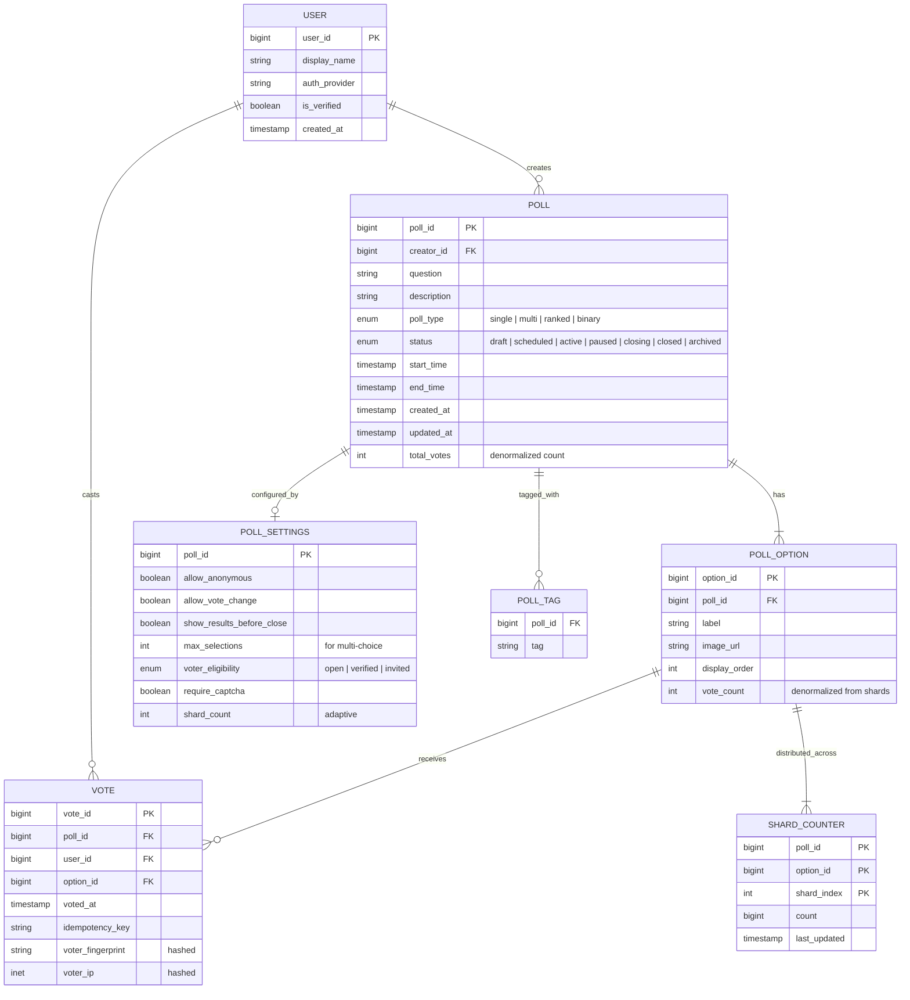

# Low-Level Design — Polling/Voting System

## 1. Data Model

### Entity Relationship Diagram



---

## 2. Schema Design

### Poll Metadata Store (Relational Database)

```
TABLE polls
    poll_id         BIGINT          PRIMARY KEY (snowflake ID)
    creator_id      BIGINT          NOT NULL REFERENCES users(user_id)
    question        VARCHAR(500)    NOT NULL
    description     TEXT
    poll_type       ENUM('single','multi','ranked','binary') DEFAULT 'single'
    status          ENUM('draft','scheduled','active','paused','closing','closed','archived')
    start_time      TIMESTAMP
    end_time        TIMESTAMP
    total_votes     BIGINT          DEFAULT 0  -- denormalized, updated periodically
    created_at      TIMESTAMP       DEFAULT NOW()
    updated_at      TIMESTAMP       DEFAULT NOW()

    INDEX idx_polls_status_created (status, created_at DESC)
    INDEX idx_polls_creator (creator_id, created_at DESC)
    INDEX idx_polls_end_time (end_time) WHERE status = 'active'
```

```
TABLE poll_options
    option_id       BIGINT          PRIMARY KEY (snowflake ID)
    poll_id         BIGINT          NOT NULL REFERENCES polls(poll_id)
    label           VARCHAR(200)    NOT NULL
    image_url       VARCHAR(500)
    display_order   SMALLINT        NOT NULL
    vote_count      BIGINT          DEFAULT 0  -- denormalized from shards

    INDEX idx_options_poll (poll_id, display_order)
    UNIQUE INDEX idx_options_poll_order (poll_id, display_order)
```

```
TABLE poll_settings
    poll_id                 BIGINT      PRIMARY KEY REFERENCES polls(poll_id)
    allow_anonymous         BOOLEAN     DEFAULT FALSE
    allow_vote_change       BOOLEAN     DEFAULT FALSE
    show_results_before_close BOOLEAN   DEFAULT TRUE
    max_selections          SMALLINT    DEFAULT 1
    voter_eligibility       ENUM('open','verified','invited') DEFAULT 'open'
    require_captcha         BOOLEAN     DEFAULT FALSE
    shard_count             SMALLINT    DEFAULT 10
```

### Vote Audit Log (Append-Only, Write-Optimized)

```
TABLE votes
    vote_id             BIGINT          PRIMARY KEY (snowflake ID)
    poll_id             BIGINT          NOT NULL
    user_id             BIGINT          NOT NULL
    option_id           BIGINT          NOT NULL
    voted_at            TIMESTAMP       DEFAULT NOW()
    idempotency_key     VARCHAR(64)     NOT NULL
    voter_fingerprint   VARCHAR(64)     -- hashed device fingerprint
    voter_ip_hash       VARCHAR(64)     -- hashed IP for fraud detection

    UNIQUE INDEX idx_votes_dedup (poll_id, user_id)
    INDEX idx_votes_poll_time (poll_id, voted_at)

    PARTITION BY HASH(poll_id) INTO 256 PARTITIONS
```

**Partitioning rationale:** Partitioned by `poll_id` hash so that all votes for a single poll land on the same partition, enabling efficient per-poll queries (counting, auditing) while distributing write load across partitions for different polls.

### Sharded Counter Store (Key-Value Store)

```
KEY FORMAT: shard:{poll_id}:{option_id}:{shard_index}
VALUE: integer count
TTL: poll_end_time + 7 days

OPERATIONS:
    INCR shard:{poll_id}:{option_id}:{random(0, shard_count-1)}
    MGET shard:{poll_id}:{option_id}:0 ... shard:{poll_id}:{option_id}:{N-1}
```

### Deduplication Store (Distributed Set in Memory)

```
KEY FORMAT: voted:{poll_id}
TYPE: SET
MEMBERS: user_id values

OPERATIONS:
    SISMEMBER voted:{poll_id} {user_id}    -- check if voted
    SADD voted:{poll_id} {user_id}         -- record vote
    SCARD voted:{poll_id}                  -- count unique voters

TTL: poll_end_time + 24 hours
```

### Result Cache (Distributed Cache)

```
KEY FORMAT: results:{poll_id}
VALUE: serialized result object
TTL: dynamic (100ms for hot polls, 5s for cold polls)

STRUCTURE:
{
    poll_id: 12345,
    total_votes: 2847593,
    last_aggregated: "2026-03-10T14:30:00.150Z",
    options: [
        { option_id: 1, label: "Option A", count: 1523841, percentage: 53.51 },
        { option_id: 2, label: "Option B", count: 1323752, percentage: 46.49 }
    ]
}
```

---

## 3. Indexing Strategy

| Table | Index | Type | Purpose |
|---|---|---|---|
| polls | `(status, created_at DESC)` | B-tree | Poll discovery: list active polls sorted by creation |
| polls | `(creator_id, created_at DESC)` | B-tree | User's poll management dashboard |
| polls | `(end_time) WHERE status = 'active'` | Partial B-tree | Scheduler finding polls to close |
| poll_options | `(poll_id, display_order)` | B-tree | Fetch options for a poll in order |
| votes | `(poll_id, user_id)` UNIQUE | B-tree | L3 dedup safety net |
| votes | `(poll_id, voted_at)` | B-tree | Time-series queries for analytics |
| poll_tags | `(tag, poll_id)` | B-tree | Tag-based poll discovery |

---

## 4. Sharding & Partitioning

### Write Path: Poll-Affinity Sharding

| Component | Sharding Strategy | Rationale |
|---|---|---|
| **Vote Queue** | Partitioned by `poll_id % P` | All votes for a poll go to the same partition; enables ordered processing |
| **Sharded Counters** | Key-based distribution by `poll_id` | KV store automatically distributes keys across nodes |
| **Dedup Store** | Key-based distribution by `poll_id` | Dedup set for a poll stays on one node; enables atomic SISMEMBER + SADD |
| **Vote Audit Log** | Hash partitioned by `poll_id` into 256 partitions | Co-locates all votes for a poll; efficient per-poll audits |

### Read Path: Cache-First

| Component | Strategy | Rationale |
|---|---|---|
| **Result Cache** | Consistent hashing by `poll_id` | Even distribution; minimal rebalancing on node add/remove |
| **Poll Metadata DB** | Read replicas (3×) | Read-heavy; write-once poll metadata |

### Hot Poll Isolation

When a poll's vote velocity exceeds 10,000 votes/sec, the system automatically:
1. Increases shard count from default (10) to high (100-500)
2. Moves the poll's dedup set to a dedicated cache node
3. Assigns a dedicated aggregation worker
4. Routes the poll to a dedicated vote queue partition

---

## 5. API Design

### Vote Ingestion

```
POST /api/v1/polls/{poll_id}/votes

Headers:
    Authorization: Bearer {token}   -- or session cookie for anonymous
    X-Idempotency-Key: {uuid}       -- client-generated; prevents duplicate submissions
    X-Client-Fingerprint: {hash}    -- device fingerprint for fraud detection

Request Body:
{
    "option_id": 42,                 -- single-choice
    "option_ids": [42, 43],          -- multi-choice
    "ranked_options": [42, 45, 43],  -- ranked-choice (ordered preference)
    "captcha_token": "abc..."        -- if required by poll settings
}

Response (200 OK):
{
    "vote_id": "v_8a7f3b2c",
    "status": "accepted",
    "results_snapshot": {            -- current results (if visible)
        "total_votes": 284752,
        "options": [
            { "option_id": 42, "count": 152384, "percentage": 53.51 },
            { "option_id": 43, "count": 132368, "percentage": 46.49 }
        ],
        "freshness_ms": 150
    }
}

Error Responses:
    400 Bad Request     -- invalid option_id, poll not active
    403 Forbidden       -- voter not eligible (e.g., not verified)
    409 Conflict        -- already voted (dedup rejection)
    429 Too Many Reqs   -- rate limit exceeded
    503 Service Unavail -- system overloaded; retry with backoff
```

### Change Vote

```
PUT /api/v1/polls/{poll_id}/votes/mine

Request Body:
{
    "option_id": 43                  -- new selection
}

Response (200 OK):
{
    "vote_id": "v_9c2e4d1f",
    "previous_option_id": 42,
    "new_option_id": 43,
    "status": "changed"
}

Error Responses:
    400 Bad Request     -- vote change not allowed for this poll
    404 Not Found       -- no existing vote to change
```

### Poll Management

```
POST /api/v1/polls
    Create a new poll (returns poll_id)

GET /api/v1/polls/{poll_id}
    Get poll details including options and settings

PATCH /api/v1/polls/{poll_id}
    Update poll (only in draft/scheduled status)

POST /api/v1/polls/{poll_id}/close
    Manually close a poll (creator only)

DELETE /api/v1/polls/{poll_id}
    Soft-delete a poll (creator only, not if votes exist)
```

### Result Retrieval

```
GET /api/v1/polls/{poll_id}/results

Query Parameters:
    include_timeline=true    -- include vote-over-time data
    granularity=1m           -- timeline bucket size

Response (200 OK):
{
    "poll_id": "p_12345",
    "status": "active",
    "total_votes": 2847593,
    "last_updated": "2026-03-10T14:30:00.150Z",
    "options": [
        {
            "option_id": 42,
            "label": "Option A",
            "count": 1523841,
            "percentage": 53.51
        },
        {
            "option_id": 43,
            "label": "Option B",
            "count": 1323752,
            "percentage": 46.49
        }
    ],
    "timeline": [                    -- if requested
        { "timestamp": "14:28:00", "votes": 12453 },
        { "timestamp": "14:29:00", "votes": 14211 }
    ]
}
```

### Real-Time Subscription

```
WebSocket: wss://api.example.com/ws/polls/{poll_id}/results

-- Client subscribes
{ "action": "subscribe", "poll_id": "p_12345" }

-- Server pushes updates (every 200-500ms during active voting)
{
    "type": "result_update",
    "poll_id": "p_12345",
    "total_votes": 2847624,
    "options": [
        { "option_id": 42, "count": 1523860, "percentage": 53.50 },
        { "option_id": 43, "count": 1323764, "percentage": 46.50 }
    ],
    "updated_at": "2026-03-10T14:30:00.650Z"
}

-- Poll closes
{
    "type": "poll_closed",
    "poll_id": "p_12345",
    "final_results": { ... },
    "is_authoritative": true
}
```

---

## 6. Core Algorithms

### Algorithm 1: Sharded Counter Increment

```
FUNCTION increment_sharded_counter(poll_id, option_id, shard_count):
    // Select a random shard to distribute write load
    shard_index = RANDOM(0, shard_count - 1)
    key = FORMAT("shard:%s:%s:%d", poll_id, option_id, shard_index)

    // Atomic increment - no lock required in KV stores
    new_count = KV_STORE.INCR(key)

    RETURN new_count
```

### Algorithm 2: Shard Aggregation

```
FUNCTION aggregate_poll_results(poll_id, options, shard_count):
    results = []
    total = 0

    FOR EACH option IN options:
        option_total = 0
        keys = []

        // Build list of all shard keys for this option
        FOR shard_index FROM 0 TO shard_count - 1:
            keys.APPEND(FORMAT("shard:%s:%s:%d", poll_id, option.id, shard_index))

        // Batch read all shards (single network round-trip)
        shard_values = KV_STORE.MGET(keys)

        FOR EACH value IN shard_values:
            option_total = option_total + (value OR 0)

        results.APPEND({
            option_id: option.id,
            count: option_total,
        })
        total = total + option_total

    // Compute percentages
    FOR EACH result IN results:
        IF total > 0:
            result.percentage = ROUND(result.count * 100.0 / total, 2)
        ELSE:
            result.percentage = 0

    RETURN { options: results, total_votes: total }
```

### Algorithm 3: Layered Deduplication

```
FUNCTION check_and_record_vote(user_id, poll_id, option_id):
    // Layer 1: Bloom filter (microsecond check, may have false positives)
    IF bloom_filters[poll_id].MIGHT_CONTAIN(user_id):
        // Probable duplicate - verify with authoritative store
        // (Fall through to L2)
    ELSE:
        // Definitely not a duplicate (Bloom filter has no false negatives)
        // Still must record in L2 for future checks
        PASS

    // Layer 2: Distributed set (millisecond check, authoritative)
    dedup_key = FORMAT("voted:%s", poll_id)
    already_voted = DEDUP_STORE.SISMEMBER(dedup_key, user_id)

    IF already_voted:
        RETURN { status: "DUPLICATE", error: "Already voted on this poll" }

    // Atomic add to dedup set (prevents race condition between check and add)
    was_added = DEDUP_STORE.SADD(dedup_key, user_id)

    IF NOT was_added:
        // Race condition: another request added between our check and add
        RETURN { status: "DUPLICATE", error: "Already voted on this poll" }

    // Add to Bloom filter for future fast-path rejection
    bloom_filters[poll_id].ADD(user_id)

    RETURN { status: "ACCEPTED" }
```

### Algorithm 4: Adaptive Shard Scaling

```
FUNCTION adjust_shard_count(poll_id, current_shard_count):
    // Measure vote velocity over last 10 seconds
    recent_votes = METRICS.get_vote_rate(poll_id, window=10s)
    votes_per_second = recent_votes / 10

    // Each shard handles ~1000 writes/sec safely
    SHARD_CAPACITY = 1000
    ideal_shards = CEIL(votes_per_second / SHARD_CAPACITY)

    // Apply bounds
    MIN_SHARDS = 2
    MAX_SHARDS = 500
    target_shards = CLAMP(ideal_shards, MIN_SHARDS, MAX_SHARDS)

    // Only scale up (never reduce during active poll to avoid data loss)
    IF target_shards > current_shard_count:
        // Add new shards (existing shards keep their counts)
        FOR i FROM current_shard_count TO target_shards - 1:
            key = FORMAT("shard:%s:*:%d", poll_id, i)
            KV_STORE.SET(key, 0)

        // Update poll settings
        UPDATE poll_settings SET shard_count = target_shards
            WHERE poll_id = poll_id

        LOG("Scaled shards for poll %s: %d → %d (velocity: %d v/s)",
            poll_id, current_shard_count, target_shards, votes_per_second)

    RETURN target_shards
```

### Algorithm 5: Vote Change (Atomic Decrement-Increment)

```
FUNCTION change_vote(user_id, poll_id, new_option_id):
    // Check if vote changes are allowed
    settings = GET poll_settings WHERE poll_id = poll_id
    IF NOT settings.allow_vote_change:
        RETURN { status: "FORBIDDEN", error: "Vote changes not allowed" }

    // Get current vote
    current_vote = GET votes WHERE poll_id = poll_id AND user_id = user_id
    IF current_vote IS NULL:
        RETURN { status: "NOT_FOUND", error: "No existing vote" }

    IF current_vote.option_id == new_option_id:
        RETURN { status: "NO_CHANGE" }

    old_option_id = current_vote.option_id
    shard_count = settings.shard_count

    // Atomic swap: decrement old, increment new
    // Use a transaction or distributed lock scoped to (user_id, poll_id)
    LOCK(FORMAT("vote_change:%s:%s", user_id, poll_id)):
        // Decrement old option (random shard)
        old_shard = RANDOM(0, shard_count - 1)
        KV_STORE.DECR(FORMAT("shard:%s:%s:%d", poll_id, old_option_id, old_shard))

        // Increment new option (random shard)
        new_shard = RANDOM(0, shard_count - 1)
        KV_STORE.INCR(FORMAT("shard:%s:%s:%d", poll_id, new_option_id, new_shard))

        // Update vote record
        UPDATE votes SET option_id = new_option_id, voted_at = NOW()
            WHERE poll_id = poll_id AND user_id = user_id

    RETURN { status: "CHANGED", old_option: old_option_id, new_option: new_option_id }
```

### Algorithm 6: Ranked-Choice Tallying (Instant Runoff)

```
FUNCTION tally_ranked_choice(poll_id):
    // Fetch all ranked votes
    all_votes = GET votes WHERE poll_id = poll_id ORDER BY user_id

    // Group by user: each user has an ordered list of preferences
    ballots = GROUP all_votes BY user_id, ORDER BY rank

    active_options = GET option_ids FROM poll_options WHERE poll_id = poll_id

    WHILE LENGTH(active_options) > 1:
        // Count first-choice votes for each active option
        first_choice_counts = {}
        FOR EACH ballot IN ballots:
            // Find highest-ranked active option
            FOR EACH preference IN ballot.ranked_options:
                IF preference IN active_options:
                    first_choice_counts[preference] += 1
                    BREAK

        total = SUM(first_choice_counts.values())

        // Check if any option has majority
        FOR EACH option, count IN first_choice_counts:
            IF count > total / 2:
                RETURN { winner: option, rounds: round_results }

        // Eliminate option with fewest first-choice votes
        eliminated = MIN_BY(first_choice_counts, value)
        active_options.REMOVE(eliminated)
        round_results.APPEND({ eliminated: eliminated, counts: first_choice_counts })

    RETURN { winner: active_options[0], rounds: round_results }
```

---

## 7. Poll Closure Reconciliation

```
FUNCTION close_poll(poll_id):
    // Step 1: Stop accepting new votes
    UPDATE polls SET status = 'closing' WHERE poll_id = poll_id

    // Step 2: Drain the vote queue for this poll
    WAIT_UNTIL vote_queue_empty(poll_id) TIMEOUT 30s

    // Step 3: Final synchronous aggregation
    options = GET poll_options WHERE poll_id = poll_id
    settings = GET poll_settings WHERE poll_id = poll_id
    final_results = aggregate_poll_results(poll_id, options, settings.shard_count)

    // Step 4: Cross-verify with dedup set
    dedup_count = DEDUP_STORE.SCARD(FORMAT("voted:%s", poll_id))
    IF ABS(final_results.total_votes - dedup_count) > 0:
        LOG_ALERT("Vote count mismatch for poll %s: shards=%d, dedup=%d",
            poll_id, final_results.total_votes, dedup_count)
        // Trigger manual audit

    // Step 5: Write authoritative results
    FOR EACH result IN final_results.options:
        UPDATE poll_options SET vote_count = result.count
            WHERE option_id = result.option_id
    UPDATE polls SET total_votes = final_results.total_votes, status = 'closed'
        WHERE poll_id = poll_id

    // Step 6: Update cache with final results (long TTL)
    CACHE.SET(FORMAT("results:%s", poll_id), final_results, TTL=7_DAYS)

    // Step 7: Notify subscribers
    WEBSOCKET.BROADCAST(poll_id, {
        type: "poll_closed",
        final_results: final_results,
        is_authoritative: TRUE
    })

    // Step 8: Cleanup sharded counters (async, after retention period)
    SCHEDULE_AFTER(7_DAYS):
        FOR EACH option IN options:
            FOR shard FROM 0 TO settings.shard_count - 1:
                KV_STORE.DEL(FORMAT("shard:%s:%s:%d", poll_id, option.id, shard))
        DEDUP_STORE.DEL(FORMAT("voted:%s", poll_id))

    RETURN final_results
```
