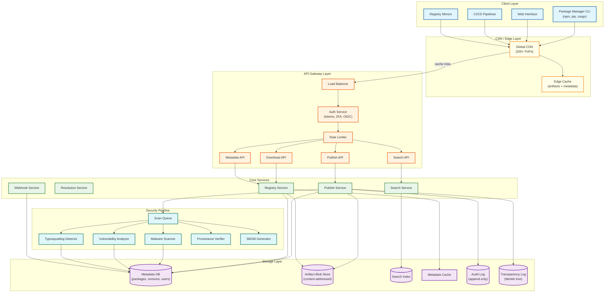
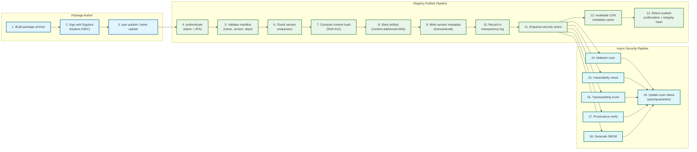
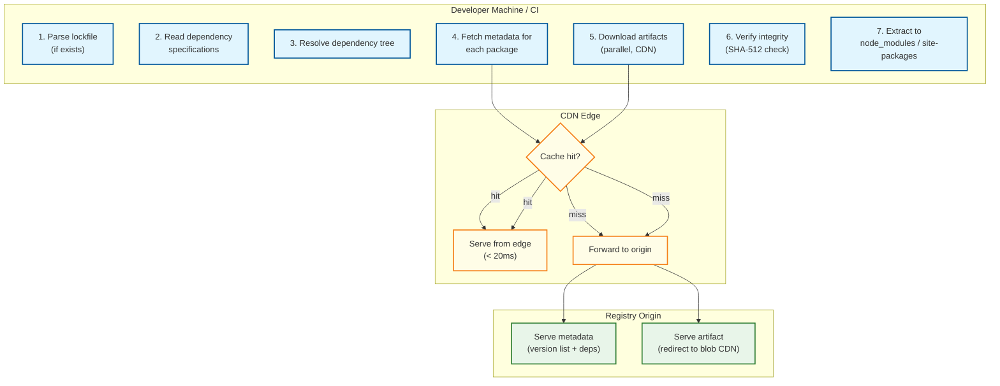
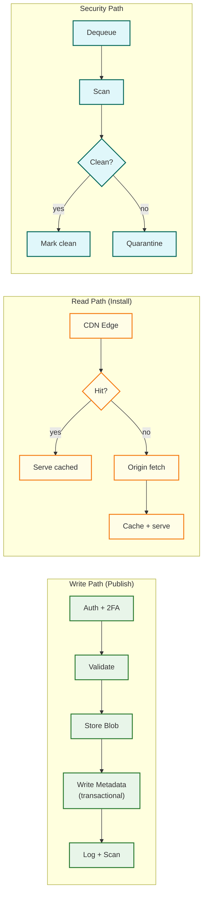

# High-Level Design — Package Registry

## 1. System Architecture

---

## 2. Data Flow — Publish Path

### Publish Path Details

**Step 3-4: Authentication.** The CLI sends the package archive along with an authentication token. The auth service validates the token, checks 2FA if required (mandatory for packages with >1M weekly downloads), and verifies the user has publish permissions for the package scope.

**Step 5-6: Validation and Uniqueness.** The manifest is validated for required fields (name, version, dependency specifications). Version uniqueness is checked with a database-level unique constraint on `(package_name, version)`. If the version already exists, the publish is rejected with a 409 Conflict—no overwrites, no exceptions.

**Step 7-8: Content-Addressed Storage.** A SHA-512 hash of the artifact bytes is computed. The artifact is stored in blob storage keyed by this hash. If the same content already exists (rare but possible with republish of yanked version), the existing blob is referenced without re-upload—content-addressable deduplication.

**Step 9: Transactional Metadata Write.** The version record (version string, content hash, dependency list, dist-tags, publish timestamp, publisher identity) is written to the metadata database in a single transaction. This is the linearization point—after this commit, the version exists.

**Step 10-11: Transparency and Scanning.** The publish event is recorded in an append-only transparency log (Merkle tree). Security scan jobs are enqueued for async processing. The package is immediately available for download—security scanning is non-blocking.

**Step 12-13: Cache Invalidation and Response.** CDN metadata cache for this package is purged (artifact cache doesn't need purging since new version = new URL). The client receives a confirmation with the integrity hash for lockfile recording.

---

## 3. Data Flow — Install Path

### Install Path Details

**Step 1-2: Lockfile Check.** If a lockfile exists (`package-lock.json`, `poetry.lock`, `Cargo.lock`), the client reads exact version pins and integrity hashes. No resolution needed—skip directly to download. If no lockfile, the client reads dependency specifications (version ranges) from the manifest.

**Step 3: Dependency Resolution.** The client (or server-side resolver) computes a compatible set of versions satisfying all constraints. This is the NP-complete step—the resolver uses SAT-solving techniques (PubGrub, CDCL) to find a valid solution or report an incompatibility. Resolution requires fetching metadata (version lists + dependency specs) for potentially hundreds of packages.

**Step 4-5: Metadata Fetch and Artifact Download.** For each resolved package, the client fetches the full version manifest (if not already cached locally) and downloads the artifact. Downloads are parallelized, CDN-served (98%+ hit rate), and use HTTP range requests for retry on partial failure.

**Step 6-7: Integrity Verification and Extraction.** Every downloaded artifact is verified against its SHA-512 integrity hash from the lockfile or metadata. If verification fails, the download is retried from a different CDN PoP. Verified artifacts are extracted into the project's dependency directory.

---

## 4. Key Architectural Decisions

### Decision 1: Metadata-Artifact Split

**Decision:** Separate metadata (package manifests, version lists, dependency specs) from artifacts (tarball bytes) into distinct storage and serving systems.

**Rationale:**
- Metadata is small (2-50 KB per package), frequently accessed, and must be fresh → served from fast, frequently-updated cache/CDN with short TTLs
- Artifacts are large (10 KB - 50 MB), immutable, and accessed less frequently per-version → served from blob storage via CDN with infinite TTL
- Different consistency requirements: metadata is eventually consistent (< 5 min); artifacts are immutable (no consistency issue)
- Enables independent scaling: metadata reads scale via cache replication; artifact reads scale via CDN and blob storage throughput

### Decision 2: Async Security Scanning (Non-Blocking Publish)

**Decision:** Return publish confirmation before security scanning completes. Scan asynchronously and quarantine retroactively if malware is detected.

**Rationale:**
- Blocking publish on scan completion adds 30s-5min latency to every publish—unacceptable developer experience
- Most published packages (>99.9%) are legitimate; blocking all publishes to catch <0.1% is disproportionate
- Quarantine-on-detection still limits exposure window to minutes, not hours
- Alternative (staging + promotion) adds complexity and delays legitimate package availability

**Trade-off:** A malicious package is downloadable for ~5-10 minutes before scan completes. Mitigation: popular packages are almost never malicious (attackers target new/obscure names); high-download packages trigger expedited scanning.

### Decision 3: CDN-First Architecture

**Decision:** Design the entire read path around CDN serving, treating origin servers as a fallback rather than the primary serving tier.

**Rationale:**
- 200B downloads/month generates ~30 PB bandwidth—no origin cluster can serve this economically
- CDN absorbs 98%+ of download traffic, reducing origin to ~600 TB/month
- Immutable artifacts are perfectly CDN-cacheable (content-addressed URLs, infinite TTL)
- CDN PoPs provide geographic proximity, reducing latency for global developer base
- CDN absorbs DDoS attacks before they reach origin infrastructure

### Decision 4: Content-Addressable Blob Storage

**Decision:** Key all artifacts by their cryptographic hash (SHA-512) rather than by package name + version.

**Rationale:**
- Enables deduplication: if two packages ship the same file, only one blob is stored
- Tamper detection: any modification to artifact bytes produces a different hash, breaking the reference
- Immutability enforcement: blobs are write-once, never updated (different content = different key)
- CDN-friendly: hash-based URLs are inherently cacheable with infinite TTL
- Simplifies integrity verification: the URL itself is the expected hash

### Decision 5: Scoped Namespaces

**Decision:** Support scoped package names (`@organization/package-name`) in addition to flat names.

**Rationale:**
- Prevents dependency confusion attacks: private `@myorg/utils` cannot be confused with public `utils`
- Enables organizational ownership: all packages under `@org/` are managed by the organization's access policies
- Reduces namespace pollution: common names like `config`, `utils`, `helpers` can exist in multiple scopes
- Aligns with how private registries work: organizations use scoped names for internal packages

### Decision 6: Transparency Log for Publish Events

**Decision:** Record every publish event in an append-only, cryptographically verifiable transparency log (Merkle tree structure).

**Rationale:**
- Enables third-party auditors to detect unauthorized publishes without trusting the registry operator
- Provides non-repudiation: a maintainer cannot deny publishing a version that appears in the log
- Supports incident response: after discovering a compromised account, auditors can identify all affected versions
- Aligns with Sigstore's transparency model (Rekor) and certificate transparency principles

---

## 5. Component Interaction Summary

| Path | Consistency | Latency Target | Availability Target |
|---|---|---|---|
| **Write (Publish)** | Strong (linearizable version uniqueness) | P99 < 10s | 99.9% |
| **Read (Download)** | Eventual (< 5 min CDN propagation) | P99 < 500ms (CDN) | 99.99% |
| **Security (Scan)** | Eventual (scan results propagate async) | P99 < 10 min | 99.5% |
| **Search** | Eventual (index lag < 60s) | P99 < 500ms | 99.5% |
