# Low-Level Design — Package Registry

## 1. Data Model

### Entity-Relationship Diagram

```mermaid
erDiagram
    PACKAGE ||--o{ VERSION : "has versions"
    PACKAGE ||--o{ PACKAGE_MAINTAINER : "has maintainers"
    PACKAGE }o--|| SCOPE : "belongs to scope"
    VERSION ||--o{ DEPENDENCY : "declares dependencies"
    VERSION ||--o{ DIST_TAG : "tagged by"
    VERSION ||--|| ARTIFACT : "references artifact"
    VERSION ||--o{ SCAN_RESULT : "scanned by"
    VERSION ||--o| PROVENANCE : "attested by"
    USER ||--o{ PACKAGE_MAINTAINER : "maintains"
    USER ||--o{ API_TOKEN : "owns tokens"
    USER ||--o{ AUDIT_EVENT : "performs actions"
    SCOPE ||--o{ SCOPE_MEMBER : "has members"
    USER ||--o{ SCOPE_MEMBER : "member of"
    PACKAGE ||--o{ SECURITY_ADVISORY : "affected by"

    PACKAGE {
        string package_id PK "UUID"
        string name UK "unique within scope"
        string scope_id FK "nullable for unscoped"
        string description "package description"
        string readme_text "rendered README"
        string repository_url "source repo URL"
        string homepage_url "project homepage"
        string license "SPDX identifier"
        string[] keywords "searchable tags"
        bigint total_downloads "aggregate counter"
        bigint weekly_downloads "rolling 7-day count"
        timestamp created_at "first publish"
        timestamp updated_at "last version publish"
        boolean is_deprecated "deprecation flag"
        string deprecation_message "reason for deprecation"
    }

    VERSION {
        string version_id PK "UUID"
        string package_id FK "parent package"
        string version_string UK "semver string"
        string artifact_hash FK "SHA-512 content hash"
        bigint artifact_size "bytes"
        string integrity "ssri format hash"
        jsonb engines "runtime version constraints"
        string publisher_id FK "who published"
        timestamp published_at "publish timestamp"
        boolean is_yanked "soft delete flag"
        string yank_reason "why yanked"
        enum scan_status "pending|clean|quarantined|failed"
        jsonb metadata "ecosystem-specific fields"
    }

    DEPENDENCY {
        string dependency_id PK "UUID"
        string version_id FK "dependent version"
        string dep_package_name "dependency package name"
        string dep_scope "dependency scope"
        string version_constraint "semver range"
        enum dep_type "runtime|dev|peer|optional|build"
        boolean is_optional "can install fail?"
    }

    ARTIFACT {
        string content_hash PK "SHA-512"
        string storage_path "blob store path"
        bigint size_bytes "raw size"
        bigint compressed_size "stored size"
        string content_type "application/gzip"
        timestamp stored_at "upload timestamp"
        int reference_count "versions referencing this"
    }

    USER {
        string user_id PK "UUID"
        string username UK "unique username"
        string email UK "verified email"
        string password_hash "bcrypt hash"
        boolean mfa_enabled "2FA active"
        string mfa_secret "TOTP secret (encrypted)"
        string[] oidc_identities "linked OIDC providers"
        timestamp created_at "registration date"
        timestamp last_login "last authentication"
    }

    SCOPE {
        string scope_id PK "UUID"
        string scope_name UK "@organization"
        enum scope_type "user|organization"
        timestamp created_at "creation date"
    }

    API_TOKEN {
        string token_id PK "UUID"
        string user_id FK "token owner"
        string token_hash UK "SHA-256 of token"
        string[] allowed_packages "package filter"
        string[] allowed_scopes "scope filter"
        string[] allowed_cidrs "IP restrictions"
        enum permissions "publish|read|admin"
        timestamp expires_at "expiration"
        timestamp last_used "last API call"
    }

    SCAN_RESULT {
        string scan_id PK "UUID"
        string version_id FK "scanned version"
        enum scan_type "malware|vulnerability|typosquatting|license|provenance"
        enum result "pass|fail|warning"
        float confidence "0.0-1.0"
        jsonb details "scanner-specific output"
        timestamp scanned_at "scan completion"
        string scanner_version "scanner identity"
    }

    PROVENANCE {
        string provenance_id PK "UUID"
        string version_id FK "attested version"
        string build_type "SLSA build type"
        string source_repo "source repository URL"
        string source_commit "git commit SHA"
        string builder_id "CI/CD system identity"
        string signature "Sigstore signature"
        string certificate "signing certificate"
        string transparency_log_entry "Rekor log index"
        timestamp attested_at "attestation timestamp"
    }

    AUDIT_EVENT {
        string event_id PK "UUID"
        string user_id FK "actor"
        string package_id FK "affected package"
        string version_id FK "affected version (nullable)"
        enum action "publish|yank|deprecate|owner_add|owner_remove|token_create|token_revoke"
        jsonb details "action-specific data"
        string ip_address "client IP"
        string user_agent "client UA"
        timestamp occurred_at "event timestamp"
    }

    SECURITY_ADVISORY {
        string advisory_id PK "CVE or registry ID"
        string package_id FK "affected package"
        string[] affected_versions "version ranges"
        string[] patched_versions "fixed version ranges"
        enum severity "critical|high|medium|low"
        string title "advisory title"
        text description "advisory details"
        string[] cwe_ids "CWE references"
        timestamp published_at "disclosure date"
        timestamp updated_at "last update"
    }

    DIST_TAG {
        string tag_id PK "UUID"
        string package_id FK "parent package"
        string tag_name "e.g., latest, next, beta"
        string version_id FK "pointed version"
        timestamp updated_at "last retag"
    }
```



---

## 2. Indexing Strategy

### Primary Indexes

| Table | Index | Type | Purpose |
|---|---|---|---|
| `PACKAGE` | `(scope_id, name)` | Unique B-tree | Package lookup by qualified name |
| `PACKAGE` | `(name)` text search | GIN trigram | Fuzzy name search, typosquatting detection |
| `PACKAGE` | `(weekly_downloads DESC)` | B-tree | Popularity ranking |
| `PACKAGE` | `(keywords)` | GIN array | Keyword-based discovery |
| `VERSION` | `(package_id, version_string)` | Unique B-tree | Version uniqueness constraint |
| `VERSION` | `(package_id, published_at DESC)` | B-tree | Latest version lookup |
| `VERSION` | `(artifact_hash)` | B-tree | Content-addressed artifact lookup |
| `VERSION` | `(scan_status)` | B-tree partial (WHERE scan_status != 'clean') | Pending/quarantined scan queries |
| `DEPENDENCY` | `(version_id)` | B-tree | Dependency list for a version |
| `DEPENDENCY` | `(dep_package_name, dep_scope)` | B-tree | Reverse dependency lookup ("who depends on X?") |
| `API_TOKEN` | `(token_hash)` | Unique B-tree | Token authentication lookup |
| `AUDIT_EVENT` | `(package_id, occurred_at DESC)` | B-tree | Package audit trail |
| `AUDIT_EVENT` | `(user_id, occurred_at DESC)` | B-tree | User activity trail |

### Search Index (External Search Engine)

| Field | Weight | Indexed Type |
|---|---|---|
| `package.name` | Highest | Exact + ngram |
| `package.keywords` | High | Exact terms |
| `package.description` | Medium | Full-text analyzed |
| `package.readme_text` | Low | Full-text analyzed |
| `package.weekly_downloads` | Boost factor | Numeric (popularity signal) |
| `version.published_at` | Recency factor | Date (freshness signal) |

---

## 3. API Design

### 3.1 Package Metadata API

```
GET /registry/{scope}/{package}
GET /registry/{package}
```

**Response (abbreviated):**
```
{
  "name": "@scope/package-name",
  "description": "A useful package",
  "dist-tags": {
    "latest": "2.3.1",
    "next": "3.0.0-beta.1"
  },
  "versions": {
    "2.3.1": {
      "version": "2.3.1",
      "dependencies": { "dep-a": "^1.0.0", "dep-b": ">=2.0.0 <3.0.0" },
      "devDependencies": { "test-lib": "^5.0.0" },
      "dist": {
        "integrity": "sha512-abc123...",
        "tarball": "https://registry.example.com/artifacts/sha512-abc123.tgz",
        "fileCount": 42,
        "unpackedSize": 156000
      },
      "provenance": {
        "sourceRepo": "https://github.com/org/repo",
        "sourceCommit": "a1b2c3d4...",
        "buildType": "https://github.com/actions/runner",
        "transparencyLogEntry": "https://rekor.example.com/api/v1/log/entries/..."
      }
    }
  },
  "time": {
    "created": "2023-01-15T10:30:00Z",
    "2.3.1": "2025-06-20T14:22:00Z"
  },
  "maintainers": [
    { "username": "author", "email": "author@example.com" }
  ]
}
```

**Caching headers:**
```
Cache-Control: public, max-age=300, stale-while-revalidate=60
ETag: "v2.3.1-1687271520"
```

### 3.2 Publish API

```
PUT /registry/{scope}/{package}
Authorization: Bearer <token>
Content-Type: application/octet-stream
```

**Request body:** Package archive (tarball) containing:
- `package.json` / `setup.py` / `Cargo.toml` (manifest)
- Source files
- README

**Publish Pipeline (pseudocode):**

```
FUNCTION publish(token, package_archive):
    // Step 1: Authenticate and authorize
    user = authenticate(token)
    IF NOT user THEN RETURN 401 Unauthorized
    IF user.requires_2fa AND NOT token.has_2fa THEN RETURN 403 "2FA required"

    // Step 2: Extract and validate manifest
    manifest = extract_manifest(package_archive)
    validate_package_name(manifest.name)
    validate_semver(manifest.version)
    validate_dependency_specs(manifest.dependencies)

    // Step 3: Authorization check
    package = lookup_package(manifest.name)
    IF package EXISTS:
        IF user NOT IN package.maintainers THEN RETURN 403 Forbidden
        IF version_exists(package.id, manifest.version) THEN RETURN 409 "Version already exists"
    ELSE:
        // New package — check namespace availability
        IF is_name_squatted(manifest.name) THEN RETURN 403 "Name reserved"
        package = create_package(manifest)
        add_maintainer(package.id, user.id, role="owner")

    // Step 4: Content-addressed storage
    content_hash = SHA512(package_archive)
    artifact = store_blob(content_hash, package_archive)

    // Step 5: Transactional metadata write
    BEGIN TRANSACTION
        version = insert_version(package.id, manifest.version, content_hash, user.id)
        insert_dependencies(version.id, manifest.dependencies)
        update_dist_tag(package.id, "latest", version.id)  // if not prerelease
        update_package_timestamp(package.id)
        insert_audit_event(user.id, package.id, version.id, "publish")
    COMMIT

    // Step 6: Async post-publish
    append_transparency_log(package.name, manifest.version, content_hash, user.id)
    enqueue_security_scan(version.id, content_hash)
    invalidate_cdn_cache(package.name)
    trigger_webhooks(package.id, "new_version", version)

    RETURN 201 Created {
        "name": manifest.name,
        "version": manifest.version,
        "integrity": "sha512-" + base64(content_hash)
    }
```

### 3.3 Download API

```
GET /artifacts/{content_hash}.tgz
```

**Response:** 302 redirect to CDN URL (or direct serve if CDN miss)

**Download flow (pseudocode):**

```
FUNCTION download(content_hash):
    // CDN handles 98%+ of requests; this is origin fallback
    artifact = lookup_artifact(content_hash)
    IF NOT artifact THEN RETURN 404 Not Found

    // Increment download counter asynchronously
    async_increment_download(artifact.package_id)

    // Return artifact with integrity headers
    RETURN 200 OK {
        headers: {
            "Content-Type": "application/gzip",
            "Content-Length": artifact.size_bytes,
            "ETag": content_hash,
            "Cache-Control": "public, max-age=31536000, immutable",
            "X-Content-Hash": "sha512-" + base64(content_hash)
        },
        body: read_blob(artifact.storage_path)
    }
```

### 3.4 Search API

```
GET /search?q={query}&page={page}&size={size}&quality={min_quality}
```

**Search ranking (pseudocode):**

```
FUNCTION compute_search_score(package, query):
    // Text relevance (0-100)
    name_score = exact_match(package.name, query) * 100
                 + prefix_match(package.name, query) * 80
                 + fuzzy_match(package.name, query) * 40
    keyword_score = keyword_overlap(package.keywords, query) * 30
    description_score = bm25(package.description, query) * 20
    readme_score = bm25(package.readme, query) * 5

    text_score = MAX(name_score, keyword_score + description_score + readme_score)

    // Popularity signal (log-scaled, 0-50)
    popularity = LOG10(package.weekly_downloads + 1) * 10
    popularity = MIN(popularity, 50)

    // Quality signal (0-30)
    quality = 0
    IF package.has_readme THEN quality += 5
    IF package.has_license THEN quality += 5
    IF package.has_repository THEN quality += 5
    IF package.has_types THEN quality += 5
    IF days_since(package.updated_at) < 365 THEN quality += 5
    IF package.has_provenance THEN quality += 5

    RETURN text_score + popularity + quality
```

### 3.5 Version Resolution API (Server-Side)

```
POST /resolve
Content-Type: application/json

{
  "dependencies": {
    "@scope/pkg-a": "^2.0.0",
    "pkg-b": ">=1.5.0 <3.0.0"
  },
  "lockfile_versions": {
    "@scope/pkg-a": "2.1.3"
  }
}
```

---

## 4. Core Algorithms

### 4.1 Semantic Version Constraint Resolution

```
FUNCTION satisfies(version, constraint):
    // Parse constraint into list of comparator sets (OR'd together)
    // Each comparator set is a list of comparators (AND'd together)
    // e.g., ">=1.2.0 <2.0.0 || >=3.0.0" = [[">=1.2.0", "<2.0.0"], [">=3.0.0"]]

    comparator_sets = parse_constraint(constraint)

    FOR EACH comparator_set IN comparator_sets:
        IF all_comparators_match(version, comparator_set):
            RETURN TRUE

    RETURN FALSE

FUNCTION resolve_best_version(package_name, constraint, registry):
    // Fetch all published versions (non-yanked)
    all_versions = registry.get_versions(package_name)
        .filter(v => NOT v.is_yanked AND v.scan_status != "quarantined")

    // Filter to constraint-satisfying versions
    candidates = all_versions.filter(v => satisfies(v, constraint))

    IF candidates IS EMPTY:
        RETURN NULL  // No compatible version

    // Return highest satisfying version (semver ordering)
    RETURN candidates.sort_descending(semver_compare).first()
```

### 4.2 Dependency Resolution (PubGrub Algorithm — Simplified)

The PubGrub algorithm resolves dependency constraints using a combination of unit propagation and conflict-driven learning, producing human-readable error messages when resolution is impossible.

```
FUNCTION resolve_dependencies(root_dependencies):
    // State: partial solution mapping package → selected version
    solution = {}
    // Incompatibilities: learned constraints that cannot be satisfied
    incompatibilities = []

    // Initialize with root dependency constraints
    FOR EACH (package, constraint) IN root_dependencies:
        add_incompatibility(incompatibilities, {package: NOT constraint})

    WHILE TRUE:
        // Unit propagation: find packages with exactly one valid version
        result = propagate(solution, incompatibilities)

        IF result == CONFLICT:
            // Conflict-driven clause learning
            learned = analyze_conflict(incompatibilities)
            IF learned.is_root_cause:
                // Unresolvable — generate human-readable error
                RETURN error_with_derivation_tree(learned)
            add_incompatibility(incompatibilities, learned)
            backtrack(solution, learned.decision_level)
            CONTINUE

        IF result == SOLUTION_COMPLETE:
            RETURN solution  // All packages resolved

        // Decision: pick next package to resolve
        next_package = choose_next_package(solution, incompatibilities)
        next_version = choose_version(next_package, solution)

        IF next_version IS NULL:
            // No valid version exists for this package
            add_incompatibility(incompatibilities,
                {next_package: "no compatible version"})
            CONTINUE

        // Add decision to solution
        solution[next_package] = next_version

        // Add dependencies of chosen version as new constraints
        deps = registry.get_dependencies(next_package, next_version)
        FOR EACH (dep_pkg, dep_constraint) IN deps:
            add_incompatibility(incompatibilities,
                {next_package: next_version, dep_pkg: NOT dep_constraint})

FUNCTION choose_next_package(solution, incompatibilities):
    // Heuristic: choose package that appears in most incompatibilities
    // (VSIDS-like heuristic from SAT solving)
    undecided = get_undecided_packages(solution)
    RETURN undecided.max_by(p => count_incompatibility_appearances(p))

FUNCTION analyze_conflict(incompatibilities):
    // Walk the incompatibility derivation graph to find root cause
    // Produces a human-readable explanation like:
    // "Because pkg-a@2.0.0 depends on pkg-b@^3.0.0
    //  and pkg-c@1.0.0 depends on pkg-b@^2.0.0,
    //  pkg-a@2.0.0 is incompatible with pkg-c@1.0.0."

    conflict = get_current_conflict()
    WHILE conflict.can_be_simplified():
        conflict = resolve_with_prior_incompatibility(conflict)
    RETURN conflict
```

### 4.3 Content-Addressable Storage

```
FUNCTION store_artifact(package_archive):
    // Compute content hash
    hash = SHA512(package_archive)
    storage_key = "sha512/" + hex(hash[0:2]) + "/" + hex(hash[2:4]) + "/" + hex(hash)

    // Check for existing blob (deduplication)
    IF blob_exists(storage_key):
        increment_reference_count(storage_key)
        RETURN { hash: hash, size: len(package_archive), deduplicated: TRUE }

    // Compress and store
    compressed = gzip_compress(package_archive)

    // Write to primary and replica regions atomically
    write_blob(storage_key, compressed, {
        content_type: "application/gzip",
        metadata: {
            original_size: len(package_archive),
            compressed_size: len(compressed),
            stored_at: now()
        },
        replication: "multi-region-sync"  // synchronous multi-region write
    })

    RETURN { hash: hash, size: len(package_archive), deduplicated: FALSE }

FUNCTION verify_artifact_integrity(content_hash, artifact_bytes):
    computed_hash = SHA512(artifact_bytes)
    IF computed_hash != content_hash:
        RAISE IntegrityError("Artifact hash mismatch: expected " + content_hash +
                             ", got " + computed_hash)
    RETURN TRUE
```

### 4.4 Download Counter Aggregation

Download counts at 200B/month scale cannot be updated synchronously per request.

```
FUNCTION async_increment_download(package_id, version_id):
    // Batch in-memory counter (per API server)
    local_counter[package_id][version_id] += 1

    // Flush to persistent store every N seconds or M increments
    IF local_counter[package_id].total > FLUSH_THRESHOLD
       OR time_since_last_flush > FLUSH_INTERVAL:
        flush_download_counts(package_id, local_counter[package_id])
        local_counter[package_id].reset()

FUNCTION flush_download_counts(package_id, counts):
    // Write batch increment to time-series store
    FOR EACH (version_id, count) IN counts:
        time_series_store.increment(
            key: "downloads:" + package_id + ":" + version_id,
            value: count,
            timestamp: current_minute_bucket()
        )

    // Update aggregate counter (eventual consistency)
    aggregate_store.increment(
        key: "weekly_downloads:" + package_id,
        value: counts.total
    )
```

---

## 5. Version Constraint Algebra

Package managers use version constraints to specify compatible dependency versions. The constraint language is formally defined:

| Operator | Meaning | Example | Matches |
|---|---|---|---|
| `=` (exact) | Exactly this version | `=1.2.3` | `1.2.3` only |
| `^` (caret) | Compatible with (same major) | `^1.2.3` | `>=1.2.3` and `<2.0.0` |
| `~` (tilde) | Approximately (same minor) | `~1.2.3` | `>=1.2.3` and `<1.3.0` |
| `>=` | Greater than or equal | `>=1.2.0` | `1.2.0`, `1.3.0`, `2.0.0`, ... |
| `<` | Less than | `<2.0.0` | `1.9.9`, `1.0.0`, `0.1.0`, ... |
| `\|\|` (or) | Either range | `^1.0.0 \|\| ^2.0.0` | Any `1.x` or `2.x` |
| `*` (wildcard) | Any version | `*` | All published versions |
| `-` (hyphen) | Inclusive range | `1.2.0 - 2.0.0` | `>=1.2.0` and `<=2.0.0` |

### Semver Ordering Rules

```
FUNCTION semver_compare(a, b):
    // Major.Minor.Patch comparison
    IF a.major != b.major THEN RETURN a.major - b.major
    IF a.minor != b.minor THEN RETURN a.minor - b.minor
    IF a.patch != b.patch THEN RETURN a.patch - b.patch

    // Pre-release versions have lower precedence
    IF a.has_prerelease AND NOT b.has_prerelease THEN RETURN -1
    IF NOT a.has_prerelease AND b.has_prerelease THEN RETURN 1

    // Compare pre-release identifiers left to right
    RETURN compare_prerelease_identifiers(a.prerelease, b.prerelease)
```

---

## 6. Lockfile Generation

```
FUNCTION generate_lockfile(resolved_packages):
    lockfile = {
        "lockfileVersion": 3,
        "requires": TRUE,
        "packages": {}
    }

    FOR EACH (package_name, resolved_version) IN resolved_packages:
        metadata = registry.get_version_metadata(package_name, resolved_version)

        lockfile.packages[package_name] = {
            "version": resolved_version,
            "resolved": metadata.dist.tarball,
            "integrity": metadata.dist.integrity,
            "dependencies": metadata.dependencies,
            "engines": metadata.engines
        }

    RETURN lockfile

FUNCTION verify_lockfile_integrity(lockfile, downloaded_artifacts):
    FOR EACH (package_name, entry) IN lockfile.packages:
        artifact = downloaded_artifacts[package_name]
        expected_hash = parse_integrity(entry.integrity)
        actual_hash = SHA512(artifact)

        IF actual_hash != expected_hash:
            RAISE IntegrityError(
                "Lockfile integrity check failed for " + package_name +
                "@" + entry.version +
                ": expected " + expected_hash +
                ", got " + actual_hash
            )

    RETURN TRUE  // All packages verified
```
