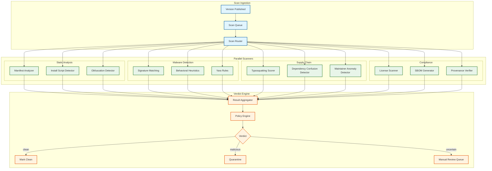

# Deep Dive & Bottlenecks — Package Registry

## Deep Dive 1: Dependency Resolution Engine

### The Fundamental Challenge

Dependency resolution is the problem of finding a set of package versions that satisfies all version constraints in a transitive dependency graph. This problem is provably NP-complete—formally equivalent to Boolean satisfiability (3-SAT). A modern project like a React application can have 1,500+ transitive dependencies with complex version constraints, and the resolver must find a compatible set or explain why no solution exists.

### Why Greedy Resolution Fails

A naive greedy algorithm (pick the latest version of each package) fails on diamond dependency conflicts:

```
Root depends on:
  pkg-A: ^2.0.0
  pkg-B: ^1.0.0

pkg-A@2.3.0 depends on:
  pkg-C: ^3.0.0

pkg-B@1.5.0 depends on:
  pkg-C: ^2.0.0        ← conflict! ^3.0.0 and ^2.0.0 have no intersection
```

A greedy resolver picks `pkg-A@2.3.0` and `pkg-B@1.5.0` (latest of each), then discovers that their `pkg-C` requirements are incompatible. The correct solution requires backtracking: try `pkg-A@2.2.0` which depends on `pkg-C: ^2.5.0`, compatible with `pkg-B`'s constraint.

### Production Resolution: PubGrub with CDCL

Production resolvers combine ideas from SAT solving (CDCL — Conflict-Driven Clause Learning) with domain-specific optimizations:

**Unit Propagation:** When a package has only one possible version (given current constraints), assign it immediately without decision.

**Conflict Analysis:** When a conflict is detected, analyze the root cause and learn a new incompatibility that prevents the same conflict in future branches. This is analogous to clause learning in CDCL SAT solvers.

**Non-Chronological Backjumping:** Instead of backtracking to the most recent decision, jump back to the decision that caused the conflict. If `pkg-C`'s conflict is caused by `pkg-A@2.3.0`, backjump to the `pkg-A` decision even if many other packages were decided after it.

**Version Ordering Heuristic:** Try versions in descending order (prefer latest), but prefer versions that minimize the number of new constraints introduced. This heuristic resolves most real-world cases without backtracking.

**Resolution Complexity in Practice:**

| Scenario | Typical Resolution Time | Why |
|---|---|---|
| Lockfile present (all pinned) | < 100ms | No resolution needed, just verify |
| Fresh install, well-constrained | 200ms - 1s | Few conflicts, minimal backtracking |
| Version update with conflicts | 1s - 5s | Backtracking through version combinations |
| Pathological constraints | 5s - 30s | Deep diamond conflicts, many candidates |
| Truly unsatisfiable | 1s - 10s | Conflict analysis terminates early |

### Performance Optimizations

**Metadata Prefetching:** The resolver predicts which packages will be needed (based on the dependency graph shape) and prefetches metadata in parallel. A batch metadata API (`POST /metadata/batch`) reduces round trips from O(n) to O(depth).

**Version Candidate Caching:** Cache the sorted list of versions satisfying a constraint. Since constraints are repeated across projects (`^1.0.0` for a popular package), the cache hit rate is high.

**Partial Solution Caching:** If a subtree of the dependency graph was resolved successfully, cache that partial solution. Many projects share common sub-dependency trees (e.g., the `typescript` ecosystem).

**Constraint Simplification:** Before resolution, simplify overlapping constraints. If root requires `^1.0.0` and a dependency requires `>=1.2.0 <2.0.0`, the effective constraint is `>=1.2.0 <2.0.0`.

---

## Deep Dive 2: Security Scanning Pipeline

### Pipeline Architecture



### Scanner Details

**1. Install Script Detection**

Pre-install and post-install scripts are the primary vector for malicious packages. The scanner extracts and analyzes lifecycle scripts:

```
FUNCTION detect_suspicious_install_scripts(manifest, archive_files):
    scripts = manifest.get("scripts", {})
    risk_score = 0.0
    findings = []

    // Check for lifecycle scripts
    FOR EACH hook IN ["preinstall", "postinstall", "preuninstall"]:
        IF hook IN scripts:
            script_content = scripts[hook]
            risk_score += 0.3  // Lifecycle scripts are inherently suspicious

            // Check for network calls
            IF contains_network_patterns(script_content):
                risk_score += 0.4
                findings.append("Network call in " + hook)

            // Check for file system writes outside package dir
            IF contains_external_fs_writes(script_content):
                risk_score += 0.3
                findings.append("External FS write in " + hook)

            // Check for encoded/obfuscated content
            IF contains_obfuscated_content(script_content):
                risk_score += 0.5
                findings.append("Obfuscated code in " + hook)

            // Check for environment variable exfiltration
            IF contains_env_access(script_content):
                risk_score += 0.3
                findings.append("Env var access in " + hook)

    RETURN { score: MIN(risk_score, 1.0), findings: findings }
```

**2. Typosquatting Scorer**

Compares new package names against popular packages using multiple distance metrics:

```
FUNCTION score_typosquatting_risk(new_name, popular_packages):
    best_match = NULL
    max_similarity = 0.0

    FOR EACH popular IN popular_packages:
        // Levenshtein distance (character edits)
        lev_distance = levenshtein(new_name, popular.name)
        lev_similarity = 1.0 - (lev_distance / MAX(len(new_name), len(popular.name)))

        // Keyboard adjacency distance (for fat-finger typos)
        keyboard_sim = keyboard_adjacency_similarity(new_name, popular.name)

        // Homoglyph detection (l vs 1, O vs 0, rn vs m)
        homoglyph_sim = homoglyph_similarity(new_name, popular.name)

        // Combined score, weighted by target package popularity
        popularity_weight = LOG10(popular.weekly_downloads + 1) / 10.0
        combined = MAX(lev_similarity, keyboard_sim, homoglyph_sim) * popularity_weight

        IF combined > max_similarity:
            max_similarity = combined
            best_match = popular

    // High similarity to a popular package = high risk
    RETURN {
        risk_score: max_similarity,
        similar_to: best_match.name IF max_similarity > 0.8 ELSE NULL,
        download_ratio: new_publisher_downloads / best_match.weekly_downloads
    }
```

**3. Dependency Confusion Detector**

Detects packages that share names with known private package scopes:

```
FUNCTION detect_dependency_confusion(package_name, publisher):
    // Check if an unscoped name matches known private packages
    IF NOT is_scoped(package_name):
        // Query private registry feeds that have reported their namespace
        private_matches = query_private_namespace_registry(package_name)

        IF private_matches IS NOT EMPTY:
            // Check if publisher is associated with any matching org
            FOR EACH match IN private_matches:
                IF publisher NOT IN match.organization.members:
                    RETURN {
                        risk: "HIGH",
                        reason: "Unscoped package name matches private package in " +
                                match.organization.name,
                        mitigation: "Use scoped name @" + match.organization.scope +
                                    "/" + package_name
                    }

    RETURN { risk: "NONE" }
```

### Verdict Aggregation

```
FUNCTION aggregate_scan_verdict(scan_results):
    // Any single critical finding triggers quarantine
    IF any(r.score > 0.9 AND r.type IN ["malware", "install_script"]):
        RETURN "QUARANTINE"

    // Multiple medium findings trigger manual review
    medium_findings = count(r FOR r IN scan_results IF r.score > 0.5)
    IF medium_findings >= 3:
        RETURN "MANUAL_REVIEW"

    // Typosquatting of very popular packages triggers review
    IF any(r.type == "typosquatting" AND r.similar_to.weekly_downloads > 1_000_000
           AND r.score > 0.85):
        RETURN "MANUAL_REVIEW"

    RETURN "CLEAN"
```

---

## Deep Dive 3: CDN Download Serving at Scale

### The Scale Challenge

Serving 200B+ downloads per month (150K peak RPS, ~180 Gbps peak bandwidth) requires a CDN-first architecture where the origin servers handle less than 2% of total traffic.

### CDN Caching Strategy

| Content Type | Cache Key | TTL | Invalidation |
|---|---|---|---|
| Artifact tarball | `/artifacts/{sha512}.tgz` | Infinite (immutable) | Never (content-addressed) |
| Package metadata | `/{scope}/{name}` | 5 minutes | On publish (purge) |
| Abbreviated metadata | `/{scope}/{name}` + `Accept: application/vnd.npm.install-v1+json` | 5 minutes | On publish (purge) |
| Search results | `/search?q={query}&page={page}` | 60 seconds | TTL-based only |
| Download counts | `/{scope}/{name}/downloads` | 1 hour | TTL-based only |

### The Abbreviated Metadata Optimization

Full package metadata (all versions with all fields) can be megabytes for packages with hundreds of versions. The `install` path only needs version numbers, dependency specs, and artifact hashes. An abbreviated metadata format reduces response size by 80-90%:

```
FUNCTION serve_abbreviated_metadata(package_name, accept_header):
    IF accept_header CONTAINS "application/vnd.npm.install-v1+json":
        // Abbreviated format — only fields needed for resolution
        RETURN {
            "name": package.name,
            "dist-tags": package.dist_tags,
            "versions": {
                FOR EACH version IN package.versions:
                    version.string: {
                        "version": version.string,
                        "dependencies": version.dependencies,
                        "peerDependencies": version.peer_dependencies,
                        "optionalDependencies": version.optional_dependencies,
                        "dist": {
                            "integrity": version.integrity,
                            "tarball": version.tarball_url
                        },
                        "engines": version.engines
                    }
            }
        }
        // Response: ~10 KB vs ~500 KB for full metadata
    ELSE:
        RETURN full_package_metadata(package_name)
```

### Hot Package Mitigation

The top 100 packages (react, lodash, typescript, express) account for a disproportionate share of downloads. These "hot packages" create CDN edge concentration:

```
FUNCTION optimize_hot_package_serving():
    // Tier 1: Ultra-hot packages (top 100)
    // - Preloaded at ALL CDN PoPs (push-based, not pull)
    // - Replicated to edge storage (not just cache)
    // - Served from edge compute with 0 origin lookups
    FOR EACH package IN hot_packages.tier1:
        cdn.preload_all_pops(package.latest_version.artifact_url)
        cdn.preload_all_pops(package.metadata_url)

    // Tier 2: Popular packages (top 10,000)
    // - Cached at regional PoPs with long TTL
    // - Stale-while-revalidate for metadata
    FOR EACH package IN hot_packages.tier2:
        cdn.set_regional_cache_priority(package, priority=HIGH)

    // Tier 3: All other packages
    // - Standard CDN caching, pull-through on first request
    // - Short metadata TTL, infinite artifact TTL
```

### Origin Shield Pattern

To prevent cache miss storms from hitting the origin directly, a two-tier CDN architecture is used:

```
Client → Edge PoP (200+ locations)
         ↓ (cache miss)
         Origin Shield (3-5 regional shields)
         ↓ (cache miss)
         Origin Servers
```

Benefits:
- Edge PoP misses hit the shield, not origin directly
- Shield aggregates concurrent misses for the same resource (request coalescing)
- Origin sees smoothed, reduced traffic even during cache cold-starts
- Shield can serve stale content during origin outages

---

## Bottleneck Analysis

### Bottleneck 1: Metadata Database — Read Amplification

**Problem:** Every `npm install` triggers metadata fetches for all direct and transitive dependencies. A project with 1,500 dependencies generates 1,500 metadata queries. At 20M daily installers, this creates ~30B metadata reads/day against the metadata store.

**Symptoms:**
- Database CPU saturation during US/EU business hours
- P99 metadata latency spikes above 500ms
- Connection pool exhaustion

**Mitigations:**

| Strategy | Description | Impact |
|---|---|---|
| **CDN metadata caching** | 5-min TTL on metadata, 98% hit rate | Reduces origin reads by 50× |
| **Abbreviated metadata** | 80% smaller responses for install path | Reduces bandwidth and serialization cost |
| **Batch metadata API** | Single request for multiple packages | Reduces connection overhead |
| **Read replicas** | Horizontally scaled read-only database replicas | Scales read capacity linearly |
| **Materialized metadata views** | Pre-computed JSON documents updated on publish | Eliminates per-request JOIN queries |
| **Local client cache** | Package manager caches metadata locally | Eliminates repeated fetches within TTL |

### Bottleneck 2: Publish Path — Transactional Write Contention

**Problem:** Publishing a version requires a transaction spanning multiple tables (version insert, dependency inserts, dist-tag update, audit log, package timestamp update). Under load (50K publishes/day, bursty during CI/CD peak hours), write contention on popular packages causes lock wait timeouts.

**Symptoms:**
- Publish latency spikes when multiple maintainers publish different packages simultaneously
- Row-level lock contention on the `PACKAGE` table (updating `updated_at` timestamp)
- Transaction rollbacks under concurrent publish

**Mitigations:**

| Strategy | Description | Impact |
|---|---|---|
| **Optimistic concurrency** | Use version number as optimistic lock; retry on conflict | Eliminates row locks for most publishes |
| **Deferred timestamp update** | Update `package.updated_at` asynchronously | Removes contention on package row |
| **Partitioned audit log** | Write audit events to separate, append-only store | Removes audit writes from critical path |
| **Publish queue serialization** | Serialize publishes to same package via queue | Eliminates concurrent write conflicts per-package |

### Bottleneck 3: CDN Cache Stampede on New Version Publish

**Problem:** When a popular package publishes a new version, CDN metadata caches are purged. The first requests after purge all miss the cache and flood the origin simultaneously—a thundering herd.

**Symptoms:**
- Origin traffic spikes 100× for 30-60 seconds after popular package publish
- Increased error rate during stampede
- Cascading latency increase across all metadata queries

**Mitigations:**

| Strategy | Description | Impact |
|---|---|---|
| **Stale-while-revalidate** | Serve stale metadata while revalidating in background | Eliminates stampede entirely for non-critical freshness |
| **Origin shield coalescing** | Shield deduplicates concurrent requests for same resource | Reduces origin load to 1 request per resource per shield |
| **Probabilistic early revalidation** | Random subset of requests trigger revalidation before TTL expires | Smooths revalidation over time |
| **Proactive cache warming** | After publish, proactively push updated metadata to shields | Pre-populates cache before client requests arrive |

### Bottleneck 4: Security Scanning Throughput

**Problem:** 50K publishes/day must each be scanned by 5+ scanners. Some scanners (behavioral analysis, SBOM generation) take 30-60 seconds per package. Total scanner capacity must sustain ~500 scan-tasks/minute.

**Symptoms:**
- Scan queue depth growing during peak publish hours
- Scan completion SLO breached (>10 min for 1%+ of publishes)
- Malware exposure window expands

**Mitigations:**

| Strategy | Description | Impact |
|---|---|---|
| **Scanner parallelism** | All scanners run in parallel per version (not sequential) | Reduces per-version scan latency to MAX(scanner times) |
| **Priority queue** | Prioritize scans for packages with high download counts | Ensures popular packages are scanned first |
| **Incremental scanning** | For minor version bumps, scan only changed files | Reduces scan work by 70% for patch releases |
| **Scanner auto-scaling** | Scale scanner fleet based on queue depth | Handles publish bursts without degradation |
| **Fast-path bypass** | Skip full scan for trusted publishers with provenance attestation | Reduces scan volume for verified CI/CD publishes |

### Bottleneck 5: Dependency Graph Computation at Scale

**Problem:** Reverse dependency queries ("which packages depend on vulnerable-pkg?") require traversing the entire dependency graph. With 50M+ versions and billions of dependency edges, this graph doesn't fit in memory on a single machine.

**Symptoms:**
- Vulnerability impact analysis takes hours instead of minutes
- Security advisory propagation is delayed
- "Dependents" count on package pages is stale

**Mitigations:**

| Strategy | Description | Impact |
|---|---|---|
| **Graph database** | Store dependency graph in a dedicated graph store optimized for traversal | Sub-second reverse dependency queries |
| **Materialized reverse index** | Pre-compute and maintain reverse dependency mappings | O(1) lookup for "who depends on X?" |
| **Incremental graph update** | Update graph incrementally on publish (add edges) and yank (mark edges) | Avoid full graph recomputation |
| **Partitioned BFS** | Partition graph by package namespace for parallel traversal | Enables distributed vulnerability propagation |
| **Tiered depth limits** | Limit transitive dependency traversal to depth 5 for advisory propagation | Bounds computation while covering 99%+ of real impact |
