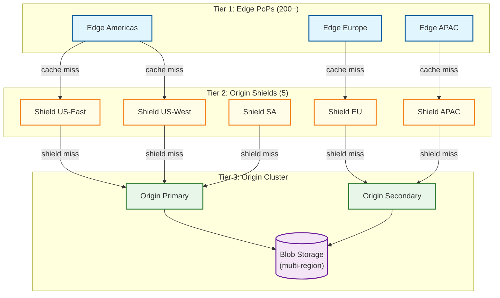

# Scalability & Reliability — Package Registry

## 1. CDN-First Architecture at 200B+ Downloads/Month

### The Economics of Scale

At 200B downloads/month with an average package size of 150 KB, the raw bandwidth is ~30 PB/month. Serving this from origin servers would require thousands of servers and cost millions in bandwidth. CDN economics fundamentally change the architecture:

| Metric | Without CDN | With CDN (98% hit) |
|---|---|---|
| Origin bandwidth | 30 PB/month | 600 TB/month |
| Origin servers needed | 2,000+ | ~30 |
| P50 download latency | 200-500ms | 20-50ms |
| Geographic coverage | 1-3 regions | 200+ PoPs |
| DDoS resilience | Limited | CDN-absorbed |
| Monthly bandwidth cost | Enormous | 50× lower |

### CDN Tier Architecture



### Caching Behavior by Content Type

**Artifacts (tarballs):** Content-addressed URLs (`/artifacts/sha512-abc123.tgz`) are perfectly cacheable with infinite TTL. Once an artifact is cached at an edge PoP, it never needs revalidation—the content hash guarantees immutability. Cache eviction only happens due to storage pressure, and popular packages are effectively pinned.

**Package metadata:** Cached with 5-minute TTL and `stale-while-revalidate: 60`. On publish, the registry sends a targeted CDN purge for the specific package URL. The stale-while-revalidate directive ensures that even during revalidation, clients get a response immediately (potentially 5 minutes stale for new versions).

**Search results:** Cached with 60-second TTL. No purge mechanism—TTL-based freshness is acceptable for search.

### Request Coalescing

When a popular package's metadata cache expires simultaneously across thousands of concurrent requests, the origin shield performs request coalescing:

```
FUNCTION handle_shield_request(url):
    // Check if another request for this URL is already in flight
    IF inflight_requests.has(url):
        // Wait for the in-flight request to complete
        RETURN inflight_requests.get(url).await()

    // First request — mark as in-flight and forward to origin
    promise = new Promise()
    inflight_requests.set(url, promise)

    response = forward_to_origin(url)

    // Fulfill all waiting requests
    promise.resolve(response)
    inflight_requests.delete(url)

    RETURN response
```

This collapses 10,000 concurrent requests for the same URL into a single origin request.

---

## 2. Metadata Store Scaling

### Read Scaling Strategy

The metadata store handles two distinct workloads:
1. **Install path reads:** High-volume, read-heavy, latency-sensitive (metadata fetch for dependency resolution)
2. **Publish path writes:** Low-volume, consistency-critical, bursty

**Architecture:**

| Component | Role | Scaling |
|---|---|---|
| **Primary database** | All writes + strong-consistency reads | Single-leader (vertical scaling + write optimization) |
| **Read replicas** | Install-path metadata reads | Horizontal (add replicas as read load grows) |
| **Materialized JSON store** | Pre-computed package metadata documents | Key-value store, horizontally partitioned |
| **Metadata cache** | Hot package metadata | Distributed cache, sharded by package name |

**Materialized Metadata Pattern:**

Instead of joining `PACKAGE`, `VERSION`, `DEPENDENCY`, and `DIST_TAG` tables on every metadata request, pre-compute the full JSON response on each publish and store it in a fast key-value store:

```
FUNCTION on_version_published(package_id, version_id):
    // Rebuild the full metadata document
    full_metadata = build_full_metadata(package_id)
    abbreviated_metadata = build_abbreviated_metadata(package_id)

    // Store pre-computed documents
    kv_store.put("metadata:full:" + package_name, full_metadata)
    kv_store.put("metadata:abbreviated:" + package_name, abbreviated_metadata)

    // Invalidate cache
    cache.delete("metadata:" + package_name)

    // CDN purge
    cdn.purge("/" + package_name)
```

This converts every metadata read from a multi-table JOIN into a single key-value lookup.

### Write Scaling Strategy

Publish operations are rare (~0.6 RPS average) but require strong consistency. A single-leader database handles this easily, but the transactional write must be optimized:

**Publish Transaction Minimization:**

```
// BAD: Large transaction with many table touches
BEGIN TRANSACTION
    INSERT INTO versions ...
    INSERT INTO dependencies (N rows) ...
    UPDATE packages SET updated_at = ... (contention!)
    UPDATE dist_tags SET version_id = ... (contention!)
    INSERT INTO audit_events ...
COMMIT

// GOOD: Minimal critical-path transaction + async follow-up
BEGIN TRANSACTION
    INSERT INTO versions (package_id, version, artifact_hash, ...)
    INSERT INTO dependencies (version_id, dep_name, constraint, ...)
COMMIT  // Atomicity for version + deps only

// Async (non-transactional, idempotent)
async UPDATE dist_tags SET version_id = ... WHERE tag = 'latest'
async UPDATE packages SET updated_at = now()
async INSERT INTO audit_events ...
async rebuild_materialized_metadata(package_id)
```

---

## 3. Blob Storage Scaling

### Content-Addressed Deduplication

Artifacts are stored by their SHA-512 hash. Two packages shipping the same file content (e.g., bundled copies of the same library) share a single blob. In practice, deduplication saves 30-40% storage across the registry.

**Storage Layout:**

```
blob-store/
  sha512/
    a1/
      b2/
        a1b2c3d4e5f6...full-hash.tgz    (sharded by first 4 hex chars)
    ff/
      00/
        ff00aabb...full-hash.tgz
```

Two-level directory sharding prevents any single directory from containing more than 65,536 entries (256 × 256).

### Multi-Region Replication

Published artifacts must survive regional failures with zero data loss:

| Replication Strategy | Durability | Latency Impact | Cost |
|---|---|---|---|
| **Synchronous multi-region** | Highest (zero RPO) | +50-100ms publish latency | High (3× storage) |
| **Async replication** | Near-zero RPO (seconds lag) | No publish impact | Medium (3× storage, lower compute) |
| **Sync primary + async secondaries** | Zero RPO for 2 regions | +20-50ms publish latency | Balanced |

**Recommended:** Synchronous write to 2 regions (primary + nearest secondary) with async replication to remaining regions. This provides zero RPO for the common failure case (single region) while keeping publish latency under control.

### Garbage Collection

Content-addressed storage requires garbage collection for orphaned blobs (artifacts whose only version was yanked/removed):

```
FUNCTION garbage_collect_blobs():
    // Run weekly during low-traffic window
    orphaned_hashes = query(
        SELECT a.content_hash
        FROM artifacts a
        LEFT JOIN versions v ON a.content_hash = v.artifact_hash
        WHERE v.version_id IS NULL
        AND a.stored_at < now() - INTERVAL '30 days'  // Grace period
    )

    FOR EACH hash IN orphaned_hashes:
        // Double-check no version references this hash
        IF count_version_references(hash) == 0:
            mark_for_deletion(hash)  // Soft delete first
            // Hard delete after 7-day hold
            schedule_hard_delete(hash, delay=7_DAYS)
```

---

## 4. Hot Package Mitigation

### The Power Law of Downloads

Package downloads follow a heavy-tailed power law distribution:

| Percentile | Packages | Downloads Share |
|---|---|---|
| Top 0.01% (~300 packages) | react, lodash, typescript, etc. | ~15% of all downloads |
| Top 0.1% (~3,000 packages) | Popular frameworks, utilities | ~40% of all downloads |
| Top 1% (~30,000 packages) | Well-known libraries | ~70% of all downloads |
| Remaining 99% (~2.97M packages) | Long tail | ~30% of all downloads |

### Tiered Serving Strategy

**Tier 1: Ultra-Hot (top 300 packages)**
- Artifacts pre-pushed to ALL CDN edge PoPs (not just cached on demand)
- Metadata pre-warmed at all origin shields
- Dedicated origin cache pool with pinned entries (never evicted)
- Monitoring: per-package latency and error rate dashboards

**Tier 2: Hot (top 30,000 packages)**
- Artifacts cached at regional PoPs with high eviction priority
- Metadata cached with extended TTL (15 min vs standard 5 min)
- Origin shield coalescing prevents stampede

**Tier 3: Long Tail (remaining 2.97M packages)**
- Standard CDN pull-through caching
- Artifacts may be evicted from edge PoPs due to low access frequency
- Origin serves cache misses directly

### New Version Publish for Hot Packages

When `react` publishes a new version, the metadata cache purge triggers millions of re-fetches. Special handling:

```
FUNCTION publish_hot_package(package_id, version):
    // Standard publish path
    result = standard_publish(package_id, version)

    // Hot package post-publish optimization
    IF is_hot_package(package_id):
        // 1. Proactively warm CDN before purge
        new_metadata = build_metadata(package_id)
        cdn.proactive_warm(package_url, new_metadata, all_shields=TRUE)

        // 2. Staggered purge (not all PoPs simultaneously)
        cdn.staggered_purge(package_url, wave_interval=30_SECONDS)

        // 3. Expedited security scan
        enqueue_scan(version, priority=CRITICAL)

    RETURN result
```

---

## 5. Fault Tolerance

### Failure Scenarios and Mitigations

| Failure | Impact | Detection | Mitigation | Recovery |
|---|---|---|---|---|
| **Single CDN PoP failure** | Users in that region see higher latency | CDN health checks (< 10s) | Automatic failover to nearest PoP | PoP restart or replacement |
| **Origin shield failure** | Edge misses route to remaining shields | Health check failure | Shield removed from edge routing | Shield restart, cache cold-start |
| **Origin server failure** | New publishes delayed; CDN serves cached reads | Health check, error rate spike | Secondary origin promoted; publish queue buffers | Primary restart, queue drain |
| **Metadata DB primary failure** | Publishes fail; reads served from replicas | Replication lag monitor, connection failures | Automated failover to replica (promote to primary) | New replica provisioned |
| **Blob storage regional failure** | Artifacts in that region unavailable | Storage health metrics | CDN serves from cache; origin redirects to replica region | Region recovery, re-replication |
| **Security scanner failure** | Scan queue grows; new packages unscanned | Queue depth alarm | Scanner auto-scaling; manual review for high-risk packages | Scanner restart, queue drain |
| **Search index failure** | Search unavailable; installs unaffected | Search error rate | Fallback to database LIKE queries (degraded) | Index rebuild from metadata DB |

### CDN-as-Bunker Pattern

During origin outages, the CDN can serve the entire read path independently:

```
FUNCTION cdn_origin_unavailable_handler(request):
    cached_response = edge_cache.get(request.url)

    IF cached_response IS NOT NULL:
        // Serve stale content with warning header
        cached_response.headers["X-Stale-Response"] = "true"
        cached_response.headers["Warning"] = "110 - Response is stale"
        RETURN cached_response

    // For immutable artifacts, try alternate origin regions
    IF request.is_artifact:
        FOR EACH region IN backup_regions:
            response = try_origin(region, request)
            IF response.ok THEN RETURN response

    // Complete origin failure for uncached content
    RETURN 503 {
        "error": "Service temporarily unavailable",
        "retry_after": 60,
        "status_page": "https://status.registry.example.com"
    }
```

For a registry with 98%+ CDN hit rate and infinite-TTL artifact caching, an origin outage is nearly invisible for install operations. Only new publishes and uncached long-tail packages are affected.

### Immutability Guarantees During Failures

The immutability invariant (published artifact bytes never change) must hold even during failures:

| Scenario | Risk | Prevention |
|---|---|---|
| **Publish retry after timeout** | Duplicate version with different content | Content hash comparison: if hash matches, idempotent success; if different content for same version, reject |
| **Partial blob write** | Corrupted artifact stored | Write blob before metadata; verify hash after write; metadata commit is the linearization point |
| **CDN serves stale metadata** | Client sees version that doesn't exist yet or vice versa | Artifact URL includes content hash—if metadata lists a version, its artifact is already stored and CDN-cacheable |
| **Database failover** | Replica promoted with replication lag | Publish writes use synchronous replication to standby; no committed version is lost on failover |
| **Blob storage corruption** | Artifact bytes modified at rest | Periodic integrity verification: re-hash stored blobs and compare against metadata hashes |

---

## 6. Disaster Recovery

### RPO/RTO Targets

| Component | RPO | RTO | Strategy |
|---|---|---|---|
| **Artifact blobs** | 0 (zero data loss) | < 5 min | Multi-region synchronous replication |
| **Metadata database** | 0 | < 15 min | Synchronous standby + automated failover |
| **Search index** | < 5 min | < 30 min | Rebuild from metadata database |
| **Audit log** | 0 | < 30 min | Append-only with multi-region replication |
| **Transparency log** | 0 | < 1 hour | Merkle tree with signed checkpoints, multi-region |
| **CDN configuration** | < 1 hour | < 5 min | Configuration-as-code, instant rollback |

### Registry Backup Architecture

```
FUNCTION full_registry_backup():
    // Blobs: already multi-region replicated — no separate backup needed
    // Metadata: continuous WAL archiving + daily base backups
    // Transparency log: Merkle tree checkpoints signed hourly

    // Cross-region backup validation (weekly)
    FOR EACH region IN backup_regions:
        sample_packages = random_sample(all_packages, size=10000)
        FOR EACH package IN sample_packages:
            primary_metadata = primary_db.get_metadata(package)
            backup_metadata = region.db.get_metadata(package)
            ASSERT primary_metadata == backup_metadata

            primary_hash = primary_blob.get_hash(package.latest.artifact)
            backup_hash = region.blob.get_hash(package.latest.artifact)
            ASSERT primary_hash == backup_hash

    report_backup_validation_results()
```

---

## 7. Capacity Planning

### Growth Projections

| Metric | Current | +1 Year | +3 Years |
|---|---|---|---|
| Total packages | 3M | 3.5M | 5M |
| Monthly downloads | 200B | 250B | 400B |
| Artifact storage | 8 TB | 12 TB | 25 TB |
| CDN bandwidth/month | 30 PB | 37.5 PB | 60 PB |
| Daily publishes | 50K | 65K | 100K |
| Security scans/day | 50K | 65K | 100K |

### Scaling Triggers

| Trigger | Threshold | Action |
|---|---|---|
| CDN origin hit rate > 5% | Standard: 2% | Add origin shield PoPs; investigate cache miss patterns |
| Metadata DB CPU > 70% | Standard: 40% | Add read replicas; verify materialized metadata freshness |
| Publish latency P99 > 10s | Standard: 5s | Investigate write contention; optimize transaction scope |
| Scan queue depth > 10K | Standard: 1K | Auto-scale scanner fleet; investigate scanner performance |
| Blob storage > 80% capacity | Standard: 50% | Provision additional storage; verify deduplication ratio |
| Search latency P99 > 1s | Standard: 300ms | Scale search cluster; optimize query patterns |
