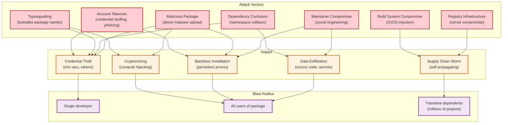

# Security & Compliance — Package Registry

## 1. Threat Model

### Attack Surface Overview

A package registry is uniquely vulnerable because a single compromised package can cascade to millions of downstream applications. The attacker's goal is not to compromise the registry itself, but to inject malicious code into the software supply chain.



---

## 2. Supply Chain Security

### 2.1 Package Signing and Provenance

**Sigstore Integration (Keyless Signing)**

Traditional PGP signing requires maintainers to manage long-lived private keys—a significant operational burden that results in low adoption. Sigstore's keyless approach uses short-lived certificates tied to OIDC identities:

```
FUNCTION sign_package_with_sigstore(artifact_hash, oidc_token):
    // 1. Verify OIDC identity (GitHub, Google, etc.)
    identity = verify_oidc_token(oidc_token)
    // identity = { email: "dev@example.com", issuer: "https://github.com/login/oauth" }

    // 2. Request ephemeral signing certificate from Fulcio CA
    ephemeral_keypair = generate_ephemeral_keypair()
    certificate = fulcio.request_certificate(
        public_key: ephemeral_keypair.public,
        identity_token: oidc_token
    )
    // Certificate is valid for 10 minutes — just long enough to sign

    // 3. Sign the artifact hash
    signature = sign(artifact_hash, ephemeral_keypair.private)

    // 4. Record in transparency log (Rekor)
    log_entry = rekor.create_entry(
        artifact_hash: artifact_hash,
        signature: signature,
        certificate: certificate
    )

    // 5. Destroy ephemeral private key (never stored)
    destroy(ephemeral_keypair.private)

    RETURN {
        signature: signature,
        certificate: certificate,
        transparency_log_id: log_entry.id,
        signer_identity: identity.email,
        build_trigger: extract_build_info(oidc_token)
    }
```

**Provenance Attestation (SLSA)**

Beyond signing ("who published this?"), provenance attestation answers "how was this built?":

```
FUNCTION generate_provenance_attestation(build_context):
    attestation = {
        "_type": "https://in-toto.io/Statement/v1",
        "subject": [{
            "name": build_context.package_name,
            "digest": { "sha512": build_context.artifact_hash }
        }],
        "predicateType": "https://slsa.dev/provenance/v1",
        "predicate": {
            "buildDefinition": {
                "buildType": build_context.ci_platform,
                "externalParameters": {
                    "source": build_context.source_repo,
                    "ref": build_context.git_ref,
                    "commit": build_context.git_commit
                }
            },
            "runDetails": {
                "builder": {
                    "id": build_context.builder_id
                },
                "metadata": {
                    "invocationId": build_context.build_id,
                    "startedOn": build_context.start_time,
                    "finishedOn": build_context.end_time
                }
            }
        }
    }

    // Sign attestation with Sigstore
    signed = sign_with_sigstore(attestation)
    RETURN signed
```

**Verification on Install:**

```
FUNCTION verify_package_provenance(package_name, version, artifact):
    provenance = registry.get_provenance(package_name, version)

    IF provenance IS NULL:
        RETURN { verified: FALSE, reason: "No provenance attestation" }

    // 1. Verify signature against transparency log
    IF NOT rekor.verify_entry(provenance.transparency_log_id):
        RETURN { verified: FALSE, reason: "Transparency log verification failed" }

    // 2. Verify certificate was valid at signing time
    IF NOT fulcio.verify_certificate(provenance.certificate, provenance.signed_at):
        RETURN { verified: FALSE, reason: "Certificate verification failed" }

    // 3. Verify artifact hash matches attestation subject
    IF SHA512(artifact) != provenance.subject_digest:
        RETURN { verified: FALSE, reason: "Artifact hash mismatch" }

    // 4. Verify source repository matches package metadata
    IF provenance.source_repo != package.repository_url:
        RETURN { verified: FALSE, reason: "Source repository mismatch" }

    RETURN {
        verified: TRUE,
        signer: provenance.signer_identity,
        source: provenance.source_repo,
        commit: provenance.source_commit,
        builder: provenance.builder_id,
        slsa_level: determine_slsa_level(provenance)
    }
```

### 2.2 SBOM Generation

Every published package automatically gets a Software Bill of Materials (SBOM) in SPDX or CycloneDX format:

```
FUNCTION generate_sbom(package_name, version, artifact):
    manifest = extract_manifest(artifact)
    file_list = list_archive_contents(artifact)

    sbom = {
        "spdxVersion": "SPDX-3.0",
        "name": package_name + "@" + version,
        "packages": [{
            "name": package_name,
            "version": version,
            "downloadLocation": registry_url + "/artifacts/" + artifact_hash,
            "checksums": [{ "algorithm": "SHA512", "value": artifact_hash }],
            "licenseDeclared": manifest.license,
            "supplier": manifest.author
        }],
        "relationships": []
    }

    // Add declared dependencies
    FOR EACH (dep_name, dep_constraint) IN manifest.dependencies:
        sbom.relationships.append({
            "type": "DEPENDS_ON",
            "source": package_name + "@" + version,
            "target": dep_name + "@" + dep_constraint
        })

    // Add file inventory
    FOR EACH file IN file_list:
        sbom.packages[0].files.append({
            "name": file.path,
            "checksum": SHA256(file.content),
            "size": file.size
        })

    RETURN sbom
```

---

## 3. Typosquatting Prevention

### Detection Heuristics

| Heuristic | Method | Example |
|---|---|---|
| **Edit distance** | Levenshtein distance ≤ 2 from popular package | `reactt` → `react` |
| **Keyboard adjacency** | Adjacent key substitution | `readct` → `react` (d adjacent to e) |
| **Homoglyph** | Visually similar characters | `l0dash` → `lodash` (zero for o) |
| **Prefix/suffix** | Common prefix/suffix additions | `react-utils-js` → `react` |
| **Scope confusion** | Unscoped version of scoped package | `babel-core` → `@babel/core` |
| **Hyphen/underscore swap** | Delimiter variations | `my_package` → `my-package` |

### Prevention Pipeline

```
FUNCTION check_typosquatting_on_publish(new_package_name, publisher):
    // Skip for established publishers with verified packages
    IF publisher.verified_package_count > 5:
        RETURN { allowed: TRUE, score: 0 }

    // Check against top 50,000 packages by weekly downloads
    popular_packages = get_popular_packages(limit=50000)

    max_risk = 0
    most_similar = NULL

    FOR EACH popular IN popular_packages:
        score = compute_similarity_score(new_package_name, popular.name)

        // Weight by target popularity (attacking react is worse than attacking foo)
        weighted_score = score * popularity_weight(popular.weekly_downloads)

        IF weighted_score > max_risk:
            max_risk = weighted_score
            most_similar = popular

    // Decision thresholds
    IF max_risk > 0.95:
        // Almost certainly typosquatting — block
        RETURN { allowed: FALSE, reason: "Name too similar to " + most_similar.name }

    IF max_risk > 0.80:
        // Suspicious — require manual review
        enqueue_manual_review(new_package_name, most_similar, publisher)
        RETURN { allowed: "PENDING_REVIEW", similar_to: most_similar.name }

    IF max_risk > 0.60:
        // Mild similarity — allow but flag
        RETURN { allowed: TRUE, warning: "Name similar to " + most_similar.name, score: max_risk }

    RETURN { allowed: TRUE, score: max_risk }
```

---

## 4. Dependency Confusion Prevention

### The Attack Vector

Dependency confusion exploits the way package managers resolve packages that exist in both a private (internal) registry and the public registry. If an internal package `internal-utils` is also published publicly by an attacker, the package manager may prefer the public version (especially if it has a higher version number).

### Prevention Mechanisms

| Mechanism | Description | Effectiveness |
|---|---|---|
| **Scoped namespaces** | Use `@myorg/internal-utils` instead of `internal-utils` | Eliminates the attack for scoped packages |
| **Namespace claiming** | Organizations register their scope, preventing anyone else from publishing under it | Prevents scope squatting |
| **Private registry priority** | Configure package manager to prefer private registry for specific scopes | Client-side mitigation |
| **Name reservation API** | Organizations can reserve unscoped names matching their private packages | Blocks external publish of conflicting names |
| **Provenance checking** | Verify that the package was built from the expected source repository | Detects substitution even if name matches |

```
FUNCTION prevent_dependency_confusion(package_name, publisher):
    // Check if this name is reserved by an organization
    reservation = lookup_name_reservation(package_name)
    IF reservation IS NOT NULL:
        IF publisher NOT IN reservation.organization.members:
            RETURN {
                blocked: TRUE,
                reason: "Package name reserved by " + reservation.organization.name
            }

    // Check if this unscoped name matches a known private package
    // (organizations can register their private package names)
    private_match = check_private_package_registry(package_name)
    IF private_match IS NOT NULL:
        IF publisher NOT IN private_match.organization.members:
            RETURN {
                blocked: TRUE,
                reason: "Name conflicts with private package. Use scoped name instead."
            }

    RETURN { blocked: FALSE }
```

---

## 5. Authentication and Token Security

### Token Architecture

| Token Type | Scope | Lifetime | Use Case |
|---|---|---|---|
| **Automation token** | Specific packages + publish only | 30-365 days | CI/CD publish pipelines |
| **Granular access token** | Per-package permissions (publish/read) | Configurable | Targeted automation |
| **Classic token** | All packages owned by user | Until revoked | Legacy/manual publish |
| **OIDC token (keyless)** | Single publish operation | ~10 minutes | CI/CD with Sigstore |

### 2FA Enforcement Policy

```
FUNCTION enforce_2fa_policy(user, package, action):
    IF action != "publish" THEN RETURN // Only enforce on publish

    // Mandatory 2FA for high-impact packages
    IF package.weekly_downloads > 1_000_000:
        IF NOT user.mfa_enabled:
            RETURN error("2FA required for packages with >1M weekly downloads")

    // Mandatory 2FA for critical packages (defined by ecosystem team)
    IF package IN critical_packages_list:
        IF NOT user.mfa_enabled:
            RETURN error("2FA required for critical ecosystem packages")

    // Recommended 2FA for all other packages
    IF NOT user.mfa_enabled:
        add_warning("Consider enabling 2FA for enhanced security")
```

### Token Compromise Response

```
FUNCTION handle_token_compromise(compromised_token):
    // 1. Immediately revoke the token
    revoke_token(compromised_token)

    // 2. Identify all actions taken with this token
    affected_actions = query_audit_log(token_id=compromised_token.id)

    // 3. Quarantine all versions published with the compromised token
    FOR EACH action IN affected_actions:
        IF action.type == "publish":
            quarantine_version(action.package_id, action.version_id,
                reason="Published with compromised token")
            notify_dependents(action.package_id, action.version_id)

    // 4. Notify the token owner
    notify_user(compromised_token.user_id,
        "Token compromised. Affected packages quarantined. Please review.")

    // 5. Force password reset and re-enroll 2FA
    force_credential_reset(compromised_token.user_id)

    // 6. Publish security advisory
    publish_advisory(affected_actions)
```

---

## 6. Malware Scanning

### Scan Heuristics

| Signal | Description | Weight |
|---|---|---|
| **Install scripts** | Pre/post-install scripts that execute on package installation | High |
| **Network calls in install** | HTTP requests during installation | Critical |
| **Environment variable access** | Reading `HOME`, credentials, or API tokens from env vars | High |
| **Obfuscated code** | Base64 encoding, dynamic code evaluation, `Buffer.from()` chains | High |
| **File system writes** | Writing outside package directory (e.g., `~/.ssh/`, `~/.npmrc`) | Critical |
| **Binary executables** | Pre-compiled binaries without source | Medium |
| **Known malware signatures** | YARA rules matching known malware patterns | Critical |
| **Sudden ownership change** | New maintainer + immediate publish of popular package | High |
| **Empty package with install script** | No meaningful code, only lifecycle scripts | Critical |

### Behavioral Sandbox Analysis

For packages flagged by static analysis, a behavioral sandbox executes install scripts in a monitored environment:

```
FUNCTION behavioral_scan(package_archive):
    sandbox = create_isolated_environment({
        network: "monitored",       // Log all network requests, block exfiltration
        filesystem: "copy-on-write", // Track all file modifications
        env_vars: "honeypot",       // Fake credentials to detect theft attempts
        time_limit: 120_SECONDS
    })

    // Execute install in sandbox
    result = sandbox.execute("install", package_archive)

    // Analyze behavior
    findings = []

    // Check for credential theft
    IF result.env_vars_accessed CONTAINS ["NPM_TOKEN", "AWS_SECRET", "GITHUB_TOKEN"]:
        findings.append({ type: "credential_theft", severity: "CRITICAL" })

    // Check for network exfiltration
    FOR EACH request IN result.network_requests:
        IF request.destination NOT IN allowed_registries:
            findings.append({
                type: "network_exfiltration",
                severity: "CRITICAL",
                details: request.destination
            })

    // Check for suspicious file writes
    FOR EACH write IN result.file_writes:
        IF write.path STARTS_WITH "~/" OR write.path STARTS_WITH "/etc/":
            findings.append({
                type: "suspicious_file_write",
                severity: "HIGH",
                details: write.path
            })

    RETURN findings
```

---

## 7. Vulnerability Disclosure

### CVE Integration

```
FUNCTION process_vulnerability_report(advisory):
    // 1. Validate advisory
    affected_packages = identify_affected_packages(advisory.cve_id, advisory.affected_versions)

    // 2. Create security advisory in registry
    registry_advisory = create_advisory({
        id: advisory.cve_id,
        title: advisory.title,
        severity: advisory.cvss_score,
        affected_packages: affected_packages,
        patched_versions: advisory.patched_versions,
        description: advisory.description,
        references: advisory.references
    })

    // 3. Propagate to affected dependents
    all_affected = compute_transitive_dependents(affected_packages)

    // 4. Notify maintainers and users
    FOR EACH dependent IN all_affected:
        IF dependent.has_vulnerability_alerts_enabled:
            send_vulnerability_alert(dependent.maintainers, registry_advisory)

    // 5. Update package metadata with advisory
    FOR EACH package IN affected_packages:
        update_package_security_status(package, registry_advisory)

    // 6. Audit API: make advisory queryable
    index_advisory(registry_advisory)
```

---

## 8. Compliance

### Regulatory Requirements

| Regulation | Requirement | Implementation |
|---|---|---|
| **US EO 14028** | Software supply chain security, SBOM for federal software | SBOM generation, provenance attestation, vulnerability scanning |
| **EU Cyber Resilience Act** | CE marking for software products, vulnerability handling | Vulnerability disclosure process, security scan results API |
| **SOC 2 Type II** | Security controls audit | Access control, audit logging, encryption at rest and in transit |
| **GDPR** | User data protection | Email hashing, data retention policies, right to deletion for user accounts |

### Audit Trail

All security-relevant events are recorded in an immutable, append-only audit log:

| Event | Data Recorded | Retention |
|---|---|---|
| Package publish | Publisher identity, token used, IP, artifact hash, timestamp | Permanent |
| Version yank/deprecate | Actor, reason, timestamp | Permanent |
| Ownership transfer | Old owner, new owner, approval chain | Permanent |
| Token creation/revocation | Token scope, permissions, IP | 5 years |
| 2FA enable/disable | User, method, timestamp | 5 years |
| Security scan result | Scanner, verdict, findings, timestamp | Permanent |
| Account login | IP, user agent, success/failure | 2 years |
| Advisory publication | CVE, affected packages, timeline | Permanent |
