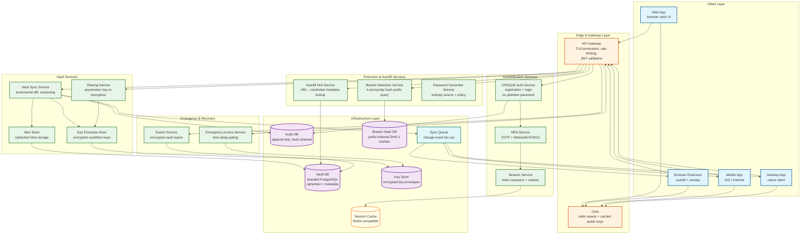
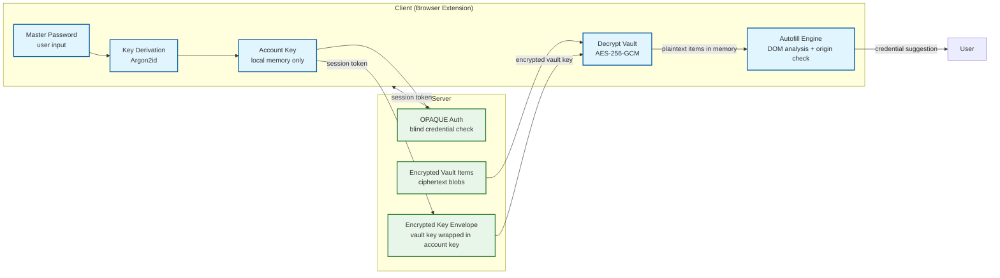
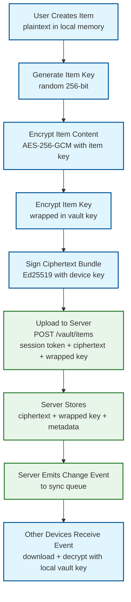
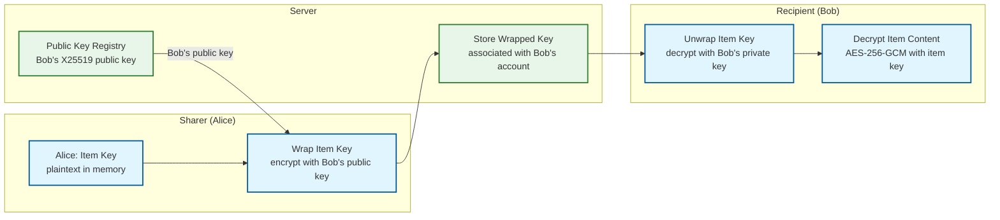

# 02 — High-Level Design: Password Manager

## System Architecture

---

## Key Design Decisions

### Decision 1: Zero-Knowledge Architecture (Client-Side Encryption)

| Attribute | Detail |
|---|---|
| **Options** | (A) Server-side encryption with server-held keys; (B) Client-side encryption, server stores ciphertext only |
| **Decision** | Option B — all encryption/decryption on client |
| **Rationale** | A server-side compromise in option A exposes all user vaults. Option B limits blast radius to metadata even under full server compromise. The server becomes a dumb, blind storage layer. USENIX 2026 research confirms that gaps in zero-knowledge implementations are exploitable; a strict client-side model minimizes server-side attack surface, even if it complicates sharing and emergency access. |
| **Trade-offs** | Sharing and emergency access require asymmetric cryptography workarounds; server-side search is impossible; client bears computational cost of key derivation. |

### Decision 2: OPAQUE for Authentication

| Attribute | Detail |
|---|---|
| **Options** | (A) Transmit password hash (bcrypt/Argon2) over TLS; (B) SRP (Secure Remote Password); (C) OPAQUE aPAKE |
| **Decision** | Option C — OPAQUE |
| **Rationale** | Option A sends a credential derivative that a compromised server can use for offline attacks. SRP (B) is widely deployed but not UC-secure and vulnerable to some precomputation attacks. OPAQUE provides mutual authentication, forward secrecy, and UC-security proof. The master password never leaves the client — even during registration the server receives only an OPRF-blinded output. Used in production by major messaging platforms. |
| **Trade-offs** | More complex to implement than SRP; requires OPAQUE library availability; IETF draft still in progress (though implementations are stable). |

### Decision 3: CRDT-Based Vault Synchronization

| Attribute | Detail |
|---|---|
| **Options** | (A) Last-write-wins (server timestamp); (B) Operational transformation (OT); (C) CRDT per-item versioning with vector clocks |
| **Decision** | Option C — CRDT semantics with vector clocks |
| **Rationale** | LWW (A) is simple but silently drops concurrent updates from different devices. OT (B) is complex to reason about under network partitions. CRDT (C) enables offline-first operation with deterministic merge on reconnect. For a vault, items are independent—merging at item granularity with a set-level CRDT (add-wins for items, LWW within an item using vector timestamps) gives correct behavior without operational transform complexity. |
| **Trade-offs** | Tombstones must be retained for deleted items to prevent re-appearance; vector clocks grow with device count; merge logic must operate on metadata only (no plaintext inspection by server). |

### Decision 4: Asymmetric Re-Encryption for Sharing

| Attribute | Detail |
|---|---|
| **Options** | (A) Share master password or vault key directly; (B) Create shared vault with separate key; (C) Per-item key re-encryption with recipient's public key |
| **Decision** | Options B+C combined — shared vaults with per-item keys wrapped for each recipient |
| **Rationale** | Option A is a zero-knowledge violation. Option B alone doesn't support item-level sharing granularity. Combining B and C: for shared vaults, a vault key is encrypted with each member's public key; for item-level sharing, the item key is wrapped with the recipient's public key. Server orchestrates key distribution but never decrypts. Revoking access means re-encrypting the vault key with a new value and not sharing the new key with the revoked party. |
| **Trade-offs** | Key management complexity grows with sharing depth; forward secrecy on revocation requires re-encrypting all items the revoked user had access to (expensive); key transparency is hard to audit. |

### Decision 5: Time-Delayed Emergency Access with Threshold Cryptography

| Attribute | Detail |
|---|---|
| **Options** | (A) Admin password reset (breaks zero-knowledge); (B) Pre-shared backup key with trusted contact; (C) Shamir's Secret Sharing (k,n) threshold scheme with time delay |
| **Decision** | Option C — Shamir's Secret Sharing with user-configured time delay |
| **Rationale** | Option A destroys zero-knowledge guarantee. Option B requires trusting a single contact entirely. SSS allows the vault owner to split their account key into n shares, requiring k shares to reconstruct. Designating k trusted contacts means any k of them can recover the vault after a configurable waiting period (1–30 days), during which the vault owner can cancel the request. NIST NISTIR 8214C (2025) formally endorses threshold cryptography for this pattern. |
| **Trade-offs** | Requires trusted contacts to hold shares securely; time delay introduces latency in genuine emergencies; share holders must be educated users; share revocation requires re-splitting and redistributing. |

### Decision 6: Separate Key Store and Vault Store

| Attribute | Detail |
|---|---|
| **Options** | (A) Store encrypted keys alongside ciphertext in same database; (B) Separate key envelope store with different access controls |
| **Decision** | Option B — physically separate key store |
| **Rationale** | Separating key envelopes from ciphertext enables independent access control policies, separate audit trails, and different replication strategies. A key-only breach reveals no plaintext without the corresponding ciphertext; a ciphertext-only breach reveals nothing without the keys. Defense-in-depth through separation of concerns at the storage layer. |
| **Trade-offs** | Two-database transactions require eventual consistency handling; additional network hop per vault operation; operational complexity of maintaining two distinct data stores. |

---

## Data Flow: Vault Unlock and Autofill

---

## Data Flow: Adding a New Vault Item

---

## Data Flow: Secure Sharing

