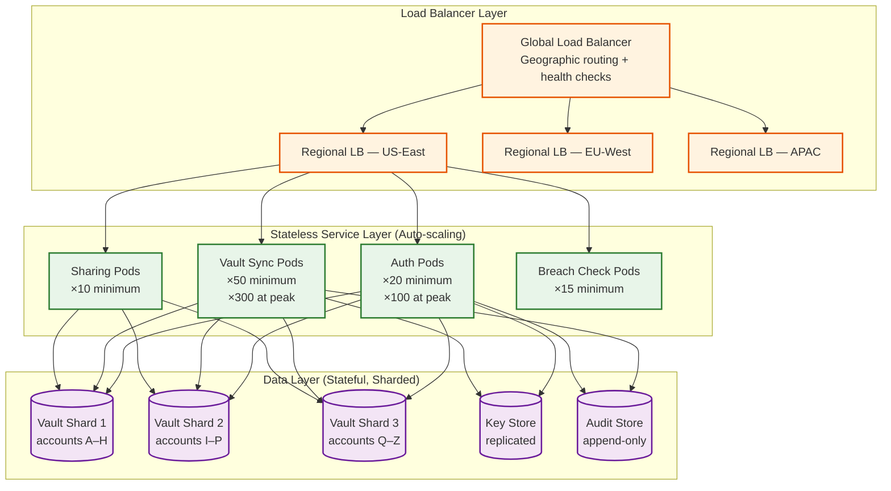
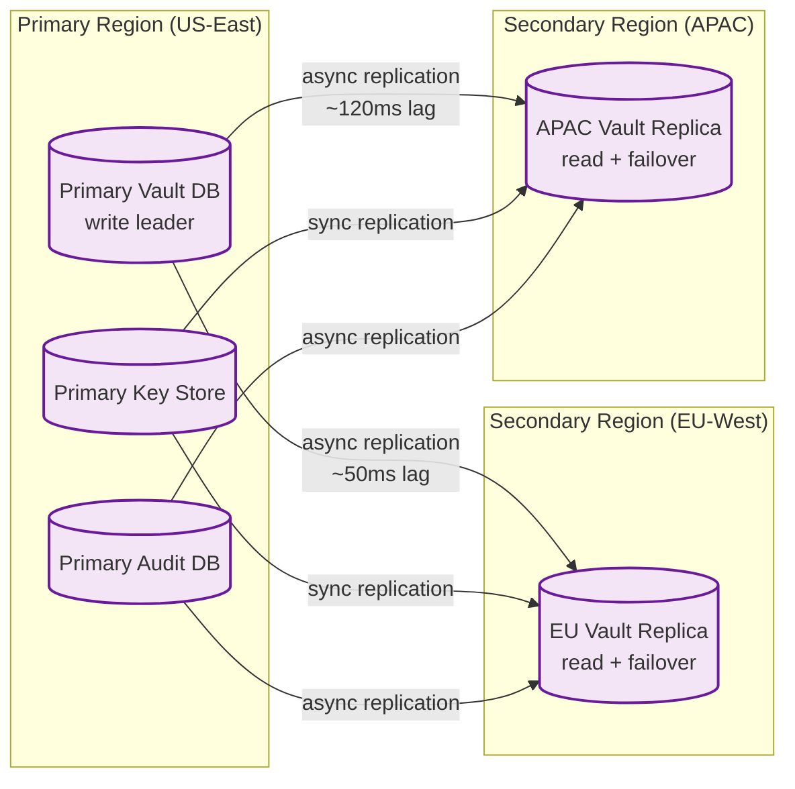

# 05 — Scalability & Reliability: Password Manager

## Horizontal Scaling Strategy

### Service Layer



All API service pods are stateless. Account-to-shard mapping uses consistent hashing on `account_id` to reduce rebalancing during scale events. Services scale horizontally based on:
- CPU utilization (target 60% average)
- Request queue depth (auto-scale when > 1,000 pending requests)
- Connection count (for WebSocket-heavy vault sync pods)

### Database Sharding

Vault data is sharded by `account_id` using consistent hashing with 256 virtual nodes. Each physical shard hosts ~8 million accounts at 50M total:

```
Vault DB per shard:
  Items:      7.5B total / 3 shards = 2.5B items per shard
  Storage:    2.5B × 2KB = 5 TB per shard
  Plus index: ~500 GB per shard (item_id, vault_id, modified_at)
  Replicas:   3 synchronous replicas per shard
```

**Shard routing**: The API gateway resolves account shard membership from a lightweight shard map cache (account_id prefix → shard endpoint). Shard map fits in memory (~50 MB) and is refreshed every 30 seconds.

**Cross-shard operations**: Sharing items across accounts (Alice in shard 1, Bob in shard 3) avoids distributed transactions by using an eventually consistent approach:
1. Alice's shard records the share grant (SharedItemRecord)
2. Share record fanned out to Bob's shard via internal event queue
3. Bob's client polls `/shares/received` which reads from Bob's shard

---

## Vault Replication

### Multi-Region Replication



**Replication strategy by data type:**
| Data | Replication Mode | Rationale |
|---|---|---|
| Vault ciphertext | Asynchronous | Slight staleness acceptable; client has local copy |
| Key envelopes | Synchronous | Auth must succeed in any region; cannot serve stale keys |
| Audit log | Asynchronous | Durability over consistency; eventual consistency acceptable |
| Session cache | No replication | Sessions re-issued per region; client re-authenticates on regional failover |

### EU Data Residency

For GDPR compliance, EU user accounts are pinned to EU-West region:
- `account_id` prefixed with region marker (`eu-XXXX`)
- Shard routing ensures EU accounts never land on US-East shards
- Key store for EU accounts lives exclusively in EU-West
- Only anonymized aggregate metrics cross regions

---

## Conflict Resolution at Scale

### Change Log Architecture

All vault changes are appended to a per-vault change log before being applied to the item store. This provides:
1. **Replay**: New devices can catch up by replaying from change log
2. **Ordering**: Total ordering of changes per vault
3. **Audit**: Full history of vault mutations (encrypted)

```
VaultChangeLogEntry {
  sequence_number:  bigint            // monotonically increasing per vault
  item_id:          UUID
  operation:        enum              // upsert, delete
  ciphertext_diff:  bytes?            // for upsert: full new ciphertext
  version_vector:   map
  device_id:        UUID
  timestamp:        timestamp
}
```

Change log is retained for 90 days (configurable). Clients sync by providing their last known `sequence_number`; server returns all subsequent entries.

### Conflict Handling at Server Layer

The server performs optimistic locking on `version_vector` during writes:
```
function attemptWrite(item, incomingVersionVector):
  currentItem = fetchFromDB(item.id)

  if currentItem is null:
    // New item — write unconditionally
    DB.insert(item)
    return SUCCESS

  if vectorDominates(incomingVersionVector, currentItem.version_vector):
    // Incoming update is strictly newer — safe to overwrite
    DB.update(item)
    return SUCCESS

  elif vectorDominates(currentItem.version_vector, incomingVersionVector):
    // Server has newer version — reject client's stale write
    return CONFLICT(currentItem)

  else:
    // True concurrent edit — server records both; client merges
    DB.insertConflictCopy(item, incomingVersionVector)
    return CONFLICT_MERGE_REQUIRED(currentItem)
```

Conflict copies are flagged with `has_conflict=true` and presented to the user during the next vault unlock.

---

## Reliability: Circuit Breakers and Graceful Degradation

### Degraded Mode Operation

| Service Degraded | Client Behavior |
|---|---|
| Sync service unavailable | Client operates fully from local encrypted cache; mutations queued locally |
| Breach check service down | Autofill proceeds without breach warning; non-blocking |
| Auth service degraded | Existing valid session tokens continue working; no new logins |
| Key store unavailable | No new device enrollments; existing devices with cached session keys continue |
| Emergency access service down | Emergency requests cannot be submitted; non-blocking on normal operations |

### Health Checks and Circuit Breakers

Each service implements three health check levels:
1. **Liveness**: Is the process running? → Restart if fails
2. **Readiness**: Can it serve traffic? (DB connection live, cache warm) → Remove from load balancer
3. **Deep health**: Can it complete a synthetic vault read/write? → Alert on-call; trigger circuit breaker

Circuit breaker configuration for vault sync:
```
CircuitBreaker {
  failureThreshold:  5 failures in 10 seconds
  halfOpenRequests:  1 probe request every 30 seconds
  openDuration:      60 seconds before testing recovery
  fallbackBehavior:  serve from read replica; queue writes
}
```

---

## Disaster Recovery

### Recovery Objectives

| Scenario | RTO | RPO | Strategy |
|---|---|---|---|
| Single pod failure | < 30s | 0 | Auto-restart; load balancer failover |
| Single DB replica failure | < 2 min | 0 | Replica promotion (synchronous replica up-to-date) |
| Full region failure | < 1 hour | < 5 min | DNS failover to secondary region; async replication lag = RPO |
| Data corruption | < 4 hours | < 24 hours | Point-in-time restore from daily snapshot |
| Ransomware / total data loss | < 24 hours | < 24 hours | Offsite encrypted backup restore |

### Backup Strategy

```
Daily full backup:
  - Vault DB snapshot: encrypted, archived to geographically separate object storage
  - Key store snapshot: encrypted with separate backup encryption key (held offline)
  - Audit log: append-only; entire history preserved

Continuous WAL shipping:
  - PostgreSQL WAL streamed to secondary regions in real time
  - Point-in-time recovery (PITR) to any second in last 7 days

Backup integrity:
  - Weekly automated restore drill to isolated environment
  - Backup decryption verified (plaintext structure validated without exposing user data)
  - Restore time measured against RTO targets quarterly
```

### Key Continuity During Disaster

A special concern for zero-knowledge systems: if the key store is lost, all encrypted vault data becomes permanently inaccessible. Mitigations:
1. **Key store has 5× replication** across geographically distributed data centers (synchronous for primary region)
2. **Offline backup keys**: Key store encryption master key held in offline HSM; required only for key store recovery, not normal operations
3. **User-held recovery keys**: Users can optionally export their vault in an encrypted format that only their master password can decrypt — truly air-gapped backup

---

## Multi-Region Active-Active Consideration

### Challenge

Active-active multi-region requires resolving cross-region write conflicts. For a zero-knowledge system:
- Server cannot read ciphertext to do semantic merge
- Must rely entirely on metadata (version vectors, timestamps) for conflict resolution
- Cross-region replication lag (50–150ms) means concurrent writes to same item are possible

### Decision: Primary-with-Hot-Standby

Rather than active-active, use active-passive-with-fast-failover:
- All writes go to primary region
- Secondary regions serve reads from replicas
- On primary region failure, secondary promoted via DNS TTL=30s
- Accept up to 50ms (primary-region RTT) latency increase for writes from other regions
- European users routed to EU-West primary; APAC routed to APAC primary; others to US-East

This reduces conflict rate dramatically while providing sub-1-minute failover. Complexity of cross-region active-active conflict resolution without plaintext inspection is prohibitive.

---

## Load Testing and Capacity Planning

### Key Scenarios

| Scenario | Target Load | Bottleneck Identified |
|---|---|---|
| Morning sync storm | 200,000 sync requests/minute | Vault DB read IOPS; mitigated by read replicas |
| Mass password change event (breach news) | 500,000 item updates in 1 hour | Write queue saturation; mitigated by write throttling per account |
| New device enrollment | 100,000/hour during promotions | Key store write contention; mitigated by sharding by account_id |
| Emergency access flood (social engineering campaign) | N/A | Rate limited to 3 requests per account per 24 hours |

### Auto-Scaling Policies

```
VaultSyncPods:
  min: 50 pods
  max: 500 pods
  scaleUp:   when CPU > 70% for 60s, add 25 pods
  scaleDown: when CPU < 30% for 300s, remove 10 pods

AuthPods:
  min: 20 pods
  max: 200 pods
  scaleUp:   when auth_queue_depth > 500 for 30s
  scaleDown: when auth_queue_depth < 50 for 300s
```
