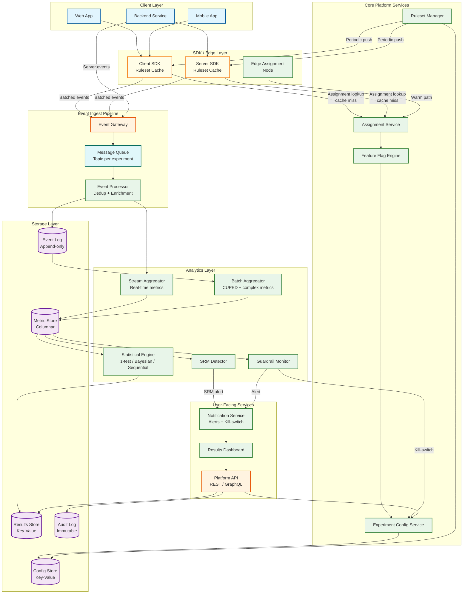
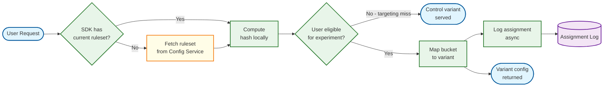

# 02 — High-Level Design: A/B Testing Platform

## System Architecture



---

## Key Design Decisions

### Decision 1: Stateless Edge Assignment Over Centralized Service

**Problem:** Assignment sits on the critical path of every product request. A centralized assignment service adds a network hop that violates the < 5 ms p99 SLO at scale.

**Decision:** Push the experiment ruleset (a compact JSON document listing all active experiments, their traffic allocations, targeting rules, and variant configurations) to client and server SDKs. SDKs evaluate assignment locally via a pure function with no I/O. Ruleset refreshes happen asynchronously every 30–60 seconds.

**Trade-offs:** The ruleset must be small enough to fit in memory (< 50 MB). Experiment configuration changes propagate with up to 60-second lag. Targeting that requires server-side user attributes (e.g., subscription tier) requires a thin server-side lookup, but the hash computation itself remains local.

---

### Decision 2: Append-Only Event Log as the System of Record

**Problem:** Metric definitions change after an experiment starts. Pre-aggregating too early locks in old definitions.

**Decision:** Store all raw events in an immutable, append-only log keyed by `(entity_id, event_type, timestamp)`. All metric computation is a query (or stream) over this log. Pre-aggregated snapshots are materialized views, not the source of truth.

**Trade-offs:** Storage cost is higher (raw events retained 90 days). Query latency for ad-hoc metrics is higher. But this design allows retroactive metric corrections and the platform can re-derive any metric from raw data at any time.

---

### Decision 3: Dual-Path Metric Computation (Streaming + Batch)

**Problem:** Analysts want near-real-time dashboards (< 15 min lag), but some metrics (CUPED-adjusted, quantile metrics, ratio metrics) are computationally expensive.

**Decision:** Run two parallel computation paths:
- **Streaming path:** Stateful stream processor computes simple aggregates (counts, sums) continuously with < 5 min lag. Results feed the live dashboard.
- **Batch path:** Scheduled batch jobs (every 1 hour) recompute all metrics from the raw event log with full accuracy, applying CUPED and variance reduction. Results overwrite streaming estimates.

Streaming results are labeled "preliminary" and batch results are labeled "final" in the UI.

---

### Decision 4: Sequential Testing as the Default Analysis Mode

**Problem:** Analysts peek at p-values before the experiment reaches the pre-specified sample size. Under classical frequentist analysis, any decision made on early data inflates the Type I error rate.

**Decision:** Default to sequential testing with always-valid confidence sequences (based on the mixture sequential probability ratio test, mSPRT). These produce p-values that remain statistically valid regardless of when the analyst looks. The platform computes them continuously and surface them in dashboards, removing any incentive to run classical t-tests against live data.

---

### Decision 5: Layered Mutual Exclusion for Experiment Isolation

**Problem:** Concurrent experiments can interact: experiment A tests a new checkout flow; experiment B tests a coupon offer on the same checkout page. Users in both simultaneously receive a confounded treatment.

**Decision:** Experiments are organized into **layers** (also called namespaces). Within a layer, each user is assigned to at most one experiment. Each layer hashes the entity ID with a layer-specific salt, producing an independent assignment namespace. Experiments targeting different features can share a layer if the product team confirms they are independent, or be placed in separate layers for guaranteed isolation at the cost of reduced eligible traffic per experiment.

---

## Data Flow: Experiment Assignment



---

## Data Flow: Event Tracking and Metric Computation

```mermaid
flowchart LR
    A([SDK Event]) --> B[Event Gateway\nValidation + Auth]
    B --> C[Message Queue\nPartitioned by entity_id]
    C --> D[Event Processor\nDedup + Enrich]
    D --> E[(Event Log)]
    D --> F[Stream Aggregator]
    F --> G[(Metric Store\nStreaming estimates)]
    E --> H[Batch Aggregator\n1-hr schedule]
    H --> I[CUPED Engine]
    I --> G
    G --> J[Statistical Engine]
    J --> K[(Results Store)]
    K --> L([Dashboard])

    classDef client fill:#e1f5fe,stroke:#01579b,stroke-width:2px
    classDef api fill:#fff3e0,stroke:#e65100,stroke-width:2px
    classDef service fill:#e8f5e9,stroke:#2e7d32,stroke-width:2px
    classDef data fill:#f3e5f5,stroke:#6a1b9a,stroke-width:2px
    classDef queue fill:#e0f7fa,stroke:#00695c,stroke-width:2px

    class A,L client
    class B api
    class D,F,H,I,J service
    class C queue
    class E,G,K data
```



---

## Data Flow: Guardrail and SRM Monitoring

```mermaid
flowchart TB
    A[(Metric Store)] --> B[SRM Detector\nchi-squared on\nactual vs expected splits]
    A --> C[Guardrail Monitor\ncompare variant vs control\non guardrail metrics]
    B --> D{SRM\ndetected?}
    D -->|Yes| E[Pause Experiment\n+ Alert]
    D -->|No| F[Continue]
    C --> G{Guardrail\nbreach?}
    G -->|Yes| H[Kill-switch:\nforce all traffic\nto control]
    G -->|No| I[Continue]
    E --> J[Notification Service]
    H --> J
    H --> K[Config Service\nupdate experiment state]

    classDef service fill:#e8f5e9,stroke:#2e7d32,stroke-width:2px
    classDef data fill:#f3e5f5,stroke:#6a1b9a,stroke-width:2px
    classDef api fill:#fff3e0,stroke:#e65100,stroke-width:2px

    class B,C,D,G,J service
    class A data
    class E,F,H,I,K api
