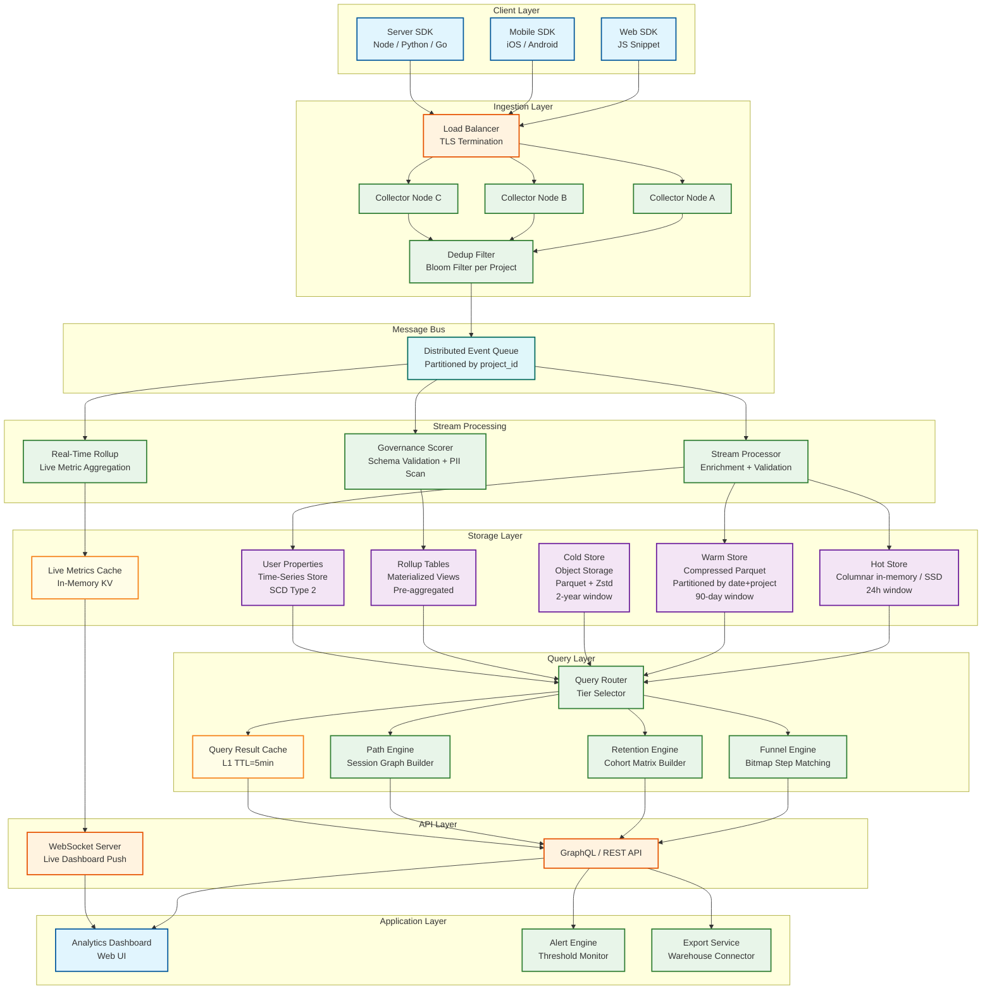
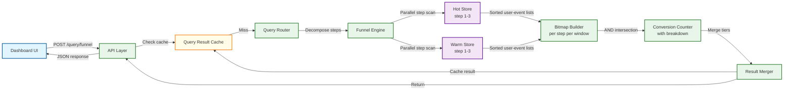

# 12.16 Product Analytics Platform — High-Level Design

## System Architecture

---

## Key Design Decisions

### Decision 1: Schema-on-Read for Event Properties

**Choice:** Store event properties as a compressed JSON blob or as a sparse dynamic column map; resolve schema at query time using property dictionaries.

**Rationale:** Product teams instrument new events constantly. Requiring schema registration before ingestion creates operational friction and delays time-to-insight. Schema-on-read allows raw events to be stored with any property set, with type inference and conflict detection surfaced post-ingestion via the governance layer.

**Trade-off:** Query-time property access is slower than native-typed columns for schema-on-write. Mitigated by materializing commonly-queried properties into typed columns during warm-store compaction—a hybrid approach where high-frequency properties get promoted to native columns while long-tail properties remain in the JSON blob.

---

### Decision 2: Separate Hot, Warm, and Cold Storage Tiers

**Choice:** Three-tier storage architecture: in-memory/NVMe hot store (last 24h), compressed columnar warm store (last 90 days), cold object storage (historical).

**Rationale:** Most queries are over recent data (last 30 days). A three-tier design ensures recent queries hit fast local storage while keeping storage costs linear with data volume rather than compute cost. The query router dispatches sub-queries to the appropriate tier and merges results.

**Trade-off:** Complexity of result merging across tiers, especially when a query window spans multiple tiers. Addressed by enforcing non-overlapping tier boundaries and merging at the query router with a deterministic merge strategy.

---

### Decision 3: Bitmap-Based Funnel Computation

**Choice:** Represent each funnel step as a roaring bitmap of user IDs who completed that step; compute conversion by ANDing consecutive step bitmaps after applying time-window constraints.

**Rationale:** Funnel queries require counting distinct users at each step while enforcing step ordering within a time window. Correlated subqueries on row-oriented data are O(n²) per step. Bitmap intersection is O(n/64) and can be vectorized. For 100M users, a full bitmap is 12.5MB—fits in L3 cache.

**Trade-off:** Bitmap approach requires sorting events by (user\_id, timestamp) per step, which is an expensive pre-sort. Mitigated by maintaining sort-order during columnar compaction so step bitmaps can be built in a single sequential scan.

---

### Decision 4: HyperLogLog for Distinct User Counting

**Choice:** Use HyperLogLog++ sketches for all distinct user count aggregations in pre-computed rollups and real-time metrics.

**Rationale:** Exact COUNT DISTINCT over 100M+ users requires either materializing all user IDs (expensive) or sorting (O(n log n)). HyperLogLog provides ~0.8% relative error at <1% of the memory cost. For business-level metrics, 0.8% error is acceptable and invisible to users.

**Trade-off:** Exact counts required for regulatory reporting or billing must bypass sketches and use exact computation, with explicit latency trade-off communicated to callers.

---

### Decision 5: Event Deduplication via Bloom Filter

**Choice:** Per-project bloom filter keyed on (project\_id, event\_id) maintained in the collector tier; refresh daily with exact hash set for previous 72 hours.

**Rationale:** SDKs retry events on network failure, creating duplicates. Downstream deduplication after storage is expensive (requires recomputation of all affected aggregates). Collector-side bloom filter catches ~99.9% of duplicates before they enter the queue. False positive rate of 0.01% means a tiny fraction of unique events incorrectly dropped—acceptable given at-least-once delivery semantics.

**Trade-off:** Bloom filter does not catch duplicates across partitions if the same event reaches different collector nodes. Mitigated by consistent hashing of event\_id to a single collector partition before dedup check.

---

## Data Flows

### Flow 1: Event Ingestion

```mermaid
flowchart LR
    SDK[SDK Client] -->|HTTPS POST /events batch| COL[Collector]
    COL -->|Check event_id| BF[Bloom Filter]
    BF -->|Not seen| VAL[Validate Envelope\ntimestamp, project_id, user_id]
    BF -->|Already seen| ACK[202 Accepted\nskip duplicate]
    VAL -->|Valid| ENRICH[Enrich\nIP→geo, UA→device]
    ENRICH -->|Partition by project_id| MQ[Message Queue]
    MQ -->|Consumer group| SP[Stream Processor]
    SP -->|Write-ahead| HOT[Hot Columnar Store]
    SP -->|Async batch| WARM[Warm Parquet Files]
    SP -->|Governance check| GOV[Governance Scorer]
    HOT -->|Ack to producer| OK[200 OK]

    classDef client fill:#e1f5fe,stroke:#01579b,stroke-width:2px
    classDef api fill:#fff3e0,stroke:#e65100,stroke-width:2px
    classDef service fill:#e8f5e9,stroke:#2e7d32,stroke-width:2px
    classDef data fill:#f3e5f5,stroke:#6a1b9a,stroke-width:2px
    classDef cache fill:#fffde7,stroke:#f57f17,stroke-width:2px
    classDef queue fill:#e0f7fa,stroke:#00695c,stroke-width:2px

    class SDK client
    class COL,VAL,ENRICH,SP,GOV api
    class BF,MQ queue
    class HOT,WARM data
    class OK,ACK cache
```

### Flow 2: Funnel Query Execution

### Flow 3: Retention Computation

```mermaid
flowchart LR
    REQ[Retention Query\ncohort=first_purchase\nwindow=12weeks] -->|Parse| RE[Retention Engine]
    RE -->|Load cohort users| COHORT[Cohort Resolver\nWeek 0 users]
    COHORT -->|bitmap of user IDs| SCAN[Event Scanner\nWeek 1..12 return events]
    SCAN -->|Per-week active bitmaps| MATRIX[Retention Matrix Builder\nRow=cohort_week Col=return_week]
    MATRIX -->|Divide by cohort size| PCT[Percentage Calculator]
    PCT -->|Result JSON| RESP[Response\n12x12 retention grid]

    classDef client fill:#e1f5fe,stroke:#01579b,stroke-width:2px
    classDef service fill:#e8f5e9,stroke:#2e7d32,stroke-width:2px
    classDef data fill:#f3e5f5,stroke:#6a1b9a,stroke-width:2px

    class REQ client
    class RE,COHORT,SCAN,MATRIX,PCT service
    class RESP data
```

### Flow 4: User Journey / Path Analysis

```mermaid
flowchart LR
    PREQ[Path Query\nafter=checkout_started\ntop_paths=20] -->|Parse| PE[Path Engine]
    PE -->|Filter anchor event| ANCHOR[Anchor Event Finder\nall sessions with checkout_started]
    ANCHOR -->|session_ids| SESS[Session Reconstructor\nnext N events per session]
    SESS -->|ordered event sequences| GRAPH[Graph Builder\ncount edge weights A→B]
    GRAPH -->|prune low-frequency edges| TOP[Top-N Path Selector]
    TOP -->|Sankey-compatible JSON\nnodes + weighted edges| RESP[Response]

    classDef client fill:#e1f5fe,stroke:#01579b,stroke-width:2px
    classDef service fill:#e8f5e9,stroke:#2e7d32,stroke-width:2px
    classDef data fill:#f3e5f5,stroke:#6a1b9a,stroke-width:2px

    class PREQ client
    class PE,ANCHOR,SESS,GRAPH,TOP service
    class RESP data
```

