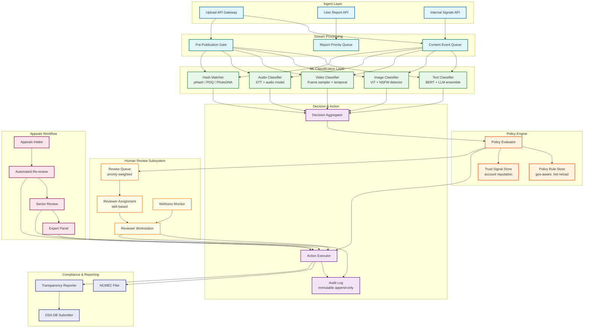
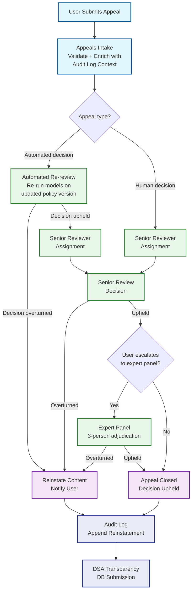
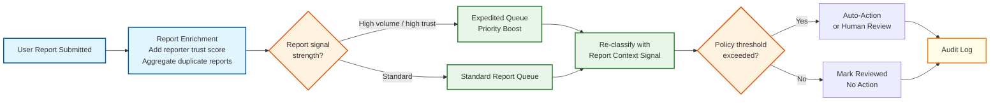

# 12.17 Content Moderation System — High-Level Design

## System Architecture

---

## Key Design Decisions

### Decision 1: Pre-Publication Gate for High-Risk Categories Only

Blocking all content pre-publication would add unacceptable latency to the user upload experience. Instead, the system applies synchronous screening only to designated high-risk categories where first-publication is itself the harm (CSAM, terrorist recruitment content, doxxing with threat signals). For all other content, items are published optimistically and scanned asynchronously. The pre-publication gate executes hash matching (fast, sub-50ms) and high-confidence model inference in the critical path; lower-confidence cases are published with a time-limited hold pending human review.

**Implication:** Reduces pre-publication latency to the minimum necessary while satisfying legal obligations for the most harmful content categories.

### Decision 2: Ensemble Classification with Confidence-Gated Routing

No single model is reliable across all content types and cultural contexts. The system runs an ensemble of specialized models (BERT-based text classifier, ViT-based image classifier, audio STT + downstream classifier) and a large language model for contextual edge cases. Each model outputs a calibrated confidence score. A three-zone routing policy routes items based on composite score:

- **Zone A (high confidence violation):** Auto-action immediately
- **Zone B (near-threshold / uncertain):** Route to human review queue
- **Zone C (high confidence benign):** Fast-path allow with sampling audit

**Implication:** Maximizes automation rate for clear cases while concentrating human attention on genuinely ambiguous items.

### Decision 3: Policy Engine as Hot-Reloadable Rule Layer, Separate from Models

Conflating policy (what is allowed) with classification (what is present) creates a coupling that makes it impossible to update community guidelines without retraining models. The policy engine is a separate runtime component that reads configurable rule sets (stored in a rule store), evaluates classified content against current policy, and produces enforcement actions. Rules can be updated and deployed without touching ML infrastructure. Geo-specific variants (EU vs. US vs. jurisdiction-specific) are first-class policy constructs, not code branches.

**Implication:** Policy updates can be rolled out in minutes rather than weeks, and compliance with new regulations does not require model retraining.

### Decision 4: Human Review Queue as a First-Class Infrastructure Component

The human review queue is not a fallback; it is a designed throughput component with its own capacity planning, priority scheduling, SLA monitoring, and wellness constraints. The queue uses a weighted priority scoring function that combines content severity tier, viral velocity (view rate of flagged content), account trust score, and regulatory SLA deadline proximity. Reviewers are matched to queue items by skill profile (language, content type specialization, CSAM clearance level).

**Implication:** Queue depth and SLA compliance are system metrics monitored on the same dashboards as ML inference latency and error rates.

### Decision 5: Immutable Audit Log as the Source of Truth for Appeals

All moderation decisions—automated and human—are written to an append-only, cryptographically chained audit log before the corresponding enforcement action is executed. This log is the authoritative record for appeals adjudication, regulatory audits, and model quality analysis. The appeals system reads from the audit log to reconstruct full decision context; reviewers cannot modify or delete log entries. This makes the system legally defensible and enables reproducible review of any past decision.

**Implication:** Adds a synchronous write-to-audit-log step in the enforcement path but eliminates entire categories of legal risk and enables trust in the appeals process.

---

## Data Flow: Content Upload to Enforcement

```mermaid
flowchart LR
    A[User Submits Content] --> B{Pre-publication\nhigh-risk check?}
    B -->|Yes| C[Synchronous\nHash Match + Fast Classifier]
    B -->|No| D[Publish & Enqueue\nfor async scan]
    C -->|Definite match| E[Block Upload\nNotify User]
    C -->|No match| D
    D --> F[ML Ensemble\nClassification]
    F --> G[Policy Engine\nEvaluation]
    G -->|Zone A: high confidence violation| H[Auto-Action\nRemove / Restrict]
    G -->|Zone B: near-threshold| I[Route to\nHuman Review Queue]
    G -->|Zone C: benign| J[Allow\nSampling Audit]
    H --> K[Audit Log\nWrite]
    I --> L[Reviewer\nDecision]
    L --> K
    K --> M[Notify User\nof Enforcement]
    M --> N{User Appeals?}
    N -->|Yes| O[Appeals Workflow]
    N -->|No| P[Case Closed]

    classDef action fill:#e8f5e9,stroke:#2e7d32,stroke-width:2px
    classDef decision fill:#fff3e0,stroke:#e65100,stroke-width:2px
    classDef terminal fill:#f3e5f5,stroke:#6a1b9a,stroke-width:2px
    classDef log fill:#fffde7,stroke:#f57f17,stroke-width:2px

    class C,F,G action
    class B,N decision
    class E,J,P terminal
    class K log
```

---

## Data Flow: Appeals Workflow

---

## Data Flow: User Report Processing

---

## Component Responsibilities Summary

| Component | Primary Responsibility | Key Interface |
|---|---|---|
| **Ingest Layer** | Normalize content items across types; emit events to stream | REST upload API; internal gRPC for service-to-service |
| **Content Event Queue** | Durable, ordered delivery of content items to classifiers; partitioned by content type | Topic-partitioned message queue |
| **ML Ensemble** | Parallel classification across modalities; return calibrated confidence scores | gRPC inference API; batch and single-item modes |
| **Hash Matcher** | Near-exact perceptual similarity lookup against known-bad databases | In-memory LSH index; updated via delta sync from hash DB |
| **Policy Engine** | Apply geo-specific, trust-aware rules to produce enforcement action | In-process rule evaluation; rule updates via config push |
| **Decision Aggregator** | Combine model scores + hash signals into unified severity score | Internal service call; no external API |
| **Action Executor** | Execute enforcement actions (remove, restrict, notify, report); write audit log | Async action queue; synchronous for pre-publication blocks |
| **Review Queue** | Priority-sorted queue of human review tasks; manages SLA timers | Internal queue API; reviewer workstation polls |
| **Reviewer Workstation** | Interface for human reviewers to view, decide, and submit moderation decisions | Web app; decisions posted to Action Executor |
| **Appeals Workflow** | Multi-tier appeals adjudication; SLA tracking; DSA submission | REST appeals API; internal review routing |
| **Transparency Reporter** | Aggregate moderation statistics; generate DSA-compliant reports | Batch job; exports to DSA Transparency Database |
