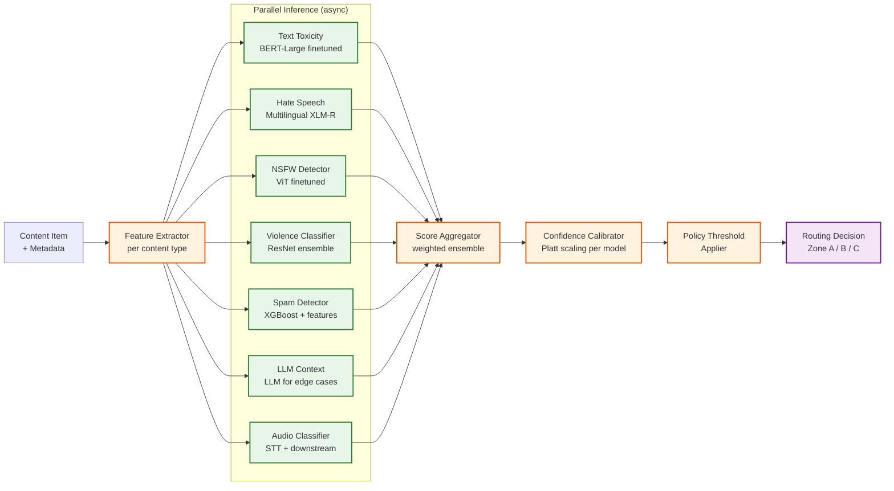

# 12.17 Content Moderation System — Deep Dives & Bottlenecks

## Deep Dive 1: ML Classification Pipeline

### Architecture Detail

The ML classification pipeline is not a single model but an orchestrated ensemble of specialized classifiers operating in parallel, with a coordinating layer that aggregates outputs into a unified decision signal. The pipeline is architected to meet two conflicting requirements: sub-500ms latency for the pre-publication path, and comprehensive coverage for the async post-publication path.



### Confidence Calibration

Raw model output scores are not probabilities—a sigmoid output of 0.9 from one model is not directly comparable to 0.9 from a different architecture. Each model undergoes Platt scaling calibration on a held-out validation set to produce calibrated probability estimates. Calibration is verified monthly using reliability diagrams; models showing ECE (Expected Calibration Error) > 5% trigger a recalibration run.

### LLM Fallback for Contextual Edge Cases

For items scoring in the uncertainty band (Zone B boundary ± 0.1), the pipeline optionally invokes an LLM-based contextual classifier implementing the "policy-as-prompt" pattern: the current policy text is provided as context, and the LLM is asked to assess whether the content violates the policy given its full context (including post title, user profile signals, and surrounding conversation thread). This approach is more expensive (100-200ms additional latency, higher inference cost) but dramatically reduces false positives on contextually sensitive content (satire, news reporting, academic discussion of harmful topics).

### Adversarial Obfuscation Normalization

Before text is passed to classifiers, a normalization layer applies a cascade of transformations:

1. **Unicode normalization**: Map homoglyphs (Cyrillic 'а' → Latin 'a', etc.) to canonical form
2. **Leetspeak expansion**: Expand common substitutions (3 → e, @ → a, ! → i)
3. **Whitespace stripping**: Remove zero-width characters, directional markers, invisible separators
4. **Repeated character collapse**: "haaaaaate" → "hate"
5. **Phonetic expansion** (language-specific): normalize phonetic respellings used to evade keyword filters

Each normalization step is logged so analysts can identify emerging evasion patterns. New normalization rules can be deployed without model retraining.

### Bottleneck: Video Frame Throughput

Video content is the dominant throughput bottleneck. A 10-minute user video at standard resolution generates ~1,200 frames at 2fps sampling. At 50,000 video submissions/hour at peak, this is 60M frames/hour requiring classification. The mitigation strategy is three-layered:

1. **Keyframe selection**: Use scene-change detection to select representative keyframes rather than uniform temporal sampling; reduces frame count by 60-70% for most content
2. **Early-exit on high-confidence signals**: If the first 10 frames produce a Zone A signal, skip remaining frames and trigger immediate action
3. **Async batch processing**: Video frames are processed in GPU batches of 512; videos are not pre-publication blocked unless text metadata or audio produces a high-confidence signal first

---

## Deep Dive 2: Human Review Queue Architecture

### Priority Queue Implementation

The review queue is a distributed priority queue implemented on top of a sorted-set data structure. Each item in the queue carries a floating-point priority score (computed per Algorithm 2 in the low-level design). The queue is partitioned by:

- **Content type shard**: Text, Image, Video, Audio each get dedicated partition shards, matching reviewer skill profiles
- **Geo shard**: Content requiring language-specific review routes to geo-partitioned sub-queues (e.g., German-language queue for NetzDG compliance)
- **Severity tier shard**: CRITICAL items get a dedicated high-throughput shard to prevent starvation

Each partition maintains a SLA timer index that fires expiry alerts when items approach their deadline without being assigned. The alerting triggers automatic priority boost and emergency reviewer pool activation.

### SLA Management

```
SLA computation per content type and regulatory context:

  CSAM (confirmed): 1 hour (NCMEC reporting obligation)
  Terrorism / incitement: 1 hour (DSA illegal content)
  Hate speech (Germany): 24 hours (NetzDG)
  Standard violation (EU): 72 hours (DSA standard)
  Standard violation (global): 7 days (internal SLA)
  Low severity / spam: 14 days (internal SLA)

SLA timer management:
  - Each review_task has a sla_deadline timestamp set at creation
  - Timer service polls queue every 60 seconds for items within 20% of SLA window
  - At 80% elapsed: priority boost (×2)
  - At 95% elapsed: alert reviewer manager; pull from contractor overflow pool
  - At 100% elapsed: task marked EXPIRED; automatic escalation to senior reviewer;
                     SLA breach event logged for transparency reporting
```

### Inter-Rater Reliability and Quality Control

A quality control program continuously measures the consistency of reviewer decisions. Every reviewer receives a 5-10% injection of calibration items—content previously reviewed and given a gold-standard label by an expert panel. The system computes Cohen's kappa between each reviewer's decisions on calibration items and the gold standard.

- **Kappa > 0.80**: Reviewer is operating at high reliability; reduced calibration injection
- **Kappa 0.60-0.80**: Standard reliability; normal calibration rate
- **Kappa 0.40-0.60**: Marginal reliability; increased calibration injection + coaching referral
- **Kappa < 0.40**: Underperforming; work reviewed by senior reviewer; potential retraining

This program also detects systematic bias (e.g., a reviewer consistently more lenient with a particular content category) by analyzing decision patterns across content categories and reviewer cohort comparisons.

### Reviewer Workstation Performance as a Throughput Constraint

Reviewer throughput is directly proportional to workstation UX performance. Each 1-second increase in content load time reduces reviewer throughput by approximately 3-4 items/hour due to cognitive context switching. The workstation is built as a low-latency, single-page application that:

- Pre-fetches the next 3 content items while the reviewer is deciding on the current item
- Delivers pre-rendered decision context (model scores, policy match explanation, account history summary) alongside content
- Applies graduated blurring to harmful visual content (NSFW: blurred by default; CSAM: maximum blur with explicit reveal gesture required)
- Supports keyboard shortcuts for all decision actions (eliminating mouse travel)
- Auto-saves reviewer decisions to prevent loss if the session crashes

---

## Deep Dive 3: Policy Engine

### Rule Evaluation Model

The policy engine evaluates content against a precedence-ordered list of rules. Rules are stored in a versioned rule store (key-value store with watch semantics) and loaded into the engine's in-process memory with a TTL-based refresh. Hot-reload is achieved via a publish-subscribe mechanism: when a policy team member pushes a new rule version, all policy engine instances receive the update within 30 seconds without restart.

```
Rule evaluation order:
  1. Category-specific emergency rules (highest priority; e.g., active CSAM hash DB update)
  2. Geo-specific rules (EU DSA, German NetzDG, country-specific legal orders)
  3. Content-type rules (image-specific, video-specific)
  4. Account trust overrides (high-trust accounts get wider thresholds)
  5. Global baseline rules (lowest priority; catch-all)

First matching rule wins (unless rule is marked additive).
```

### Geo-Specific Policy Variants

As of 2025, platforms operating in the EU must comply with the Digital Services Act, while Germany maintains additional NetzDG obligations, and other jurisdictions impose their own requirements. The policy engine treats `geo_scope` as a first-class rule attribute. At evaluation time, the engine fetches the user's geo context (IP-derived country code, validated against account registration country for consistency) and applies the most restrictive applicable ruleset.

Critically, geo-specific rules must be applied to both content creator and content viewer contexts. Content that is legal in one jurisdiction but illegal in another may need to be geo-restricted rather than globally removed.

### Policy Rollout and Experimentation

New policies go through a staged rollout:

1. **Shadow mode**: New rule evaluates content but produces no enforcement action; outputs logged for impact analysis
2. **Canary (1% traffic)**: Rule is enforced for 1% of content; outcomes compared to shadow baseline
3. **Progressive rollout**: 10% → 25% → 50% → 100% with automatic rollback on anomaly detection
4. **Emergency rules**: Bypass staged rollout; applied globally within seconds (used for active CSAM campaigns or coordinated attack patterns)

### Bottleneck: Rule Proliferation

Mature platforms accumulate thousands of policy rules over years of regulatory and community guidelines evolution. A naive sequential evaluation against all rules becomes a bottleneck at scale. Mitigation:

- Rules are compiled into a decision tree indexed by content type + category, enabling O(log n) evaluation rather than O(n)
- Redundant rules are flagged by the policy management tool and pruned on a quarterly basis
- Rule dependency analysis prevents circular conditions that could cause evaluation loops

---

## Deep Dive 4: Appeals Workflow Under DSA Compliance

### Regulatory Context

As of July 1, 2025, the EU DSA requires platforms to:
- Provide an internal complaint mechanism for all content moderation decisions
- Offer access to out-of-court dispute settlement bodies for EU users
- Submit machine-readable transparency reports including appeals outcome data
- Maintain a public DSA Transparency Database entry for every content removal

The appeals system must satisfy these requirements while handling hundreds of thousands of appeals per month at scale without consuming unlimited human reviewer capacity.

### Automated Re-Review as First-Line Appeals

The majority of appeals (estimated 70-80%) are resolved at the automated re-review tier without human involvement. The re-review runs the current classification pipeline (which may reflect updated model versions and updated policy rules since the original decision) and compares the new result to the original. Given the empirically observed reversal rate of ~30% in internal appeals and ~52% at out-of-court bodies (based on DSA reports from 2025), a well-calibrated automated re-review can significantly reduce human escalation volume.

Key design decisions at this tier:
- **Re-review is not an identical replay**: It uses the current policy version, which may have been updated since the original decision
- **Appeal context is injected**: The appellant's statement is passed to the LLM contextual classifier as additional context that was not available at the original classification time
- **Model confidence must exceed original**: If re-review produces the same action but with lower confidence, the item is escalated to human review rather than re-affirmed automatically

### Expert Panel Composition and Bias Prevention

The expert panel tier (tier 3) uses a three-person adjudication panel. Panel composition must avoid conflicts of interest:

- No panelist who reviewed the original item or any related item from the same account
- No panelist from the same cultural/geographic background as the content creator for geo-sensitive content
- Odd number of panelists to guarantee a majority decision

Panel decisions are recorded with full rationale and contribute to the gold-standard label pool for reviewer calibration. This creates a virtuous cycle: expert panel decisions improve reviewer quality, which reduces the volume of genuinely ambiguous items reaching the panel.

---

## Bottleneck Analysis Summary

| Bottleneck | Root Cause | Mitigation |
|---|---|---|
| Video frame throughput | High frame count × high video volume | Keyframe selection; early-exit; GPU batch processing |
| Pre-publication latency | Sequential dependency on multiple classifiers | Parallel async inference; hash-match fast-path; LLM only on uncertainty |
| Human review queue depth | Reviewer throughput capped by headcount | Priority queue ensures worst violations reviewed first; contractor surge pools |
| Policy update lag | Rule compilation and distribution | Hot-reload via pub-sub; emergency bypass path |
| Hash database consistency | Delta updates to distributed nodes | In-memory snapshots with 60-second sync; all nodes serve same version during sync |
| Appeal backlog at peak | Surge in user reports during viral events | Automated re-review handles 70-80%; human review reserved for genuine edge cases |
| Reviewer quality variance | Human inconsistency under fatigue | Calibration injection; inter-rater kappa monitoring; wellness-triggered breaks |

---

## Race Conditions and Correctness Challenges

### Concurrent Moderation Decisions

A content item can receive simultaneous moderation signals from: an initial automated scan, a user report that triggers a re-scan, and an account-level action that changes the account's trust score. If these signals race, two conflicting decisions could attempt to update the item's enforcement state.

**Resolution**: All enforcement actions are serialized through the Action Executor, which uses optimistic locking on the `content_item.enforcement_state` field. Only the most severe pending action is applied; subsequent less-severe actions are no-ops if the item is already in a more restrictive state.

### Appeal During Active Enforcement Change

If an enforcement action is being applied at the same moment an appeal overturn is being processed, the system must ensure the overturn takes precedence without leaving the content in an intermediate state.

**Resolution**: Appeals system writes the overturn decision to the audit log with a version counter. The action executor checks this counter before applying any enforcement change; if the audit log version is newer, the executor re-reads state before acting. The audit log's append-only semantics ensure the overturn is always visible to subsequent readers.

### Hash Database Update During Active Scan

If a new hash is added to the CSAM database while a batch scan is in progress, some items in the batch may be evaluated against the old database version.

**Resolution**: Hash scans tag their results with the database version used at scan time. Items scanned against an older version are flagged for re-scan after the update is applied. The re-scan is enqueued automatically as part of the hash DB update propagation process.
