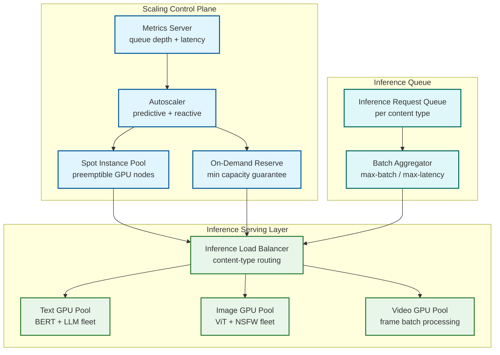

# 12.17 Content Moderation System — Scalability & Reliability

## GPU Inference Fleet Scaling

### Scaling Architecture

The ML inference layer is the most resource-intensive component of the moderation system. GPU instances are expensive and have non-trivial spin-up times (2-5 minutes for a new node to join the inference pool), making reactive autoscaling insufficient for sudden traffic spikes.



### Predictive vs. Reactive Scaling

Reactive autoscaling alone (scale up when queue depth or latency SLO is breached) is insufficient because new GPU nodes take 2-5 minutes to warm up, during which backlog accumulates and latency SLOs are already breached. The solution uses a two-layer scaling strategy:

**Predictive scaling (primary)**: A forecasting model trained on historical traffic patterns predicts content ingest volume 15 minutes ahead. The autoscaler provisions nodes in advance of predicted demand. Historical data shows strong diurnal and weekly patterns, enabling accurate 15-minute forecasts with <15% MAPE.

**Reactive scaling (secondary)**: Monitors p95 inference queue wait time and GPU utilization. If reactive signals exceed thresholds (queue wait > 200ms, GPU utilization > 85%), additional nodes are spun up immediately from a pre-warmed warm pool (nodes in standby state, fully initialized but not serving traffic, costing ~30% of active node cost).

**Floor capacity**: A minimum GPU reservation ensures baseline coverage at all hours, preventing cold-start delays during off-peak → on-peak transitions.

### Batch Optimization

GPU inference is substantially more efficient in batches. The batch aggregator collects inference requests up to a maximum batch size (typically 256 items for text, 64 for images) or a maximum wait time (50ms), whichever comes first. This creates a deliberate trade-off between throughput (larger batches) and latency (longer wait). For pre-publication items, the wait time ceiling is reduced to 10ms, prioritizing latency over throughput.

### Model Serving Versioning

Multiple model versions can be active simultaneously during rolling upgrades. The inference load balancer routes a configurable percentage of traffic to each model version (canary deployment). Model versions are tagged with the policy version they were trained against, enabling correlation between model updates and policy changes in observability tooling.

---

## Queue Partitioning and Backpressure

### Content-Type Partitioning

The content event queue is partitioned along three dimensions to prevent resource contention and enable independent scaling:

| Partition | Content | Consumers | Key Concern |
|---|---|---|---|
| `pre-pub-critical` | Pre-publication high-risk content | Dedicated fast-path consumers | Sub-500ms end-to-end |
| `text-async` | Async text classification | Text GPU fleet | Throughput-optimized |
| `image-async` | Async image classification | Image GPU fleet | GPU memory-optimized |
| `video-async` | Video processing pipeline | Video GPU fleet | Long-tail item sizes |
| `reports` | User-reported items | Priority re-scan consumers | High priority, moderate volume |
| `hash-updates` | Hash DB delta sync | Hash matching nodes | Consistency-critical |

### Backpressure Propagation

When the inference fleet is saturated (GPU utilization > 90%), the system applies backpressure to the ingest layer to prevent unbounded queue growth:

1. **Tier 1 (queue depth > 500K)**: Slow non-critical ingest paths (rate-limit async scan enqueuing for low-trust accounts)
2. **Tier 2 (queue depth > 2M)**: Pause async scan for low-severity content categories; only process CRITICAL and HIGH severity items
3. **Tier 3 (queue depth > 5M)**: Invoke degraded mode — see Graceful Degradation below

Queue depth thresholds are calibrated against worst-case reviewer throughput to ensure the review queue does not grow faster than it can be drained.

---

## Human Review Queue: Reviewer Pool Elasticity

### Staffing Model

The reviewer workforce consists of three tiers with different mobilization speeds:

| Tier | Type | Capacity | Mobilization Time | Cost |
|---|---|---|---|---|
| Core | Full-time trained reviewers | 40% of daily capacity | Already active | Highest/fixed |
| Flex | Part-time trained reviewers | 30% of daily capacity | 1-2 hours | Medium |
| Surge | Contractor overflow pool | 30% of daily capacity | 4-24 hours | Variable |

Surge pool activation is triggered by queue depth projections: if the queue is projected to exceed its SLA capacity within the next 4 hours based on current ingest rate and reviewer throughput, surge pool activation begins. The 4-hour lead time accounts for contractor ramp-up time.

### Geographic Distribution

Reviewer pools are geographically distributed to serve geo-specific queue partitions. Each geographic pool has:
- Language-certified reviewers for local content moderation
- Regulatory knowledge certification for applicable local laws (NetzDG, DSA obligations)
- Overlap hours with adjacent geographic pools to handle shift transitions

Queue routing ensures content requiring language-specific review (e.g., German-language hate speech for NetzDG compliance) is only routed to reviewers with the appropriate language certification.

---

## Graceful Degradation During Content Surges

### Degradation Mode Hierarchy

The system is designed to fail in a direction that minimizes harm: when capacity is constrained, it is better to queue for review than to auto-allow potentially harmful content.

```
Level 0 (Normal): Full pipeline; all content types scanned; hash + ML + human review
Level 1 (Moderate surge):
  - Deprioritize video frame classification (use audio/text signals only for video)
  - Increase Zone A threshold slightly to reduce human review routing rate
  - Activate flex reviewer tier
Level 2 (High surge):
  - Video classification: hash match + audio transcript only; no frame classification
  - Pause low-priority content categories (spam, low-NSFW)
  - Activate surge contractor pool
  - Alert engineering on-call
Level 3 (Severe surge / ML outage):
  - All unconfirmed items (not hash-matched) route to human review
  - Pre-publication gate: hash match only; LLM disabled
  - Circuit breaker on LLM inference (high cost, high latency)
  - Page incident commander
Level 4 (Critical: human review queue overflowing):
  - Temporary upload restriction for low-trust accounts
  - Emergency contractor pool expansion (cross-region)
  - Executive notification
  - Publish platform status update
```

### ML Inference Outage Handling

When the ML inference fleet becomes unavailable (deployment failure, GPU driver crash, network partition):

1. **Circuit breaker**: Inference clients detect consecutive failures and open the circuit; fallback logic activates immediately (no waiting for timeout)
2. **Fallback**: Hash matching continues (CPU-based; unaffected by GPU outage). All content not cleared by hash matching routes directly to human review
3. **Queue depth monitoring**: Human review queue depth is watched closely during ML outage; if depth exceeds surge thresholds, contractor pools are activated
4. **Recovery**: When ML inference recovers, items queued during the outage are re-processed; human review decisions made during the outage are reconciled against ML decisions (if they conflict, human decision stands)

---

## Multi-Region Deployment and Data Sovereignty

### Regional Architecture

The moderation system is deployed in multiple geographic regions to satisfy data sovereignty requirements (EU GDPR, regional data residency laws) and to reduce latency for geo-distributed reviewer workforces.

Each region is a full stack:
- Regional ingest endpoints
- Regional ML inference fleet
- Regional review queue and reviewer workstations
- Regional policy engine (synchronized policy from global policy store)
- Regional audit log (synchronized to global log for compliance)

Content is processed in the region where the user is located where legally required. Cross-region content sharing (e.g., a hash DB update from NCMEC applies globally) uses encrypted, replicated channels with provenance tracking.

### Hash Database Global Consistency

The known-bad hash databases (CSAM, terrorist, copyright) must be globally consistent across all regional deployments. A dedicated hash synchronization service pushes delta updates to all regions within 60 seconds of a new hash being added. During the propagation window, regions that have not yet received the update may miss matches for newly added hashes—acceptable given that CSAM reporting obligations are measured in hours, not seconds.

---

## Reliability Patterns

### Idempotency in Enforcement Actions

Every enforcement action (remove, restrict, suspend) is idempotent. Duplicate action requests for the same content item and action type are no-ops, returning the current state without side effects. This is implemented via an idempotency key (item_id + action_type + decision_id) that is checked before executing any enforcement change.

### Audit Log Durability

The audit log is the system's most durability-critical component. It is implemented as an append-only log replicated synchronously across three geographically distinct nodes (quorum write: requires 2/3 nodes to acknowledge before the write is confirmed). The log uses cryptographic chaining (each entry includes the hash of the previous entry) to provide tamper evidence. Log compaction is never performed; entries are retained indefinitely for legal and regulatory purposes.

### Saga Pattern for Complex Multi-Step Enforcement

Some enforcement actions involve multiple steps (e.g., account termination requires: remove all content, revoke authentication tokens, notify user, file regulatory report, archive account data). These are implemented as sagas with explicit compensation actions for each step. If any step fails, compensating actions roll back completed steps to a consistent state. The saga state machine is persisted in the audit log, enabling replay from any point in case of infrastructure failure.
