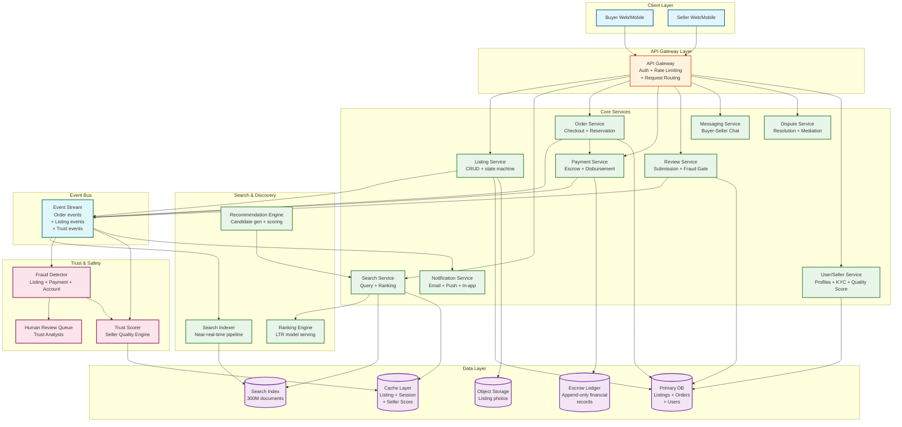
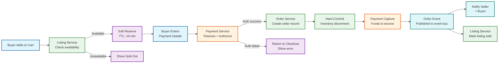
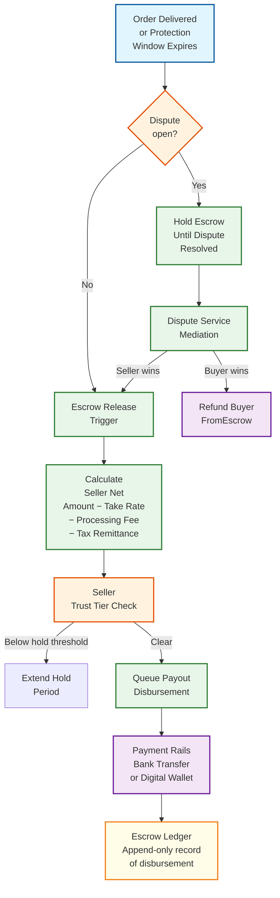
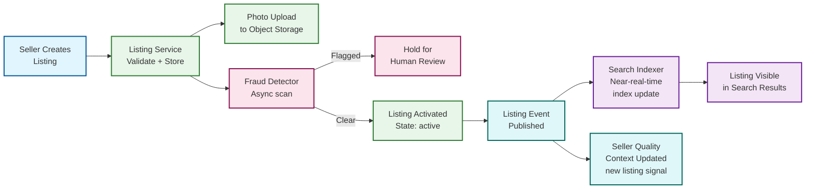

# 12.18 Marketplace Platform — High-Level Design

## System Architecture

---

## Key Design Decisions

### Decision 1: Escrow-Based Payment with Conditional Release

Charging the buyer at order creation and immediately forwarding proceeds to the seller creates a non-recoverable situation when buyers dispute non-delivery or item misrepresentation. The platform would need to chase sellers for refunds—a losing proposition at scale. Instead, buyer payment is captured at checkout into a platform-held escrow account. Funds are released to the seller only when one of three conditions is met: (1) delivery is confirmed by carrier tracking, (2) the buyer confirms receipt, or (3) the buyer protection window expires without a dispute being filed. This makes the platform the trusted intermediary for both sides: buyers trust that payment won't disappear, sellers trust that payment is secured and will be released.

**Implication:** The platform must hold substantial float (days of GMV in escrow), which creates regulatory obligations as a payment intermediary. The escrow ledger must be a separate, append-only financial record independent of the operational database.

### Decision 2: Seller Quality Score as a First-Class, Asynchronously Updated Signal

Seller quality affects search ranking, payout hold periods, buyer trust badges, and listing visibility—it is the most cross-cutting signal in the system. Computing it synchronously on every affected operation would create tight coupling and latency problems. Instead, the seller quality score is a pre-computed, cached signal updated asynchronously after each qualifying event (order completion, review submitted, dispute resolved, policy action taken). The score is versioned and timestamped; downstream systems consume the current score from cache and receive invalidation events when scores change materially.

**Implication:** There is an inherent staleness window (typically seconds to minutes) between a quality-changing event and the score update propagating to search ranking. This is acceptable—ranking is not expected to update in real time—but requires explicit SLO for propagation latency.

### Decision 3: Multi-Stage Search Pipeline (Recall → Rank → Filter → Personalize)

A naive approach applies a single scoring function to all 300M listings per query. This doesn't scale. The production pipeline uses four stages: (1) lightweight ANN (approximate nearest neighbor) vector recall to retrieve the top ~1,000 candidates from 300M in under 10ms; (2) learning-to-rank re-ranking of the 1,000 candidates using rich features (seller quality, behavioral signals, listing freshness) in under 20ms; (3) hard filtering for sold-out, policy-suspended, and geo-restricted listings; (4) diversity injection and personalization layer to avoid filter bubbles and surface new sellers. Each stage has a different latency budget and a different trade-off between recall and precision.

**Implication:** The system can improve ranking quality by improving any single stage without rebuilding the others. New ranking signals can be added to the re-ranker without touching the recall layer.

### Decision 4: Inventory Reservation with TTL-Based Soft Reserve

A race condition exists when multiple buyers simultaneously view the same single-quantity listing and attempt to purchase. Without reservation, two buyers can complete checkout for the same item. The solution uses a two-phase reservation: when a buyer enters checkout, a soft reserve is written with a TTL (10 minutes). If checkout completes within the TTL, the reserve converts to a hard commit and inventory is decremented. If TTL expires without checkout completion, the reserve is released and the item becomes available again. Only one soft reserve per listing can exist for single-quantity items.

**Implication:** Items can appear "unavailable" during checkout even if no purchase occurs (TTL reserve squatting). This is the correct trade-off: a false "sold out" for 10 minutes is far less harmful than an oversell.

### Decision 5: Trust Signals as Graph-Structured, Not Record-Structured, Data

Review fraud and coordinated seller manipulation are graph problems, not row-based anomaly detection problems. A seller with 5,000 five-star reviews from accounts that all signed up in the same week, have never reviewed other sellers, and share overlapping IP ranges cannot be detected by examining any single review record. It requires modeling the bipartite graph of reviewer-to-seller relationships and computing structural anomaly scores (reviewer clustering coefficients, temporal burst detection, IP diversity of review sources). Storing trust signals in a graph database alongside the transactional relational database allows this structural analysis without degrading OLTP performance.

**Implication:** Trust scoring requires a separate analytical pipeline that processes the review graph nightly (or in near-real-time for burst anomalies) and updates seller quality scores accordingly.

---

## Data Flow: Buyer Checkout

---

## Data Flow: Escrow Release and Payout

---

## Data Flow: Listing Creation to Search Visibility

---

## Component Responsibilities Summary

| Component | Primary Responsibility | Key Interface |
|---|---|---|
| **API Gateway** | Authentication, rate limiting, request routing, SSL termination | REST/GraphQL; JWT token validation |
| **Listing Service** | Listing CRUD, state machine (draft→active→sold), photo orchestration | REST API; publishes listing events to event bus |
| **Search Service** | Query parsing, multi-stage retrieval, ranking assembly | REST search API; reads from search index and cache |
| **Search Indexer** | Near-real-time index updates from listing events; document transformation | Consumes listing events; writes to search index |
| **Ranking Engine** | LTR model serving; combines relevance + seller quality + behavioral signals | gRPC inference API; called by Search Service |
| **Order Service** | Checkout orchestration, inventory reservation, order record management | REST checkout API; coordinates with Payment and Listing services |
| **Payment Service** | Payment authorization, capture, escrow accounting, disbursement scheduling | Internal gRPC; integrates with external payment processor and banking rails |
| **Escrow Ledger** | Append-only financial record of all escrow events (capture, hold, release, refund) | Write-only from Payment Service; read for audits and reconciliation |
| **Fraud Detector** | Multi-layer fraud scoring for listings, transactions, and reviews | Async event consumer; writes scores to Trust DB; escalates to human review |
| **Trust Scorer** | Computes and updates seller quality score from all quality signals | Event-driven; updates score cache; publishes score change events |
| **Dispute Service** | Opens, tracks, and resolves buyer-seller disputes; controls escrow release | REST disputes API; integrates with Payment Service for refund/release |
| **Review Service** | Review submission with fraud gate; score aggregation; public display | REST reviews API; fraud check before write; async quality score update |
