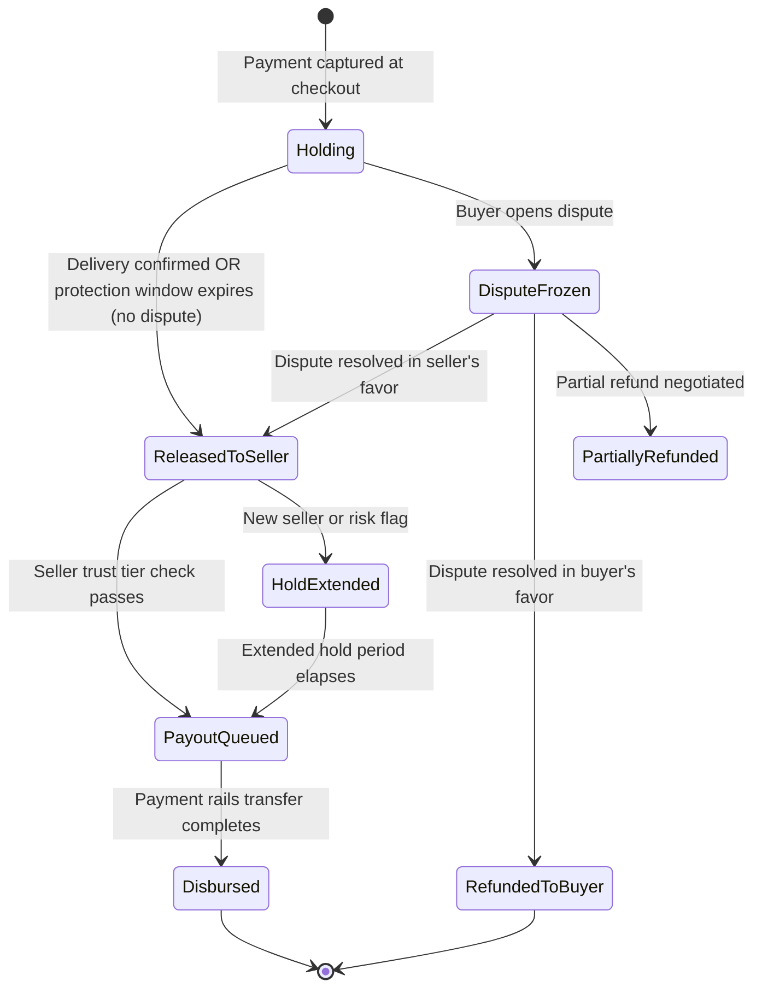

# 12.18 Marketplace Platform — Deep Dives & Bottlenecks

## Deep Dive 1: Multi-Stage Search Ranking Pipeline

### The Four-Stage Architecture

Production marketplace search does not apply a single scoring function to 300M listings per query—the computational cost would be prohibitive. The solution is a cascade of increasingly expensive, increasingly accurate scoring stages, each reducing the candidate set before passing to the next stage.

```mermaid
flowchart LR
    A[Query\n"vintage camera\nnikon\nnear me"] --> B[Query Understanding\nEntity extraction\nIntent classification\nSpell correction]
    B --> C[ANN Vector Recall\nTop ~1,000 candidates\nfrom 300M in ≤ 10ms]
    C --> D[BM25 Lexical Recall\nMerge with vector\nresults → 1,500 candidates]
    D --> E[LTR Re-Ranker\n30+ features\n≤ 20ms for 1,500 docs]
    E --> F[Hard Filters\nAvailability, policy,\ngeo restrictions]
    F --> G[Diversity + Personalization\nDe-dup seller\nPersonalize for buyer]
    G --> H[Promoted Injection\nBlended at fixed\npositions]
    H --> I[Return top 48\nresults to buyer]

    classDef query fill:#e1f5fe,stroke:#01579b,stroke-width:2px
    classDef recall fill:#e8f5e9,stroke:#2e7d32,stroke-width:2px
    classDef rank fill:#fff3e0,stroke:#e65100,stroke-width:2px
    classDef filter fill:#f3e5f5,stroke:#6a1b9a,stroke-width:2px
    classDef output fill:#fffde7,stroke:#f57f17,stroke-width:2px

    class A,B query
    class C,D recall
    class E rank
    class F,G,H filter
    class I output
```

### LTR Feature Groups

The learning-to-rank model at stage 3 uses feature groups that capture different quality dimensions:

| Feature Group | Examples | Signal Type |
|---|---|---|
| **Relevance** | Title BM25 score, semantic similarity to query, category match depth | Query-doc |
| **Quality** | Seller overall score, review count, trust tier | Doc-static |
| **Freshness** | Listing age (hours), last price change recency | Doc-static |
| **Behavioral** | 7-day CTR, 7-day conversion rate, 30-day view count | Doc-dynamic |
| **Price** | Price percentile within category, price vs. median | Query-doc |
| **Shipping** | Estimated delivery days, free shipping indicator | Doc-static |
| **Personalization** | Buyer's category affinity, prior seller interactions | Query-user |

**Model choice:** Gradient-boosted tree (LambdaMART) trained on click and purchase data. Neural ranking models (BERT-based cross-encoders) are too slow for 1,500 candidates per query; they are used for the offline training signal, not live inference.

**Training signal:** Purchases are strong positive signals; clicks with long dwell are medium; bounces are weak negative signals. Implicit feedback must be debiased for position effects (clicks on position 1 are inflated by exposure, not quality).

### Index Freshness for New Listings

New listings must appear in search within 30 seconds. Batch index rebuilds (hours) are unacceptable. The solution:

1. **Near-real-time index update pipeline:** Listing activation event → stream processor → incremental write to search index shard
2. **Dual-path query:** At query time, results from the main index are supplemented by a "hot listings" in-memory index covering items listed in the last 5 minutes (small enough to scan entirely, indexed by category)
3. **Availability filter short-circuit:** A separate availability cache (Redis, updated by Order Service on every sale) is checked after retrieval; sold-out listings are filtered before ranking, preventing buyers from clicking on unavailable items

**Bottleneck:** Index shard updates under peak listing creation (10,000/minute) → batch micro-updates every 5 seconds per shard with write coalescing to avoid index segment fragmentation.

---

## Deep Dive 2: Payment Escrow and Disbursement

### Escrow State Machine



### Disbursement Calculation

Every disbursement is a multi-party split computed atomically:

```
order_total = item_price + shipping_charged_to_buyer

platform_fee = order_total * take_rate  // e.g., 8% of order total

payment_processing_fee = (order_total * interchange_rate) + fixed_fee
// e.g., 2.9% + $0.30 per transaction

tax_remittance = collected_sales_tax  // passed through to tax authority

seller_net = order_total - platform_fee - payment_processing_fee - tax_remittance

// Ledger entries (all atomic):
DEBIT  escrow_account              order_total
CREDIT platform_revenue_account    platform_fee
CREDIT payment_processor_account   payment_processing_fee
CREDIT tax_remittance_account       tax_remittance
CREDIT seller_pending_payout        seller_net
```

**Financial integrity:** Every transaction produces exactly four ledger entries that sum to zero. Discrepancies trigger automated reconciliation alerts. The escrow ledger is append-only—entries are never updated or deleted.

### Payout Batching

Disbursing every seller net amount individually via banking rails would generate millions of micro-transfers per day, each incurring transfer fees. Production systems batch payouts:

- **Standard batch:** Twice daily (00:00 and 12:00 UTC). All sellers with cleared escrow and passed hold period receive a single aggregate transfer per bank account.
- **Instant payout option:** Premium sellers can request real-time disbursement (separate fee) via faster payment rails.
- **Cross-border complexity:** Payouts to international sellers require FX conversion at a locked rate, additional compliance checks, and integration with international wire/SWIFT or regional faster-payment networks.

---

## Deep Dive 3: Trust & Safety — Four Attack Vectors

### Vector 1: Fraudulent Listings

**Pattern:** Seller lists non-existent or counterfeit items, collects payment, never ships.

**Detection layers:**
1. **Account age gate:** New accounts cannot list high-value items (>$200) without additional verification
2. **Listing content classifier:** NLP model detects pricing anomalies (luxury goods priced 80% below market), template-matched descriptions from known fraud patterns, copy-paste listing descriptions across multiple seller accounts
3. **Image perceptual hash:** Listing photos checked against database of known counterfeit product images; watermark removal attempt detection
4. **Behavioral signals:** Rapid listing creation after account creation; listing many identical items across categories; messaging patterns soliciting off-platform payment

**Response:** Flagged listings enter human review queue (trust analysts); account may be proactively suspended pending review.

### Vector 2: Review Fraud

**Pattern A (Boosting):** Seller pays for fake five-star reviews to inflate reputation.
**Pattern B (Bombing):** Competitor pays for fake one-star reviews to harm a rival seller.

**Detection beyond per-review signals (covered in LLD):**

- **Temporal graph analysis:** Model the bipartite graph of (reviewer → seller) reviews. A coordinated attack creates a dense subgraph of reviews from accounts with short path distances in the social graph.
- **Linguistic fingerprinting:** Reviews from coordinated farms often share syntactic templates even when surface-level words differ. Sentence embedding clustering identifies farms.
- **Purchase funnel bypass detection:** Legitimate reviews require a completed purchase. Any review submitted via unusual API path or for which no matching completed order exists → hard suppression.

### Vector 3: Payment Fraud

**Pattern:** Stolen credit card used to purchase items; item shipped before card dispute is raised.

**Detection layers:**
1. **Device fingerprint + velocity:** Same device placing multiple orders to different addresses; orders from device first seen < 24 hours ago
2. **Billing-shipping mismatch:** Different billing address, IP geolocation, and shipping address
3. **Card testing signals:** Multiple failed authorization attempts from same device/IP followed by a success
4. **Order anomaly:** First order from a new account being high-value, expedited shipping, gift wrapping (patterns associated with card fraud)

**Response:** High-risk transactions blocked; medium-risk require 3DS strong authentication challenge; funds held in extended escrow for elevated-risk orders even after delivery.

### Vector 4: Account Takeover (ATO)

**Pattern:** Attacker takes over a legitimate seller's account, changes banking details, and receives their pending payouts.

**Detection and mitigation:**
1. **Login anomaly detection:** Impossible travel (login from two geographies within 1 hour), device fingerprint change, credential stuffing pattern (high-velocity login attempts)
2. **Payout account change: hard freeze.** Any change to seller banking details triggers a 72-hour hold on all pending payouts and sends a verification email/SMS to the account's registered contacts
3. **High-value action re-authentication:** Changes to price, shipping address, bank details require re-authentication regardless of session state
4. **Progressive trust for new bank accounts:** First payout to a newly added bank account is sent as a small verification deposit (micro-deposit pattern) before full disbursement

---

## Deep Dive 4: Dispute Resolution Automation

### Automated Resolution Patterns

| Scenario | Evidence Available | Auto-Resolution |
|---|---|---|
| Item not received | Carrier tracking shows "delivered" within protection window | Reject dispute; buyer protection ends |
| Item not received | No carrier scan past "label created" after 10 days | Auto-refund buyer; escrow returned |
| Item not received | Carrier shows "in transit" past estimated delivery by 5+ days | Extend protection window; notify buyer |
| Item not as described | Buyer provides photo evidence rated high-confidence mismatch by image similarity model | Refund buyer; flag seller quality score |
| Item not as described | Ambiguous evidence | Route to human trust analyst |
| Seller issues voluntary refund | Any dispute state | Resolve in buyer's favor; close dispute |

**Human review escalation criteria:**
- Dispute value > $500
- Seller or buyer has multiple prior disputes (pattern flag)
- Evidence is contradictory between parties
- Seller does not respond within 48 hours

### Dispute Impact on Seller Quality

Disputes are the highest-weight negative signal in the seller quality score:
- Dispute opened: neutral (disputes can be frivolous)
- Dispute resolved against seller: −0.1 to quality score (normalized)
- Dispute resolved in seller's favor: +0.02 (vindication signal)
- Seller response within 48 hours to dispute: +0.01 (engagement signal)
- High dispute rate (>5% of orders): search penalty applied; payout hold extended

---

## Key Bottlenecks and Mitigations

| Bottleneck | Root Cause | Mitigation |
|---|---|---|
| **Search index staleness** | Batch index refresh cycles | Near-real-time incremental indexing + hot listing overlay |
| **Checkout race conditions** | Concurrent purchases of single-quantity items | TTL-based optimistic soft reserve |
| **Payment processor rate limits** | External API quota exhaustion during holiday peaks | Connection pool + queue-based smoothing; secondary processor failover |
| **Seller quality score fanout** | One dispute triggers recomputation, then cascades to search index update for all their listings | Debounce recomputation (coalesce events in 5-min window); batch search index update |
| **Escrow ledger contention** | Millions of ledger writes per day to same financial accounts | Append-only event sourcing; aggregate balances computed on read, not stored as mutable state |
| **Review fraud graph query** | Graph traversal queries on billions of edges | Pre-materialized subgraph summaries per seller; incremental updates on new review events |
| **Photo ingest throughput** | 14.4 TB/day of new photo uploads from sellers | Async direct-to-object-storage upload with signed URLs; resize/compress pipeline runs independently of listing creation |
