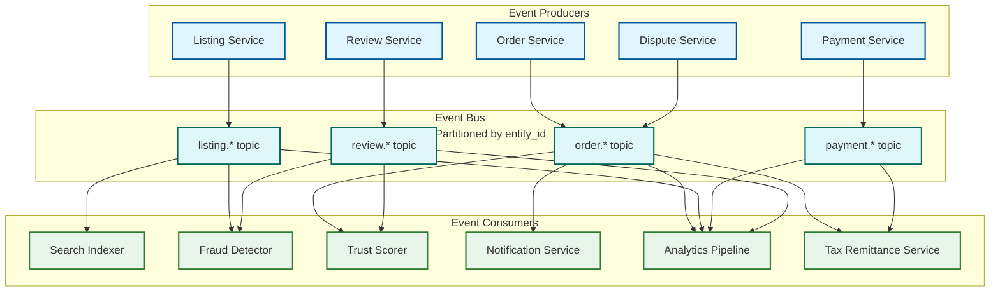

# 12.18 Marketplace Platform — Scalability & Reliability

## Scalability Architecture

### Listing and Search Index Partitioning

With 300M active listings, no single search node can hold the full index in memory. The search index is partitioned (sharded) across multiple nodes:

```
Sharding strategy: Category-aware consistent hashing
  Shard key: category_id + listing_id (prevents hot shards from popular categories)
  Shard count: 100 shards (allows horizontal expansion without full re-sharding)
  Replicas per shard: 3 (2 read replicas + 1 primary for index updates)

Query fan-out:
  A query for "vintage camera" fans out to:
    1. Identify candidate shards (Electronics, Cameras categories → 2 shards)
    2. Broadcast to both shards in parallel
    3. Merge and re-rank results from both shards at search aggregator
    4. Return top N to buyer

Global queries (no category filter):
  Fan out to all 100 shards → merge top-100 from each → final re-rank
  Mitigated by query understanding that adds category hints for most queries
```

### Database Partitioning Strategy

Different data access patterns require different partitioning strategies:

| Table | Partition Strategy | Rationale |
|---|---|---|
| Listings | Range partition by listing_id (UUID v7 time-ordered) | Evenly distributes writes; new listings cluster in latest partition |
| Orders | Shard by buyer_id | Buyer order history queries (most common) are single-shard |
| Orders (seller view) | Denormalized read replica sharded by seller_id | Seller order management queries are single-shard |
| Reviews | Partition by seller_id | Review reads for a seller listing page are single-shard |
| EscrowLedger | Append-only; partition by date | Financial reconciliation is time-range based |
| SellerQualityScore | Single row per seller; shard by seller_id | Small table; read heavy |

**Cross-shard operations:** Checkout requires reads across Listings, Users, and Orders. These are handled by the Order Service application layer, not as database JOINs, to maintain partition independence.

### Event Bus for Decoupling

All cross-service coordination flows through the event bus rather than synchronous service calls:



**Consumer group isolation:** Each consumer group (search indexer, fraud detector, etc.) maintains independent read offsets. A slow fraud detection pipeline does not block search indexing. Consumers can replay from any offset during outages or backfills.

---

## Holiday Peak Handling

Marketplaces experience 5–10× traffic spikes on major shopping holidays. The following systems require special handling:

### Checkout Throughput

At 5× peak (290 orders/sec), the payment processor becomes the bottleneck:

- **Connection pooling:** Maintain warm connection pools to payment processor to avoid connection setup latency under burst
- **Secondary processor failover:** Pre-integrated backup payment processor; automatic failover if primary error rate exceeds 1% for 30 seconds
- **Checkout queue smoothing:** Excess checkout requests are queued with a status page ("Completing your order...") rather than rejected. Queue depth is bounded at 30 seconds of capacity; beyond that, new requests receive "busy" response

### Search Read Scaling

- **Read replica auto-scaling:** Search nodes scale horizontally on CPU and QPS metrics; pre-warm additional nodes 2 hours before anticipated peaks (based on historical patterns)
- **Query result caching:** Top 10,000 most-common queries are cached with 30-second TTL. Cache hit rate ~40% on holiday peaks reduces live query load substantially
- **Graceful degradation:** Under extreme load, disable personalization layer (most expensive) and serve un-personalized ranked results

### Listing Availability Cache

The availability check (is this listing still available?) must be consistent even under peak load. A stale read from the main database could serve a sold-out listing:

- **Dedicated availability cache** (in-memory, write-through from Order Service on every sale): Single source of truth for in-search availability filtering
- **Cache capacity:** 300M boolean flags ≈ 300 MB per replica (trivially fits in memory)
- **Invalidation SLA:** Availability flag updated within 100ms of order commitment; search results filter against this cache, not the main listing database

---

## Reliability Patterns

### Payment Service: Critical Path Hardening

The payment service is the highest-reliability component ($225M/day GMV flows through it):

- **Idempotency keys:** Every payment operation includes a buyer-generated idempotency key. Duplicate requests (from client retries) return the original result without re-executing
- **Saga pattern for checkout:** Order creation is a distributed saga:
  1. Reserve inventory (compensatable: release reservation)
  2. Create order record (compensatable: mark order cancelled)
  3. Authorize payment (compensatable: void authorization)
  4. Capture payment (compensatable: refund)
  5. Create escrow record (compensatable: release escrow)
  If any step fails, the saga executes compensating transactions in reverse order
- **Circuit breaker on payment processor:** If error rate exceeds threshold, stop sending requests to degraded processor and route to backup; prevents cascading failures from propagating to buyers

### Search Service: Graceful Degradation

Search failure degrades buyer experience but is not a financial-integrity issue:

| Failure Mode | Degradation Response |
|---|---|
| Search index shard unavailable | Query remaining shards; mark shard as degraded; serve partial results with "limited results" indicator |
| LTR re-ranker latency spike | Fall back to lexical BM25 scoring only; disable neural features |
| Personalization service unavailable | Serve un-personalized results; no buyer-visible indicator |
| Recommendation engine down | Surface "editor's picks" static fallback set |

### Escrow Ledger Durability

The escrow ledger represents real money—it requires the highest durability guarantees in the system:

- **Synchronous replication:** Ledger writes are committed to a minimum of 2 replicas before returning success
- **Geographic distribution:** Primary replica + 2 cross-region replicas; RPO = 0 (no data loss) for committed transactions
- **Reconciliation job:** Daily automated reconciliation compares escrow ledger totals against payment processor settlement reports; any discrepancy triggers immediate alert and manual review
- **Audit log retention:** Escrow records retained for 7 years minimum (financial regulation); cold storage after 18 months

### Seller Quality Score: Eventual Consistency

Seller quality scores are eventually consistent across subsystems:

- **Score version propagation:** When a seller quality score is recomputed, a new version is published to all downstream caches (search ranking, buyer-facing profile, payout eligibility)
- **Version skew tolerance:** A search index using score version N while the payout system uses version N+1 for a brief window is acceptable
- **Hard limits:** If the score cache for a seller is completely missing (cache miss), fall back to conservative defaults (new seller tier) rather than serving stale data that might grant inflated trust

---

## Multi-Region Architecture

Global marketplace serving buyers and sellers across time zones requires multi-region deployment:

```
Region strategy:
  Active-active for read traffic (search, listing browse)
  Active-passive for write traffic (orders, payments, escrow)
  Global single source of truth for financial records (one primary region)

Data residency:
  User PII stored in user's home region (GDPR EU data sovereignty)
  Listing data replicated globally for search serving
  Financial records in primary region with encrypted backups in secondary regions

Latency optimization:
  Search index replicated to all regions; queries served from nearest region
  Listing photos served via CDN (no origin hits for cached photos)
  Payment processing routed to regionally appropriate processor (EU buyers via EU processor)
```
