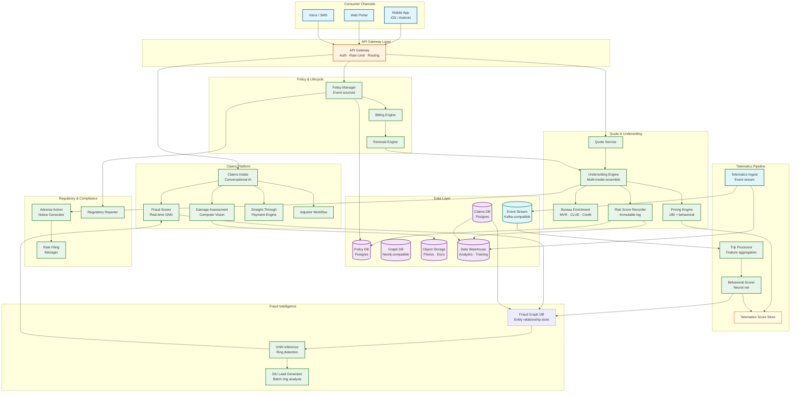
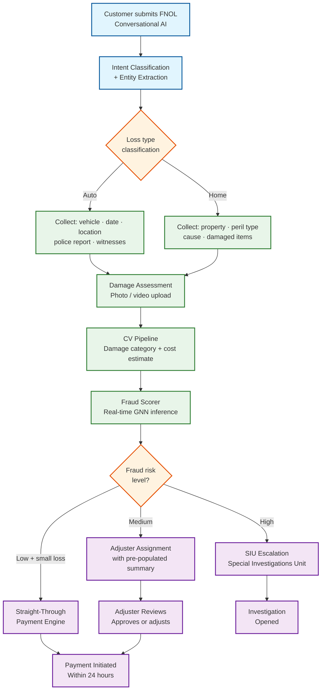

# 12.19 AI-Native Insurance Platform — High-Level Design

## System Architecture

---

## Key Design Decisions

### Decision 1: Immutable Risk Score Record at Every Binding Event

Every binding decision (new policy, renewal, endorsement) writes an immutable risk score record before the policy record is created. This record captures the exact feature vector, model version, approved algorithm version, and output scores at the moment the decision was made. This is not optional—it is a regulatory requirement. If a state insurance commissioner audits a rate decision made 18 months ago, the system must reproduce the exact inputs and outputs from that moment, using the actuarial algorithm version that was filed and approved at that time.

**Implication:** Model versioning is not just a DevOps concern—it is a compliance obligation. The risk score record is append-only and must survive model retraining, algorithm updates, and even database migrations without alteration.

### Decision 2: State-Parameterized Scoring, Not a Single Model

Insurance rating algorithms are approved on a state-by-state basis. A new rating variable (e.g., a telematics-derived aggressive braking score) must be filed and approved in each state before it can be used for rating in that state. A single model trained on all state data cannot satisfy this requirement—if the model inadvertently uses a prohibited factor for a given state, that state's rate filing is invalid.

The solution is a parameterized scoring engine: the feature set and algorithm weights are configuration objects (keyed by state × line-of-business × algorithm version). The underwriting engine selects the correct feature set and algorithm at inference time, never passing prohibited variables to the model. The approved algorithm version is stamped on the risk score record.

**Implication:** Adding a new rating variable requires a rate filing workflow before it can be activated in production. The feature pipeline and model are decoupled from the regulatory approval process.

### Decision 3: Dual-Write Telematics to Stream and Cold Storage

Telematics events are written to two destinations simultaneously: a low-latency event stream for real-time feature computation, and a cold object store for long-term archival. The event stream feeds the trip processor (near-real-time behavioral score updates). The cold store feeds the data warehouse for model retraining and serves as the regulatory archive (telematics data used for pricing decisions must be retained for the life of the policy plus state-mandated retention periods).

**Implication:** Telematics data has three lifetimes: real-time (seconds, for score updates), operational (30 days, for dispute resolution), and archival (7 years, for regulatory compliance). The storage tier transitions must be automatic and the cold archive must remain queryable for litigation support.

### Decision 4: Real-Time Fraud Scoring on the Critical FNOL Path

Fraud scoring is synchronous on the FNOL submission path—the claim is not acknowledged to the customer until a fraud score is computed and routed (either to straight-through payment or to adjuster queue). This design means high-fraud claims never enter the payment queue; they arrive in the adjuster workflow already flagged. The alternative (asynchronous fraud scoring after acknowledgment) risks payment of fraudulent claims before scoring completes.

The fraud scorer maintains a warm subgraph in memory for each active claim entity (updated continuously from the fraud graph). At FNOL, the scorer expands a 2-hop subgraph centered on the claimant and runs GNN inference. The ≤3-second SLO requires the GNN inference latency to be sub-second after subgraph retrieval.

**Implication:** The fraud graph must support sub-second subgraph retrieval for any entity. Graph DB query optimization (indexed entity lookup, in-memory hot subgraphs for high-risk entities) is a critical performance engineering problem.

### Decision 5: Conversational Claims Intake as a Structured Data Extraction Problem

The conversational AI claims intake is not a general-purpose chatbot—it is a state machine that extracts a defined set of structured fields required to open a claim (date of loss, loss type, property description, witness contacts, police report number). The conversation is designed to be empathetic but directive: the AI always steers toward collecting the next required field.

Intent classification and entity extraction run on every turn. If the customer is expressing distress, the AI acknowledges it before continuing extraction. If the AI is uncertain about a critical field (e.g., cannot reliably extract a vehicle plate number), it escalates to a live adjuster rather than guessing. This design produces a fully structured FNOL record as the output, not a transcript—enabling downstream automation without NLP post-processing.

**Implication:** The claims conversation is designed around a schema, not around natural language understanding in the abstract. Edge cases (ambiguous answers, distressed customers, complex losses) are escalation triggers, not model problems to solve.

---

## Data Flow: Quote-to-Bind

```mermaid
flowchart LR
    A[Consumer starts quote] --> B[Quote Service\ncollects application data]
    B --> C[Bureau Enrichment\nMVR · CLUE · Credit async calls]
    B --> D[Telematics Feature\nRetrieval from TST]
    C & D --> E[Underwriting Engine\nMulti-model ensemble]
    E --> F{State feature set\nselection}
    F --> G[Prohibited factor\nexclusion per state]
    G --> H[Model Inference\nGLM + GBM + Telematic NN]
    H --> I[Risk Score\nComputed]
    I --> J[Pricing Engine\napply approved rate algo]
    J --> K[Generate Quote\nPremium + Coverage options]
    K --> L{Customer\naccepts?}
    L -->|Yes| M[Write Risk Score Record\nImmutable — pre-bind]
    M --> N[Issue Policy\nPolicy Manager]
    N --> O[Billing Setup]
    L -->|No| P[Quote Expires\nArchived for analytics]

    classDef service fill:#e8f5e9,stroke:#2e7d32,stroke-width:2px
    classDef decision fill:#fff3e0,stroke:#e65100,stroke-width:2px
    classDef data fill:#f3e5f5,stroke:#6a1b9a,stroke-width:2px
    classDef terminal fill:#e1f5fe,stroke:#01579b,stroke-width:2px

    class B,C,D,E,G,H,I,J,K,M,N,O service
    class F,L decision
    class P terminal
```

---

## Data Flow: Claims FNOL to Resolution

---

## Data Flow: Telematics to Premium Adjustment

```mermaid
flowchart LR
    A[Mobile SDK\n10Hz sensor events] --> B[Edge Preprocessor\non-device trip detection]
    B --> C[Batch Upload\nper trip completion]
    C --> D[Telematics Ingest Service\nevent validation + enrichment]
    D --> E[Event Stream\ndurable · partitioned by driver]
    E --> F[Trip Processor\nreconstruct trip · compute features]
    F --> G[Behavioral Scorer\nneural net inference]
    G --> H[Behavioral Score Store\nrolling 30-day window]
    H --> I[Pricing Engine\nre-rate at billing cycle]
    I --> J{Score\nchange?}
    J -->|Significant delta| K[Rate Adjustment\nNotify policyholder]
    J -->|Within threshold| L[No rate change\nlog for monitoring]
    G --> M[Fraud Graph Update\nadd trip node + features]

    classDef device fill:#e1f5fe,stroke:#01579b,stroke-width:2px
    classDef pipeline fill:#e8f5e9,stroke:#2e7d32,stroke-width:2px
    classDef store fill:#fffde7,stroke:#f57f17,stroke-width:2px
    classDef decision fill:#fff3e0,stroke:#e65100,stroke-width:2px
    classDef queue fill:#e0f7fa,stroke:#00695c,stroke-width:2px

    class A,B device
    class C,D,F,G,I pipeline
    class H,M store
    class J decision
    class E queue
```

---

## Component Responsibilities Summary

| Component | Primary Responsibility | Key Interface |
|---|---|---|
| **API Gateway** | Auth (JWT), rate limiting, routing to downstream services | REST + WebSocket; gRPC for internal services |
| **Quote Service** | Orchestrate quote flow: collect inputs, call bureau enrichment, invoke underwriting engine, return bindable offer | REST API; async bureau calls with timeout/fallback |
| **Underwriting Engine** | Select per-state feature set, invoke model ensemble, compute risk score, write score record | Internal gRPC; reads approved algorithm config from Rate Filing Manager |
| **Bureau Enrichment** | Fan-out to MVR, CLUE, credit bureau APIs; normalize and cache responses | Async HTTP; response TTL cache; graceful degradation on bureau timeout |
| **Pricing Engine** | Apply approved rating algorithm to risk score; compute premium; apply UBI behavioral modifier | Internal service; reads telematics score from Behavioral Score Store |
| **Telematics Ingest** | Validate, authenticate, and durably enqueue telematics events from mobile SDK and OBD-II | REST upload API; writes to partitioned event stream |
| **Trip Processor** | Consume event stream, reconstruct trips, compute per-trip features (speed, hard braking, distraction events) | Stream consumer; writes trip records to Behavioral Score Store |
| **Behavioral Scorer** | Run neural net inference on trip feature vectors; update rolling behavioral score | Batch scoring job; reads from trip records; writes to Behavioral Score Store |
| **Claims Intake (Conversational AI)** | Multi-turn conversation to collect structured FNOL data; intent classification and entity extraction | REST + WebSocket for real-time chat; voice gateway integration |
| **Damage Assessment** | Computer vision pipeline on uploaded photos/video; classify damage severity and estimate repair cost | Async job queue; reads from object storage; writes assessment to Claims DB |
| **Fraud Scorer** | Real-time GNN inference over 2-hop subgraph; return fraud risk score with feature attribution | Synchronous gRPC; ≤3s SLO |
| **Fraud Graph DB** | Store and serve entity relationship graph; support sub-second subgraph retrieval | Graph DB with indexed entity lookup; updated by event consumers |
| **Straight-Through Payment** | Approve and initiate payment for qualifying low-risk claims; integrate with payment rails | Internal service; writes payment record; calls payment processor API |
| **Rate Filing Manager** | Maintain approved algorithm versions per state; enforce prohibited factor lists; generate SERFF packages | Config store; read-heavy; write on regulatory approval |
| **Adverse Action Generator** | Detect underwriting decisions requiring adverse action notice; generate FCRA-compliant notices | Event consumer on underwriting decisions; letter generation service |
