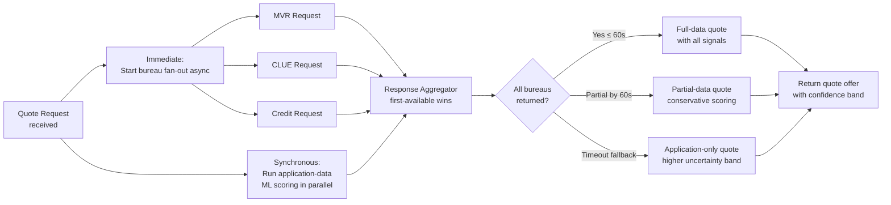
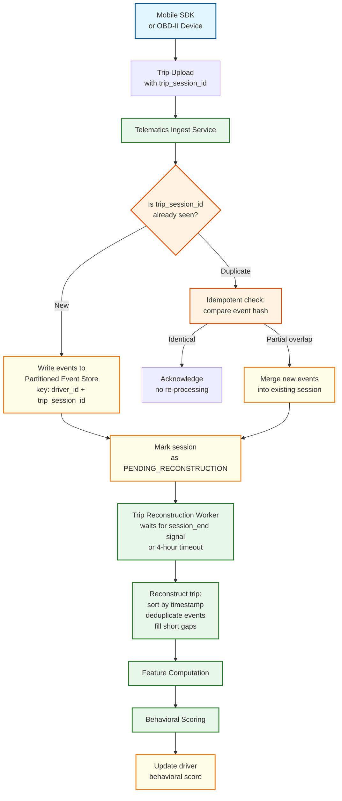
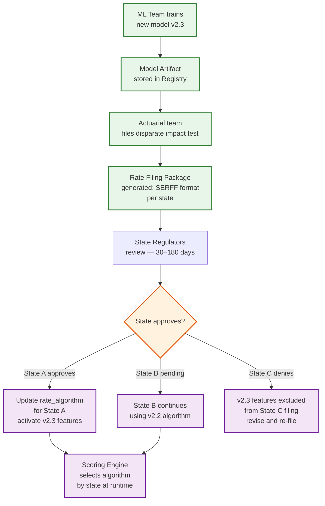

# 12.19 AI-Native Insurance Platform — Deep Dives & Bottlenecks

## Deep Dive 1: Underwriting Pipeline — Bureau Enrichment Latency Problem

### The Problem

The most significant bottleneck in the quote-to-bind flow is external bureau enrichment. Motor Vehicle Record (MVR) providers, CLUE (property loss history) databases, and credit bureaus are third-party systems with highly variable response latencies—p50 of 2 seconds, p99 of 45 seconds, and occasional timeouts up to 120 seconds. The customer-facing quote SLO is 90 seconds from submission to bindable offer. With three mandatory bureau calls in sequence, the system would regularly exceed this SLO.

### The Solution: Speculative Pre-Fetch and Parallel Fan-Out



Bureau calls are fired immediately upon quote request receipt, in parallel, before any ML scoring begins. The quote returns as soon as the ML scoring finishes AND either all bureaus have responded OR the timeout threshold is reached (60 seconds). For timed-out bureaus, the system applies a conservative score adjustment (assumes adverse history was present) and widens the premium uncertainty band, issuing a preliminary offer. The customer can bind on the preliminary offer; the final rate is reconciled within 48 hours when bureau data arrives, with a rebate if the final rate is lower.

### Caching Bureau Responses

MVR and CLUE responses are cached per applicant (keyed by SSN hash) with a configurable TTL (typically 30 days). For renewal underwriting, cached responses are reused if within TTL, avoiding repeat bureau charges. Cache freshness is tracked per record; records within 7 days of TTL expiry trigger a background refresh call so the cache is warm for renewals.

**Credit report caching:** A credit pull is a hard inquiry under FCRA if used for underwriting decisions. The system caches soft pulls for pre-qualification (not rating-determinative) and initiates hard pulls only at policy bind, complying with FCRA requirements.

---

## Deep Dive 2: Telematics Pipeline — Reliable At-Least-Once Ingestion

### The Problem

Telematics data has a peculiar reliability profile: mobile devices are frequently offline during trips (tunnels, dead zones), lose battery power mid-trip, or crash the SDK. Raw events may arrive hours after the trip ends, in batch uploads, or in duplicate due to retry logic. The behavioral scoring system must handle:
- Out-of-order event delivery
- Duplicate events (device retries)
- Partial trips (SDK crash mid-trip)
- Mega-batch uploads (device syncs after 3 days offline)

### The Solution: Idempotent Trip Reconstruction



Each trip is identified by a `trip_session_id` generated on the device at trip start. All events from a trip carry this ID. The ingest service groups events by `(driver_id, trip_session_id)` in the event store. Trip reconstruction waits for a `session_end` event or a configurable timeout (4 hours) before processing—this handles gradual uploads from offline devices. Deduplication is event-level (events carry a device-generated sequence number + hash of raw sensor reading).

### Edge Processing for Bandwidth and Privacy

The mobile SDK performs local trip detection (start/end via still-detection algorithm) and computes trip-level aggregate features on-device before upload. The raw 10Hz GPS trace is not uploaded—only aggregated features plus a sparse set of event markers (hard braking events, phone pick-up events). This reduces upload bandwidth by 95%, protects raw GPS history from server storage, and satisfies data minimization requirements. Raw GPS is available only for opted-in dispute resolution (30-day window) stored encrypted with customer-controlled key.

---

## Deep Dive 3: Fraud Graph — Ring Detection at Scale

### The Problem

Organized insurance fraud rings are characterized by shared participants across multiple claims: the same medical provider billing across hundreds of staged accidents, the same attorney representing 40 claimants in the same zip code, or the same body shop being listed on suspicious claims far outside its service area. These patterns are invisible when scoring each claim in isolation.

### Graph Schema for Insurance Fraud

The fraud graph is a heterogeneous knowledge graph where nodes represent different entity types and edges represent participation in a claim:

```
Node types:       CLAIMANT, VEHICLE, PROVIDER (medical/repair), ATTORNEY,
                  ACCIDENT_LOCATION, BODY_SHOP, INSURANCE_AGENT
Edge types:       INSURED_IN (claimant → vehicle),
                  INJURED_AT (claimant → accident_location),
                  TREATED_BY (claimant → provider),
                  REPRESENTED_BY (claimant → attorney),
                  REPAIRED_AT (vehicle → body_shop),
                  CO_PARTICIPANT (claimant ↔ claimant via same accident)
```

### Batch Ring Detection Algorithm

```
FUNCTION detect_fraud_rings(lookback_days: integer = 90) -> list<ring_lead>:

  // Step 1: Extract subgraph of recent claims (sliding window)
  recent_claims = claims_store.query(
    submitted_after = now() - lookback_days,
    status_in = [UNDER_REVIEW, APPROVED, PAID, SIU_INVESTIGATION]
  )

  // Step 2: Compute suspicion signals per entity
  FOR each provider entity P:
    P.unique_claimant_count = count(distinct claimants via TREATED_BY)
    P.avg_billing_per_claim = sum(claim amounts) / claim_count
    P.geographic_spread = std_dev(accident locations treated)
    P.suspicion_score = 0.0
    IF P.unique_claimant_count > 50 AND P.avg_billing_per_claim > $5000:
      P.suspicion_score += 0.4
    IF P.geographic_spread > 100km:  // treating patients from far away
      P.suspicion_score += 0.3

  // Step 3: Community detection on high-suspicion subgraph
  suspicious_nodes = filter(all_nodes, suspicion_score > 0.3)
  subgraph = fraud_graph.induced_subgraph(suspicious_nodes)

  // Louvain community detection → identifies tight clusters
  communities = louvain_community_detection(subgraph)

  // Step 4: Score each community as a ring candidate
  ring_leads = []
  FOR community IN communities WHERE community.size >= 5:
    ring_score = compute_ring_score(community)
    IF ring_score > 0.7:
      ring_leads.append({
        community_id: community.id,
        entity_count: community.size,
        estimated_fraud_amount: community.sum(claim_amounts),
        key_entities: top_5_by_centrality(community),
        ring_score: ring_score,
        evidence_summary: generate_evidence(community)
      })

  RETURN sort_by(ring_leads, by=estimated_fraud_amount, descending=true)
```

Weekly batch jobs produce investigative leads surfaced to the SIU team. Each lead includes a network visualization, top suspicious entities by centrality, cross-claim evidence summary, and estimated total fraud exposure—enabling investigators to prioritize without manually querying the graph.

---

## Deep Dive 4: Rate Filing — Regulatory Compliance Without Deployment Coupling

### The Problem

Adding a new rating variable (e.g., telematics-derived distraction score) to the underwriting model requires:
1. Actuarial analysis proving the variable is correlated with loss outcomes
2. Disparate impact testing (variable may not proxy for protected class)
3. SERFF filing submission to each state insurance commissioner
4. Regulator approval (typically 30–180 days depending on state)
5. Only then: activating the variable in the production scoring engine

This creates a regulatory review process that is completely decoupled from the ML model development cycle. The ML team may have a better model ready in two weeks; it cannot be deployed for a year while rate filings clear 50 states.

### The Solution: Algorithm Version Registry with State-Gated Activation



The production scoring engine never directly references an ML model artifact—it references an `approved_algorithm` configuration record keyed by (state, LOB, version). The algorithm config specifies which model artifact to use and which features are enabled. When a new state approves a new algorithm version, a one-line config update (new algorithm record) activates it for that state without any code deployment. States in different approval stages run different algorithm versions simultaneously in the same production infrastructure.

---

## Bottleneck Analysis

| Bottleneck | Manifestation | Mitigation |
|---|---|---|
| **Bureau enrichment latency** | Quote completion SLO breached; customers abandon | Parallel fan-out; cached responses; preliminary quote with reconciliation |
| **Fraud GNN subgraph retrieval** | FNOL acknowledgment delayed > 3 seconds | In-memory hot entity cache; indexed 2-hop subgraph queries; async write-back |
| **Telematics event burst at commute peak** | Event stream backlog; behavioral scores stale | Consumer group horizontal scaling; trip reconstruction timeout window buffers bursts |
| **Rate filing state multiplicity** | Model deployment blocked waiting for 50-state approval | Algorithm version registry; state-gated activation; partial rollout by state |
| **Photo damage assessment throughput** | Claims requiring CV assessment queue up during CAT events | GPU auto-scaling for CV pipeline; triage by claim size (skip CV for micro-claims) |
| **SHAP attribution compute latency** | Adverse action notice generation delayed | SHAP computation async after scoring; queued for background completion |
| **Fraud ring detection batch job** | Weekly batch too slow for very large graphs | Incremental community detection (add new claim nodes to existing communities); CAT event real-time ring alert |
