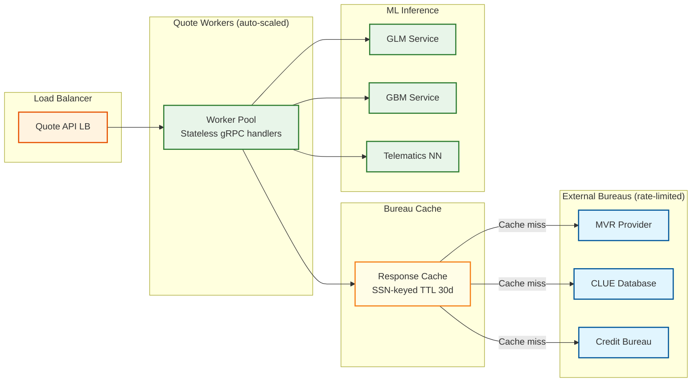
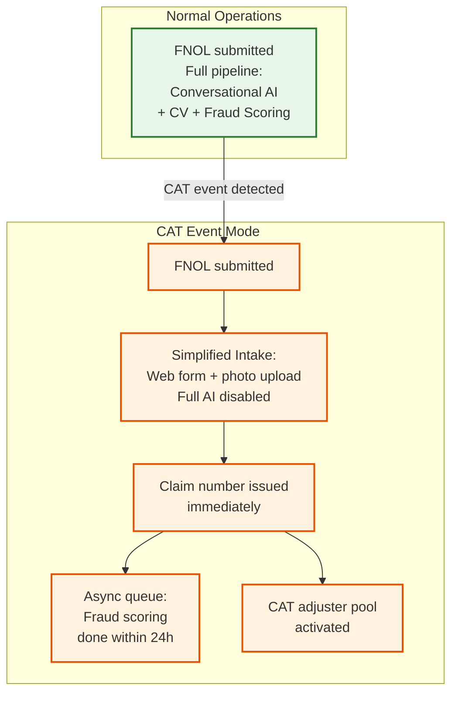

# 12.19 AI-Native Insurance Platform — Scalability & Reliability

## Scaling Dimensions

The platform has four independent scaling concerns that must each be addressed separately:

1. **Quote burst scaling** — Marketing campaigns, end-of-month deadlines, and price comparison site surges produce 10–50× baseline quote volume within minutes
2. **Telematics ingest scaling** — Commute-hour spikes produce 3× baseline event volume; CAT events produce no burst (claims dominate, not telematics)
3. **Claims CAT event scaling** — Hurricanes, wildfires, and hailstorms can produce 100× normal FNOL volume within hours of event onset
4. **Fraud graph scaling** — Steady growth of entity graph over years; query performance degrades as graph density increases

---

## Quote Burst Scaling

### Architecture

The quote service is stateless and horizontally scalable. Each quote request is handled by a worker that fans out bureau calls, awaits results, runs inference, and returns a response. The bottleneck is not compute but external bureau rate limits.



**Bureau rate limit management:** Each bureau has a contractual API rate limit (e.g., 500 requests/minute for MVR). At burst time, the quote service maintains a token bucket per bureau. When the token bucket is exhausted, new quote requests join a short-lived priority queue (tiered by customer acquisition source: direct channel > comparison aggregator). The preliminary quote pathway (application-data-only scoring) is available immediately for customers still within their quote session, providing an initial offer while bureau data is awaited.

**Auto-scaling trigger:** Managed container orchestration scales quote workers on CPU utilization and queue depth. Scale-out lead time is approximately 90 seconds. To handle instant spikes (marketing campaign launch), a warm pool of pre-initialized workers (10× normal capacity) is maintained during high-risk windows (end-of-month, advertised promotions).

---

## Telematics Ingest Scaling

### Partition Strategy

The event stream is partitioned by `driver_id`. This ensures all events for a single driver's trip land on the same partition, enabling stateful trip reconstruction within a single consumer without cross-partition coordination.

```
Partition count: 256 partitions
Average drivers per partition: 1.5M / 256 = ~5,900 drivers
Peak events per partition: 104,000 / 256 = ~406 events/sec
Events per partition at 200-byte average: 81 KB/sec — well within partition capacity
```

Consumer group horizontal scaling: trip processor workers consume from partition subsets. Adding workers redistributes partition assignments. Trip reconstruction state is held in a local in-process store (single-driver trip data rarely exceeds 50 KB) with checkpoint writes to a distributed KV store for crash recovery.

### Backpressure Handling

During commute spikes, the event stream provides natural buffering. The trip processor does not need to keep up in real-time—a behavioral score update within 30 minutes of trip completion satisfies the SLO. The consumer lag metric (events behind latest offset) is the primary scaling signal. If consumer lag exceeds 5 minutes of events, additional trip processor workers are added.

---

## Claims CAT Event Scaling

### The CAT Problem

A Category 4 hurricane making landfall produces an estimated 50,000 FNOL submissions within the first 6 hours—a 300× multiple over the 16,400 claims-per-day baseline. This is not a sustained load; it is a multi-hour burst that must be absorbed without losing any FNOL submission (lost claims create regulatory and reputational damage).

### CAT Response Architecture



**CAT mode activation:** When the geospatial claims density detector identifies > 500 FNOL submissions within a 50-mile radius in 60 minutes, CAT mode is triggered automatically. Conversational AI intake is replaced by a simplified structured web form. Fraud scoring shifts from synchronous (blocking payment) to asynchronous (scored within 24 hours). Claims are assigned to a pre-contracted CAT adjuster pool. Straight-through payment is suspended for affected region pending fraud review.

**FNOL queue durability:** All FNOL submissions write to a durable event queue before any downstream processing. This decouples intake acknowledgment (immediate) from processing capacity (scaled separately). During CAT events, the intake queue may have a multi-hour backlog; this is expected and acceptable as long as the queue does not drop messages.

---

## Model Serving Reliability

### Graceful Degradation Tiers

The underwriting engine is designed with three degradation tiers:

| Tier | Models Available | Behavior | When Triggered |
|---|---|---|---|
| **Full** | GLM + GBM + Telematics NN | Normal underwriting; full ensemble | Healthy |
| **Partial** | GLM + GBM only | Telematics score substituted with population average; slightly wider premium band | Telematics NN unavailable |
| **Minimum** | GLM only | GBM result used from last successful run if within 24h; else conservative GLM-only premium | GBM service unavailable |
| **Manual** | None | All quotes routed to manual underwriting queue; online binding suspended | All models unavailable |

GLM is a simple logistic regression that runs on CPU with sub-5ms latency and requires no GPU infrastructure—it is the reliability anchor. GBM runs on CPU clusters. Only the telematics neural net requires GPU. This tier structure means a GPU outage degrades telematics scoring but does not stop quoting.

### Multi-Region Deployment

The scoring infrastructure is deployed across two active regions with policy database replicated synchronously. Risk score records are written with a two-phase commit across regions before the quote is confirmed as bindable. The policy database uses active-passive replication with sub-5-second failover (DNS-based, pre-warmed).

Claims processing can tolerate eventual consistency for most operations (adjuster notes, document uploads) but requires strong consistency for payment initiation (no double-payments). Payment initiation uses a distributed idempotency token (claim_id + payment_attempt_number) and calls the payment processor with exactly-once semantics enforced by the idempotency key.

---

## Database Sharding Strategy

### Policy Database

Sharded by `policyholder_id` modulo shard count. This ensures all policies for a single customer are co-located (supporting customer-centric queries) and distributes write load across shards. Cross-shard queries (e.g., "all policies in state X for regulatory report") are served by the data warehouse (eventual consistency acceptable for regulatory reports with 30-day delay).

### Claims Database

Sharded by `claim_id`. Claims are accessed by ID after FNOL; no customer-centric query pattern requires cross-shard access at transaction time. Exception: customer portal "view my claims" query runs against read replicas with cross-shard scatter-gather.

### Fraud Graph

The graph database is not sharded—graph traversals require global visibility. The fraud graph is scaled vertically (large in-memory graph DB) with a read replica for GNN inference and a primary for writes. At 76 GB estimated graph size, a single well-provisioned graph DB node is sufficient. Horizontal sharding of graph databases introduces prohibitive cross-shard traversal latency for 2-hop neighbor queries.

---

## SLO-Driven Capacity Planning

| SLO | Capacity Driver | Headroom Target |
|---|---|---|
| Quote p99 ≤ 200ms (scoring) | ML inference fleet CPU/GPU | 3× peak demand |
| FNOL p99 ≤ 3s fraud score | Fraud graph in-memory hot entities | Top 100K entities pre-loaded |
| Telematics score freshness ≤ 30min | Trip processor consumer lag | ≤ 10 min at sustained peak |
| CAT FNOL queue no loss | Intake queue replication | Cross-region durable queue |
| Policy DB write durability | Synchronous multi-region replication | Commit blocked until both regions ACK |
