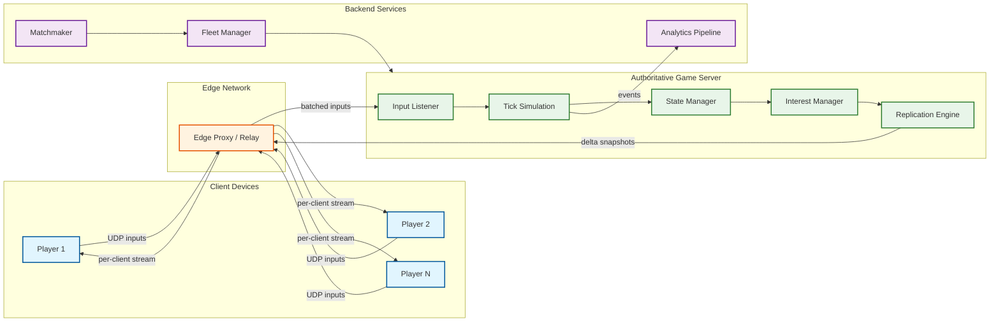

# 12.2 — Multiplayer Game State Synchronization (Fortnite / PUBG Style)

## System Overview

A **Multiplayer Game State Synchronization** system is the real-time networking backbone that keeps hundreds of players in a shared, consistent game world — despite each operating on imperfect networks with variable latency, jitter, and packet loss. Think Fortnite's 100-player Battle Royale or PUBG's large-map combat: every bullet, every movement, every destruction event must appear correct on every client within the bounds of human perception (~150 ms).

The system runs an **authoritative server** that simulates the canonical game world at a fixed tick rate (20–128 Hz), collects player inputs, resolves physics and combat, and broadcasts compressed state deltas to all relevant clients. Clients, meanwhile, employ **prediction**, **interpolation**, and **reconciliation** to mask latency and present a smooth, responsive experience — even when the true server state is tens of milliseconds away.

This design is fundamentally **write-heavy** (every player generates input every frame), **latency-critical** (perceived responsiveness must stay under 150 ms), and **bandwidth-constrained** (100 players × 60 ticks/s × state payload must fit within each player's connection).

---

## Key Characteristics

| Characteristic | Description |
|---|---|
| **Write-Heavy** | Every connected player generates 20–128 input packets per second; the server must ingest, simulate, and broadcast results within the same tick budget |
| **Latency-Critical** | Player-perceived latency must stay below 150 ms for competitive play; server processing must complete within a single tick window (8–50 ms) |
| **Real-Time Streaming** | Continuous bidirectional UDP streams between server and every client — not request/response |
| **Bandwidth-Constrained** | Per-player downstream bandwidth typically capped at 30–80 Kbps; requires aggressive delta compression and interest management |
| **Determinism-Sensitive** | Simulation consistency across server ticks is critical; floating-point drift and race conditions cause "desync" |
| **Stateful Sessions** | Each match is a long-lived stateful session (15–30 minutes) with no tolerance for mid-match server restarts |
| **Spatially Partitioned** | Interest management limits replication scope to relevant entities — players only receive updates for nearby game objects |

---

## Quick Links

| # | Document | Focus |
|---|----------|-------|
| 01 | [Requirements & Estimations](./01-requirements-and-estimations.md) | Functional/non-functional requirements, capacity math, SLOs |
| 02 | [High-Level Design](./02-high-level-design.md) | Architecture diagrams, tick cycle data flow, key protocol decisions |
| 03 | [Low-Level Design](./03-low-level-design.md) | Data models, packet formats, core algorithms (prediction, interpolation, delta compression) |
| 04 | [Deep Dive & Bottlenecks](./04-deep-dive-and-bottlenecks.md) | Server tick loop internals, lag compensation rewind, bandwidth analysis |
| 05 | [Scalability & Reliability](./05-scalability-and-reliability.md) | Fleet management, edge deployment, dynamic tick adjustment, session migration |
| 06 | [Security & Compliance](./06-security-and-compliance.md) | Anti-cheat architecture, input validation, replay integrity |
| 07 | [Observability](./07-observability.md) | Tick budgets, latency histograms, desync detection, player experience dashboards |
| 08 | [Interview Guide](./08-interview-guide.md) | 45-minute pacing, trap questions, trade-off discussions |
| 09 | [Insights](./09-insights.md) | Extracted architectural insights with categories and rationale |

---

## Complexity Rating

| Dimension | Rating | Notes |
|-----------|--------|-------|
| **Domain Complexity** | ★★★★★ | Requires deep understanding of physics simulation, network protocols, and human perception |
| **Scale Challenge** | ★★★★☆ | Thousands of concurrent matches, but each match is an independent shard (~100 players) |
| **Latency Sensitivity** | ★★★★★ | Sub-50 ms tick budgets; perceived latency directly impacts competitive fairness |
| **Data Model Complexity** | ★★★★☆ | Entity-component architecture with spatial indexing, delta-encoded state snapshots |
| **Operational Complexity** | ★★★★☆ | Global edge deployment, fleet auto-scaling, zero-downtime match allocation |
| **Interview Frequency** | ★★★☆☆ | Popular at gaming companies; occasionally appears at general tech companies for real-time systems rounds |

---

## Core Terminology

| Term | Definition |
|------|-----------|
| **Tick** | A single discrete simulation step on the server; at 60 Hz, one tick = 16.67 ms |
| **Authoritative Server** | The server holds the canonical game state; clients are untrusted |
| **Client-Side Prediction** | Client simulates its own movement locally to mask round-trip latency |
| **Server Reconciliation** | Client replays unacknowledged inputs on top of server-confirmed state to correct mispredictions |
| **Interpolation** | Client renders remote entities at a position smoothly blended between two known server snapshots |
| **Extrapolation / Dead Reckoning** | Client estimates future position of remote entities beyond the latest snapshot |
| **Lag Compensation** | Server rewinds world state to the shooter's perceived time when processing hit detection |
| **Delta Compression** | Encoding only the difference between the current snapshot and the last acknowledged baseline |
| **Interest Management** | Filtering which entities are replicated to each client based on spatial relevance |
| **Snapshot** | A serialized capture of the full or partial game world state at a specific tick |
| **Desync** | Divergence between client and server state that results in visible corrections ("rubber-banding") |
| **Jitter Buffer** | Client-side buffer that absorbs network timing variance to smooth playback |

---

## Architecture at a Glance

---

## What Makes This System Unique

1. **Physics-Rate Networking**: Unlike web-scale systems that optimize for throughput, game state sync optimizes for *latency at physics-simulation frequency* — every 8–50 ms matters.

2. **Lie-to-the-Player Architecture**: The system intentionally shows each player a slightly *different* version of reality (their predicted local state) and corrects silently — a fundamentally different consistency model from traditional distributed systems.

3. **Bandwidth as the Binding Constraint**: The system must fit an entire world's worth of changes into ~30–80 Kbps per player. This forces aggressive compression, prioritization, and spatial filtering — architectural concerns that dominate the design.

4. **Session-Scoped Consistency**: Unlike databases that aim for eternal consistency, game state needs to be consistent only for the duration of a match (15–30 min). This enables aggressive in-memory approaches that would be unacceptable for persistent data.

5. **Human Perception as SLA**: The true service level is defined by what the human eye and brain can detect — corrections below ~100 ms are invisible, allowing the system to trade strict consistency for perceived smoothness.
