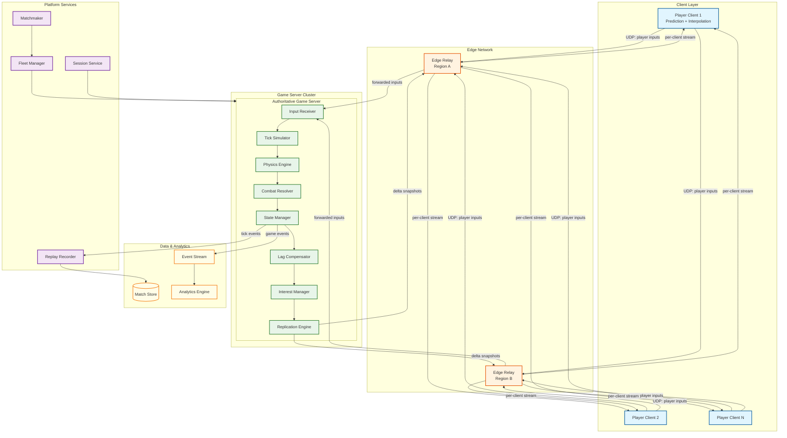
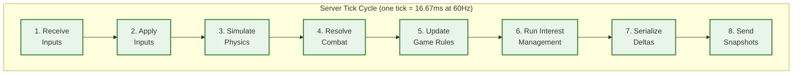
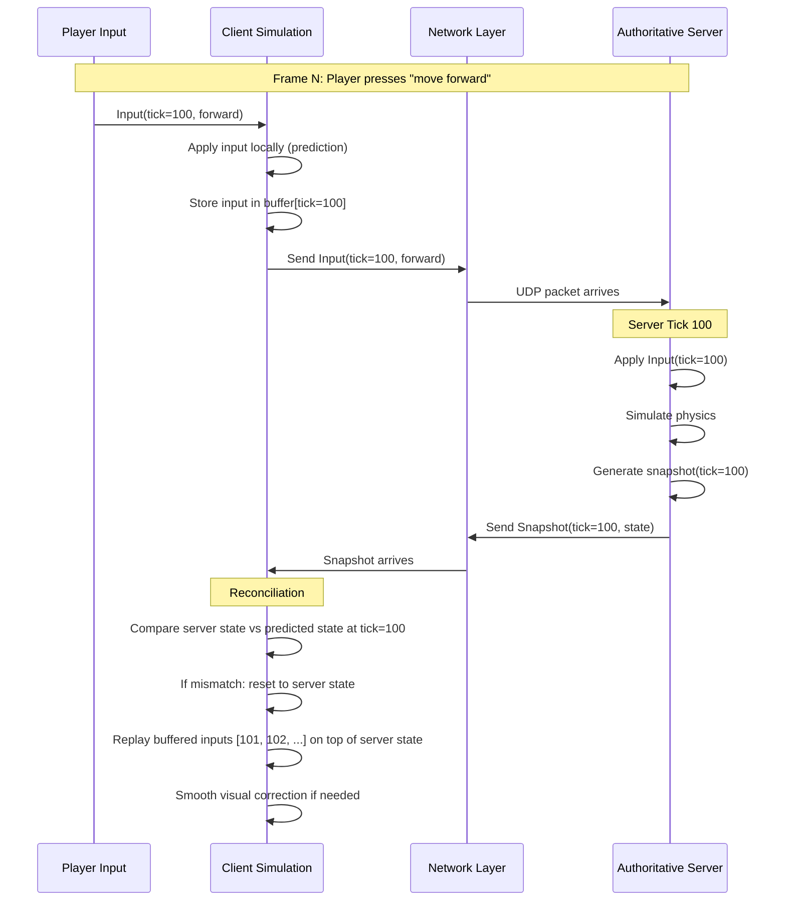
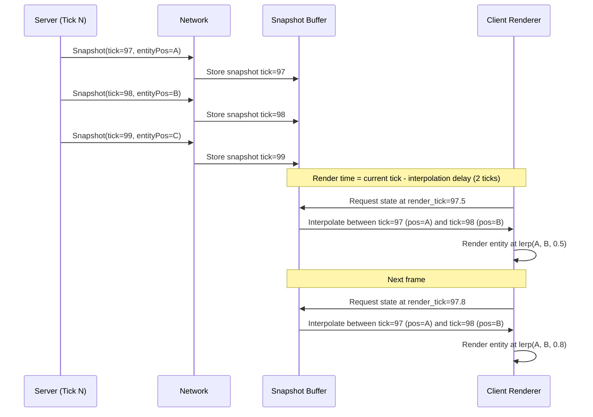
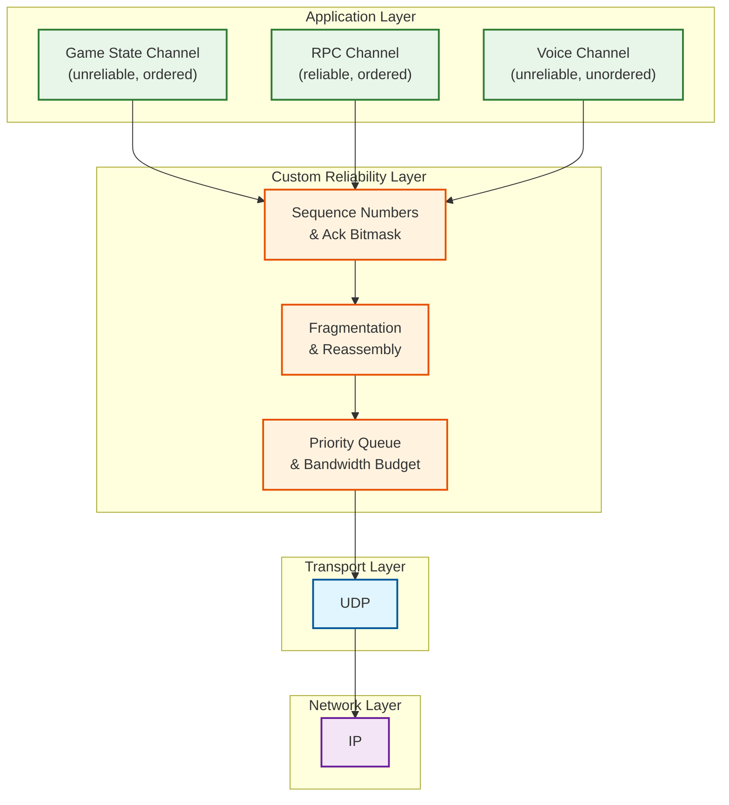
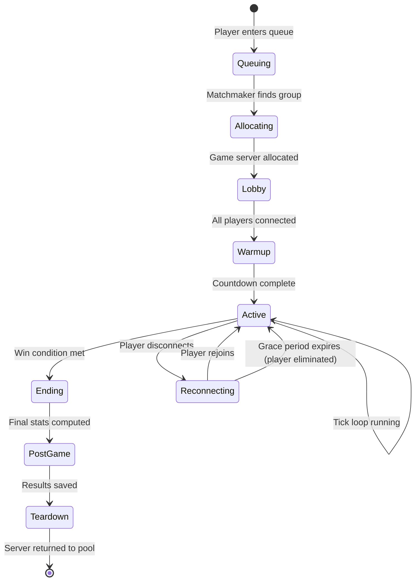
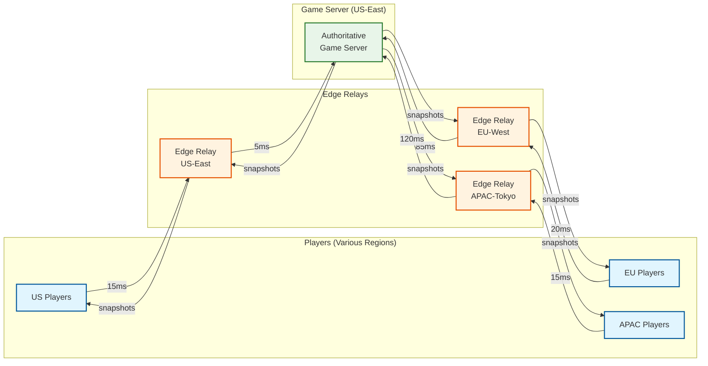

# High-Level Design

## 1. Architecture Overview

The system follows a **server-authoritative, client-predicted** model — the gold standard for competitive multiplayer games. A single dedicated game server holds the canonical world state for each match, processes all player inputs, runs physics, resolves combat, and broadcasts compressed state deltas to connected clients. Clients locally predict their own actions and interpolate remote entities to mask network latency.

### 1.1 Full System Architecture



### 1.2 Component Responsibilities

| Component | Responsibility |
|-----------|---------------|
| **Player Client** | Captures input, runs local prediction, renders interpolated state, sends inputs to server |
| **Edge Relay** | Regional UDP relay that reduces RTT, batches inputs, and fans out snapshots |
| **Input Receiver** | Deserializes and validates incoming player input packets, queues for tick processing |
| **Tick Simulator** | Orchestrates the fixed-timestep game loop: input → physics → combat → state |
| **Physics Engine** | Resolves movement, collision detection, projectile trajectories |
| **Combat Resolver** | Processes hit detection (with lag compensation), damage application, elimination events |
| **State Manager** | Maintains canonical game state, entity registry, component storage |
| **Lag Compensator** | Stores tick history; rewinds world state for hit validation at shooter's perceived time |
| **Interest Manager** | Determines which entities each player needs to receive based on spatial relevance and priority |
| **Replication Engine** | Serializes delta-compressed state, packages per-client snapshots, manages reliable delivery for critical events |
| **Matchmaker** | Groups players by region/skill/latency, requests game server allocation |
| **Fleet Manager** | Provisions and monitors game server instances, auto-scales fleet based on demand |
| **Session Service** | Manages match lifecycle (create, join, reconnect, end), player presence |
| **Replay Recorder** | Captures input stream + periodic snapshots for replay reconstruction |

---

## 2. Server Tick Cycle — Data Flow

The core of the system is the **server tick loop** — a fixed-timestep cycle that processes the entire game world in a deterministic order.

### 2.1 Tick Cycle Diagram



### 2.2 Step-by-Step Flow

| Step | Action | Details |
|------|--------|---------|
| **1. Receive Inputs** | Dequeue all player inputs that arrived since last tick | Inputs are tagged with client tick number; late inputs are handled via lag compensation |
| **2. Apply Inputs** | Apply each player's input to their character state | Movement vectors, look direction, action triggers (fire, use item, build) |
| **3. Simulate Physics** | Run physics step for all dynamic entities | Collision detection, projectile advancement, vehicle physics, destruction |
| **4. Resolve Combat** | Process hit-scan and projectile hits | Rewind world state to shooter's time for hit validation; apply damage |
| **5. Update Game Rules** | Check win conditions, zone shrink, loot spawns | Game-mode-specific logic that modifies world state |
| **6. Run Interest Management** | Compute per-player relevance sets | Spatial partitioning query to determine which entities each player sees |
| **7. Serialize Deltas** | For each player, delta-encode their relevant entity states | Compare current state vs. last acknowledged baseline per player |
| **8. Send Snapshots** | Transmit per-client snapshot packets via UDP | Priority-sorted: most important entities get bandwidth first |

---

## 3. Client-Side Architecture

### 3.1 Client Prediction and Reconciliation Flow



### 3.2 Remote Entity Interpolation



---

## 4. Key Architectural Decisions

### 4.1 Authoritative Server vs. Peer-to-Peer

| Factor | Authoritative Server | Peer-to-Peer |
|--------|---------------------|--------------|
| **Anti-cheat** | Server validates all state — strong cheat prevention | Each peer trusts others — vulnerable to hacking |
| **Consistency** | Single source of truth — no split-brain | Consensus required — complex with >2 players |
| **Latency** | Client → Server → Client RTT | Direct peer-to-peer can be lower for 2 players |
| **Scalability** | Server handles N players; cost scales linearly | N² connections required; impractical for 100 players |
| **Hosting Cost** | Requires dedicated server fleet | No server cost (players host) |

**Decision**: **Authoritative server** — mandatory for competitive 100-player games. Cheat prevention, consistency, and scalability all require a trusted central authority. P2P is only viable for small cooperative sessions.

### 4.2 UDP vs. TCP

| Factor | UDP | TCP |
|--------|-----|-----|
| **Latency** | No head-of-line blocking; stale data is skipped | Retransmissions cause delays for all subsequent data |
| **Packet Loss Handling** | Application-level: skip lost state packets, resend only critical events | Kernel-level: automatic retransmission of all lost packets |
| **Bandwidth Control** | Application controls exactly what to send and when | TCP congestion control may throttle below game needs |
| **Ordering** | Application manages ordering per-channel | Strict FIFO ordering — unnecessary for state updates |
| **Reliability** | Selective reliability: state updates are unreliable, RPCs are reliable | All-or-nothing reliability |

**Decision**: **UDP with custom reliability layer** — game state updates are unreliable (latest snapshot supersedes lost ones), while critical events (eliminations, match state changes) use an application-level reliable channel built on top of UDP.

### 4.3 State Synchronization vs. Deterministic Lockstep

| Factor | State Synchronization | Deterministic Lockstep |
|--------|----------------------|----------------------|
| **Bandwidth** | Higher (sending state) | Lower (sending only inputs) |
| **Player Count** | Scales to 100+ players | Practical limit ~8–16 players |
| **Determinism Requirement** | None — server is authoritative | Strict bitwise determinism required |
| **Late Joins / Reconnects** | Easy — send full snapshot | Complex — must replay all inputs from start |
| **Physics Engine Flexibility** | Any physics engine works | Must guarantee identical floating-point results |
| **Cheat Prevention** | Server validates all state | Must trust client simulation or add verification |

**Decision**: **State synchronization** — required for 100-player Battle Royale. Deterministic lockstep is suitable for RTS games with few players but cannot scale to large player counts or handle the non-deterministic physics required by shooter games.

### 4.4 Tick Rate Strategy

| Game Phase | Tick Rate | Rationale |
|------------|----------|-----------|
| **Pre-game Lobby** | 10 Hz | Minimal simulation; save resources |
| **Early Game (100 players)** | 20–30 Hz | High entity count; CPU-bound; acceptable because players are spread out |
| **Mid Game (50 players)** | 30–40 Hz | Reduced entity count allows higher tick rate |
| **Late Game (< 20 players)** | 60 Hz | Critical combat moments deserve maximum responsiveness |
| **Competitive / Arena** | 60–128 Hz | Smaller lobbies, esports-grade precision |

**Decision**: **Dynamic tick rate** that increases as player count decreases within a match. This balances server cost (early game) against competitive quality (late game).

---

## 5. Network Protocol Stack



### Channel Design

| Channel | Reliability | Ordering | Use Case |
|---------|------------|----------|----------|
| **Game State** | Unreliable | Sequenced (drop stale) | Position, rotation, velocity, animation state |
| **RPC / Events** | Reliable | Ordered | Eliminations, score updates, zone changes, item pickups |
| **Input** | Unreliable + Redundant | Sequenced | Player inputs (send last 3 to tolerate loss) |
| **Voice** | Unreliable | Unordered | Proximity-based voice chat |

---

## 6. Match Lifecycle



### Lifecycle Phases

| Phase | Duration | Server Activity |
|-------|----------|----------------|
| **Queuing** | 5–60s | Matchmaker groups players by region + skill |
| **Allocating** | 2–5s | Fleet manager provisions server, loads map |
| **Lobby** | 10–30s | Players connect, load assets, confirm ready |
| **Warmup** | 10–15s | Spawn players, countdown timer, restricted inputs |
| **Active** | 15–30 min | Full tick loop: input → simulate → replicate |
| **Ending** | 5s | Final state freeze, victory determination |
| **PostGame** | 10s | Stats aggregation, replay finalization, XP awards |
| **Teardown** | 2s | Flush logs, release resources, return server to pool |

---

## 7. Edge Relay Architecture

To minimize latency for a global player base, UDP traffic is routed through **edge relays** deployed in 15+ regions.



### Edge Relay Responsibilities

| Function | Description |
|----------|-------------|
| **Input Batching** | Collect multiple input packets from nearby players, forward in single batch to reduce server-side syscalls |
| **Snapshot Fan-Out** | Receive one copy of snapshot data from game server, duplicate and send to each local player |
| **Jitter Smoothing** | Buffer incoming packets to smooth out network jitter before forwarding |
| **RTT Measurement** | Continuously measure RTT between relay and game server for latency reporting |
| **DDoS Mitigation** | Shield game server IP from direct player connections; absorb volumetric attacks at edge |

---

## 8. Data Flow Summary

```
CLIENT → SERVER (per tick):
┌─────────────────────────────────────────┐
│ Input Packet                            │
│  ├── client_tick: u32                   │
│  ├── server_ack_tick: u32               │
│  ├── inputs[]: last 3 ticks of input    │
│  │    ├── movement_vector: vec2         │
│  │    ├── look_direction: vec2          │
│  │    ├── action_bitmask: u16           │
│  │    └── tick_number: u32              │
│  └── timestamp: u64                     │
└─────────────────────────────────────────┘

SERVER → CLIENT (per tick):
┌─────────────────────────────────────────┐
│ Snapshot Packet                         │
│  ├── server_tick: u32                   │
│  ├── client_ack_tick: u32               │
│  ├── baseline_tick: u32 (for delta)     │
│  ├── entity_updates[]:                  │
│  │    ├── entity_id: u16               │
│  │    ├── component_mask: u32           │
│  │    └── delta_data: bytes             │
│  └── reliable_events[]:                 │
│       ├── event_type: u8               │
│       └── event_data: bytes             │
└─────────────────────────────────────────┘
```
