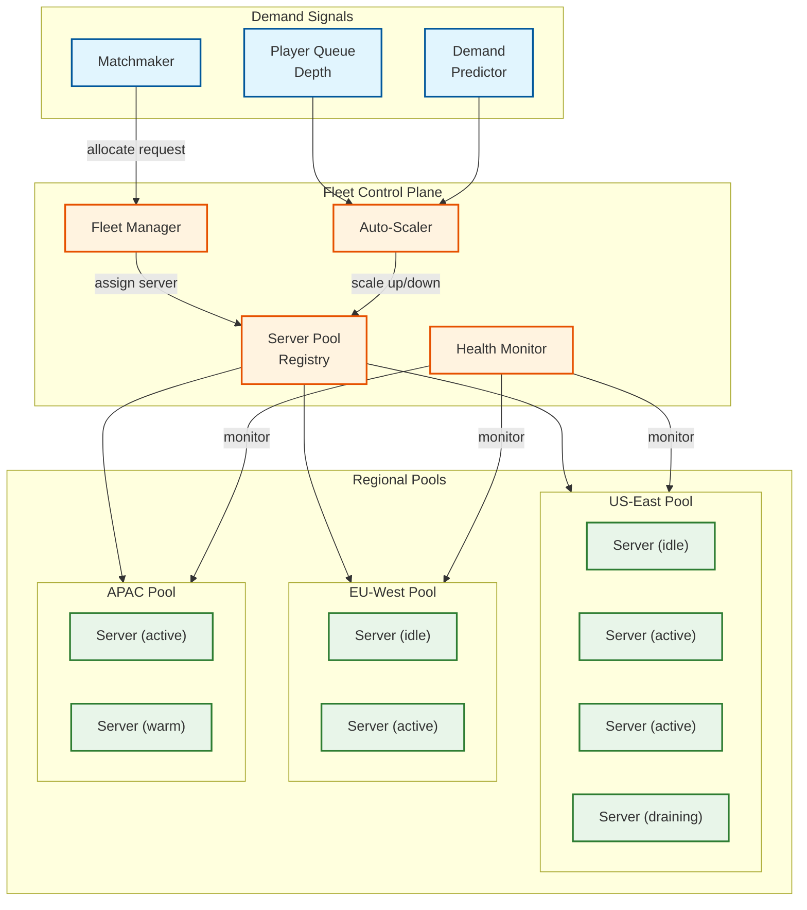

# Scalability & Reliability

## 1. Server Fleet Management

### 1.1 Fleet Architecture

The game server fleet is a **pool of pre-provisioned instances** that are dynamically allocated to matches and recycled. Unlike web services that share servers across requests, each game server instance runs **exactly one match** at a time.



### 1.2 Server Lifecycle States

```
State Machine for Game Server Instance:

  COLD → WARM → IDLE → ALLOCATED → ACTIVE → DRAINING → IDLE
                  ↑                                      │
                  └──────────────────────────────────────┘

States:
  COLD:      Instance not yet started. OS and runtime booting.
  WARM:      Instance running, game binary loaded, map assets pre-cached.
             Ready to receive allocation within 1-2 seconds.
  IDLE:      Warm and available in pool. Waiting for matchmaker request.
  ALLOCATED: Assigned to a match. Loading specific map, configuring game mode.
  ACTIVE:    Match in progress. Tick loop running. Not interruptible.
  DRAINING:  Match complete. Flushing replays, metrics, logs.
             Will return to IDLE within 5-10 seconds.
```

### 1.3 Match Allocation Flow

```
ALLOCATION SEQUENCE:

1. Matchmaker groups 100 players → sends allocation request:
   { region: "us-east", mode: "battle_royale", map: "island_v3",
     player_count: 100, min_tick_rate: 20 }

2. Fleet Manager queries pool for region "us-east":
   - Check IDLE servers with matching map pre-cached
   - If found: assign immediately (< 100ms)
   - If not: check WARM servers, load map (~2s)
   - If none available: request SCALE UP from auto-scaler

3. Fleet Manager reserves server, returns endpoint:
   { server_id: "gs-us-east-4201", ip: "10.0.1.42", port: 7777 }

4. Matchmaker distributes endpoint to all 100 players' clients.

5. Players connect via edge relay → game server.

6. Server transitions: IDLE → ALLOCATED → ACTIVE when all players ready.
```

### 1.4 Fleet Sizing Strategy

```
Sizing Model:

  Demand parameters:
    Peak concurrent players: 10M
    Players per match: 100
    Peak concurrent matches: 100,000
    Match duration: 25 min average
    Turnaround time (drain + reset): 2 min

  Instance utilization:
    Active time per hour: 25 min × (60 / 27) ≈ 2.2 matches/hour
    Active minutes per hour: 2.2 × 25 = 55 min
    Utilization: 55 / 60 = 91.7% during peak

  Fleet sizing:
    Active instances needed: 100,000
    Buffer for allocation headroom (15%): 15,000
    Buffer for health failures (5%): 5,000
    Total fleet at peak: 120,000 instances

  Off-peak (30% of peak):
    30,000 active + 8,000 buffer = 38,000 instances
    Scale-down savings: 68%

  Instance specifications:
    4 vCPUs (tick simulation is single-threaded; extra cores for I/O and serialization)
    8 GB RAM
    50 Mbps network (guaranteed)
    No persistent disk required (ephemeral)
```

---

## 2. Auto-Scaling

### 2.1 Scaling Signals

| Signal | Weight | Source | Rationale |
|--------|--------|--------|-----------|
| **Queue depth** | 40% | Matchmaker | Direct measure of unmet demand — players waiting for servers |
| **Idle pool size** | 25% | Fleet Manager | Below threshold means allocation latency will spike |
| **Time-of-day prediction** | 20% | Historical model | Pre-scale for known daily patterns (evening peak, weekend surge) |
| **Active match count trend** | 15% | Fleet Manager | Rate of change predicts near-term need |

### 2.2 Scaling Thresholds

```
SCALE_UP triggers (any one):
  - idle_pool_ratio < 10% of active fleet
  - queue_wait_time > 15 seconds (P95)
  - predicted_demand_15min > current_capacity × 0.85

SCALE_DOWN triggers (all required):
  - idle_pool_ratio > 30% of active fleet
  - no SCALE_UP trigger in last 15 minutes
  - not within 2 hours of predicted peak
  - rate: max 10% of fleet per 15-minute window (gentle ramp-down)

SCALING SPEED:
  Scale-up: Warm instances available within 60 seconds (container start)
  Cold start with map loading: 3-5 minutes
  Strategy: Maintain "warm pool" of pre-started instances across regions
```

### 2.3 Predictive Scaling

```
ALGORITHM: PredictiveDemandScaling

Uses 3-layer demand prediction:

Layer 1 — Historical Weekly Pattern:
  Aggregate match count by (day_of_week, hour, region)
  Apply 4-week rolling average
  Provides baseline prediction

Layer 2 — Event Calendar:
  New season launch: +40% demand spike
  In-game event: +20% demand
  Holiday periods: +30% sustained
  Pre-scale 30 minutes before known events

Layer 3 — Real-Time Adjustment:
  Compare actual queue depth vs. predicted
  If actual > predicted × 1.1: immediately scale up delta
  If actual < predicted × 0.8: defer scale-down (may be temporary dip)
```

---

## 3. Dynamic Tick Rate Adjustment

### 3.1 Within-Match Tick Rate Scaling

The tick rate is not fixed — it adapts based on player count and server load within a single match.

```
ALGORITHM: DynamicTickRate

PARAMETERS:
  min_tick_rate: 20 Hz
  max_tick_rate: 60 Hz
  tick_budget_threshold: 0.80  // 80% of tick window used → consider reducing

ON_MATCH_STATE_CHANGE(alive_players, tick_duration_avg):
  // Player-count-based target
  IF alive_players > 80:
    target_rate = 20  // Early game: many entities, spread out
  ELSE IF alive_players > 50:
    target_rate = 30
  ELSE IF alive_players > 20:
    target_rate = 40
  ELSE:
    target_rate = 60  // Late game: fewer entities, intense combat

  // CPU-budget-based override
  current_utilization = tick_duration_avg / (1.0 / current_tick_rate)
  IF current_utilization > tick_budget_threshold:
    target_rate = min(target_rate, current_tick_rate - 10)
    target_rate = max(target_rate, min_tick_rate)

  // Smooth transition (avoid jarring changes)
  IF target_rate != current_tick_rate:
    transition_over_ticks = 30  // Gradual shift over ~1 second
    schedule_tick_rate_transition(target_rate, transition_over_ticks)

  // Notify clients of new tick rate
  broadcast_reliable(TICK_RATE_CHANGE, target_rate)
```

### 3.2 Client Adaptation to Tick Rate Changes

```
ON_TICK_RATE_CHANGE(new_rate):
  // Adjust interpolation buffer
  interpolation_delay = 2.0 / new_rate  // 2 ticks at new rate

  // Adjust input send rate to match server
  input_send_interval = 1.0 / new_rate

  // Adjust jitter buffer size
  jitter_buffer_ticks = max(3, ceil(network_jitter / (1.0 / new_rate)))

  // Adjust prediction parameters
  max_prediction_ticks = ceil(rtt / (1.0 / new_rate))
```

---

## 4. Seamless Server Migration

For long-running sessions (creative modes, custom matches lasting hours), the system supports live server migration without disconnecting players.

### 4.1 Migration Triggers

| Trigger | Scenario |
|---------|----------|
| **Hardware maintenance** | Host machine scheduled for patching |
| **Resource contention** | Noisy neighbor on shared hardware |
| **Region rebalancing** | Redistribute matches for better latency |
| **Server degradation** | Increasing tick overruns on current instance |

### 4.2 Migration Protocol

```
PHASE 1 — Preparation (background, ~5 seconds):
  1. Fleet Manager allocates target server in same region
  2. Target server loads same map and game mode
  3. Source server begins streaming tick history to target
  4. Target server builds world state from streamed history

PHASE 2 — Synchronization (transparent, ~2 seconds):
  1. Source server enters "dual-write" mode:
     - Processes ticks normally
     - Forwards all inputs and state to target server
  2. Target server replays forwarded inputs to converge state
  3. Source reports sync gap (ticks behind target)
  4. When gap < 3 ticks: ready to cut over

PHASE 3 — Cutover (brief pause, ~100-500ms):
  1. Source server stops accepting new inputs
  2. Source flushes remaining tick queue to target
  3. Target confirms state convergence
  4. Edge relays atomically redirect traffic to target server
  5. Target resumes tick loop
  6. Source enters DRAINING state

PHASE 4 — Verification:
  1. Target sends state checksum to all clients
  2. Clients compare and report any discrepancy
  3. If checksum mismatch: force full resync for affected clients

Player experience:
  Brief hitch of 100-500 ms during cutover.
  No disconnection, no loss of progress.
```

---

## 5. Edge Server Deployment for Latency Optimization

### 5.1 Edge Network Topology

```
Deployment regions (15+ globally):
  North America: US-East, US-West, US-Central, Canada
  Europe: EU-West, EU-Central, EU-North, UK
  Asia-Pacific: Japan, Korea, Singapore, Australia, India
  South America: Brazil
  Middle East: UAE

Each region has:
  - Edge relay cluster (lightweight, high-bandwidth)
  - Game server pool (compute-heavy)
  - Regional matchmaker instance

Player → Edge relay: < 20 ms (geographic proximity)
Edge relay → Game server: < 10 ms (same region, private backbone)
Total added latency from relay: < 5 ms (relay processing)
```

### 5.2 Edge Relay Scaling

```
Edge relay characteristics:
  - Stateless packet forwarding (no game logic)
  - CPU: minimal (packet rewriting + fan-out)
  - Network: high throughput (handles fan-out for many matches)
  - One relay can serve 5,000–10,000 concurrent players

Scaling:
  Peak 10M players ÷ 10,000 per relay = 1,000 relays globally
  Distributed across 15 regions ≈ 50-100 relays per region
  Auto-scale based on connection count and bandwidth utilization
```

### 5.3 Multi-Region Match Handling

```
Scenario: 100 players from 3 regions in one match

  Region distribution:
    US-East: 60 players → Edge Relay A
    EU-West: 30 players → Edge Relay B
    APAC:    10 players → Edge Relay C

  Game server location: US-East (majority region)

  Latency profile:
    US-East players: 15ms client→relay + 5ms relay→server = 40ms RTT
    EU-West players: 20ms client→relay + 85ms relay→server = 210ms RTT
    APAC players:    15ms client→relay + 120ms relay→server = 270ms RTT

  Bandwidth optimization:
    Server sends 1 aggregated snapshot to each edge relay
    Edge relay A fans out to 60 clients (saves 59 server packets)
    Edge relay B fans out to 30 clients (saves 29 server packets)
    Edge relay C fans out to 10 clients (saves 9 server packets)
    Total server packets: 3 instead of 100 = 97% reduction
```

---

## 6. Reliability Patterns

### 6.1 Match Continuity Under Failures

| Failure | MTTR Target | Strategy |
|---------|-------------|----------|
| **Single player disconnect** | 0s (others unaffected) | Grace period for reconnection; AI bot substitution optional |
| **Edge relay crash** | < 5s | DNS health check fails → traffic rerouted to backup relay |
| **Game server crash** | Unrecoverable | Match terminated; players compensated; fleet manager replaces instance |
| **Fleet manager outage** | < 30s | Standby fleet manager promoted; existing matches unaffected |
| **Matchmaker outage** | < 60s | New matches queue; existing matches continue; matchmaker restarts |
| **Full region outage** | < 5 min | Players rerouted to next-closest region; higher latency accepted |

### 6.2 Reconnection Protocol

```
ALGORITHM: PlayerReconnection

GRACE_PERIOD: 60 seconds
FULL_SYNC_BUDGET: 500 ms (30 ticks at 60 Hz)

ON_PLAYER_DISCONNECT(player_id):
  mark_disconnected(player_id, timestamp: now())
  // Keep player entity alive but input-less
  // Character stands still (no AI takeover in BR mode)
  start_timer(GRACE_PERIOD, on_grace_expired(player_id))

ON_RECONNECT_REQUEST(player_id, session_token):
  IF grace_period_expired(player_id):
    REJECT("Session expired")
    RETURN

  IF NOT validate_session(session_token):
    REJECT("Invalid session")
    RETURN

  // Phase 1: Send full world state
  full_snapshot = serialize_full_state(interest_set(player_id))
  send_reliable(player_id, full_snapshot)

  // Phase 2: Client acknowledges full state
  WAIT_FOR ack FROM player_id (timeout: 5s)

  // Phase 3: Resume delta streaming
  set_baseline(player_id, current_tick)
  mark_connected(player_id)
  resume_input_processing(player_id)
  cancel_grace_timer(player_id)
```

### 6.3 Graceful Degradation Under Load

```
Degradation levels (progressive):

Level 0 — NOMINAL:
  Full tick rate, full interest sets, full compression.

Level 1 — ELEVATED LOAD (tick budget > 70%):
  - Reduce interest management radius by 20%
  - Skip low-priority entity updates for 1 in 3 ticks
  - Reduce hitbox history depth from 256 to 128 ticks

Level 2 — HIGH LOAD (tick budget > 85%):
  - Reduce tick rate by one step (60 → 40 Hz, 40 → 30 Hz)
  - Disable extrapolation detail for distant entities
  - Aggregate nearby static entities into single update

Level 3 — CRITICAL (tick budget > 95%):
  - Drop to minimum tick rate (20 Hz)
  - Interest management radius halved
  - Only replicate player entities (skip projectiles, effects)
  - Alert fleet manager: request immediate load redistribution

Level 4 — EMERGENCY:
  - If sustained > 30 seconds: initiate server migration
  - If migration unavailable: log detailed diagnostics, continue best-effort
```

---

## 7. Data Durability and Replay Storage

### 7.1 Replay Recording Architecture

```
Recording happens off the critical tick path:

  During tick loop:
    - Append input events to lock-free ring buffer
    - Every 60 ticks (1 second): snapshot state to ring buffer

  Background writer thread:
    - Drains ring buffer → writes to local disk (sequential I/O)
    - On match end: compress and upload to object storage
    - Retention: 7 days hot (regional), 90 days cold (central)

  Replay file format:
    Header: { match_id, map, mode, tick_rate, player_manifest }
    Chunks[]: { tick_range, inputs[], state_snapshot? }
    Footer: { final_standings, match_stats, checksum }

  Size per match: ~100-200 MB compressed
```

### 7.2 Replay Playback

```
Playback reconstructs match from recorded data:

  1. Load header and player manifest
  2. Initialize simulation with initial state
  3. For each chunk:
     a. Apply recorded inputs to simulation
     b. Advance tick loop (deterministic replay)
     c. Periodically verify against recorded snapshots (checksums)
  4. Client renders from replayed state with free camera

  Supports:
    - Variable speed playback (0.25x to 8x)
    - Rewind (re-simulate from nearest snapshot)
    - Per-player POV switching
    - Kill cam generation (extract 5-second clips around elimination events)
```

---

## 8. Capacity Planning for Growth

### 8.1 Scaling Axes

| Axis | Current | 2× Scale | Approach |
|------|---------|-----------|----------|
| **Concurrent players** | 10M | 20M | Double fleet instances; horizontal |
| **Players per match** | 100 | 200 | Requires tick rate reduction or spatial sharding (split map across 2 servers) |
| **Tick rate** | 60 Hz | 128 Hz | Requires faster CPUs or reduced player count per match |
| **Map size** | 8 km² | 16 km² | Interest management handles this; minimal server cost increase |
| **Replay storage** | 500 TB/day | 1 PB/day | Object storage tier scaling; lifecycle policies |

### 8.2 Spatial Sharding for Mega-Scale

```
For 200+ player matches or massive open worlds:

  Approach: Split game world across multiple server processes

  Method:
    - Divide map into overlapping zones
    - Each zone managed by a dedicated server process
    - Boundary entities replicated between adjacent zone servers
    - Players seamlessly handed off as they cross zone boundaries

  Challenges:
    - Cross-zone hit detection (projectile crosses boundary)
    - Synchronization between zone servers (entity handoff latency)
    - Load balancing when players cluster in one zone

  This is reserved for MMO-scale systems and is NOT needed for
  standard 100-player Battle Royale matches.
```
