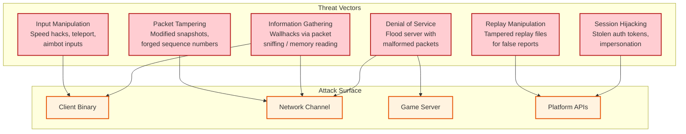

# Security & Compliance

## 1. Threat Model

### 1.1 Attack Surface Map



### 1.2 Threat Categories

| Category | Severity | Frequency | Examples |
|----------|----------|-----------|----------|
| **Aim Assistance** | Critical | Very High | Aimbot, auto-fire, recoil compensation |
| **Movement Cheats** | Critical | High | Speed hacks, teleportation, fly hacks, no-clip |
| **Information Cheats** | High | Very High | Wallhacks (ESP), radar hacks, loot ESP |
| **Exploitation** | High | Medium | Duplication glitches, damage exploits, invulnerability |
| **Network Abuse** | Medium | Medium | Lag switching, packet injection, DDoS |
| **Account Abuse** | Medium | High | Botting, boosting, account selling |

---

## 2. Server Authority — The Foundation of Anti-Cheat

### 2.1 Design Principle

The authoritative server model is the **primary anti-cheat mechanism**. The server never trusts client state — it only accepts player inputs and validates them independently.

```
TRUST MODEL:

  Client sends:     Inputs only (movement vector, aim direction, actions)
  Client does NOT send: Position, health, damage, inventory, score

  Server computes:  Position (from movement input + physics)
                    Health (from damage events it resolves)
                    Inventory (from pickup/drop events it validates)
                    Score (from elimination events it confirms)

  Client receives:  Authoritative state snapshots
                    Client's own predicted state is ADVISORY only
```

### 2.2 Input Validation Pipeline

```
ALGORITHM: InputValidation

ON_INPUT_RECEIVED(client_id, input_packet):
  // Layer 1: Protocol validation
  IF NOT valid_packet_header(input_packet):
    drop_and_flag(client_id, "malformed_packet")
    RETURN

  IF input_packet.sequence <= last_sequence[client_id]:
    drop(input_packet)  // Duplicate or replay
    RETURN

  // Layer 2: Rate limiting
  IF input_rate[client_id] > MAX_INPUTS_PER_SECOND * 1.5:
    throttle(client_id)
    flag_suspicious(client_id, "input_flood")
    RETURN

  // Layer 3: Physical plausibility
  input = deserialize(input_packet)

  // Movement validation
  IF magnitude(input.movement_vector) > 1.0 + EPSILON:
    clamp(input.movement_vector, 1.0)
    flag_suspicious(client_id, "movement_magnitude_exceeded")

  // Look direction validation
  IF abs(input.look_pitch) > 90 + EPSILON:
    clamp(input.look_pitch, -90, 90)
    flag_suspicious(client_id, "invalid_pitch")

  // Action validation
  IF input.actions.fire AND NOT has_weapon_equipped(client_id):
    strip_action(input, FIRE)
    flag_suspicious(client_id, "fire_without_weapon")

  IF input.actions.fire AND NOT can_fire(client_id):  // cooldown, reloading
    strip_action(input, FIRE)
    // Not suspicious: client prediction may be slightly ahead

  // Layer 4: Contextual validation
  IF is_dead(client_id) AND input.actions != SPECTATE:
    drop(input)  // Dead players can only spectate
    RETURN

  // Accept validated input
  input_queue.enqueue(client_id, input)
```

---

## 3. Cheat Detection Systems

### 3.1 Server-Side Statistical Detection

```
SYSTEM: StatisticalCheatDetection

Tracks per-player metrics over rolling windows:

MOVEMENT METRICS:
  - max_speed_per_tick: track maximum speed achieved
    Alert if: speed > max_allowed_speed(movement_mode) × 1.1
    Tolerance: brief spikes from physics (explosions, vehicles) are whitelisted

  - position_delta_consistency: compare input-derived position vs physics position
    Alert if: divergence > 2 units for 10+ consecutive ticks (teleport cheat)

  - terrain_violation_count: how often player passes through solid geometry
    Alert if: > 3 violations in 60 seconds (no-clip cheat)

COMBAT METRICS:
  - headshot_ratio: ratio of headshots to total hits
    Alert if: > 60% over 50+ shots (aimbot signature)

  - reaction_time_distribution: time between target becoming visible and first shot
    Alert if: median < 100ms consistently (inhuman reaction → auto-aim)

  - tracking_accuracy: aim deviation from target center over time
    Alert if: deviation approaches zero (pixel-perfect tracking → aimbot)

  - damage_rate: damage dealt per second over rolling window
    Alert if: > weapon_theoretical_max × 1.2 sustained (fire rate hack)

  - hit_angle_distribution: statistical distribution of angles at which shots connect
    Alert if: uniform distribution (natural aiming produces gaussian around center)

SCORING:
  Each metric contributes to a suspicion score.
  score = weighted_sum(metric_anomalies)

  Thresholds:
    score > 0.3: increase monitoring frequency
    score > 0.6: flag for review
    score > 0.8: auto-restrict (shadow queue, reduced priority matchmaking)
    score > 0.95: auto-ban with human review queue
```

### 3.2 Speed Hack Detection

```
ALGORITHM: SpeedHackDetection

Speed hacks work by sending inputs faster than real-time
(manipulating client tick rate or time dilation).

Detection approach — Server-Side Time Validation:

  expected_input_interval = 1.0 / TICK_RATE
  tolerance = 0.20  // 20% tolerance for network jitter

  PER CLIENT:
    input_timestamps: RingBuffer<timestamp>(size=60)

    ON_INPUT_RECEIVED(input):
      input_timestamps.push(now())

      IF input_timestamps.count >= 60:
        actual_rate = input_timestamps.count / time_span(input_timestamps)
        expected_rate = TICK_RATE

        IF actual_rate > expected_rate × (1 + tolerance):
          // Client sending inputs too fast
          speed_violation_count += 1

          IF speed_violation_count > 10:
            flag_suspicious(client_id, "speed_hack_detected")
            // Countermeasure: throttle processing to expected rate
            throttle_input_processing(client_id, expected_rate)
        ELSE:
          speed_violation_count = max(0, speed_violation_count - 1)

  Additional check — Position-based:
    distance_per_second = distance(current_pos, pos_one_second_ago)
    max_legal_speed = max_speed(current_movement_mode) × 1.1

    IF distance_per_second > max_legal_speed:
      // Could be speed hack OR physics launch
      IF NOT has_physics_event_in_window(client_id, 1_second):
        flag_suspicious(client_id, "speed_violation")
```

### 3.3 Wallhack Prevention via Interest Management

```
PRINCIPLE: Don't send data the client shouldn't have

The most effective wallhack prevention is not sending enemy positions
to a client when those enemies are behind walls/obstacles.

ALGORITHM: VisibilityFilteredInterestManagement

BUILD_INTEREST_SET(player_id):
  // Standard spatial interest set
  candidates = grid_based_interest_set(player_id)

  // Visibility filtering
  visible_set = []
  FOR EACH entity IN candidates:
    IF is_teammate(player_id, entity):
      visible_set.add(entity)  // Always show teammates
      CONTINUE

    IF is_within_audio_range(player_id, entity):
      visible_set.add(entity)  // Can hear them, need position for audio
      CONTINUE

    // Line-of-sight check
    IF has_line_of_sight(player_pos, entity_pos, geometry):
      visible_set.add(entity)
      entity.visibility_timer = VISIBILITY_LINGER  // Keep sending for 2s after LoS lost
      CONTINUE

    // Linger period: keep sending for a short time after LoS lost
    // This prevents pop-in when player peeks around corners
    IF entity.visibility_timer > 0:
      entity.visibility_timer -= TICK_DURATION
      visible_set.add(entity)
      CONTINUE

    // Entity is NOT visible — do NOT replicate to this client
    // Wallhack sees nothing because client never received the data

  RETURN visible_set

TRADE-OFF:
  LoS checks are expensive: ray-cast per (player, entity) pair.
  100 players × 99 others = 9,900 ray-casts per tick.

  Optimization:
  1. Only check enemies (teammates always visible): reduces by ~75%
  2. Use spatial hash to pre-filter by distance (skip far entities)
  3. Cache LoS results for 3-5 ticks (geometry doesn't change fast)
  4. Use simplified collision geometry (not full mesh)
  Result: ~500-1000 ray-casts per tick — manageable
```

---

## 4. Packet Security

### 4.1 Encryption and Authentication

```
Network Security Layer:

  Session Establishment:
    1. Client authenticates via HTTPS to platform API → receives session token
    2. Client presents session token to game server during connection handshake
    3. Server validates token with platform API
    4. Server and client perform key exchange (e.g., X25519)
    5. Shared secret derived → used for packet authentication

  Packet Authentication (every packet):
    - HMAC appended to each UDP packet (truncated to 8 bytes)
    - Prevents packet injection from third parties
    - Sequence number included in HMAC → prevents replay attacks

  Encryption (selective):
    - Game state packets: authenticated but NOT encrypted
      (encryption adds latency; game state is not confidential on the wire)
    - Chat / voice: encrypted (privacy-sensitive)
    - Auth tokens: always encrypted

  Why not encrypt game state?
    - Adds ~0.5 ms per packet for encrypt + decrypt
    - Game state is ephemeral (useless after match ends)
    - Sniffing own game state is a local attack (client already has it)
    - Authentication prevents injection/modification — sufficient for integrity
```

### 4.2 Anti-Replay Protection

```
Replay Attack Prevention:

  Each packet includes:
    - Rolling sequence number (u16, wraps at 65535)
    - HMAC over (sequence + payload + shared_secret)

  Receiver maintains:
    - Highest received sequence number
    - Sliding window bitmask of received sequences (16 bits)

  ON_PACKET_RECEIVED(packet):
    IF packet.sequence < highest_received - WINDOW_SIZE:
      DROP  // Too old
    IF packet.sequence IN received_window:
      DROP  // Duplicate
    IF NOT verify_hmac(packet):
      DROP  // Tampered or injected

    mark_received(packet.sequence)
    process(packet)
```

---

## 5. Denial of Service Protection

### 5.1 DDoS Mitigation Architecture

```
Defense Layers:

  Layer 1 — Edge Network:
    - Edge relays absorb volumetric attacks
    - Players connect to edge relay IP, not game server IP
    - Game server IP is never exposed to clients
    - Edge relay can drop traffic from IP ranges under attack

  Layer 2 — Connection Rate Limiting:
    - Max new connections per second per edge relay: configurable
    - SYN-cookie-equivalent for UDP handshake
    - Unauthenticated packets dropped after initial handshake

  Layer 3 — Per-Connection Throttling:
    - Max packets per second per connection: TICK_RATE × 3
    - Max bytes per second per connection: 20 KB/s (upstream)
    - Excess traffic silently dropped
    - Sustained excess → connection terminated

  Layer 4 — Application-Level:
    - Invalid packet format → drop + flag IP
    - Failed HMAC → drop + increment strike counter
    - 10 consecutive HMAC failures → block IP for 5 minutes
```

### 5.2 Amplification Prevention

```
Game servers must avoid being amplification vectors:

  Rule: Response size ≤ 10× request size for unauthenticated queries
  Rule: No response to unauthenticated packets (after handshake)
  Rule: Server info queries rate-limited to 1/second per source IP

  Challenge-Response Handshake:
    1. Client sends: CONNECT_REQUEST (32 bytes)
    2. Server sends: CHALLENGE (32 bytes, includes client IP hash)
    3. Client sends: CHALLENGE_RESPONSE (64 bytes, proves they received challenge)
    4. Server sends: CONNECT_ACCEPT (variable)

    → Spoofed IPs cannot complete step 3 (never receive challenge)
    → Amplification ratio of unauthenticated exchange: 1:1
```

---

## 6. Replay System Integrity

### 6.1 Tamper-Proof Replay Files

```
Replay Integrity Chain:

  During recording:
    - Every 60 ticks: compute SHA-256 hash of world state
    - Chain hashes: hash_N = SHA-256(hash_{N-1} || state_N)
    - Final hash signed with server's private key

  Replay file structure:
    HEADER:
      match_id, server_id, timestamp, map, mode, player_count
      server_public_key_fingerprint

    CHUNKS[]:
      tick_range: [start_tick, end_tick]
      inputs[]: all player inputs in range
      state_snapshot: (every 60 ticks)
      state_hash: SHA-256

    FOOTER:
      final_state_hash: chain hash of all state hashes
      server_signature: sign(final_state_hash, server_private_key)
      match_result: final standings

  Verification:
    1. Verify server signature on final_state_hash
    2. Replay match from inputs
    3. Compare computed state hashes against recorded hashes
    4. If match: replay is authentic. If mismatch: tampered.
```

### 6.2 Replay Use Cases for Security

| Use Case | Description |
|----------|-------------|
| **Cheat Review** | Suspicious players flagged by statistical detection are reviewed via replay |
| **Player Reports** | Players can report opponents; support team reviews replay clips |
| **Tournament Verification** | Esports matches verified for integrity via independent replay verification |
| **Exploit Discovery** | Replay analysis reveals new exploits (e.g., map geometry abuse) |

---

## 7. Account Security

### 7.1 Authentication Flow

```
Match Join Authentication:

  1. Client authenticates to platform API (OAuth2 / OIDC)
     → Receives: access_token (JWT, 15-min expiry)
                 refresh_token (secure, 30-day expiry)

  2. Client requests match join via matchmaker API (HTTPS + access_token)
     → Matchmaker validates token, checks account standing
     → Returns: match_server_endpoint + connection_token (one-time, 60s expiry)

  3. Client connects to game server via UDP
     → Sends: connection_token in handshake
     → Server validates: token signature, expiry, match_id match
     → Establishes: encrypted session with key exchange

  Security properties:
    - Game server never sees user's credentials
    - Connection token is single-use and time-limited
    - Token includes player_id, match_id — cannot be reused for other matches
    - Server validates token locally (public key verification, no API call needed)
```

### 7.2 Ban System Architecture

```
Ban enforcement layers:

  Layer 1 — Real-time restrictions (in-match):
    - Shadow matchmaking: flagged players matched with other flagged players
    - Reduced priority queue: longer wait times
    - Feature restrictions: disable voice chat for toxic players

  Layer 2 — Post-match bans:
    - Temporary ban: 1 hour → 24 hours → 7 days (escalating)
    - Permanent ban: account terminated, hardware ID recorded

  Layer 3 — Hardware-level bans:
    - Ban by hardware fingerprint (CPU ID, GPU ID, disk serial)
    - Prevents banned players from creating new accounts
    - Fingerprint collected during anti-cheat client initialization

  Appeals process:
    - All bans include evidence summary
    - Temporary bans: automatic appeal review within 24 hours
    - Permanent bans: human review required
    - False positive rate target: < 0.01%
```

---

## 8. Compliance Considerations

### 8.1 Data Privacy

| Data Type | Retention | Access Control | Notes |
|-----------|-----------|----------------|-------|
| **Player inputs (raw)** | 7 days | Internal analytics only | Deleted after replay expiry |
| **Match replays** | 7–90 days | Player + support + anti-cheat | Player can download own replays |
| **Chat logs** | 30 days | Support + trust & safety | Moderation review |
| **Player statistics** | Account lifetime | Player + authorized APIs | GDPR: exportable and deletable |
| **IP addresses** | 30 days | Security team only | Used for DDoS investigation |
| **Hardware fingerprints** | Ban duration + 30 days | Anti-cheat system only | Hashed, not raw identifiers |

### 8.2 Regulatory Compliance

| Regulation | Relevance | Implementation |
|------------|-----------|----------------|
| **GDPR (EU)** | Player data rights | Data export, deletion, consent for analytics |
| **COPPA (US)** | Age verification for under-13 | Parental consent flow; restricted data collection for minors |
| **PEGI / ESRB** | Age rating compliance | Content filtering; voice chat restrictions by age |
| **Regional Gaming Laws** | Varies (China, Korea) | Session time limits; real-name verification in applicable jurisdictions |

### 8.3 Fair Play Enforcement

```
Fair play is both a security and compliance concern:

  Matchmaking fairness:
    - Skill-based matchmaking prevents unfair pairings
    - Smurf detection (experienced players on new accounts)
    - Input device separation (keyboard/mouse vs. controller lobbies)

  Match integrity:
    - Teaming detection (unauthorized cooperation in solo modes)
    - AFK detection (players idling for rewards)
    - Win trading detection (coordinated losing for rank manipulation)

  Reporting system:
    - In-game report button with category selection
    - Reports trigger replay review for target player
    - Repeated false reports penalize the reporter
    - Verified reports escalate punishment for offender
```
