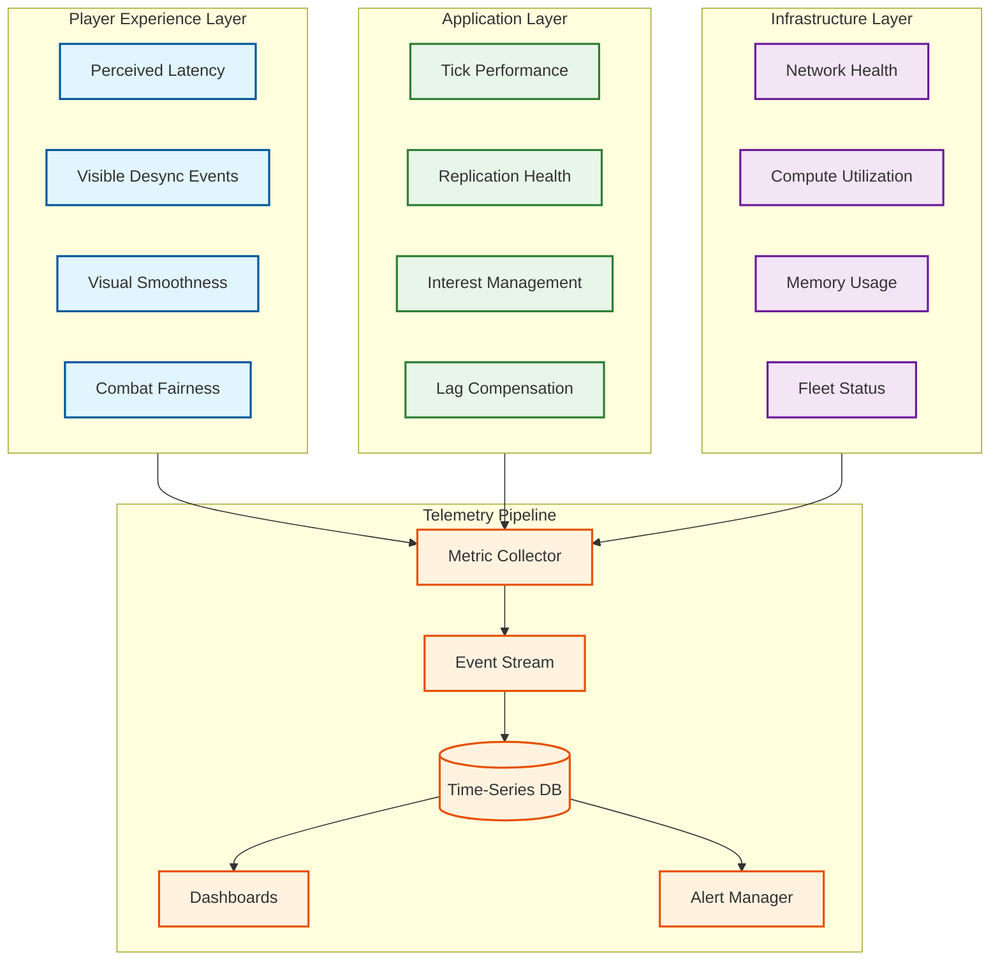

# Observability

## 1. Observability Philosophy

Game state synchronization has a unique observability challenge: the system's correctness is ultimately measured by **human perception**, not just technical metrics. A server running at perfect tick rate is meaningless if players experience rubber-banding. Observability must bridge the gap between server-side telemetry and player-perceived experience.

### 1.1 Observability Layers



---

## 2. Server Tick Monitoring

### 2.1 Tick Performance Metrics

| Metric | Type | Description | Alert Threshold |
|--------|------|-------------|-----------------|
| `tick.duration_ms` | Histogram | Time to complete one tick | P99 > 80% of tick budget |
| `tick.overrun_count` | Counter | Ticks that exceeded budget | > 5 per minute |
| `tick.skip_count` | Counter | Ticks skipped to catch up | > 1 per minute |
| `tick.phase.input_ms` | Histogram | Input processing phase duration | P99 > 3 ms |
| `tick.phase.physics_ms` | Histogram | Physics simulation phase | P99 > 6 ms |
| `tick.phase.combat_ms` | Histogram | Combat resolution phase | P99 > 4 ms |
| `tick.phase.interest_ms` | Histogram | Interest management phase | P99 > 3 ms |
| `tick.phase.serialize_ms` | Histogram | Serialization phase | P99 > 5 ms |
| `tick.phase.send_ms` | Histogram | Network send phase | P99 > 3 ms |
| `tick.current_rate_hz` | Gauge | Current dynamic tick rate | Below minimum for game mode |
| `tick.entity_count` | Gauge | Total entities in simulation | > 500 (resource pressure) |

### 2.2 Tick Budget Dashboard

```
Dashboard: "Tick Budget Analysis"

Panel 1 — Tick Duration Over Time (stacked area chart):
  X: time (last 30 minutes)
  Y: milliseconds
  Series: input, physics, combat, interest, serialize, send, headroom
  → Shows where tick budget is being consumed

Panel 2 — Tick Rate vs Player Count (dual axis):
  Y1: current tick rate (Hz)
  Y2: alive player count
  → Visualizes dynamic tick rate adaptation

Panel 3 — Tick Overrun Heatmap:
  X: time (24 hours)
  Y: server instances
  Color: overrun count per 5-minute bucket
  → Identifies problematic instances or time windows

Panel 4 — Tick Phase Percentile Table:
  Columns: Phase | P50 | P95 | P99 | Max
  → Quick identification of which phase is the bottleneck
```

---

## 3. Player Latency Monitoring

### 3.1 Latency Metrics

| Metric | Type | Description | Alert Threshold |
|--------|------|-------------|-----------------|
| `player.rtt_ms` | Histogram (per region) | Round-trip time to server | P95 > 150 ms |
| `player.jitter_ms` | Histogram | RTT variance | P95 > 30 ms |
| `player.packet_loss_pct` | Histogram | Packet loss percentage | P95 > 5% |
| `player.input_delay_ticks` | Histogram | Ticks between client send and server process | P99 > 5 ticks |
| `player.interpolation_buffer_ms` | Gauge | Client-side interpolation buffer depth | < 1 tick (starvation risk) |
| `player.prediction_correction_magnitude` | Histogram | Size of reconciliation corrections | P95 > 2 game units |
| `player.perceived_latency_ms` | Computed | RTT/2 + server process + interp delay | P95 > 150 ms |

### 3.2 Latency Histogram Dashboard

```
Dashboard: "Player Latency Distribution"

Panel 1 — RTT Distribution by Region (histogram):
  Buckets: 0-20, 20-40, 40-60, 60-100, 100-150, 150-200, 200+ ms
  Series: one per region
  → Shows which regions have latency issues

Panel 2 — RTT P50/P95/P99 Over Time (line chart):
  Per region, over 24 hours
  → Identifies latency degradation trends

Panel 3 — Jitter vs Packet Loss Scatter Plot:
  X: jitter (ms), Y: packet loss (%)
  Points: individual players, colored by region
  → Identifies correlation between jitter and loss

Panel 4 — Player Connection Quality Breakdown (pie chart):
  Good (RTT < 60ms, loss < 1%): target > 80%
  Degraded (RTT 60-150ms, loss 1-3%)
  Poor (RTT > 150ms, loss > 3%): target < 5%
```

### 3.3 Client-Side Telemetry

```
Metrics reported by client to analytics pipeline (sampled, non-blocking):

  client.frame_rate_fps:           Current render frame rate
  client.prediction_error_units:   Magnitude of last reconciliation correction
  client.interpolation_starvation: Frames rendered without new snapshot data
  client.rubber_band_events:       Count of visible position corrections > threshold
  client.hit_denied_count:         Server rejected client-predicted hits
  client.visual_latency_ms:        Time from input to visual response (measured locally)

  Sampling: 1 report per 10 seconds per client
  Payload: ~200 bytes per report
  Pipeline: UDP → analytics collector → stream processing → time-series DB
```

---

## 4. Desync Detection

### 4.1 What is Desync?

Desync occurs when the client's predicted state diverges significantly from the server's authoritative state. Visible symptoms: rubber-banding, teleportation, phantom hits, or actions being undone.

### 4.2 Desync Metrics

| Metric | Description | Calculation |
|--------|-------------|-------------|
| `desync.correction_count` | Number of reconciliation corrections per player per minute | Client reports corrections > threshold |
| `desync.correction_magnitude_p95` | 95th percentile of correction distance | Magnitude of server state vs. predicted state |
| `desync.rubber_band_events` | Player-visible teleportation corrections | Corrections > 3 game units |
| `desync.checksum_mismatch` | Server-client state checksum disagreements | Periodic checksum comparison (every 60 ticks) |
| `desync.combat_denial_rate` | Percentage of client-predicted hits denied by server | Hit denied events / total hit attempts |

### 4.3 Periodic Checksum Verification

```
ALGORITHM: PeriodicDesyncCheck

Every 60 ticks (1 second at 60 Hz):

  SERVER:
    checksum = CRC32(serialize(player_entity_state))
    send_reliable(player_id, CHECKSUM_VERIFY, { tick, checksum })

  CLIENT:
    local_checksum = CRC32(serialize(predicted_player_state_at(tick)))
    IF local_checksum != server_checksum:
      report_desync(tick, local_checksum, server_checksum)
      // Force full reconciliation
      request_full_state_sync()

  ANALYTICS:
    Track desync events per:
      - Player (network quality issue vs. bug)
      - Server instance (server bug vs. client issue)
      - Game mode / map (mode-specific bugs)
      - Game phase (early/mid/late)
      - Tick rate (desync correlation with dynamic tick changes)
```

### 4.4 Desync Root Cause Analysis

```
Dashboard: "Desync Investigation"

Panel 1 — Desync Event Rate Over Time:
  Grouped by: server version, game mode, region
  → Detects regressions after patches

Panel 2 — Desync Correlation Matrix:
  Correlate desync rate with:
    - Player RTT (high latency → more corrections)
    - Packet loss (lost snapshots → stale predictions)
    - Tick overruns (server falling behind → stale data)
    - Player count (more entities → more prediction error)
  → Identifies root cause category

Panel 3 — Per-Player Desync Timeline:
  For a specific player session:
    X: match timeline
    Y: correction magnitude
    Overlay: RTT, packet loss, tick overruns
  → Deep dive into individual player issues

Panel 4 — Desync Heatmap by Map Location:
  Map image with heat overlay showing desync frequency
  → Identifies geometry or physics bugs at specific locations
```

---

## 5. Server Health Monitoring

### 5.1 Compute Metrics

| Metric | Type | Alert Threshold |
|--------|------|-----------------|
| `server.cpu_utilization_pct` | Gauge | > 85% sustained for 30s |
| `server.memory_rss_mb` | Gauge | > 90% of allocated |
| `server.gc_pause_ms` (if applicable) | Histogram | P99 > 5 ms (within tick) |
| `server.thread_count` | Gauge | Anomalous increase |
| `server.fd_count` | Gauge | > 80% of ulimit |

### 5.2 Network Metrics

| Metric | Type | Alert Threshold |
|--------|------|-----------------|
| `server.network.tx_bytes_per_sec` | Gauge | > 80% of NIC capacity |
| `server.network.rx_bytes_per_sec` | Gauge | > 80% of NIC capacity |
| `server.network.tx_packets_per_sec` | Gauge | > 50,000 pps |
| `server.network.udp_send_errors` | Counter | > 0 per minute |
| `server.network.socket_buffer_overflow` | Counter | > 0 per minute |

### 5.3 Match-Level Metrics

| Metric | Type | Description |
|--------|------|-------------|
| `match.duration_seconds` | Histogram | Match length distribution |
| `match.player_count_at_end` | Histogram | How many players remain at match end |
| `match.disconnect_count` | Counter | Players who disconnected mid-match |
| `match.reconnect_success_rate` | Ratio | Successful reconnections / total disconnects |
| `match.completion_rate` | Ratio | Matches that completed normally / total started |
| `match.avg_player_experience_score` | Gauge | Composite score from client telemetry |

---

## 6. Fleet-Level Dashboards

### 6.1 Fleet Overview Dashboard

```
Dashboard: "Fleet Operations Overview"

Panel 1 — Fleet Status (stacked bar, real-time):
  Categories: cold, warm, idle, allocated, active, draining
  → Shows fleet utilization at a glance

Panel 2 — Regional Distribution (world map):
  Circles on map proportional to active matches per region
  Color: green (healthy), yellow (elevated load), red (capacity pressure)

Panel 3 — Allocation Latency (line chart):
  P50, P95, P99 of time from matchmaker request to player connection
  → Target: P95 < 5 seconds

Panel 4 — Match Throughput (rate chart):
  Matches started per minute, matches completed per minute
  → Shows system throughput and identifies backlog
```

### 6.2 Capacity Planning Dashboard

```
Dashboard: "Capacity Planning"

Panel 1 — Demand vs Capacity (dual line):
  Line 1: active matches (demand)
  Line 2: total available servers (capacity)
  Shaded region: idle buffer
  → Alerts when buffer < 10%

Panel 2 — Scaling Events Timeline:
  Scale-up and scale-down events over 7 days
  Overlay: player count
  → Validates auto-scaling behavior

Panel 3 — Regional Capacity Table:
  | Region | Active | Idle | Capacity | Utilization | Status |
  → Per-region capacity health check

Panel 4 — Cost Efficiency:
  Server-hours consumed vs. player-hours served
  → Cost per player-hour metric for financial planning
```

---

## 7. Alerting Strategy

### 7.1 Alert Severity Levels

| Level | Response Time | Notification | Example |
|-------|---------------|-------------|---------|
| **P1 — Critical** | < 5 min | Page on-call | Fleet capacity < 5% idle; match completion rate < 95% |
| **P2 — High** | < 15 min | Slack + page | Regional desync rate spike; tick overrun rate > 5% |
| **P3 — Medium** | < 1 hour | Slack | Single server instance degraded; edge relay failover |
| **P4 — Low** | Next business day | Dashboard only | Latency P99 approaching threshold; storage nearing quota |

### 7.2 Alert Definitions

```
ALERT: TickBudgetExhaustion
  Condition: tick.overrun_count > 10 per minute for 3+ minutes
  Severity: P2
  Runbook:
    1. Check tick.phase breakdown for bottleneck
    2. Check server.cpu_utilization (hardware issue?)
    3. Check match.player_count (unexpected entity count?)
    4. If physics: check for physics explosion (cascading collision)
    5. If serialize: check client baseline age distribution

ALERT: RegionalLatencySpike
  Condition: player.rtt_ms P95 > 150ms for region, sustained 5+ min
  Severity: P2
  Runbook:
    1. Check edge relay health in affected region
    2. Check backbone route latency (edge → game server)
    3. Check for ISP-level outage via external monitoring
    4. If edge relay: failover to backup
    5. If backbone: reroute via alternate path

ALERT: DesyncRateSpike
  Condition: desync.rubber_band_events per player-minute > 2× baseline
  Severity: P2
  Runbook:
    1. Correlate with recent deployment (regression?)
    2. Check if localized to specific server version
    3. Check if localized to specific map region (geometry bug)
    4. Check network metrics (packet loss spike?)
    5. If deployment: roll back affected server version

ALERT: FleetCapacityCritical
  Condition: idle_pool_ratio < 5% for 2+ minutes
  Severity: P1
  Runbook:
    1. Verify auto-scaler is running and healthy
    2. Check for instance launch failures (quota? capacity?)
    3. Manually trigger emergency scale-up
    4. If capacity exhausted: enable queue throttling in matchmaker
    5. Notify stakeholders of degraded match allocation times

ALERT: MatchCompletionDrop
  Condition: match.completion_rate < 99% over 15 minutes
  Severity: P1
  Runbook:
    1. Check for server crash patterns (core dumps, OOM kills)
    2. Check if specific server version is crashing
    3. Isolate affected servers from allocation pool
    4. Review recent deployments or configuration changes
    5. Initiate incident response if widespread
```

---

## 8. Distributed Tracing for Match Events

### 8.1 Trace Structure

```
Trace: Player Action → Server Processing → Client Observation

Example trace for a "player fires weapon" event:

  Span 1: client.input_capture
    timestamp: T+0ms
    data: { tick: 100, action: FIRE, aim_dir: (0.7, 0, 0.7) }

  Span 2: server.input_receive
    timestamp: T+35ms  (half RTT)
    data: { tick: 100, queue_depth: 3 }

  Span 3: server.combat_resolve
    timestamp: T+40ms  (during tick processing)
    data: { rewind_tick: 94, hit: true, target: player_42, damage: 75 }

  Span 4: server.snapshot_encode
    timestamp: T+42ms
    data: { entities_updated: 12, packet_size: 340 bytes }

  Span 5: client.snapshot_receive (shooter)
    timestamp: T+70ms  (half RTT return)
    data: { confirmed_hit: true, correction: 0.2 units }

  Span 6: client.snapshot_receive (target)
    timestamp: T+85ms
    data: { health_update: -75, visual_effect: hit_marker }

  Total perceived latency: 70ms (shooter feels responsive via prediction)
```

### 8.2 Sampling Strategy

```
Sampling for game telemetry:

  High-frequency metrics (tick, latency): 100% — needed for alerting
  Client telemetry reports: 100% at 0.1 Hz (every 10 seconds)
  Distributed traces: 1% of player actions (too expensive at 100%)
  Full match replay data: 100% (required for anti-cheat)

  Storage estimates:
    Metrics: ~50 bytes per metric × 20 metrics × 60Hz × 100K servers
           = ~6 GB/minute → aggregated to 1-minute resolution in TSDB
    Client telemetry: ~200 bytes × 10M players × 0.1 Hz = ~200 MB/s
    Traces: 1% × 10M players × 1 action/s × 500 bytes = ~50 MB/s
```

---

## 9. Player Experience Score

### 9.1 Composite Score

```
METRIC: Player Experience Score (PXS)

A composite metric that captures overall quality of service
from the player's perspective. Scored 0-100.

Components:
  latency_score = max(0, 100 - (perceived_latency_ms - 30) × 0.8)
    // 30ms → 100, 80ms → 60, 155ms → 0

  smoothness_score = max(0, 100 - rubber_band_events_per_min × 25)
    // 0 events → 100, 2 events → 50, 4+ events → 0

  fairness_score = max(0, 100 - hit_denial_rate_pct × 5)
    // 0% denied → 100, 10% denied → 50, 20%+ → 0

  stability_score = IF no_disconnect THEN 100
                    ELSE IF successful_reconnect THEN 60
                    ELSE 0

  PXS = 0.35 × latency_score
      + 0.30 × smoothness_score
      + 0.25 × fairness_score
      + 0.10 × stability_score

Targets:
  PXS P50 > 85 (most players have excellent experience)
  PXS P10 > 60 (even worst-case players are acceptable)
  PXS P1 > 40 (virtually nobody has unplayable experience)
```

### 9.2 PXS Dashboard

```
Dashboard: "Player Experience Score"

Panel 1 — PXS Distribution (histogram):
  Current PXS distribution across all active players
  Overlaid: yesterday's distribution for comparison

Panel 2 — PXS by Region (box plot):
  Per-region PXS percentiles
  → Identifies regions with consistently poor experience

Panel 3 — PXS vs Churn Correlation:
  X: average PXS over player's last 10 matches
  Y: probability of returning next day
  → Quantifies business impact of experience quality

Panel 4 — PXS Component Breakdown:
  Stacked bar showing contribution of each sub-score
  → Identifies which component is dragging down PXS
```
