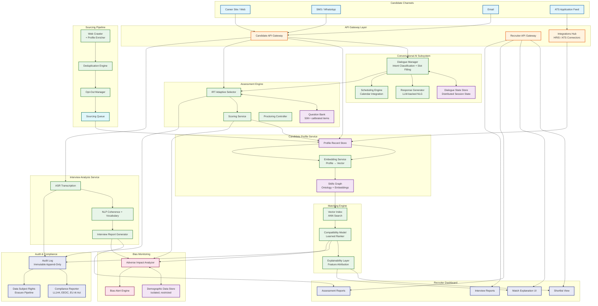
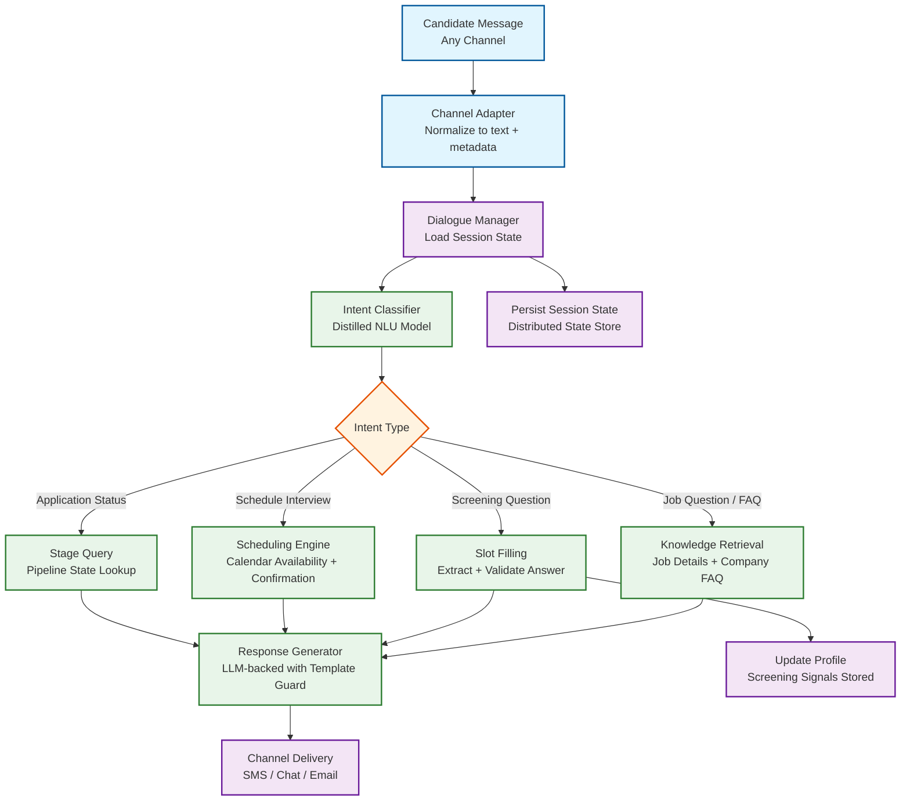

# 12.20 AI-Native Recruitment Platform — High-Level Design

## System Architecture

---

## Key Design Decisions

### Decision 1: Skills Graph as the Shared Semantic Foundation

All subsystems that reason about candidate fit—sourcing query expansion, matching embedding space, assessment item tagging, and career path inference—share a common skills ontology and skills graph. The skills graph maps explicit skills (Python, Kubernetes) to adjacent skills (container orchestration, cloud-native development) and inferred competency clusters through learned co-occurrence from millions of job descriptions and career trajectories. Rather than building separate feature engineering pipelines per subsystem, every skill representation is grounded in this shared graph, ensuring that improvements to the ontology (new skill added, incorrect adjacency corrected) propagate uniformly across sourcing, matching, and assessment.

**Implication:** Avoids the data model drift problem where different subsystems develop conflicting representations of "the same skill." Enables compound learning: a well-calibrated assessment item teaches the matching engine what a particular skill actually looks like in practice.

### Decision 2: Embedding-Based Matching with a Learned Compatibility Layer

Pure embedding cosine similarity (candidate vector vs. job vector) captures semantic skill overlap but fails to capture hiring team preferences, role seniority fit, culture dimensions, and the historical fact that certain skill combinations predict success for this specific organization. The system uses ANN (approximate nearest neighbor) search for recall—retrieving the top-K semantically similar candidates—and then a learned compatibility model (gradient-boosted ranker trained on historical hire outcomes) for precision re-ranking within that candidate set. The two layers are independent: the ANN index can be updated daily without retraining the ranker; the ranker can be retrained weekly without rebuilding the index.

**Implication:** Separation of recall and precision allows independent iteration cycles and isolates the bias surface: the ANN index is trained on skill co-occurrence (neutral); the ranker, which is trained on historical hire outcomes, requires careful bias monitoring and regular retraining with outcome debiasing techniques.

### Decision 3: Conversational AI as the Candidate-Facing Orchestrator

Rather than exposing candidates to a fragmented set of forms, email sequences, and portal logins, a stateful dialogue manager serves as the single conversational interface for all candidate-facing interactions: job discovery, FAQ, application screening, scheduling, assessment delivery, and status updates. The dialogue manager maintains state across channels and time gaps. This design reduces candidate drop-off (each form / portal step is a drop-off event), enables real-time personalization ("I see you applied for role X—would you also be interested in role Y?"), and gives the platform a full structured record of every candidate interaction for compliance and quality analysis.

**Implication:** The dialogue state store becomes a consistency-critical system component. A candidate switching from web to SMS mid-conversation must experience seamless continuity; this requires distributed session state with conflict-free merge semantics, not a simple key-value cache.

### Decision 4: Bias Monitoring as a Synchronous Gate, Not an Offline Report

Adverse impact must be detected before outreach is triggered, not discovered during an annual audit. After each decision batch closes (a batch is defined as one stage transition for one job requisition—e.g., all resume screens for req #4521 this week), the bias monitoring service computes selection rate ratios across demographic categories. If any ratio falls below the 4/5ths threshold with statistical significance (Fisher's exact test, p < 0.05), the batch is flagged and a compliance review is triggered before any rejection notifications or next-stage invitations are sent. This introduces a small delay (up to 5 minutes per batch) but converts the bias check from a retroactive legal defense into a prospective quality gate.

**Implication:** Requires demographic data to be collected at application time (with clear disclosure) and stored in an isolated, access-restricted demographic store separate from the matching features used for ranking. The matching model must never receive demographic attributes as input features.

### Decision 5: Multimodal Interview Analysis Without Facial Signals

Video interview analysis extracts value from audio (ASR transcript) and linguistic structure (coherence, domain vocabulary, answer completeness) without analyzing visual signals from the candidate's face. This decision is driven by legal and ethical constraints: facial expression analysis in hiring has been challenged under ADA (deaf candidates), BIPA (Illinois biometric law), and emerging EU AI Act provisions, and has demonstrated racial and gender bias in published research. By restricting analysis to speech and language signals, the platform produces legally defensible, competency-anchored interview reports while eliminating the highest-risk bias surface in video analysis.

**Implication:** Technically limits the signal extracted from video vs. a full multimodal model, but this is the correct trade-off given the legal landscape. Competency scoring based on answer content is more predictively valid than facial expression scoring in controlled research.

---

## Data Flow: Candidate Application to Shortlist

```mermaid
flowchart LR
    A[Candidate Applies] --> B[API Gateway\nConsent + Notice Check]
    B --> C{AEDT notice\ngiven ≥ 10 days?}
    C -->|No| D[Send Notice\nAwait Opt-In or 10-Day Window]
    C -->|Yes| E[Profile Enrichment\nResume Parse + Skills Extraction]
    E --> F[Embedding Service\nGenerate Candidate Vector]
    F --> G[ANN Search\nTop-K Similar Candidates for Req]
    G --> H[Compatibility Model\nRe-rank Top-K]
    H --> I[Bias Monitor\nAdverse Impact Check on Batch]
    I -->|Alert: threshold breach| J[Compliance Hold\nHuman Review Before Outreach]
    I -->|Clear| K[Shortlist Delivered\nto Recruiter Dashboard]
    K --> L[Recruiter Reviews\nWith Match Explanation]
    L --> M[Conversational AI\nEngages Candidate]
    M --> N[Assessment + Interview\nStructured Signals Added]
    N --> O[Updated Shortlist Rank\nCompatibility Model Re-scores]

    classDef input fill:#e1f5fe,stroke:#01579b,stroke-width:2px
    classDef process fill:#e8f5e9,stroke:#2e7d32,stroke-width:2px
    classDef decision fill:#fff3e0,stroke:#e65100,stroke-width:2px
    classDef bias fill:#fce4ec,stroke:#880e4f,stroke-width:2px
    classDef output fill:#f3e5f5,stroke:#6a1b9a,stroke-width:2px

    class A,B input
    class E,F,G,H,M,N,O process
    class C,I decision
    class J bias
    class D,K,L output
```

---

## Data Flow: Conversational Recruiting Session

---

## Component Responsibilities Summary

| Component | Primary Responsibility | Key Interface |
|---|---|---|
| **Candidate API Gateway** | Channel normalization, authentication, consent enforcement, rate limiting | REST / WebSocket; SMS via webhook adapter |
| **Dialogue Manager** | Multi-turn session state management, intent routing, slot filling | Internal gRPC; state persisted to distributed session store |
| **Sourcing Pipeline** | Crawler orchestration, deduplication, opt-out enforcement, enrichment queue | Crawler → queue → profile service; rate-limited per source |
| **Skills Graph** | Shared ontology, skill adjacency model, embedding space foundation | Graph query API; embedding lookup by skill ID or free text |
| **Embedding Service** | Converts profile or job text into vector space representation | gRPC; called at profile update time and job creation time |
| **ANN Vector Index** | Approximate nearest neighbor retrieval of candidate vectors for a job vector | HNSW index; rebuilt incrementally; read replica per shard |
| **Compatibility Model** | Learned re-ranker: takes top-K ANN candidates and produces ordered shortlist | gRPC inference; gradient-boosted ranker; versioned model artifact |
| **Assessment Engine** | IRT-driven adaptive question selection, session management, scoring | REST session API; question bank loaded in memory per shard |
| **Interview Analysis Service** | ASR → NLP → competency report pipeline for video submissions | Async; object storage for video input; report written to candidate profile |
| **Bias Monitor** | Per-batch adverse impact analysis; alert emission; demographic data query | Reads decision batch events; writes alerts to compliance queue |
| **Audit Log** | Immutable append-only log of every algorithmic decision | Write-once; append API; no delete path; cryptographic chaining |
| **Compliance Reporter** | Generates LL144 bias audits, EEOC reports, EU AI Act documentation | Batch job; reads from audit log + demographic store |
