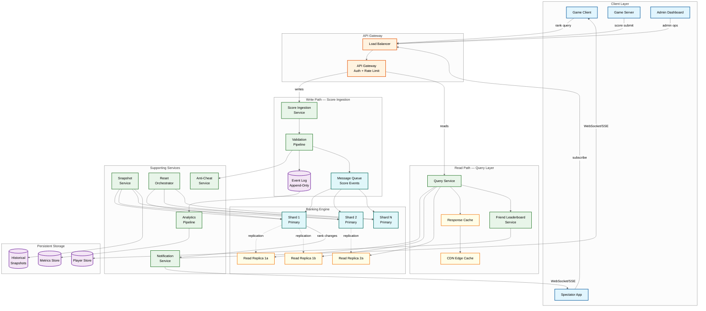
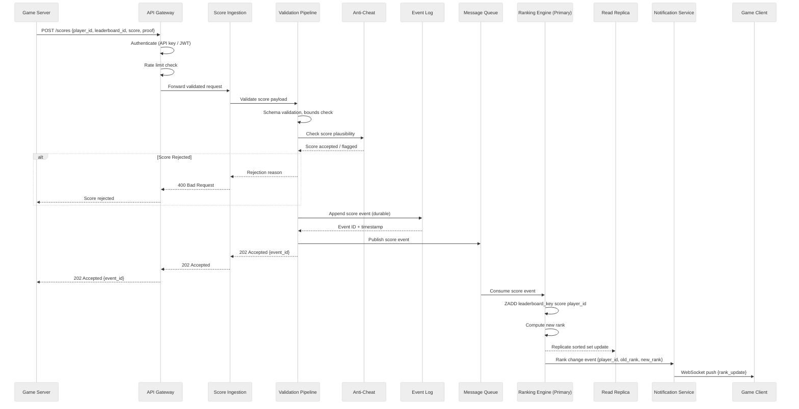
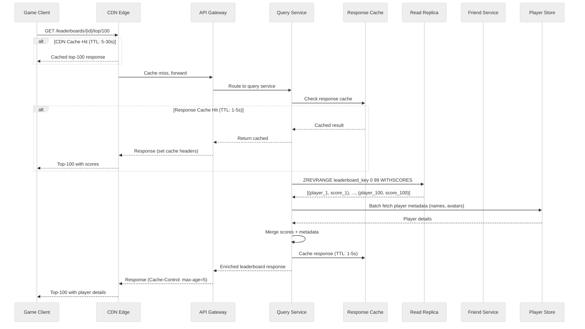
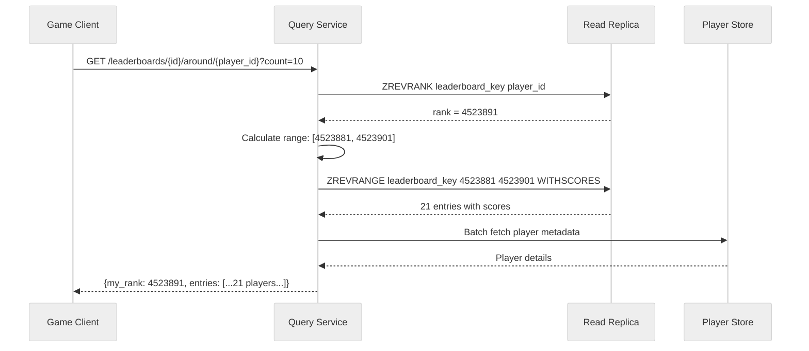
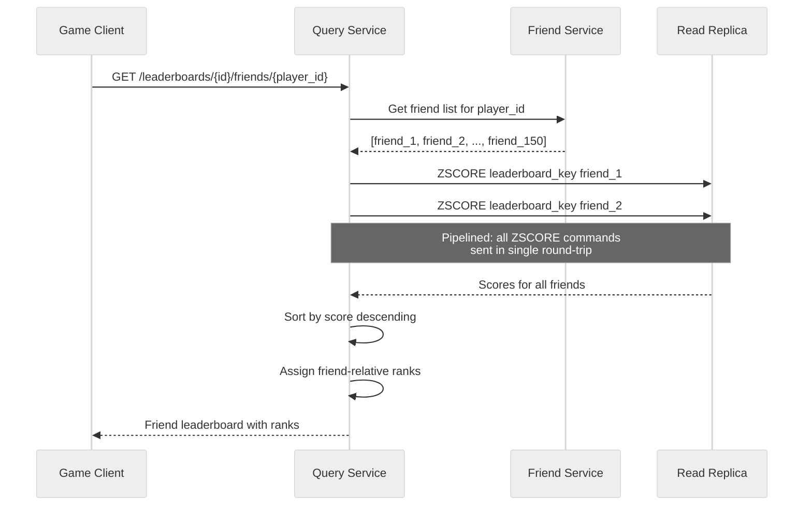
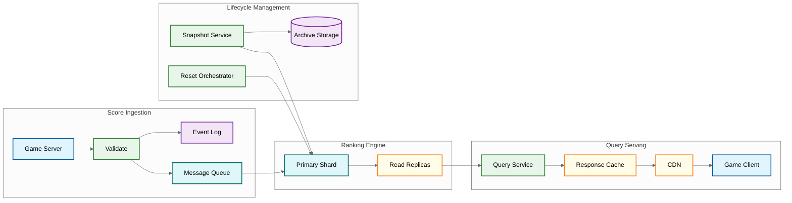

# High-Level Design — Live Leaderboard System

## Architecture Overview

The Live Leaderboard System follows a **CQRS (Command Query Responsibility Segregation)** architecture, cleanly separating the score ingestion (write) path from the rank query (read) path. Score submissions flow through a validation pipeline before updating in-memory sorted sets on primary instances, while rank queries are served from read replicas with CDN caching for popular leaderboard segments. An event log provides durability and enables replay for recovery.



---

## Write Path: Score Submission Flow

The write path prioritizes **durability first, ranking second**. Scores are persisted to the event log before being applied to the ranking engine, ensuring no validated score is lost even if the ranking engine fails.



### Write Path Key Decisions

| Decision | Choice | Rationale |
|---|---|---|
| **Async vs sync ranking** | Asynchronous (202 Accepted) | Decouples submission latency from ranking latency; allows backpressure handling |
| **Event log before ranking** | Yes, always | Guarantees durability; ranking engine can rebuild from event log on failure |
| **Score validation location** | On the write path (blocking) | Invalid scores must never enter the ranking engine; fail-fast prevents pollution |
| **Anti-cheat mode** | Synchronous fast-check + async deep analysis | Fast plausibility check (< 50ms) on write path; deep replay verification async |

---

## Read Path: Rank Query Flow

The read path is optimized for **low latency and high throughput**. Queries are served from read replicas, with a multi-tier cache for popular leaderboard segments.



### Read Path Optimization Tiers

```
Tier 1: CDN Edge Cache (5-30s TTL)
  - Top-100, Top-1000 for popular leaderboards
  - Hit rate: 60-80% during peak traffic
  - Reduces query service load by 5-10x

Tier 2: Response Cache (1-5s TTL)
  - Pre-computed responses for common queries
  - Short TTL ensures freshness for competitive scenarios
  - Hit rate: 40-60% for cache-missed CDN requests

Tier 3: Read Replica (real-time, ~10ms lag)
  - Direct sorted set queries against replicated data
  - Handles around-me, percentile, and friend queries
  - 3-5 replicas per shard for throughput

Tier 4: Primary Instance (authoritative)
  - Used only when strong consistency is required
  - Tournament finals, prize-determining queries
  - Typically < 1% of total read traffic
```

---

## Around-Me Query Flow

The "around-me" query requires fetching a player's rank first, then retrieving surrounding entries—a two-step operation that must feel instantaneous.



---

## Friend Leaderboard Flow

Friend leaderboards compute a ranking over a small subset of the global leaderboard. This is computed on-demand by fetching scores for the friend list and sorting client-side or server-side.



> **Optimization**: For players with large friend lists (500+), use `ZMSCORE` (multi-score lookup) to fetch all scores in a single operation rather than pipelining individual `ZSCORE` commands.

---

## Key Architecture Decisions

### Decision 1: Redis Sorted Sets vs. Custom B-Tree

| Factor | Sorted Sets (In-Memory KV) | Custom B-Tree |
|---|---|---|
| **Complexity** | Out-of-the-box, well-tested | Custom implementation, higher bug risk |
| **Performance** | O(log N) for all operations | O(log N) but tunable branching factor |
| **Memory efficiency** | ~120 bytes/entry overhead | Can be more compact with custom encoding |
| **Operational** | Managed services available | Self-hosted only |
| **Sharding** | Requires external sharding logic | Can build sharding into the tree |
| **Verdict** | **Chosen for MVP and most workloads** | Consider for billion-entry scale only |

### Decision 2: Single vs. Sharded Leaderboard

| Factor | Single Instance | Sharded |
|---|---|---|
| **Capacity** | ~50M entries max | Unlimited (add shards) |
| **Rank accuracy** | Exact | Requires scatter-gather for global rank |
| **Query latency** | Lowest (single hop) | Higher (fan-out + merge) |
| **Operational** | Simple | Complex (shard management, rebalancing) |
| **Verdict** | **Use for leaderboards < 50M entries** | **Use for > 50M or extreme throughput** |

### Decision 3: Push vs. Pull for Real-Time Updates

| Factor | Push (WebSocket/SSE) | Pull (Polling) |
|---|---|---|
| **Latency** | Sub-second rank updates | Depends on poll interval (typically 5-30s) |
| **Server load** | Connection management overhead | Query amplification at scale |
| **Client complexity** | Requires WebSocket handling | Simple HTTP requests |
| **Scalability** | Fan-out challenge for millions of subscribers | Each poll is independent |
| **Verdict** | **Push for active gameplay; pull for background checks** | Hybrid approach recommended |

### Decision 4: Exact vs. Approximate Global Ranking

| Factor | Exact Ranking | Approximate Ranking |
|---|---|---|
| **Cross-shard** | Scatter-gather all shards | Sample + interpolate |
| **Latency** | O(shard_count) | O(1) with precomputed buckets |
| **Accuracy** | 100% | 99.9%+ (sufficient for most use cases) |
| **Use case** | Tournament finals, prize distribution | General gameplay, percentile display |
| **Verdict** | **Exact for top-1000 and prize boundaries** | **Approximate for general population** |

---

## Data Flow Summary



---

## Component Interaction Matrix

| Component | Writes To | Reads From | Protocol |
|---|---|---|---|
| **API Gateway** | Score Ingestion, Query Service | — | HTTP/2, gRPC |
| **Score Ingestion** | Event Log, Message Queue | Validation Pipeline | gRPC (internal) |
| **Validation Pipeline** | Message Queue | Anti-Cheat Service | gRPC |
| **Ranking Engine** | Sorted Sets, Read Replicas | Message Queue | Custom binary protocol |
| **Query Service** | Response Cache | Read Replicas, Player Store | gRPC, sorted set protocol |
| **Notification Service** | WebSocket connections | Ranking Engine (change events) | gRPC, WebSocket |
| **Snapshot Service** | Archive Storage | Ranking Engine (DUMP) | Bulk transfer |
| **Reset Orchestrator** | Ranking Engine | — | Admin RPC |

---

## Failure Modes & Mitigations

| Failure | Impact | Mitigation |
|---|---|---|
| **Ranking Engine primary down** | No new score updates processed | Promote read replica to primary; replay from event log |
| **All replicas down for a shard** | Queries for that shard fail | Serve stale cache; degrade to cross-shard approximate rank |
| **Event log unavailable** | Scores accepted but not durable | Buffer in ingestion service memory (< 60s); reject if buffer full |
| **Message queue backlog** | Score propagation delay > SLO | Auto-scale consumers; alert on queue depth |
| **CDN failure** | Increased load on query service | Query service auto-scales; response cache absorbs burst |
| **Network partition** | Shard isolation | Each shard operates independently; merge on heal |
| **Anti-cheat service down** | Scores bypass deep validation | Fast-check still runs locally; queue for async validation |

---

*Previous: [Requirements & Estimations](./01-requirements-and-estimations.md) | Next: [Low-Level Design →](./03-low-level-design.md)*
