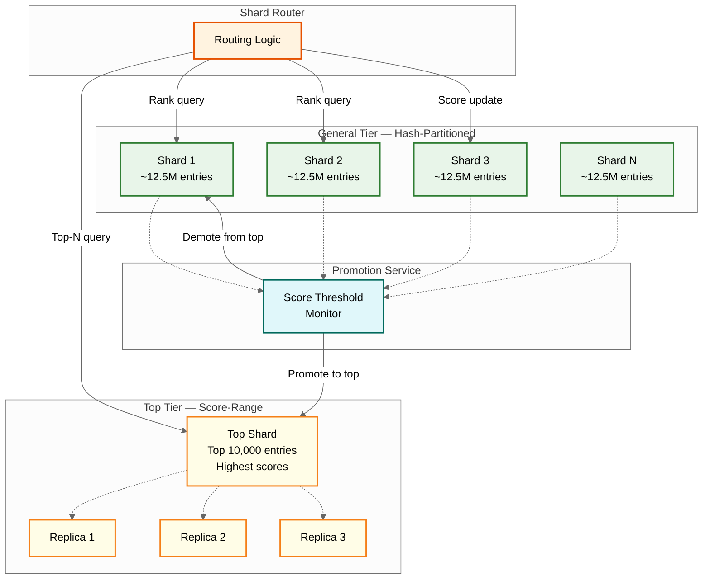
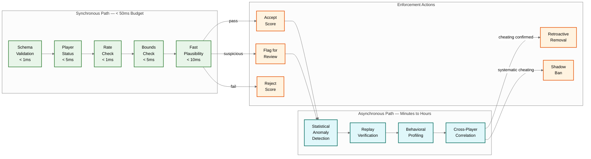
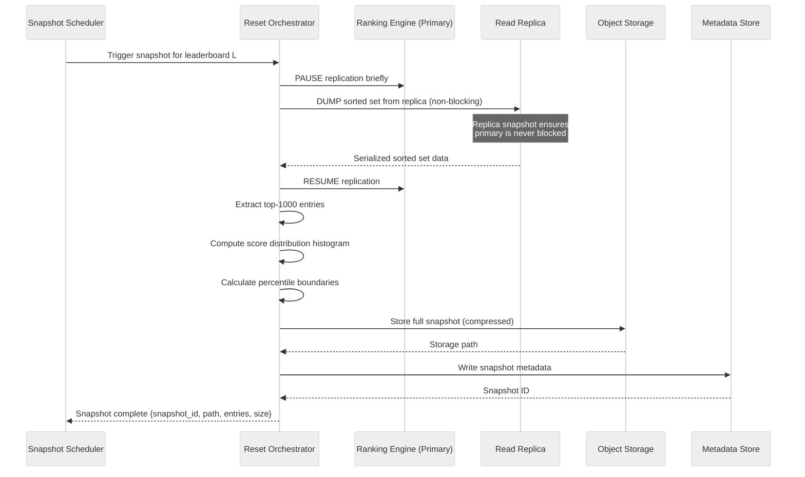

# Deep Dive & Bottlenecks — Live Leaderboard System

## Deep Dive 1: Sharded Ranking Engine

### The Fundamental Problem

A single in-memory sorted set instance can hold approximately 50 million entries before memory constraints and garbage collection pressure degrade performance. For leaderboards exceeding this—a global battle royale with 100M+ players—the ranking engine must be sharded across multiple instances. Sharding introduces the core challenge: **computing a global rank requires knowledge distributed across all shards**.

### Sharding Strategy Selection

```
Strategy 1: Hash-Based Sharding (by player_id)
  shard = HASH(player_id) MOD shard_count

  Pros:
    - Uniform distribution across shards
    - Player's shard is deterministic (no lookup needed)
    - Score updates are single-shard operations

  Cons:
    - Top-N queries require scatter-gather across ALL shards
    - Global rank requires counting across ALL shards
    - Cannot route "top-heavy" queries to a single shard

  Best for: Large leaderboards where most queries are individual rank lookups
           or around-me queries (player knows their shard)

Strategy 2: Score-Range Sharding
  shard = find_shard_for_score_range(score)
  Example: Shard 0 = scores [0, 1000), Shard 1 = [1000, 5000), etc.

  Pros:
    - Top-N queries hit only the highest-score shard
    - Percentile queries can skip irrelevant shards
    - Natural "hot shard" for top of leaderboard (can add replicas)

  Cons:
    - Score updates may require cross-shard migration
    - Uneven distribution (score distributions are rarely uniform)
    - Range boundaries need periodic rebalancing

  Best for: Leaderboards where top-N queries dominate
           and score distribution is relatively stable

Strategy 3: Hybrid (Hash + Score-Range)
  Top shard: dedicated to top-10,000 entries (score-range)
  Remaining shards: hash-partitioned for the general population

  This is the recommended approach for production leaderboards.
```

### Hybrid Sharding Architecture



### Promotion/Demotion Between Tiers

```
FUNCTION check_promotion(player_id, new_score, current_shard):
    top_shard_min = GET_MIN_SCORE("top_shard")

    IF new_score > top_shard_min:
        // Player qualifies for top tier
        ATOMIC:
            ZREM(current_shard, player_id)
            ZADD("top_shard", new_score, player_id)

            // The entry displaced from top tier moves to general
            displaced = ZRANGE("top_shard", 0, 0)  // Lowest in top tier
            IF ZCARD("top_shard") > TOP_TIER_MAX:
                displaced_shard = HASH(displaced.player_id) MOD general_shard_count
                ZREM("top_shard", displaced.player_id)
                ZADD(displaced_shard, displaced.score, displaced.player_id)
```

### Cross-Shard Rank Computation Cost

```
For hash-sharded leaderboard with S shards:

  Individual rank query:
    1. ZSCORE on owner shard:          O(1)
    2. ZCOUNT on each of S shards:     O(S × log N/S)
    3. Network round-trips:             1 (parallelized)
    4. Total latency:                   ~5ms × S (if serialized)
                                        ~10ms (if parallelized, bounded by slowest shard)

  Top-N query with K-way merge:
    1. ZREVRANGE(0, N) on each shard:  O(S × (log(N/S) + N))
    2. K-way merge:                    O(N × log S)
    3. Total latency:                  ~15-50ms for S=10, N=100

  The scatter-gather pattern becomes the dominant latency contributor
  at S > 20 shards. Mitigation: precompute top-N periodically (every 1-5s)
  and serve from cache for the majority of top-N queries.
```

---

## Deep Dive 2: Score Validation Pipeline

### Multi-Layer Validation Architecture

The validation pipeline must catch invalid and fraudulent scores without adding unacceptable latency to the write path. The design uses a **tiered approach**: fast synchronous checks on the hot path, followed by asynchronous deep analysis.



### Statistical Anomaly Detection

```
FUNCTION detect_score_anomaly(player_id, new_score, leaderboard_id):
    // Fetch player's historical score distribution
    history = GET_SCORE_HISTORY(player_id, leaderboard_id, last_n=100)

    IF history.count < 10:
        // Insufficient data for statistical analysis
        RETURN {anomaly: false, confidence: 0.0}

    mean = MEAN(history.scores)
    stddev = STDDEV(history.scores)

    // Z-score test: how many standard deviations from mean?
    z_score = (new_score - mean) / stddev

    IF z_score > 4.0:
        // Score is 4+ standard deviations above mean
        RETURN {anomaly: true, confidence: 0.99, reason: "extreme_outlier"}

    // Improvement rate check
    improvement_rate = (new_score - history.scores[-1]) / history.scores[-1]
    max_expected_improvement = get_max_improvement_rate(leaderboard_id)

    IF improvement_rate > max_expected_improvement:
        RETURN {anomaly: true, confidence: 0.8, reason: "rapid_improvement"}

    // Temporal pattern check
    time_since_last = NOW() - history.timestamps[-1]
    IF time_since_last < MIN_GAME_DURATION AND new_score > mean * 1.5:
        RETURN {anomaly: true, confidence: 0.9, reason: "impossible_speed"}

    RETURN {anomaly: false, confidence: 0.0}
```

### Shadow Banning

Shadow banning is a critical anti-cheat technique: the banned player sees their own scores and rank normally, but their entries are invisible to all other players.

```
FUNCTION apply_shadow_ban(player_id, leaderboard_id):
    // Move player from main leaderboard to shadow copy
    main_key = "lb:" + leaderboard_id
    shadow_key = "lb:" + leaderboard_id + ":shadow"

    score = ZSCORE(main_key, player_id)
    ZREM(main_key, player_id)
    ZADD(shadow_key, score, player_id)

    // Mark player as shadow-banned in metadata
    SET_PLAYER_FLAG(player_id, "shadow_banned", true)

FUNCTION get_rank_for_player(player_id, leaderboard_id):
    IF IS_SHADOW_BANNED(player_id):
        // Return rank from shadow leaderboard (only they see this)
        shadow_key = "lb:" + leaderboard_id + ":shadow"
        main_count = ZCARD("lb:" + leaderboard_id)
        shadow_rank = ZREVRANK(shadow_key, player_id)
        // Fake a plausible rank by blending with main leaderboard size
        RETURN shadow_rank + 1  // They see themselves as ranked
    ELSE:
        RETURN ZREVRANK("lb:" + leaderboard_id, player_id) + 1
```

---

## Deep Dive 3: Snapshot & Reset Mechanism

### Snapshot Capture Process

Snapshots must capture a consistent point-in-time view of the leaderboard without blocking write operations.



### Zero-Downtime Seasonal Reset

The reset process must be **atomic from the client's perspective**: at no point should a player see an empty leaderboard or a partially reset state.

```
FUNCTION zero_downtime_reset(leaderboard_id, new_season):
    // Phase 1: Pre-warm (minutes before scheduled reset)
    new_key = generate_season_key(leaderboard_id, new_season)
    ENSURE_EXISTS(new_key)  // Allocate memory, create empty sorted set

    // Phase 2: Snapshot current state
    old_key = get_active_key(leaderboard_id)
    snapshot_id = capture_snapshot(old_key)

    // Phase 3: Coordinate across shards
    shard_count = GET_SHARD_COUNT(leaderboard_id)

    FOR each shard IN [0..shard_count-1]:
        old_shard = old_key + ":shard:" + shard
        new_shard = new_key + ":shard:" + shard
        ENSURE_EXISTS(new_shard)

    // Phase 4: Atomic pointer swap (the critical moment)
    // All shards are swapped in a single coordinated operation
    pointer_key = "lb:" + leaderboard_id + ":active_season"

    DISTRIBUTED_LOCK(leaderboard_id):
        // Brief lock (< 100ms) during pointer swap
        SET(pointer_key, new_season)
        // All new writes now go to new season
        // All reads now query new season

    // Phase 5: Drain in-flight writes
    // Score events published before the swap but consumed after
    // must be routed to the correct season based on their timestamp
    WAIT(500ms)  // Allow in-flight events to settle

    // Phase 6: Async archival
    ASYNC:
        archive_snapshot(snapshot_id, object_storage_path)
        SET_EXPIRY(old_key, 86400 * 7)  // Keep old data 7 days for appeals
        notify_reward_service(leaderboard_id, old_key, snapshot_id)

    RETURN {status: "RESET_COMPLETE", new_season: new_season}
```

### Handling In-Flight Writes During Reset

```
FUNCTION route_score_event(event):
    active_season = GET("lb:" + event.leaderboard_id + ":active_season")

    IF event.timestamp < reset_timestamp(event.leaderboard_id):
        // Event belongs to old season (arrived late)
        target_key = season_key(event.leaderboard_id, active_season - 1)
        IF EXISTS(target_key):
            apply_score(target_key, event)
            // Also update snapshot if the old season is prize-relevant
        ELSE:
            // Old season already archived; log for reconciliation
            LOG_LATE_EVENT(event)
    ELSE:
        // Event belongs to new season
        target_key = season_key(event.leaderboard_id, active_season)
        apply_score(target_key, event)
```

---

## Race Conditions in Concurrent Score Updates

### Race Condition 1: Concurrent HIGHEST Score Updates

```
Problem:
  Thread A: ZSCORE → 100, new_score=150, will ZADD 150
  Thread B: ZSCORE → 100, new_score=120, will ZADD 120
  If B executes ZADD after A: score regresses from 150 to 120

Solution:
  Use atomic server-side scripting (all operations in one atomic block):

  ATOMIC_SCRIPT:
    current = ZSCORE(key, player)
    IF current == NULL OR new_score > current:
        ZADD(key, new_score, player)
        RETURN new_score
    RETURN current
```

### Race Condition 2: Concurrent Increment Operations

```
Problem:
  Thread A: ZINCRBY(key, 10, player)  // score = 100 + 10 = 110
  Thread B: ZINCRBY(key, 5, player)   // score = 110 + 5 = 115

Solution:
  ZINCRBY is inherently atomic in sorted set implementations.
  No race condition exists for increment operations.
  This is a key reason to prefer INCREMENT over absolute ZADD
  when the scoring model supports it.
```

### Race Condition 3: Read-After-Write on Replicas

```
Problem:
  1. Player submits score → primary updates to 150
  2. Player immediately queries rank → hits read replica
  3. Replica hasn't received replication yet → shows old score 100

Solution:
  "Read-your-writes" consistency:
  Option A: Route the post-submission rank query to the primary (sticky session)
  Option B: Return the new rank in the score submission response (202 Accepted + rank)
  Option C: Include a version/timestamp; client retries if stale

  Recommended: Option B — return rank estimate in the submission response,
  with a flag indicating it's "optimistic" and may adjust within 500ms.
```

### Race Condition 4: Shard Migration During Rank Query

```
Problem:
  During hybrid sharding, a player is being promoted from general to top tier.
  A concurrent rank query might miss them in both tiers (removed from general,
  not yet in top) or count them in both (present in both during migration).

Solution:
  Two-phase promotion with tombstone:
  1. Add to top tier
  2. Mark as "migrating" in general tier (tombstone)
  3. Rank queries check tombstone and skip
  4. Remove tombstone after confirmation

  The migration window is < 10ms; the probability of a query hitting
  exactly during migration is ~0.01%. The tombstone prevents double-counting.
```

---

## Bottleneck Analysis

### Bottleneck 1: Single Sorted Set Memory Limits

```
Problem:
  A sorted set with 100M entries requires ~12 GB RAM.
  Beyond 50M entries, garbage collection pauses and memory fragmentation
  cause P99 latency spikes (50ms → 200ms).

Impact:
  Large global leaderboards cannot fit in a single instance.

Mitigation:
  1. Shard at 30-40M entries (below the degradation threshold)
  2. Use dedicated instances (no co-location with other data)
  3. Disable background persistence (snapshot to replica instead)
  4. Monitor memory fragmentation ratio; trigger restart if > 1.5

Quantification:
  50M entries × 120 bytes = 6 GB data
  With fragmentation (1.3x): 7.8 GB
  With OS/runtime overhead: ~10 GB total
  Instance size recommendation: 16 GB RAM (leaving headroom)
```

### Bottleneck 2: Cross-Shard Rank Computation

```
Problem:
  For hash-sharded leaderboards, every rank query requires scatter-gather
  across ALL shards. With 20 shards, even parallelized, the tail latency
  is bounded by the slowest shard response.

Impact:
  P99 latency grows linearly with shard count.
  20 shards × P99 5ms per shard ≈ P99 15-20ms for the scatter-gather
  (parallel, but waiting for the slowest).

Mitigation:
  1. Approximate ranking: precompute score-bucket histograms every 1-5 minutes
     and interpolate rank from bucket position. Accuracy: ±0.1%
  2. Hedged requests: send each shard query to both primary and replica;
     use whichever responds first
  3. Timeout with degradation: if a shard doesn't respond in 50ms,
     use its last-known count (stale by at most the refresh interval)
  4. Hybrid sharding: keep top tier on a single shard to avoid
     scatter-gather for top-N queries
```

### Bottleneck 3: Reset Storms

```
Problem:
  When a seasonal reset occurs, millions of players simultaneously:
  1. Query the new (empty) leaderboard → see rank 0 → confused
  2. Submit their first score → thundering herd on write path
  3. Check old season results → load on archived data

Impact:
  10M players resuming within 5 minutes of reset = 33K score submissions/sec
  (4x normal), plus 100K+ rank queries/sec on a nearly-empty leaderboard.

Mitigation:
  1. Staggered reset awareness: don't push reset notification to all players
     simultaneously. Stagger over 5-10 minutes by region/shard
  2. Pre-seed new leaderboard: carry forward a "placement score" from last
     season so the new board isn't empty (e.g., 50% of previous score)
  3. Queue score submissions with backpressure: return 202 Accepted and
     process at controlled rate
  4. CDN cache old season results with long TTL (they're immutable post-reset)
  5. Progressive client refresh: game client doesn't auto-refresh leaderboard
     on reset; waits for user action
```

### Bottleneck 4: Friend Leaderboard at Scale

```
Problem:
  A player with 500 friends requesting a friend leaderboard triggers
  500 ZSCORE operations. Even pipelined, this is 500 operations per request.
  If 1M players request friend leaderboards simultaneously, that's
  500M ZSCORE operations.

Impact:
  500 ZSCORE × 1M concurrent = 500M ops/sec → exceeds cluster capacity

Mitigation:
  1. ZMSCORE: batch multi-key score lookup (single command, server-side loop)
  2. Precompute friend leaderboards: for active players, periodically (every 30s)
     compute friend leaderboard and cache the result
  3. Lazy computation: only compute on first request, then cache for 30s
  4. Limit friend list size: cap at 200 friends for leaderboard queries
  5. Client-side computation: send friend scores to client, let client sort
     (reduces server load but increases response size)
```

### Bottleneck 5: Hot Leaderboard Problem

```
Problem:
  During a major tournament, a single leaderboard receives 80% of all queries.
  Even with read replicas, the replication fan-out creates a hot-spot.

Impact:
  1 leaderboard × 800K queries/sec → replica capacity exhausted

Mitigation:
  1. CDN caching with 5-second TTL for top-100 (serves 80% of queries)
  2. Response cache with 1-second TTL for top-1000
  3. Dedicated replica pool for hot leaderboards (5-10 replicas vs. standard 3)
  4. Progressive detail: top-100 cached aggressively, deeper ranks served
     from standard replicas with higher latency tolerance
  5. Event-specific scaling: pre-provision extra replicas before scheduled events
```

---

## Performance Characteristics Summary

| Operation | Single Instance | 10-Shard Cluster | With Caching |
|---|---|---|---|
| ZADD (score update) | < 1ms | < 5ms (route + write) | N/A |
| ZREVRANK (rank lookup) | < 1ms | 10-20ms (scatter-gather) | < 1ms (cache hit) |
| ZREVRANGE top-100 | < 1ms | 15-30ms (merge) | < 5ms (CDN hit) |
| Around-me (±10) | < 2ms | 10-25ms | < 5ms (cache hit) |
| Friend leaderboard (200 friends) | < 5ms | < 10ms | < 2ms (precomputed) |
| Percentile | < 1ms | 5-10ms (bucket lookup) | < 1ms (precomputed) |
| Seasonal reset | < 100ms | 1-5s (coordinated) | N/A |
| Snapshot capture | 5-30s | 5-30s per shard (parallel) | N/A |

---

*Previous: [Low-Level Design](./03-low-level-design.md) | Next: [Scalability & Reliability →](./05-scalability-and-reliability.md)*
