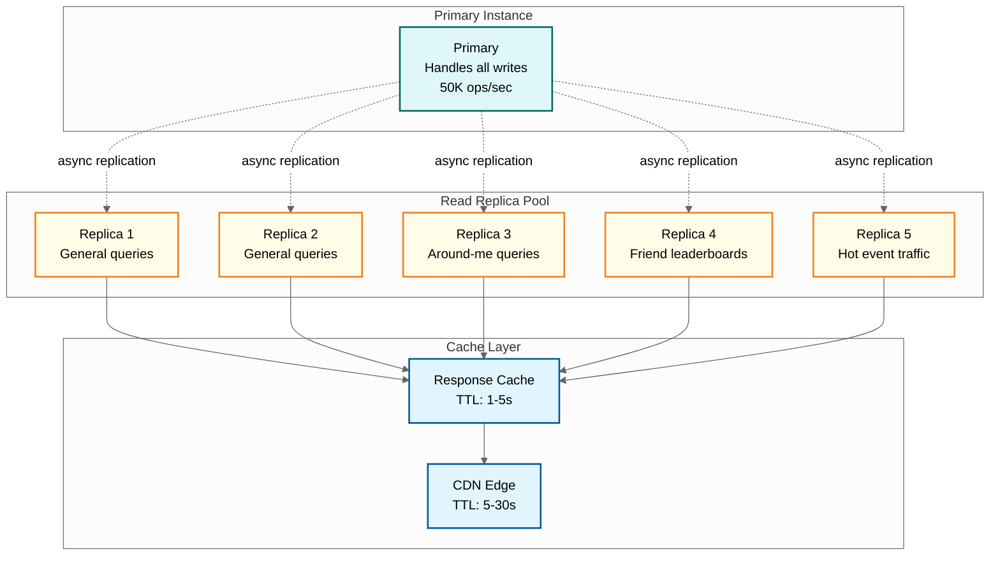
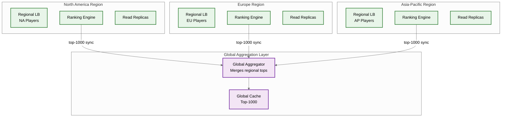

# Scalability & Reliability — Live Leaderboard System

## Scalability Strategies

### Dimension 1: Vertical Scaling (Single Instance)

Before sharding, maximize single-instance capacity:

```
Single Instance Optimization Checklist:
  1. Dedicated instance: no other data co-located with leaderboard sorted sets
  2. Disable background persistence: snapshot from replica, not primary
  3. Allocate maxmemory to 80% of physical RAM (leave headroom for OS, forks)
  4. Use 64-bit instance (no 4GB memory limit)
  5. Optimize member encoding: use integer IDs (8 bytes) instead of string UUIDs (36 bytes)
  6. Disable transparent huge pages (reduces latency jitter)

  Result: Single instance handles ~50M entries with < 5ms P99 latency
  Throughput: ~100K writes/sec, ~200K reads/sec
```

### Dimension 2: Read Scaling (Replicas)

The 4:1 read-to-write ratio (up to 20:1 during events) makes read scaling the primary concern.



**Replica Scaling Math:**

```
Each replica handles: ~200K read ops/sec
Sustained read demand: 200K queries/sec → 1 replica sufficient
Peak read demand (event): 1M queries/sec → 5 replicas needed
With CDN (80% hit rate): 1M × 0.2 = 200K queries to origin → 1 replica
With response cache (60% of misses): 200K × 0.4 = 80K queries to replica

Effective scaling factor: CDN + cache reduces replica load by 12x
```

### Dimension 3: Write Scaling (Sharding)

When write throughput exceeds single-instance capacity or entry count exceeds memory limits:

```
Sharding Decision Matrix:

  Trigger 1: Entry count > 40M → Memory pressure
    Action: Shard by player_id hash
    Effect: Each shard holds entries/N, operates independently

  Trigger 2: Write throughput > 80K ops/sec → CPU saturation
    Action: Shard by leaderboard_id (if multiple boards)
    Effect: Different leaderboards on different instances

  Trigger 3: Single leaderboard > 100M entries → Must shard one board
    Action: Hash-shard by player_id within the leaderboard
    Effect: Cross-shard scatter-gather for rank queries

  Trigger 4: Hot leaderboard bottleneck → Read + write on same board
    Action: Hybrid sharding (top tier + general hash shards)
    Effect: Top-N queries avoid scatter-gather
```

### Dimension 4: Multi-Region Deployment

For global games with players across continents:



**Multi-Region Strategy:**

```
Tier 1: Regional Leaderboards (Authoritative)
  - Each region maintains its own sorted set
  - Score updates are local (low latency, no cross-region writes)
  - Regional rank queries are fast (single-region)

Tier 2: Global Leaderboard (Aggregated)
  - Periodically (every 5-10 seconds), each region pushes its top-N to aggregator
  - Global aggregator performs K-way merge across regions
  - Global top-1000 is cached and served from all regions
  - Exact global rank for non-top players uses cross-region scatter-gather

Trade-off:
  - Regional ranks: exact, < 50ms
  - Global top-1000: near-exact, < 100ms (refreshed every 5-10s)
  - Global rank for player #500,000: approximate, < 2s
```

### Dimension 5: Leaderboard Lifecycle Scaling

Not all leaderboards have the same lifecycle or load pattern:

```
Leaderboard Tiering:

  Hot Tier (in-memory, dedicated instances):
    - Active season leaderboards for top games
    - Currently-running tournament leaderboards
    - < 100 leaderboards, each > 1M entries
    - Full replica set, CDN caching

  Warm Tier (in-memory, shared instances):
    - Active leaderboards for smaller games
    - Weekly/daily reset boards
    - 1,000-10,000 leaderboards, each < 1M entries
    - Co-located on shared instances, 2 replicas each

  Cold Tier (on-disk, loaded on demand):
    - Historical season leaderboards
    - Archived tournament results
    - > 100,000 leaderboards
    - Stored in object storage, loaded to memory on query
    - Evicted after 5-minute inactivity (LRU)

  Frozen Tier (object storage only):
    - Completed seasons older than 1 year
    - Read-only snapshots
    - Served from object storage with CDN caching
```

---

## Reliability Strategies

### Failure Mode 1: Primary Instance Failure

```
Detection:
  - Health check failure (3 consecutive misses in 5 seconds)
  - Replication lag spike (replica not receiving updates)
  - Sentinel/cluster manager detects primary unreachable

Recovery:
  1. Sentinel promotes highest-priority replica to primary (~5-15 seconds)
  2. Other replicas reconfigure to follow new primary
  3. Score ingestion workers reconnect to new primary
  4. Event log replays scores from last successful replication checkpoint
  5. Brief period of stale reads from remaining replicas (< 15s)

Impact:
  - Write unavailability: 5-15 seconds during failover
  - Read availability: unaffected (replicas still serve)
  - Data loss risk: last 1-5 seconds of unreplicated writes
    → Mitigated by event log replay

RTO: 15 seconds
RPO: < 5 seconds (bounded by replication lag)
```

### Failure Mode 2: Read Replica Failure

```
Detection:
  - Health check failure
  - Query latency spike (P99 > 100ms)

Recovery:
  1. Load balancer removes failed replica from pool
  2. Remaining replicas absorb additional load
  3. New replica spun up and synced from primary
  4. Sync time: ~30 seconds for 50M entries (full sync)

Impact:
  - Read capacity temporarily reduced by 1/N (N = replica count)
  - No data loss risk
  - Transparent to clients (load balancer handles routing)

Capacity Planning: Always maintain N+1 replicas (can lose one without SLO breach)
```

### Failure Mode 3: Event Log Failure

```
Detection:
  - Write acknowledgment timeout
  - Partition leader unavailable

Recovery:
  1. Score ingestion service buffers events in memory (< 60 seconds)
  2. If buffer fills, return 503 to game servers (backpressure)
  3. Game servers queue scores locally (client-side buffer)
  4. On event log recovery, drain local buffers in order

Impact:
  - Score submissions may be delayed (buffered, not lost)
  - Ranking engine continues serving existing data
  - At-least-once delivery: deduplication by event_id on replay

Maximum Buffer:
  50K events/sec × 200 bytes × 60 seconds = 600 MB in-memory buffer
  Sufficient for most event log outages
```

### Failure Mode 4: Network Partition (Split Brain)

```
Scenario:
  Network partition isolates primary from replicas.
  Sentinel promotes a replica to new primary.
  Original primary recovers → two primaries exist.

Prevention:
  1. Original primary detects it can't reach quorum of replicas
  2. Original primary stops accepting writes (self-demotes to read-only)
  3. Minimum replica quorum: ceil(N/2) replicas must be reachable

Recovery:
  1. When partition heals, original primary syncs from new primary
  2. Any writes accepted during partition by the old primary are lost
  3. Event log replay recovers these lost writes

Configuration:
  min-replicas-to-write: 1 (at least 1 replica must confirm)
  min-replicas-max-lag: 10 (max replication lag in seconds)
  → Primary stops accepting writes if no replica within 10s lag
```

### Failure Mode 5: Cascading Failure During Season Reset

```
Scenario:
  Season reset triggers 10M players to simultaneously submit scores.
  Write throughput spikes to 200K/sec, overwhelming the pipeline.

Prevention:
  1. Rate limiting at API gateway: max 200K writes/sec globally
  2. Score ingestion queue absorbs burst (queue depth up to 1M events)
  3. Ranking engine consumers process at steady rate (50K/sec)
  4. Client-side exponential backoff on 429/503 responses
  5. Staggered reset notification (5-10 minute window)

Circuit Breaker Configuration:
  - Open circuit if error rate > 10% over 30 seconds
  - Half-open after 15 seconds (allow 10% of traffic through)
  - Close circuit when error rate drops below 5%
```

---

## Warm Standby Strategy

```
Warm Standby Configuration:

Active-Passive Setup:
  Primary Cluster (Active):
    - Handles all writes and reads
    - Full replica set

  Standby Cluster (Warm):
    - Receives async replication from primary
    - Lag: 1-5 seconds behind primary
    - Does NOT serve traffic normally
    - Can be promoted in < 30 seconds

  Promotion Trigger:
    - Entire primary cluster unreachable for > 30 seconds
    - Manual operator decision (to avoid false positives)
    - Automated only if monitoring confirms DC-level failure

  Data Reconciliation After Failback:
    1. Stop writes to standby
    2. Sync primary from standby state
    3. Apply any events from event log that standby missed
    4. Verify sorted set checksums match
    5. Redirect traffic back to primary
```

---

## Seasonal Reset Without Downtime — Detailed Flow

```
Timeline of Zero-Downtime Reset:

T-5min: Pre-warm phase
  - Create new season sorted sets on all shards
  - Allocate memory for expected initial entries
  - Notify CDN to prepare for cache invalidation

T-1min: Snapshot phase
  - Capture snapshot of current season from replicas
  - Store snapshot metadata in persistent store
  - Verify snapshot integrity (checksum)

T-0: Atomic swap
  - Acquire distributed lock (< 100ms hold time)
  - Swap season pointer on all shards
  - Release lock
  - Score ingestion workers read new pointer on next event

T+0 to T+5s: Drain phase
  - In-flight events for old season are routed correctly (by timestamp)
  - New events write to new season
  - Clients may briefly see empty leaderboard (acceptable)

T+5s to T+5min: Ramp-up phase
  - New scores populate the leaderboard
  - First submissions get early high ranks (natural)
  - CDN caches warm with new data

T+5min to T+24h: Cleanup phase
  - Archive old season to object storage
  - Old sorted sets remain in memory for 24h (grace period for appeals)
  - After 24h: evict old season from memory, serve from archive

T+7d: Purge
  - Remove old season sorted sets entirely
  - Historical queries served from object storage
```

---

## Auto-Scaling Policies

| Component | Scale Trigger | Scale Action | Cooldown |
|---|---|---|---|
| **API Gateway** | CPU > 70% for 2 min | Add instance | 3 min |
| **Score Ingestion Workers** | Queue depth > 100K events | Add 2 workers | 2 min |
| **Read Replicas** | Query latency P99 > 30ms for 5 min | Add replica | 10 min (sync time) |
| **Query Service** | Request rate > 80% capacity | Add instance | 3 min |
| **WebSocket Servers** | Connection count > 80% limit | Add instance | 5 min |
| **CDN** | Origin pull rate > threshold | Increase TTL by 2x | 1 min |
| **Notification Workers** | Notification backlog > 50K | Add 2 workers | 2 min |

### Pre-Scaling for Known Events

```
Event-Driven Pre-Scaling:

  Before scheduled tournament:
    - T-30min: Add 3 extra read replicas per shard
    - T-15min: Pre-warm CDN with empty leaderboard structure
    - T-5min: Scale WebSocket servers to 2x normal capacity
    - T-0: Tournament starts, auto-scaling handles residual

  Before seasonal reset:
    - T-60min: Pre-warm new season sorted sets
    - T-30min: Scale ingestion workers to 3x
    - T-15min: Add extra read replicas
    - T-0: Reset occurs with pre-provisioned capacity

  After event ends:
    - T+30min: Begin scale-down evaluation
    - T+60min: Remove extra replicas if load normalized
    - T+2h: Return to baseline capacity
```

---

## Disaster Recovery

```
Recovery Priority Order:
  1. Read path (rank queries) — restores player experience
  2. Write path (score submissions) — prevents score loss
  3. Notification service — real-time updates can lag
  4. Historical/snapshot queries — can be offline temporarily

RTO/RPO Summary:
  | Component          | RTO      | RPO      | Recovery Method       |
  |-------------------|----------|----------|-----------------------|
  | Ranking Engine     | 15s      | < 5s     | Replica promotion     |
  | Event Log          | 30s      | 0        | Multi-AZ replication  |
  | Query Service      | 5s       | N/A      | Stateless, restart    |
  | Snapshot Storage   | 1 hour   | 0        | Cross-region copy     |
  | Player Metadata    | 30s      | < 1s     | Database failover     |

Full Cluster Recovery (Worst Case):
  1. Provision new sorted set instances:            5 minutes
  2. Replay event log from last checkpoint:          10-30 minutes
  3. Rebuild sorted sets from events:               10-30 minutes
  4. Sync replicas:                                 5 minutes
  5. Total RTO for full rebuild:                    30-70 minutes
```

---

*Previous: [Deep Dive & Bottlenecks](./04-deep-dive-and-bottlenecks.md) | Next: [Security & Compliance →](./06-security-and-compliance.md)*
