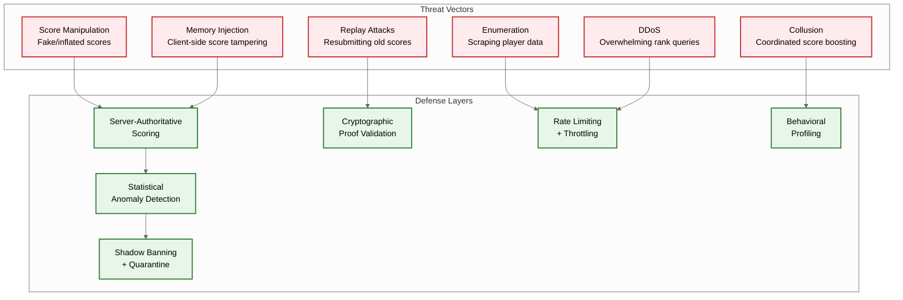

# Security & Compliance — Live Leaderboard System

## Threat Model

### Attack Surface Overview



---

## Score Validation & Anti-Cheat

### Principle 1: Server-Authoritative Scoring

The most fundamental anti-cheat principle: **never trust the client**. Scores must originate from game servers, not game clients.

```
Trust Hierarchy:

  Level 1 (Highest Trust): Server-Computed Scores
    - Game server simulates or validates gameplay
    - Score is a direct output of server-side logic
    - Client cannot influence the score value
    - Example: Server tracks kills, objectives, time → computes score

  Level 2 (Medium Trust): Server-Validated Client Scores
    - Client reports score with gameplay replay/proof
    - Server replays or validates the proof
    - Score accepted only if proof verifies
    - Example: Client submits puzzle solution; server verifies solution

  Level 3 (Lowest Trust): Client-Reported Scores
    - Client directly reports score with no proof
    - ONLY acceptable for non-competitive leaderboards
    - Must be rate-limited and anomaly-checked
    - Example: Casual single-player game with no prizes

Production systems MUST use Level 1 or Level 2.
Level 3 is only acceptable for non-competitive, non-prized leaderboards.
```

### Proof-Based Score Validation

```
FUNCTION generate_score_proof(game_server_id, match_data):
    // Game server generates proof after match completes

    proof_payload = {
        server_id: game_server_id,
        match_id: match_data.id,
        player_id: match_data.player_id,
        score: match_data.computed_score,
        game_events: match_data.event_log_hash,
        timestamp: NOW(),
        nonce: RANDOM(256)
    }

    // Sign with server's private key
    signature = HMAC_SHA256(
        server_private_key,
        SERIALIZE(proof_payload)
    )

    RETURN {
        payload: proof_payload,
        signature: signature
    }

FUNCTION validate_score_proof(score_event):
    proof = score_event.proof

    // Step 1: Verify server identity
    server = GET_SERVER(proof.payload.server_id)
    IF server == NULL OR server.revoked:
        REJECT("unknown or revoked server")

    // Step 2: Verify signature
    expected_sig = HMAC_SHA256(
        server.public_key,
        SERIALIZE(proof.payload)
    )
    IF proof.signature != expected_sig:
        REJECT("invalid signature — tampering detected")

    // Step 3: Verify freshness (prevent replay)
    IF NOW() - proof.payload.timestamp > MAX_PROOF_AGE:
        REJECT("proof expired — possible replay")

    // Step 4: Verify nonce uniqueness (prevent replay)
    IF NONCE_SEEN(proof.payload.nonce):
        REJECT("duplicate nonce — replay attack")
    MARK_NONCE_SEEN(proof.payload.nonce, TTL=MAX_PROOF_AGE)

    // Step 5: Verify score matches proof
    IF score_event.score != proof.payload.score:
        REJECT("score mismatch between event and proof")

    RETURN VALID
```

### Anti-Cheat Detection Strategies

```
Strategy 1: Statistical Distribution Analysis
  - Maintain per-leaderboard score distribution (mean, stddev, percentiles)
  - Flag scores > 4 standard deviations from mean
  - Compare player's score progression vs population curve
  - Alert on players whose score trajectory is statistically impossible

Strategy 2: Temporal Analysis
  - Track time between score submissions per player
  - Flag scores achieved faster than the theoretical minimum game duration
  - Detect "inhuman" patterns: perfect scores at regular intervals
  - Monitor for suspicious patterns in submission timestamps

Strategy 3: Cross-Player Correlation
  - Detect clusters of accounts with similar scoring patterns
  - Identify win-trading (two accounts alternately boosting each other)
  - Flag accounts that only play against specific opponents
  - Monitor for "shared device" patterns (same IP, similar hardware fingerprint)

Strategy 4: Behavioral Profiling
  - Build per-player behavioral model over time
  - Track metrics: accuracy, reaction time, score variance, play frequency
  - Detect sudden capability jumps inconsistent with learning curves
  - Compare in-game performance metrics against reported scores

Strategy 5: Honeypot Leaderboards
  - Create invisible test leaderboards
  - Any score submission to a honeypot = automated tool detected
  - Use canary entries with known scores; detect if modified externally
```

---

## Rate Limiting

### Multi-Layer Rate Limiting Architecture

```
Layer 1: Network Edge (DDoS Protection)
  - Volumetric: 10,000 requests/sec per IP
  - Connection: 100 concurrent connections per IP
  - Geographic: Block traffic from unexpected regions

Layer 2: API Gateway
  - Per API key: 10,000 requests/sec (configurable per game)
  - Per endpoint: different limits per operation type
  - Adaptive: automatically tighten during detected attacks

Layer 3: Application
  - Per player (score submission): 10/minute
  - Per player (rank query): 60/minute
  - Per player (friend leaderboard): 10/minute
  - Per game server: 5,000 score submissions/second

Layer 4: Ranking Engine
  - Write queue depth limit: 1M events
  - Backpressure: reject new events when queue > 80% full
  - Per-leaderboard: 50K writes/sec cap
```

### Rate Limit Implementation

```
FUNCTION check_rate_limit(player_id, operation, limit, window_seconds):
    key = "rate:" + operation + ":" + player_id
    current_window = FLOOR(NOW() / window_seconds)
    window_key = key + ":" + current_window

    count = INCR(window_key)
    IF count == 1:
        EXPIRE(window_key, window_seconds * 2)  // Auto-cleanup

    IF count > limit:
        retry_after = window_seconds - (NOW() MOD window_seconds)
        RETURN {
            allowed: false,
            retry_after_seconds: retry_after,
            limit: limit,
            remaining: 0
        }

    RETURN {
        allowed: true,
        remaining: limit - count
    }
```

### Progressive Trust Model

```
New Account Restrictions:
  Day 0-1:   Max 50 score submissions, rank queries unlimited
  Day 1-7:   Max 200 score submissions/day
  Day 7-30:  Max 1,000 score submissions/day
  Day 30+:   Standard limits (10/minute)

Trust Score Adjustments:
  High trust (>0.9): 2x rate limits
  Normal trust (0.5-0.9): Standard limits
  Low trust (<0.5): 0.5x rate limits, all scores flagged for review
  Banned (0.0): No score submissions, read-only access

Trust Score Factors:
  + Account age (max +0.2)
  + Payment history (max +0.1)
  + Consistent play patterns (max +0.2)
  + No prior violations (max +0.3)
  + Verified identity (max +0.2)
  - Anomalous scores (-0.3 per incident)
  - Rate limit violations (-0.1 per violation)
  - Association with banned accounts (-0.5)
```

---

## PII Handling in Public Leaderboards

### Data Classification

```
Public Data (displayed on leaderboards):
  - Display name (chosen by player, may be pseudonym)
  - Avatar (player-selected image)
  - Rank and score
  - Region/country (optional, player-configured)
  - Clan/team name

Private Data (never displayed on leaderboards):
  - Real name
  - Email address
  - IP address
  - Device identifiers
  - Location (precise)
  - Payment information
  - Friend list composition (only visible to the player)

Derived Data (internal only):
  - Trust score
  - Anti-cheat flags
  - Score validation history
  - Behavioral profile
```

### PII Protection Measures

```
Measure 1: Display Name Sanitization
  - Filter offensive content (profanity filter)
  - Prevent impersonation of official accounts
  - Rate-limit name changes (1 per week)
  - Allow players to opt out of public display (show "Anonymous Player")

Measure 2: Data Minimization
  - Leaderboard entries contain ONLY: player_id, display_name, score, rank
  - Player metadata (avatar, region) fetched separately and cached
  - No PII stored in the ranking engine sorted sets

Measure 3: Right to Erasure (GDPR/CCPA)
  - Player can request account deletion
  - Remove player from all active leaderboards (ZREM from sorted sets)
  - Anonymize historical snapshots: replace player_id with hash
  - Score event log: soft-delete (mark as redacted, retain aggregate stats)
  - Completion: within 30 days of request

Measure 4: Age-Appropriate Design (COPPA)
  - Players under 13: display name restricted to system-generated
  - No social features (friend leaderboard disabled)
  - Parental consent required for public leaderboard participation

Measure 5: Data Residency
  - EU player data stored in EU region
  - Regional leaderboards respect data residency requirements
  - Global leaderboards contain only anonymized/pseudonymized entries
```

---

## Replay Attack Prevention

```
Attack Vector:
  An attacker captures a valid score submission (with proof)
  and resubmits it to receive the same score again (useful for
  cumulative leaderboards where repeated submissions increase rank).

Defense 1: Nonce-Based Deduplication
  - Every score proof contains a unique nonce
  - Nonces are stored in a distributed set with TTL = max_proof_age
  - Duplicate nonces are immediately rejected
  - Space: 100K nonces × 32 bytes = 3.2 MB (trivial)

Defense 2: Timestamp Validation
  - Proof timestamp must be within 5 minutes of submission
  - Prevents using old proofs from previous game sessions
  - Clock skew tolerance: ±30 seconds

Defense 3: Sequence Numbers
  - Each game server maintains a monotonic sequence number
  - Score submissions must have sequence > last accepted sequence
  - Out-of-order sequences are rejected or reordered

Defense 4: Match ID Uniqueness
  - Each match generates a unique match_id
  - Score submissions reference the match_id
  - A match_id can only produce one score submission per player
  - Match IDs are tracked for 24 hours then pruned
```

---

## API Security

### Authentication & Authorization

```
Authentication Flow:
  Game Server → API Gateway:
    - API key + secret in Authorization header
    - API key identifies the game; secret authenticates
    - Rate limits applied per API key

  Game Client → API Gateway:
    - JWT token obtained from game auth service
    - Token contains: player_id, game_id, permissions, expiry
    - Token validated on every request

  Admin Dashboard → API Gateway:
    - OAuth 2.0 with MFA
    - Role-based access: admin, game_manager, read_only
    - All actions audit-logged

Authorization Rules:
  Score submission:
    - Only game servers (API key auth) can submit scores
    - Game clients CANNOT submit scores directly
  Rank query:
    - Any authenticated player can query any public leaderboard
    - Friend leaderboard: only for the requesting player's friend list
  Admin operations:
    - Reset: requires admin role + confirmation
    - Ban player: requires admin role + reason
    - View anti-cheat data: requires admin or security analyst role
```

### API Hardening

```
Input Validation:
  - player_id: must match UUID v4 format
  - leaderboard_id: alphanumeric + hyphens, max 128 chars
  - score: numeric, within [MIN_SCORE, MAX_SCORE] per leaderboard config
  - count (for top-N): integer, max 1000
  - All string inputs: sanitized against injection

Response Filtering:
  - Never return internal IDs or database keys
  - Never return trust scores or anti-cheat flags to players
  - Strip server-side metadata from client-facing responses

Transport Security:
  - TLS 1.3 required for all API communication
  - Certificate pinning for game server connections
  - WebSocket connections over WSS only
  - API keys rotatable without downtime
```

---

## Compliance Framework

### Data Protection Regulations

| Regulation | Requirement | Implementation |
|---|---|---|
| **GDPR** (EU) | Right to erasure, data portability | Account deletion removes from sorted sets; export API for player data |
| **CCPA** (California) | Do not sell personal information | Leaderboard data not sold; opt-out for public display |
| **COPPA** (US) | Parental consent for under-13 | Age gate; restricted social features; system-generated display names |
| **LGPD** (Brazil) | Consent for data processing | Explicit consent on first leaderboard participation |
| **POPIA** (South Africa) | Purpose limitation | Leaderboard data used only for ranking; not shared with third parties |

### Audit Logging

```
Audit Events Captured:
  - Every score submission (player_id, score, validation result, timestamp)
  - Every admin action (operator_id, action, target, timestamp)
  - Every leaderboard reset (operator_id, leaderboard_id, reason)
  - Every player ban/unban (operator_id, player_id, reason, duration)
  - Every data deletion request (player_id, request_date, completion_date)
  - Every anti-cheat enforcement action (player_id, action, evidence)

Audit Log Properties:
  - Append-only (cannot be modified or deleted)
  - Retained for 7 years (regulatory minimum)
  - Encrypted at rest
  - Access restricted to security team and auditors
  - Tamper-evident (hash chain)
```

### Fair Play Enforcement

```
Enforcement Tiers:

  Tier 1: Warning
    - First minor violation (suspicious score that could be legitimate)
    - Player notified; score allowed to stand
    - Trust score reduced by 0.1

  Tier 2: Score Removal
    - Confirmed invalid score (failed async validation)
    - Score removed from leaderboard; player notified with reason
    - Trust score reduced by 0.3

  Tier 3: Temporary Ban
    - Repeated violations (3+ in 30 days)
    - Banned from score submissions for 7-30 days
    - Can still view leaderboards (read-only)
    - Trust score reduced to 0.2

  Tier 4: Shadow Ban
    - Sophisticated cheating detected
    - Player believes they are ranked normally
    - Their entries invisible to all other players
    - Duration: indefinite, reviewed quarterly

  Tier 5: Permanent Ban
    - Systematic cheating, botting, or commercial exploitation
    - Account permanently suspended
    - All scores removed from all leaderboards
    - Hardware/device fingerprint blocked
    - Appeal process: written submission, reviewed within 30 days
```

---

## Incident Response

```
Score Manipulation Incident Playbook:

  Detection:
    - Automated alert: anomalous score distribution shift
    - Player reports: community reporting suspicious scores
    - Anti-cheat service: flagged cluster of accounts

  Containment (< 15 minutes):
    1. Freeze affected leaderboard (no new scores accepted)
    2. Identify affected accounts
    3. Snapshot current leaderboard state

  Investigation (< 4 hours):
    1. Review score event logs for affected accounts
    2. Analyze proof validation results
    3. Cross-reference with behavioral profiles
    4. Determine scope: single player, coordinated group, or systemic

  Remediation (< 24 hours):
    1. Remove invalid scores from sorted sets
    2. Recalculate ranks for affected leaderboard
    3. Apply appropriate enforcement tier to offenders
    4. Notify affected players (those whose rank changed)

  Post-Incident:
    1. Root cause analysis: how did invalid scores bypass validation?
    2. Update validation rules to prevent recurrence
    3. Communicate transparently with player community
    4. Consider compensation for players displaced by cheaters
```

---

*Previous: [Scalability & Reliability](./05-scalability-and-reliability.md) | Next: [Observability →](./07-observability.md)*
