# 12.4 Gaming: Matchmaking System

## System Overview

A Matchmaking System is the real-time player pairing engine at the heart of every competitive multiplayer game, responsible for collecting queue requests from millions of concurrent players, evaluating skill ratings (Elo, Glicko-2, TrueSkill 2), forming balanced teams or match pairings within strict latency and fairness constraints, allocating optimal game servers based on geographic proximity, and delivering match results back to players—all within a target queue time of under 30 seconds for the median player. Modern matchmaking platforms serving titles at the scale of major competitive shooters and battle royale games process 100K+ match requests per minute across dozens of regional pools, maintain persistent skill rating models that incorporate win/loss outcomes, individual performance metrics, party composition, and behavioral signals, execute expanding-window search algorithms that progressively relax skill constraints to balance queue time against match quality, handle party-based matchmaking with weighted skill aggregation, enforce anti-smurf and anti-boosting detection, and coordinate with server allocation systems to spin up or route players to the lowest-latency game server. These systems achieve sub-30-second median queue times, match quality scores where team skill variance stays within 200 rating points, 99.9% platform availability, and graceful degradation during peak concurrent player surges—while simultaneously feeding post-match outcomes back into the rating engine to continuously refine player skill estimates.

---

## Key Characteristics

| Characteristic | Description |
|---|---|
| **Architecture Style** | Event-driven microservices with regionalized matching pools, in-memory queue state, and asynchronous rating updates |
| **Core Abstraction** | Match ticket as a stateful entity progressing through queued → searching → matched → server-allocated → in-game lifecycle with skill and latency metadata |
| **Processing Model** | Real-time for queue management and match formation; near-real-time for skill rating updates; batch for smurf detection, rating recalibration, and analytics |
| **Matching Algorithm** | Expanding-window search with configurable skill tolerance, latency caps, and party-aware weighted averaging—progressively relaxing constraints over wait time |
| **Rating Engine** | Bayesian skill estimation (TrueSkill 2 family) tracking mean skill (μ) and uncertainty (σ) per player per game mode, with decay for inactivity |
| **Queue Management** | Priority-sorted concurrent queues partitioned by region, game mode, and rank tier with atomic dequeue operations to prevent double-matching |
| **Server Allocation** | Latency-based server selection considering player geographic distribution, available server capacity, and predicted match duration |
| **Data Consistency** | Strong consistency for queue state and match assignments; eventual consistency for skill ratings and analytics |
| **Availability Target** | 99.9% for matchmaking API, 99.95% for end-to-end queue-to-game-start pipeline, zero match data loss |
| **Fairness Framework** | Smurf detection via accelerated MMR convergence, hardware fingerprinting, and behavioral analysis; boosting prevention via party skill restrictions and IP correlation |
| **Scalability Model** | Horizontally scaled stateless API tier; regionalized matching workers with in-memory queue state; partitioned rating storage by player ID |

---

## Quick Navigation

| Document | Focus Area |
|---|---|
| [01 - Requirements & Estimations](./01-requirements-and-estimations.md) | Functional/non-functional requirements, capacity planning with matchmaking-specific math |
| [02 - High-Level Design](./02-high-level-design.md) | Architecture diagrams, matchmaking lifecycle data flows, regional pool topology |
| [03 - Low-Level Design](./03-low-level-design.md) | Data models, API contracts, TrueSkill 2 algorithm, expanding-window search, party aggregation |
| [04 - Deep Dive & Bottlenecks](./04-deep-dive-and-bottlenecks.md) | Skill rating engine internals, queue race conditions, outlier skill starvation |
| [05 - Scalability & Reliability](./05-scalability-and-reliability.md) | Regional pool expansion, peak auto-scaling, queue failover, match recovery |
| [06 - Security & Compliance](./06-security-and-compliance.md) | Smurf detection, boosting prevention, queue manipulation, player data privacy |
| [07 - Observability](./07-observability.md) | Queue time distributions, match quality histograms, rating drift detection |
| [08 - Interview Guide](./08-interview-guide.md) | 45-minute pacing, matchmaking-specific traps, trade-off discussions |
| [09 - Insights](./09-insights.md) | Key architectural insights and cross-cutting patterns |

---

## What Differentiates This System

| Dimension | Basic Matchmaker | Production Matchmaking Platform |
|---|---|---|
| **Skill Model** | Simple Elo with fixed K-factor | TrueSkill 2 with uncertainty tracking, performance features, mode-specific ratings, and inactivity decay |
| **Queue Strategy** | Fixed skill window, FIFO matching | Expanding-window search with dynamic tolerance relaxation, priority weighting, and starvation prevention |
| **Party Handling** | Use highest-ranked player's rating | Weighted average with highest-player skew, party size restrictions by rank tier, and cross-party balancing |
| **Server Selection** | Random available server | Latency-optimal selection considering all players' geographic positions, server load, and capacity headroom |
| **Fairness** | No smurf detection | Accelerated MMR convergence, hardware fingerprinting, behavioral anomaly detection, and boosting prevention |
| **Match Quality** | Win rate balancing only | Multi-factor quality scoring: skill variance, role coverage, latency fairness, party symmetry, and rematch avoidance |
| **Scale** | Single-region, single-queue | Multi-region pools with cross-region overflow, mode-specific queues, and tens of millions of concurrent players |
| **Feedback Loop** | Static ratings | Continuous rating recalibration with individual performance features, confidence intervals, and season resets |

---

## Complexity Rating

| Dimension | Rating | Notes |
|---|---|---|
| **Algorithmic** | ★★★★★ | TrueSkill 2 Bayesian inference, expanding-window optimization, NP-hard team formation |
| **Concurrency** | ★★★★★ | Atomic queue operations across millions of concurrent requests, double-match prevention |
| **Latency Sensitivity** | ★★★★★ | Sub-30s median queue time target, real-time match formation, instant server allocation |
| **Scale** | ★★★★☆ | 10M+ concurrent players, 100K+ match requests/min, regionalized pool management |
| **Fairness/Trust** | ★★★★★ | Smurf detection, boosting prevention, rating manipulation resistance, perceived fairness |
| **Domain Complexity** | ★★★★☆ | Game-mode-specific rules, party constraints, role-based matching, season/rank systems |

---

## Key Trade-offs at a Glance

| Trade-off | Dimension A | Dimension B | Typical Resolution |
|---|---|---|---|
| **Queue Time vs Match Quality** | Faster matches (looser skill range) | Better-balanced matches (tighter skill range) | Time-based expansion: start strict, relax progressively |
| **Skill Accuracy vs Rating Stability** | Rapid rating adjustment (volatile) | Stable ratings (slow to reflect improvement) | Uncertainty-weighted updates with diminishing K-factor |
| **Fairness vs Party Freedom** | Strict party rank restrictions | Allow friends of any rank to queue together | Separate queues for wide-rank parties with adjusted matching |
| **Regional Latency vs Queue Population** | Strict regional pools (low latency) | Cross-region matching (larger pool) | Regional-first with cross-region overflow after timeout |
| **Smurf Detection vs New Player Experience** | Aggressive smurf detection (false positives) | Conservative detection (smurfs slip through) | Accelerated MMR convergence for new accounts (5-game calibration) |

---

## Matchmaking Lifecycle at a Glance

```mermaid
flowchart LR
    subgraph Entry["Queue Entry"]
        A[Player clicks<br/>Find Match]
        B[Create Match<br/>Ticket]
    end

    subgraph Search["Match Search"]
        C[Expanding Window<br/>Search]
        D[Quality Scoring<br/>& Team Formation]
    end

    subgraph Allocation["Server Allocation"]
        E[Latency-Optimal<br/>Server Selection]
        F[Session<br/>Handoff]
    end

    subgraph Game["In-Game"]
        G[Match<br/>In Progress]
        H[Outcome<br/>Collection]
    end

    subgraph Rating["Post-Match"]
        I[TrueSkill 2<br/>Rating Update]
        J[Smurf/Boost<br/>Analysis]
    end

    A --> B --> C --> D --> E --> F --> G --> H --> I --> J

    classDef entry fill:#e1f5fe,stroke:#01579b,stroke-width:2px
    classDef search fill:#e8f5e9,stroke:#2e7d32,stroke-width:2px
    classDef alloc fill:#fff3e0,stroke:#e65100,stroke-width:2px
    classDef game fill:#f3e5f5,stroke:#6a1b9a,stroke-width:2px
    classDef rating fill:#fffde7,stroke:#f57f17,stroke-width:2px

    class A,B entry
    class C,D search
    class E,F alloc
    class G,H game
    class I,J rating
```

---

## Domain Glossary

| Term | Definition |
|---|---|
| **μ (mu)** | Mean skill estimate in the TrueSkill model; represents the system's best guess of a player's true ability |
| **σ (sigma)** | Skill uncertainty in the TrueSkill model; decreases as the system gains confidence from more matches |
| **Ordinal Rating** | Display-ready rating calculated as μ - 3σ; represents the system's conservative skill floor estimate |
| **Expanding Window** | The technique of progressively widening acceptable skill, latency, and quality tolerances as a player's queue time increases |
| **Match Ticket** | The queue entry representing a player or party, containing skill data, preferences, and search parameters |
| **Pool** | A collection of active match tickets segmented by region, game mode, and optionally rank tier |
| **Double-Matching** | A race condition where two match workers simultaneously select the same ticket for different matches |
| **Party Synergy Bonus** | Additional effective skill added to a party's aggregate rating to account for coordination advantage |
| **Queue Starvation** | Condition where a ticket cannot find a match due to insufficient same-skill players in the pool |
| **Smurf** | An experienced player creating a new account to face weaker opponents; detected via behavioral and hardware signals |
| **Boosting** | Artificially inflating another player's rank through account sharing or coordinated play |
| **Win Trading** | Coordinated behavior where players deliberately lose to each other on alternating accounts |
| **Rank Rating (RR)** | Visible player-facing rating that moves predictably per win/loss; may differ from hidden MMR |
| **MMR (Matchmaking Rating)** | Hidden internal rating used for actual match formation; based on TrueSkill μ |
| **Placement Matches** | Initial calibration matches for a new account or season where uncertainty is high and rating changes are large |
| **Soft Reset** | Seasonal rating adjustment that increases uncertainty and slightly regresses skill toward the mean |
| **Stomp Rate** | Percentage of matches that are one-sided (decided by a large margin), indicating poor match quality |
| **Fill Match** | A match formed with fewer than the ideal number of players (e.g., 4v4 in a 5v5 mode) to reduce extreme queue times |
| **Cross-Region Overflow** | Routing a player to a server in a non-home region when the local pool cannot form a match in time |

---

## Related Systems

| System | Relationship to Matchmaking |
|---|---|
| **Game State Synchronization** | Downstream consumer — receives matched player groups and manages real-time game state |
| **Live Leaderboard** | Consumes rating updates to maintain public rankings and seasonal standings |
| **Player Profile Service** | Provides player data (cosmetics, progression) displayed during match loading |
| **Social Graph Service** | Provides friend/block lists for "prefer/avoid" matching features |
| **Anti-Cheat System** | Feeds detection signals (aim assist, speed hacks) that influence matchmaking integrity scoring |
| **Analytics Platform** | Consumes match outcomes, queue telemetry, and quality metrics for game health dashboards |
| **Server Fleet Manager** | Provides available server capacity; matchmaking requests server allocation |
| **Push Notification Service** | Delivers match-found and queue-status notifications to mobile clients |
