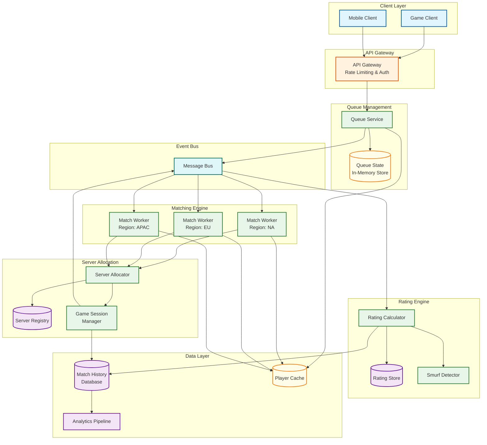
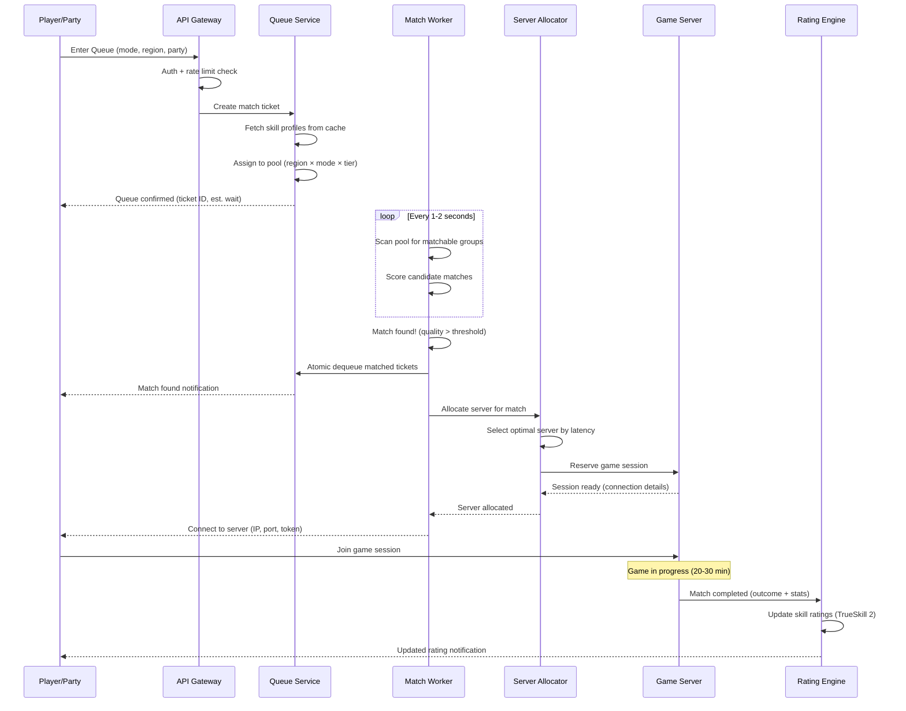
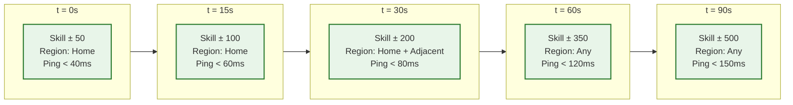
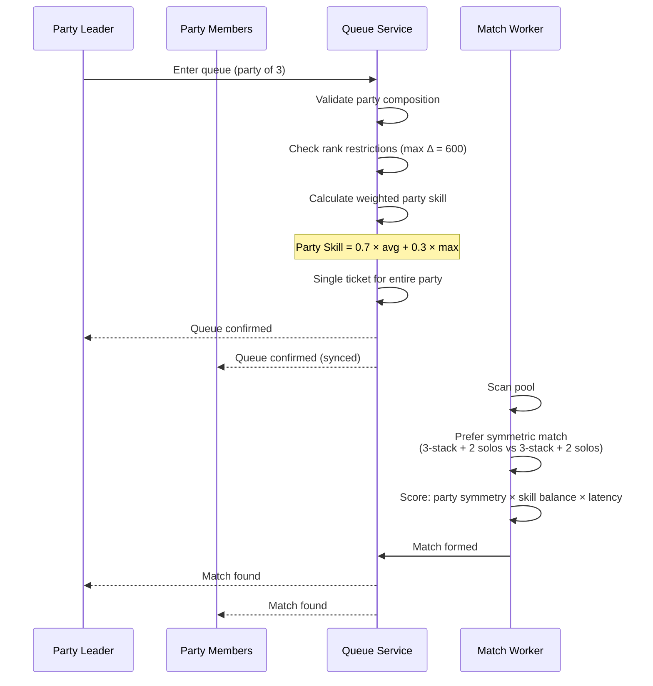
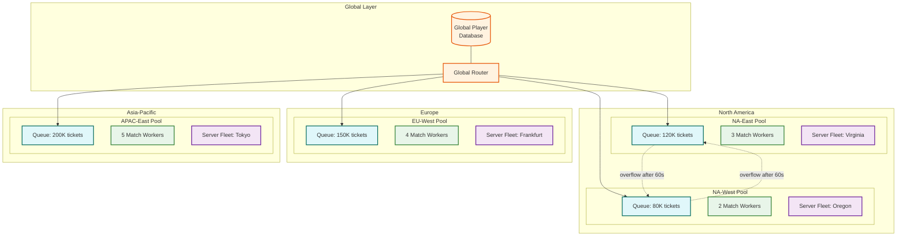

# High-Level Design — Gaming Matchmaking System

## 1. Architecture Overview

The matchmaking system follows a regionalized, event-driven microservices architecture with four primary layers: the API Gateway accepting queue requests, the Queue Manager organizing players into searchable pools, the Matchmaker forming balanced matches, and the Server Allocator assigning game infrastructure. A separate Rating Engine processes post-match outcomes asynchronously to update player skill profiles.



---

## 2. Core Components

### 2.1 API Gateway

| Responsibility | Detail |
|---|---|
| **Authentication** | Validate player session tokens, extract player ID and entitlements |
| **Rate Limiting** | Per-player queue entry throttle (1 request per 5 seconds) to prevent spam |
| **Request Routing** | Route to nearest regional Queue Service based on player's detected region |
| **Input Validation** | Validate game mode, party composition, and role preferences |
| **WebSocket Management** | Maintain persistent connections for real-time queue status and match notifications |

### 2.2 Queue Service

The Queue Service is the stateful coordination point that manages player queue lifecycle.

| Responsibility | Detail |
|---|---|
| **Ticket Creation** | Create match tickets with player skill data, latency profile, party info, and queue entry timestamp |
| **Queue Assignment** | Place tickets into the correct pool (region × game mode × rank tier) |
| **Status Updates** | Push real-time queue position and estimated wait time to clients via WebSocket |
| **Cancellation** | Handle explicit cancels and implicit timeouts (disconnect detection) |
| **Deduplication** | Prevent players from being in multiple queues simultaneously |

### 2.3 Match Workers (Regionalized)

Each region runs independent match workers that process their pool's queue:

| Responsibility | Detail |
|---|---|
| **Pool Scanning** | Every 1-2 seconds, scan the regional queue pool for matchable ticket combinations |
| **Quality Scoring** | Evaluate candidate matches using multi-factor quality function |
| **Expanding Window** | Apply time-based tolerance relaxation for tickets that have waited longer |
| **Match Formation** | Atomically dequeue matched tickets and emit match-formed events |
| **Party Balancing** | Ensure party composition symmetry (party vs party, not party vs solos) |

### 2.4 Server Allocator

| Responsibility | Detail |
|---|---|
| **Latency Optimization** | Select the server location minimizing aggregate latency for all matched players |
| **Capacity Management** | Track available server instances per region, request scaling when headroom drops |
| **Server Health** | Monitor server heartbeats, exclude unhealthy servers from allocation |
| **Session Handoff** | Provide matched players with server connection details (IP, port, auth token) |

### 2.5 Rating Engine

| Responsibility | Detail |
|---|---|
| **Skill Updates** | Apply TrueSkill 2 Bayesian updates after match completion |
| **Performance Features** | Incorporate individual performance metrics (kills, assists, objectives) into rating adjustment |
| **Uncertainty Management** | Track and decay confidence intervals for inactive players |
| **Smurf Detection** | Identify accounts with anomalously high performance relative to rating |
| **Season Management** | Execute seasonal soft resets, placement match logic |

### 2.6 Game Session Manager

| Responsibility | Detail |
|---|---|
| **Session Lifecycle** | Track game sessions from creation through completion |
| **Outcome Collection** | Receive match results (winner, individual stats) from game servers |
| **Disconnect Handling** | Manage player disconnects, reconnection windows, and abandonment penalties |
| **Result Publishing** | Emit match-completed events to rating engine and analytics pipeline |

---

## 3. Data Flow: Matchmaking Lifecycle

### 3.1 Queue Entry to Game Start



### 3.2 Expanding Window Over Time



### 3.3 Party Matchmaking Flow



---

## 4. Regional Architecture

### 4.1 Region Topology



### 4.2 Cross-Region Overflow Rules

| Condition | Action |
|---|---|
| Ticket age < 60s | Match within home region only |
| Ticket age 60-90s | Expand to adjacent regions (NA-East ↔ NA-West, EU-West ↔ EU-North) |
| Ticket age > 90s | Expand to any region where player ping < 150ms |
| Extremely outlier skill (top 0.1%) | Immediately search adjacent regions from t=0 |
| Tournament mode | Restrict to designated tournament region, no overflow |

---

## 5. Key Design Decisions

### 5.1 Greedy vs Optimal Matching

| Approach | Pros | Cons | Decision |
|---|---|---|---|
| **Greedy** (first valid match) | Lowest queue time, simple implementation | Suboptimal quality, may miss better pairings | Use for casual modes |
| **Batch Optimal** (accumulate then solve) | Best match quality, global optimization | Higher latency (wait for batch window), complex solver | Use for ranked/competitive |
| **Hybrid** (greedy with quality floor) | Good balance of speed and quality | More complex logic, tuning required | **Selected for default** |

The hybrid approach runs every 1-2 seconds: accumulate tickets, score all valid pairings within each pool, select the highest-quality set of non-overlapping matches, and emit them atomically.

### 5.2 Centralized vs Regionalized Matching

| Approach | Pros | Cons | Decision |
|---|---|---|---|
| **Centralized** (single global matcher) | Largest pool, best skill matching | High cross-region latency, single point of failure | Rejected |
| **Regionalized** (per-region matchers) | Low latency, independent scaling | Smaller pools, outlier skill starvation | **Selected** |
| **Federated** (regional primary, global overflow) | Balance of pool size and latency | Cross-region coordination complexity | Enhancement of selected |

Each region operates independently with its own match workers and queue state. Cross-region overflow is triggered only after time-based thresholds.

### 5.3 Rating System Selection

| System | Strengths | Weaknesses | Decision |
|---|---|---|---|
| **Elo** | Simple, well-understood | No uncertainty tracking, 1v1 only, slow convergence | Rejected |
| **Glicko-2** | Uncertainty + volatility, good for 1v1 | Not designed for team games, complex adaptation needed | Considered |
| **TrueSkill 2** | Team-native, uncertainty tracking, performance features, proven at scale | Microsoft-originated complexity, patent considerations | **Selected** |

TrueSkill 2 natively supports team games, tracks skill uncertainty (σ) for confidence intervals, incorporates individual performance features beyond win/loss, and has proven scalability at major game platform scale.

---

## 6. Match Quality Function

The match quality score determines whether a candidate match is good enough to form:

```
MatchQuality = w₁ × SkillBalance + w₂ × LatencyFairness +
               w₃ × PartySymmetry + w₄ × RoleBalance +
               w₅ × RematchPenalty

Where:
- SkillBalance = 1 - (|AvgSkillTeamA - AvgSkillTeamB| / MaxSkillRange)
- LatencyFairness = 1 - (PingVariance / MaxPingVariance)
- PartySymmetry = 1 - (|PartySizeTeamA - PartySizeTeamB| / MaxPartySize)
- RoleBalance = RolesCovered / TotalRolesNeeded
- RematchPenalty = 0 if no recent rematches, else -0.2 per recent opponent overlap

Default weights: w₁=0.40, w₂=0.25, w₃=0.15, w₄=0.10, w₅=0.10
Quality threshold: 0.65 (relaxes to 0.45 after 90s queue time)
```

---

## 7. Technology-Agnostic Infrastructure Mapping

| Component | Infrastructure Pattern | Scaling Unit |
|---|---|---|
| API Gateway | Load-balanced HTTP/WebSocket reverse proxy | Horizontal, per concurrent connection count |
| Queue Service | In-memory key-value store with sorted sets | Per-region, vertical (memory-bound) |
| Match Workers | Stateless compute with in-memory pool snapshot | Horizontal, per-region queue depth |
| Server Allocator | Service with server registry cache | Horizontal, per match formation rate |
| Rating Engine | Event-driven workers consuming match-complete events | Horizontal, per match completion rate |
| Player Cache | Distributed cache cluster | Per total player data size |
| Match History DB | Partitioned document/wide-column store | Time-partitioned, per write throughput |
| Event Bus | Distributed message broker with topic partitioning | Per event throughput |
| Analytics | Stream processing into columnar warehouse | Per event volume |
