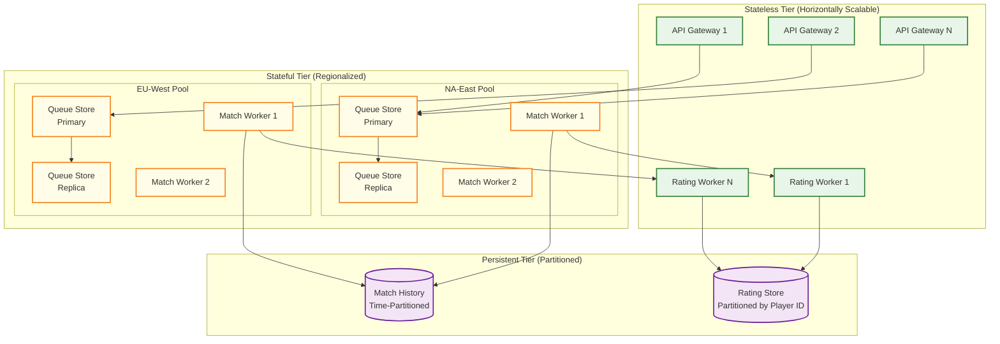

# Scalability & Reliability — Gaming Matchmaking System

## 1. Scalability Architecture

### 1.1 Horizontal Scaling Model



### 1.2 Scaling Dimensions

| Component | Scaling Trigger | Scaling Unit | Scaling Limit |
|---|---|---|---|
| **API Gateway** | Concurrent WebSocket connections > 80% capacity | Add gateway instance | Virtually unlimited (stateless) |
| **Queue Store** | Memory utilization > 70% or ticket count > 100K | Vertical scale (memory) or split pool into sub-tiers | Memory-bound; 320MB for 800K tickets fits in single node |
| **Match Workers** | Matching cycle time > 800ms or queue backlog growing | Add worker to regional pool | Diminishing returns due to conflict rate above 4-6 workers per pool |
| **Rating Workers** | Event queue depth > 5K events | Add rating worker instances | Virtually unlimited (stateless, idempotent) |
| **Server Allocator** | Allocation latency > 3s or capacity headroom < 20% | Request more game server instances from fleet manager | Constrained by physical server capacity |
| **Rating Store** | Read latency > 10ms at p99 | Add read replicas or partition further | Standard database scaling |
| **Match History DB** | Write throughput > 80% capacity | Time-based partition rotation | Standard partitioning |

### 1.3 Queue Pool Partitioning Strategy

As player population grows, a single regional pool may become too large for efficient matching. The pool subdivision strategy:

```
Level 0 (< 10K tickets): Single pool per region × mode
    Example: "NA-East:Ranked" (one pool)

Level 1 (10K-50K tickets): Split by rank tier
    Example: "NA-East:Ranked:Bronze-Silver"
             "NA-East:Ranked:Gold-Platinum"
             "NA-East:Ranked:Diamond-Master"
    Overflow: tickets near tier boundaries search adjacent tier pools

Level 2 (50K-200K tickets): Split by rank + sub-tier
    Example: "NA-East:Ranked:Gold1-Gold2"
             "NA-East:Ranked:Gold3-Platinum1"
    Overflow: expanding window naturally crosses sub-tier boundaries

Level 3 (200K+ tickets): Add role-based sub-pools (if role queue mode)
    Example: "NA-East:Ranked:Gold:DPS"
             "NA-East:Ranked:Gold:Support"
```

The key invariant: **pool subdivision must never prevent matching**. Adjacent pools share an overlap zone where tickets are visible to workers in both pools. Tickets in the overlap zone have slightly higher conflict rates but ensure no artificial matching barriers.

---

## 2. Regionalized Matchmaking

### 2.1 Regional Pool Design

Each region is a self-contained matchmaking unit with its own queue store, match workers, and server fleet. This design provides:

- **Latency isolation:** Players only match within acceptable latency bounds
- **Fault isolation:** A failure in EU-West doesn't affect NA-East
- **Independent scaling:** Regions scale based on their local population
- **Regulatory compliance:** Player data stays within regional boundaries when needed

### 2.2 Dynamic Pool Expansion

When a region's pool is too small for efficient matching, the system dynamically expands:

```
FUNCTION DynamicPoolExpansion(pool, config):
    // Evaluate pool health every 30 seconds
    health = AssessPoolHealth(pool)

    IF health.median_wait > config.expansion_trigger_wait:
        // Pool is struggling—find merge candidates
        adjacent = GetAdjacentPools(pool)
        FOR EACH adj IN adjacent:
            adj_health = AssessPoolHealth(adj)
            IF adj_health.ticket_count > config.min_merge_size:
                // Create temporary cross-region pool
                merged_pool = CreateMergedView(pool, adj)
                // Match workers for both pools now search the merged view
                // Formed matches choose server based on player distribution
                merged_pool.SetExpiry(config.merge_duration)  // Auto-dissolve after 5 min

    IF health.median_wait < config.contraction_trigger_wait:
        // Pool is healthy—dissolve any merged views
        DissolveMergedViews(pool)

// Adjacent pool mapping:
// NA-East ↔ NA-West (40-80ms cross-latency)
// EU-West ↔ EU-North (20-40ms)
// APAC-East ↔ APAC-SE (30-60ms)
// SA ↔ NA-East (100-140ms, last resort only)
```

### 2.3 Cross-Region Server Selection

When a match forms with players from multiple regions:

```
FUNCTION SelectCrossRegionServer(players):
    // Group players by home region
    region_groups = GroupBy(players, p -> p.home_region)

    // Find the region with the most players
    primary_region = MAX_BY(region_groups, group -> LEN(group))

    // Calculate aggregate latency for each candidate region
    candidate_scores = {}
    FOR EACH region IN GetServerRegions():
        total_ping = SUM(p.latency_profile[region] FOR p IN players)
        max_ping = MAX(p.latency_profile[region] FOR p IN players)
        IF max_ping > 150:
            CONTINUE  // Hard cap
        candidate_scores[region] = {
            avg_ping: total_ping / LEN(players),
            max_ping: max_ping,
            // Prefer the primary region's servers (majority benefit)
            home_bonus: -20 IF region == primary_region ELSE 0
        }

    // Select region with lowest weighted score
    best = MIN_BY(candidate_scores, s -> s.avg_ping + 0.5 × s.max_ping + s.home_bonus)
    RETURN AllocateServerInRegion(best.region)
```

---

## 3. Peak Time Auto-Scaling

### 3.1 Predictive Scaling

Matchmaking load follows highly predictable daily and weekly patterns:

```
Scaling schedule (learned from historical data):

Weekday pattern (UTC, NA-East example):
- 06:00-12:00: Base load (1x)
- 12:00-16:00: Rising (1.5x)
- 16:00-22:00: Peak (3x)
- 22:00-02:00: Declining (2x)
- 02:00-06:00: Trough (0.5x)

Weekend pattern:
- Peak is 4-5x base instead of 3x
- Peak window extends: 10:00-24:00

Special events:
- Game update launch: 5-8x base for 4-6 hours
- Season start: 3-5x base for 24 hours
- Esports tournament viewing: 2-3x base during broadcast
```

**Pre-scaling strategy:**
- Scale up 30 minutes before predicted peak
- Scale down 15 minutes after load drops below threshold
- Maintain 30% headroom above predicted peak for unexpected surges
- Scale match workers, API gateways, and game servers independently

### 3.2 Reactive Scaling Triggers

When predictive scaling is insufficient:

| Metric | Threshold | Action | Cooldown |
|---|---|---|---|
| Queue depth > 120% predicted | 2 consecutive 1-min samples | Add 2 match workers per affected region | 5 min |
| Median queue time > 40s | 3 consecutive 1-min samples | Add 1 match worker + relax quality threshold by 0.05 | 3 min |
| API gateway CPU > 80% | 1-min average | Add 2 gateway instances | 5 min |
| WebSocket connections > 85% per gateway | Instantaneous | Add 1 gateway instance | 3 min |
| Game server capacity < 15% headroom | 5-min average | Request 20% more servers from fleet | 10 min |
| Rating event queue > 10K depth | 1-min sample | Add 2 rating workers | 5 min |

### 3.3 Graceful Degradation Under Overload

When the system cannot scale fast enough to meet demand:

| Degradation Level | Trigger | Actions |
|---|---|---|
| **Level 0: Normal** | All metrics within SLO | Normal operation |
| **Level 1: Elevated** | Queue times 1.5x normal | Widen skill tolerance by 20%, reduce matching cycle to 500ms |
| **Level 2: Stressed** | Queue times 2x normal, API latency rising | Disable rematch avoidance, reduce quality floor to 0.50, enable server overprovisioning |
| **Level 3: Critical** | Queue times 3x+ normal or API errors > 1% | Disable role preferences, match any 10 compatible-skill players, enable emergency cross-region matching for all tiers |
| **Level 4: Emergency** | Core infrastructure failing | Enable maintenance mode for ranked, casual-only matching with minimal quality checks |

---

## 4. Reliability Patterns

### 4.1 Queue Durability

The queue is the most critical stateful component. Loss of queue state means hundreds of thousands of players silently drop from their queue—a terrible experience.

**Primary protection: synchronous replication**

```
Queue Write Path:
1. Player enters queue → ticket created in primary queue store
2. Ticket synchronously replicated to queue store replica (same region)
3. Acknowledgment sent to player only after replication confirms
4. If replication fails: retry once, then fail the queue entry (player retries)

Replication topology:
- Primary → Replica (synchronous, same region, different availability zone)
- Primary → Archive (asynchronous, for analytics and audit)
```

**Secondary protection: client-side heartbeat**

```
Client heartbeat protocol:
1. Client sends heartbeat every 10 seconds while in queue
2. Server marks ticket as "alive" on each heartbeat
3. If no heartbeat for 30 seconds: mark ticket STALE
4. If no heartbeat for 60 seconds: remove ticket (assumed disconnect)
5. If server detects ticket missing (replication gap): client auto-re-queues

This ensures:
- Disconnected players don't block match formation
- Server-side state loss is detected and recovered by clients
- No zombie tickets consuming pool space
```

### 4.2 Match Formation Reliability

Once a match is formed, several things can go wrong before the game starts:

```
Match formation → Server allocation → Player connection → Game start

Failure points and recovery:

1. Server allocation fails (no capacity):
   - Retry with different server/region (up to 3 attempts)
   - If all fail: re-queue all players with PRIORITY flag
   - Players see: "Match found, allocating server..." for up to 10s

2. Player fails to connect to server (timeout 30s):
   - Cancel the match
   - Re-queue the 9 connected players with PRIORITY flag
   - Penalize the non-connecting player (queue cooldown)
   - Players see: "A player failed to connect. Returning to queue..."

3. Player declines match (if accept/decline is enabled):
   - Cancel the match
   - Re-queue the 9 accepting players with PRIORITY flag
   - Penalize the declining player (increasing cooldown)
   - Track decline rate; frequent decliners get lower queue priority

4. Server crashes during loading:
   - Game Session Manager detects via heartbeat
   - Re-queue all players with PRIORITY flag
   - Black-list the server instance for health check
```

### 4.3 Rating Engine Reliability

Rating updates are eventually consistent and idempotent, making the rating engine inherently more resilient:

```
Rating reliability guarantees:

1. Durability: Match outcomes published to persistent event log before processing
   - If rating worker crashes: restart and replay from last checkpoint
   - Event log retains 7 days of match outcomes

2. Idempotency: Rating updates include match_id as idempotency key
   - Replaying the same match outcome produces identical rating changes
   - Safe to retry on any failure

3. Ordering: Matches processed in chronological order per player
   - If Match B arrives before Match A for the same player, B waits
   - Ordering enforced by player-partitioned event streams

4. Consistency: Rating reads may be stale by up to 5 seconds
   - Queue entry reads from rating cache (updated every 2-3 seconds)
   - Player profile shows last-committed rating
   - Acceptable: player's displayed rating lags by one match briefly
```

### 4.4 Disaster Recovery

| Scenario | RTO | RPO | Recovery Strategy |
|---|---|---|---|
| **Single queue store failure** | < 10s | 0 (sync replica) | Automatic failover to replica, clients re-heartbeat |
| **Regional infrastructure outage** | < 5 min | 0 for queue (replicated), < 5s for ratings | Redirect traffic to adjacent region, cross-region matching |
| **Global rating store corruption** | < 30 min | < 1 hour | Restore from hourly snapshot, replay match events from log |
| **Total matchmaking failure** | < 15 min | 0 (queue re-entry) | Players auto-retry queue; custom game/casual modes as fallback |

---

## 5. Game Server Fleet Management

### 5.1 Server Pool Architecture

```
Server Fleet per Region:
┌─────────────────────────────────────────────────┐
│ Warm Pool (80% of fleet)                        │
│ ┌─────────┐ ┌─────────┐ ┌─────────┐            │
│ │ Server 1│ │ Server 2│ │ Server N│  Running,   │
│ │ (idle)  │ │ (in-use)│ │ (idle)  │  ready for  │
│ └─────────┘ └─────────┘ └─────────┘  allocation │
├─────────────────────────────────────────────────┤
│ Cold Pool (20% of fleet)                        │
│ ┌─────────┐ ┌─────────┐                        │
│ │Server N+1│ │Server N+2│  Provisioned but not  │
│ │(standby) │ │(standby) │  started; 30-60s to   │
│ └─────────┘ └──────────┘  activate              │
├─────────────────────────────────────────────────┤
│ Scaling Overflow                                │
│ On-demand instances requested when warm + cold  │
│ pools fall below 15% headroom                   │
└─────────────────────────────────────────────────┘
```

### 5.2 Server Lifecycle

```
FUNCTION ManageServerFleet(region):
    fleet = GetFleetStatus(region)

    // Headroom calculation
    active_matches = fleet.servers_in_use
    available = fleet.warm_idle + fleet.cold_standby
    total_capacity = active_matches + available
    headroom_pct = available / total_capacity × 100

    // Upscale decision
    IF headroom_pct < 25:
        // Activate cold pool servers
        servers_to_activate = fleet.cold_standby × 0.5
        ActivateServers(servers_to_activate)

    IF headroom_pct < 15:
        // Request additional capacity
        RequestOnDemandServers(region, count=CEIL(total_capacity × 0.2))

    // Downscale decision (only during off-peak)
    IF headroom_pct > 50 AND IsOffPeak(region):
        // Move excess warm servers to cold standby
        excess = available - (total_capacity × 0.30)
        IF excess > 0:
            DeactivateServers(MIN(excess, fleet.warm_idle × 0.25))
        // Never scale below minimum fleet size
```

---

## 6. Data Lifecycle Management

### 6.1 Data Tiering

| Data Type | Hot Storage | Warm Storage | Cold Storage | Retention |
|---|---|---|---|---|
| **Queue state** | In-memory (primary + replica) | N/A | N/A | Transient (match duration) |
| **Player ratings** | Distributed cache | Rating database | N/A | Indefinite (current season in cache) |
| **Match history** | Primary database (30 days) | Time-series store (1 year) | Object storage archive | 7 years (regulatory) |
| **Player profiles** | Distributed cache (active) | Profile database | Object storage (inactive) | Account lifetime |
| **Queue analytics** | Stream processor | Aggregated metrics store | Object storage | 2 years |
| **Smurf/boost signals** | Detection engine cache | Signal database | Object storage | 1 year |

### 6.2 Cache Strategy

```
Cache Layers:

L1: Application-local cache (per API gateway / match worker)
    - Player rating snapshot: TTL 30 seconds
    - Server fleet status: TTL 10 seconds
    - Pool configuration: TTL 5 minutes
    - Hit rate target: > 80%

L2: Distributed cache cluster (per region)
    - Full player skill profiles: TTL 5 minutes
    - Match history (last 20 matches): TTL 10 minutes
    - Queue statistics: TTL 10 seconds
    - Hit rate target: > 95%

L3: Persistent storage (read-through on L2 miss)
    - Player profiles, rating history, match records
    - Accessed only on cache miss
```
