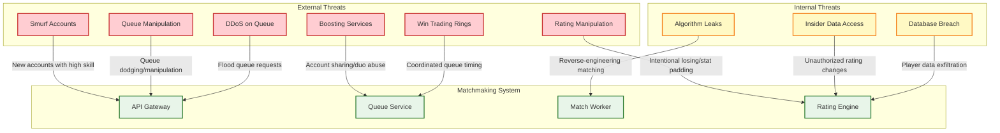

# Security & Compliance — Gaming Matchmaking System

## 1. Threat Model

### 1.1 Attack Surface



### 1.2 Threat Prioritization

| Threat | Likelihood | Impact | Priority | Mitigation Complexity |
|---|---|---|---|---|
| **Smurf Accounts** | Very High | High (ruins lower-rank games) | P0 | High |
| **Boosting Services** | High | High (undermines rank integrity) | P0 | Very High |
| **Queue Manipulation** | Medium | Medium (degrades experience) | P1 | Medium |
| **Win Trading** | Medium (at high ranks) | High (at high ranks) | P1 | High |
| **DDoS on Queue** | Low-Medium | Critical (total service loss) | P1 | Medium |
| **Rating Manipulation** | Low | High | P2 | Medium |
| **Data Breach** | Low | Critical (privacy) | P1 | Medium |
| **Insider Threat** | Very Low | Critical | P2 | Low |

---

## 2. Smurf Account Detection

### 2.1 Multi-Signal Detection Framework

Smurf detection requires combining multiple weak signals into a strong composite score, because no single signal is reliable enough to act on alone.

**Signal fusion approach:**

```
FUNCTION ComputeSmurfScore(account):
    signals = []

    // Signal 1: Account age vs performance
    IF account.age_days < 30 AND account.matches_played < 50:
        perf_percentile = GetPerformancePercentile(account, account.current_tier)
        IF perf_percentile > 0.95:
            signals.APPEND(Signal("new_account_high_perf", 0.85))
        ELSE IF perf_percentile > 0.85:
            signals.APPEND(Signal("new_account_above_avg", 0.50))

    // Signal 2: Hardware fingerprint linkage
    linked_accounts = GetAccountsByHardwareId(account.hardware_id)
    IF LEN(linked_accounts) > 1:
        max_rank = MAX(a.peak_ordinal FOR a IN linked_accounts)
        IF max_rank - account.ordinal > 500:
            signals.APPEND(Signal("hw_linked_higher_account", 0.90))
        ELSE IF max_rank - account.ordinal > 200:
            signals.APPEND(Signal("hw_linked_moderate_diff", 0.55))

    // Signal 3: Behavioral fingerprint matching
    input_signature = ExtractInputSignature(account)  // mouse sens, keybinds, etc.
    similar_accounts = FindSimilarSignatures(input_signature, threshold=0.85)
    IF LEN(similar_accounts) > 0:
        highest_match = MAX(similar_accounts, BY similarity)
        IF highest_match.account.peak_ordinal > account.ordinal + 400:
            signals.APPEND(Signal("input_signature_match", 0.75))

    // Signal 4: Win rate trajectory
    IF account.matches_played >= 10:
        win_rate = account.recent_win_rate(last=10)
        IF win_rate > 0.80 AND account.matches_played < 30:
            signals.APPEND(Signal("high_early_winrate", 0.60))

    // Signal 5: Game knowledge indicators
    // Players who immediately use advanced techniques (movement, ability combos)
    // that normally take 100+ hours to learn
    game_knowledge_score = AssessGameKnowledge(account)
    IF game_knowledge_score > 0.90 AND account.matches_played < 20:
        signals.APPEND(Signal("advanced_game_knowledge", 0.65))

    // Combine signals using Bayesian fusion
    composite_score = BayesianFusion(signals)
    RETURN composite_score

FUNCTION BayesianFusion(signals):
    // Start with prior probability of smurfing (~5% of new accounts)
    prior = 0.05
    odds = prior / (1 - prior)

    FOR EACH signal IN signals:
        // Convert confidence to likelihood ratio
        lr = signal.confidence / (1 - signal.confidence)
        odds *= lr

    posterior = odds / (1 + odds)
    RETURN posterior
```

### 2.2 Smurf Response Actions

| Smurf Score | Classification | Action |
|---|---|---|
| < 0.30 | Normal | Standard matching and rating updates |
| 0.30 - 0.60 | Suspected | Accelerate MMR convergence (1.5x), monitor closely |
| 0.60 - 0.85 | Likely Smurf | Accelerate MMR convergence (2x), match against higher-tier opponents, flag for review |
| > 0.85 | Confirmed Smurf | Accelerate MMR convergence (3x), restrict from lowest tiers, notify if linked account found |

**Critical design principle:** The primary response is **accelerated convergence**, not punishment. The goal is to get the smurf to their true skill tier as quickly as possible, minimizing the number of games they disrupt. Banning is a last resort because false positives destroy legitimate new player experience.

### 2.3 Hardware Fingerprinting

```
FUNCTION GenerateHardwareFingerprint(client_telemetry):
    // Collect hardware signals (sent by game client)
    components = [
        Hash(client_telemetry.gpu_model),
        Hash(client_telemetry.cpu_model),
        Hash(client_telemetry.ram_size),
        Hash(client_telemetry.disk_serial),
        Hash(client_telemetry.motherboard_id),
        Hash(client_telemetry.monitor_resolution),
        Hash(client_telemetry.os_install_date),
    ]

    // Create composite fingerprint using locality-sensitive hashing
    // Allows partial matching (hardware upgrades change some components)
    fingerprint = LocalitySensitiveHash(components, bands=4, rows=3)

    // Store fingerprint-to-account mapping
    StoreFingerprint(fingerprint, account.id)

    // Check for collisions (multiple accounts same hardware)
    existing = FindAccountsByFingerprint(fingerprint, similarity_threshold=0.70)
    RETURN existing

PRIVACY NOTE:
    - Hardware data is one-way hashed before transmission
    - Raw hardware identifiers never stored
    - Fingerprint comparison is hash-to-hash only
    - Fingerprint data deleted with account deletion
    - GDPR: fingerprint classified as pseudonymized personal data
```

---

## 3. Boosting Prevention

### 3.1 Boosting Detection Layers

**Layer 1: Access pattern analysis**

```
FUNCTION DetectAccountSharing(player, session):
    // Check for geographic impossibility
    last_session = GetLastSession(player)
    IF last_session != NULL:
        distance = GeoDistance(last_session.ip_geo, session.ip_geo)
        time_gap = session.start - last_session.end
        travel_speed = distance / time_gap

        IF travel_speed > MAX_PLAUSIBLE_TRAVEL_SPEED:
            // Impossible travel → likely different person logging in
            FlagSession(session, "IMPOSSIBLE_TRAVEL", confidence=0.85)

    // Check for hardware profile change
    IF session.hardware_fingerprint != player.last_hardware_fingerprint:
        IF session.hardware_fingerprint matches known booster fingerprint:
            FlagSession(session, "KNOWN_BOOSTER_HW", confidence=0.90)
        ELSE:
            FlagSession(session, "HW_CHANGE", confidence=0.40)

    // Check for input profile change
    IF InputSignatureSimilarity(session, player.baseline_signature) < 0.60:
        FlagSession(session, "INPUT_PROFILE_CHANGE", confidence=0.65)
```

**Layer 2: Party-based boosting detection**

```
FUNCTION DetectPartyBoosting(player, party_history):
    // Pattern: low-rank player repeatedly queuing with same high-rank partner
    partners = GetFrequentPartners(player, last_30_days)

    FOR EACH partner IN partners:
        rank_delta = ABS(partner.ordinal - player.ordinal)
        games_together = CountGamesTogether(player, partner, last_30_days)

        IF rank_delta > 400 AND games_together > 20:
            // Check if the partner appears with other low-rank accounts
            partner_low_rank_buddies = GetLowRankPartners(partner, last_90_days)
            IF LEN(partner_low_rank_buddies) > 3:
                RETURN BoostingAlert(
                    type="SERIAL_BOOSTER_PARTNER",
                    booster=partner,
                    boosted=[player] + partner_low_rank_buddies,
                    confidence=0.80
                )

        // Check for alternating account use
        IF partner.hardware_fingerprint == player.hardware_fingerprint:
            IF NOT SameHousehold(player, partner):  // Heuristic: same IP range
                RETURN BoostingAlert(
                    type="ACCOUNT_SHARING",
                    accounts=[player, partner],
                    confidence=0.85
                )
```

### 3.2 Party Rank Restrictions

To limit boosting opportunities, ranked queues enforce party composition rules:

| Rank Tier | Maximum Party Skill Spread | Party Size Limit |
|---|---|---|
| Bronze - Silver | 800 rating points | 5 (no restriction) |
| Gold - Platinum | 600 rating points | 5 |
| Diamond | 400 rating points | 3 |
| Master - Grandmaster | 300 rating points | 2 |
| Top 500 | Solo queue only | 1 |

**Rationale:** At higher ranks, the skill difference within a party has more impact. A Diamond player carrying a Bronze friend into Diamond lobbies creates unbalanced matches regardless of how the party skill is aggregated.

### 3.3 Boosting Response Actions

| Detection | Confidence | Action |
|---|---|---|
| Account sharing suspected | 0.40 - 0.65 | Require re-authentication, increase monitoring |
| Account sharing likely | 0.65 - 0.85 | Temporary ranked restriction, require 2FA verification |
| Serial booster partner identified | > 0.80 | Flag all associated accounts, restrict queuing together |
| Confirmed boosting service | > 0.90 | Season rank reset, competitive cooldown (14 days), escalate to trust & safety |

---

## 4. Queue Manipulation Prevention

### 4.1 Queue Dodging

Queue dodging occurs when a player enters queue, sees their opponents or teammates during selection/loading, and deliberately disconnects to avoid an unfavorable match.

**Countermeasures:**

```
Queue Dodge Penalty System:

First dodge (per 24h window):
- 5-minute queue cooldown
- No rating penalty

Second dodge:
- 15-minute queue cooldown
- -5 rating points (ranked only)

Third dodge:
- 60-minute queue cooldown
- -15 rating points
- Warning notification

Fourth+ dodge:
- 120-minute queue cooldown
- -25 rating points
- Account flagged for behavioral review

Reset: Penalty tier resets after 24 hours without a dodge.

Implementation:
- Track dodge events per player with timestamps
- Penalty escalation stored in player behavior profile
- Dodge detection: match found → player fails to connect within 30s
  AND client was online (not a genuine disconnect)
- Distinguish dodge from genuine disconnect: check client heartbeat
  status at time of timeout
```

### 4.2 Queue Sniping Prevention

Queue sniping is when a player (often a streamer's viewer) deliberately queues at the same time to get into the streamer's match:

| Countermeasure | Description | Effectiveness |
|---|---|---|
| **Queue delay randomization** | Add 0-15 second random delay before ticket enters matching pool | Medium (increases attacker's window of uncertainty) |
| **Anonymous queue** | Don't reveal queue status to non-party members | High (sniper can't confirm they're in same pool) |
| **Streamer protection mode** | Optional: deprioritize matching against recently-played opponents | Medium (reduces but doesn't eliminate) |
| **Queue time obfuscation** | Don't expose exact queue timer to client (round to 5s intervals) | Low (reduces timing precision) |

### 4.3 Intentional Deranking Prevention

Some players intentionally lose games to lower their rank and face weaker opponents:

```
FUNCTION DetectIntentionalLosing(player, recent_matches):
    // Check for suspicious loss patterns
    last_20 = recent_matches.Last(20)

    // Signal 1: Near-zero performance in losses
    loss_performances = [m.performance FOR m IN last_20 WHERE m.outcome == LOSS]
    IF LEN(loss_performances) >= 10:
        avg_damage_in_losses = AVG(lp.damage FOR lp IN loss_performances)
        avg_damage_overall = player.avg_damage_per_match

        IF avg_damage_in_losses < avg_damage_overall × 0.20:
            RETURN DerankerAlert(
                signal="MINIMAL_EFFORT_IN_LOSSES",
                confidence=0.75
            )

    // Signal 2: Alternating win/loss streaks (throw 5, stomp 5, repeat)
    outcome_sequence = [m.outcome FOR m IN last_20]
    IF HasAlternatingStreaks(outcome_sequence, min_streak=4):
        RETURN DerankerAlert(
            signal="ALTERNATING_STREAKS",
            confidence=0.60
        )

    // Signal 3: Rapid rank drop without corresponding performance decline
    rank_change = player.ordinal - player.ordinal_30_days_ago
    IF rank_change < -300 AND player.avg_performance_percentile > 0.50:
        RETURN DerankerAlert(
            signal="RANK_PERFORMANCE_MISMATCH",
            confidence=0.70
        )

    RETURN NULL
```

---

## 5. API Security

### 5.1 Authentication & Authorization

```
Authentication flow:

1. Player authenticates with game platform auth service → receives JWT
2. JWT contains: player_id, session_id, entitlements, region, exp
3. API Gateway validates JWT signature and expiry
4. Queue Service extracts player_id from validated JWT
5. No raw player credentials ever reach matchmaking services

Authorization rules:
- Only authenticated players can enter queue
- Players can only cancel their own queue ticket
- Rating data is read-only for players (write requires internal service auth)
- Admin operations require separate privileged JWT with MFA
- Rate limiting: 1 queue entry per 5 seconds per player
```

### 5.2 Rate Limiting & Abuse Prevention

| Endpoint | Rate Limit | Burst | Action on Exceed |
|---|---|---|---|
| `POST /queue/enter` | 12/minute per player | 2 | 429 + 30s cooldown |
| `DELETE /queue/cancel` | 30/minute per player | 5 | 429 + 10s cooldown |
| `GET /queue/status` | 60/minute per player | 10 | 429, silent |
| `GET /players/ratings` | 120/minute per player | 20 | 429, silent |
| `WebSocket connect` | 2/minute per player | 1 | Connection refused |

**DDoS protection:**
- API gateway implements connection-level rate limiting before auth
- Anomalous traffic patterns (>10x normal rate from IP range) trigger geo-blocking
- Queue service rejects tickets when pool exceeds capacity threshold
- WebSocket connections require valid auth within 5 seconds or disconnect

---

## 6. Player Data Privacy

### 6.1 Data Classification

| Data Category | Classification | Storage | Access |
|---|---|---|---|
| **Player ID** | Personal (pseudonymous) | Encrypted at rest | Matchmaking services only |
| **Skill Ratings** | Personal (derived) | Encrypted at rest | Player can view own; others see rank tier only |
| **Hardware Fingerprint** | Personal (sensitive) | One-way hashed, encrypted | Anti-cheat service only |
| **IP Address** | Personal | Not stored (used transiently for routing) | Network layer only |
| **Match History** | Personal (behavioral) | Encrypted at rest | Player can view own; aggregated for analytics |
| **Behavior Score** | Personal (sensitive) | Encrypted at rest | Matchmaking service only; not exposed to player |
| **Latency Profile** | Technical | Cached transiently | Matchmaking service |

### 6.2 GDPR Compliance

| Requirement | Implementation |
|---|---|
| **Right to Access** | Player can export all personal data (ratings, match history, behavior data) via settings |
| **Right to Erasure** | Account deletion removes all personal data within 30 days; match records anonymized (player_id → hash) |
| **Data Minimization** | Hardware fingerprint is one-way hashed; IP addresses not persisted; behavior scores expire after 90 days of inactivity |
| **Purpose Limitation** | Skill data used only for matchmaking; not shared with third parties; not used for advertising |
| **Consent** | Competitive matchmaking requires accepting terms of service; smurf detection disclosed in privacy policy |
| **Data Portability** | Player data exportable in standard JSON format |
| **Breach Notification** | Automated detection pipeline; 72-hour notification SLA to supervisory authority |

### 6.3 Data Retention Policy

| Data Type | Active Retention | Archive Retention | Deletion Method |
|---|---|---|---|
| Player skill profiles | Account lifetime | 30 days post-deletion | Cryptographic erasure |
| Match records | 30 days (hot) | 7 years (anonymized) | Anonymization at archive boundary |
| Queue telemetry | 7 days | 90 days (aggregated) | Aggregation removes PII |
| Hardware fingerprints | Account lifetime | Deleted with account | Immediate deletion |
| Behavior scores | 90 days rolling | Not archived | TTL expiry |
| Smurf/boost flags | 1 year | 2 years (for appeals) | Scheduled deletion |

---

## 7. Competitive Integrity

### 7.1 Rating Transparency vs Security

A fundamental tension exists between showing players their exact rating (transparency) and hiding it (security against manipulation).

| Approach | Benefit | Risk |
|---|---|---|
| **Show exact MMR** | Players understand matching decisions | Enables targeted manipulation, anxiety over small changes |
| **Show rank tier only** | Reduces manipulation surface, cleaner player experience | Players feel "the system is rigged" when rank doesn't match perceived skill |
| **Show MMR range** | Partial transparency, less manipulable | Still provides enough info for some gaming |
| **Dual system (visible RR + hidden MMR)** | Best UX—visible progress with hidden fairness | Complexity in explaining disconnects between visible and hidden ratings |

**Selected: Dual system.** Display a visible Rank Rating (RR) that moves predictably (+/- fixed amounts per win/loss), while the hidden MMR (μ, σ) determines actual matchmaking. The visible RR is nudged toward the hidden MMR over time, preventing permanent divergence.

### 7.2 Match Result Integrity

```
Match result validation:

1. Game server submits match result (server-authoritative)
2. Result includes cryptographic signature from server
3. Rating engine validates signature before processing
4. Cross-reference: all players' clients also report perceived outcome
5. If server result differs from > 50% of client reports: flag for review

Anti-tampering:
- Match results transmitted over mutual TLS between server and rating engine
- Server-side result is the single source of truth
- Client reports are advisory signals for anomaly detection only
- No client can unilaterally alter the match outcome
```
