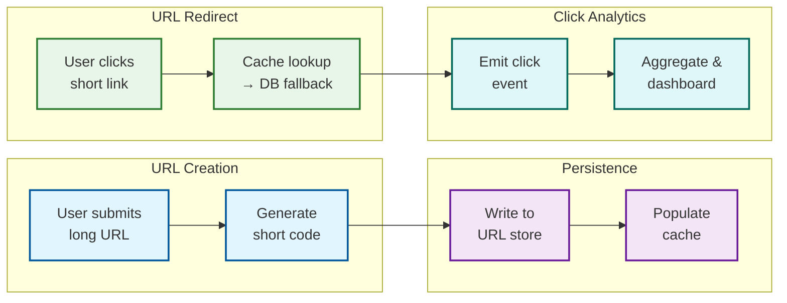

# 12.5 Design a URL Shortener

## System Overview

A URL Shortener is a service that maps long URLs to compact, shareable short codes (e.g., `https://short.ly/a1B2c3`), redirecting users to the original destination upon access. Beyond basic shortening, production systems like Bitly and TinyURL provide real-time click analytics (geographic distribution, referrer tracking, device breakdown), custom alias support, link expiration policies, and abuse detection—all while serving a massively read-heavy workload (typically 100:1 read-to-write ratio) with sub-50ms redirect latency at billions of redirects per day.

---

## Key Characteristics

| Characteristic | Description |
|---|---|
| **Architecture Style** | Read-optimized microservices with multi-tier caching, asynchronous analytics pipeline, and edge-level redirect serving |
| **Core Abstraction** | Short code as a deterministic mapping from a compact identifier to a destination URL, with optional metadata (expiration, custom alias, ownership) |
| **Processing Model** | Synchronous for URL creation and redirect; asynchronous for click analytics, fraud detection, and aggregation |
| **Data Consistency** | Strong consistency for short-code-to-URL mappings; eventual consistency for analytics counters and aggregated metrics |
| **Availability Target** | 99.99% for redirect path (revenue-critical); 99.9% for creation API and analytics dashboard |
| **Latency Targets** | < 10ms for cached redirects, < 50ms P99 for redirect with cache miss, < 200ms for URL creation |
| **Scalability Model** | Horizontally scaled stateless redirect servers behind a global load balancer; sharded URL store by short code prefix; edge caching for hot links |

---

## Quick Navigation

| Document | Focus Area |
|---|---|
| [01 - Requirements & Estimations](./01-requirements-and-estimations.md) | Functional/non-functional requirements, capacity math for read-heavy workload |
| [02 - High-Level Design](./02-high-level-design.md) | Architecture diagrams, write path (creation), read path (redirect), analytics flow |
| [03 - Low-Level Design](./03-low-level-design.md) | Data models, API contracts, Base62 encoding, ID generation algorithms |
| [04 - Deep Dive & Bottlenecks](./04-deep-dive-and-bottlenecks.md) | ID generation at scale, redirect hot path, analytics pipeline internals |
| [05 - Scalability & Reliability](./05-scalability-and-reliability.md) | Horizontal scaling, caching tiers, database sharding, multi-region failover |
| [06 - Security & Compliance](./06-security-and-compliance.md) | Abuse prevention, phishing detection, enumeration attacks, GDPR link deletion |
| [07 - Observability](./07-observability.md) | RED/USE metrics, redirect latency histograms, cache hit ratio dashboards |
| [08 - Interview Guide](./08-interview-guide.md) | 45-minute pacing, trade-off discussions, trap questions, quick reference card |
| [09 - Insights](./09-insights.md) | Key architectural insights and cross-cutting patterns |

---

## What Differentiates This System

| Dimension | Naive URL Shortener | Production URL Shortening Platform |
|---|---|---|
| **ID Generation** | Auto-increment integer in a single database | Distributed Snowflake-style IDs with Base62 encoding; no single point of coordination |
| **Redirect Path** | Database lookup on every request | Multi-tier cache (in-process → distributed cache → database) with edge-level redirect caching |
| **Analytics** | Synchronous counter increment on redirect | Asynchronous event streaming to columnar analytics store with real-time and batch aggregation |
| **Custom Aliases** | Simple uniqueness check | Collision handling, profanity filtering, reserved-word blocking, and alias-to-owner binding |
| **Link Management** | Static mappings, no expiration | TTL-based expiration, soft-delete with tombstones, bulk link management APIs |
| **Abuse Prevention** | None | URL reputation scoring, phishing detection, rate limiting, and click fraud identification |
| **Scale** | Single server, single database | Globally distributed edge nodes, sharded storage, 100K+ redirects/second |
| **Redirect Strategy** | Always 302 | Configurable 301/302 per link based on analytics needs vs. caching optimization |

---

## What Makes This System Unique

### 1. Extreme Read-to-Write Asymmetry

URL shorteners exhibit one of the highest read-to-write ratios in system design (100:1 or higher). A single viral link can generate millions of redirects from a single write. This asymmetry drives every architectural decision: the write path can afford to be slower and more complex, while the read path must be optimized to the microsecond level with aggressive multi-tier caching.

### 2. The Short Code Is the API

Unlike most systems where the identifier is an internal implementation detail, the short code IS the user-facing product. It must be short (6-8 characters), URL-safe, non-offensive, and visually unambiguous. This makes ID generation a product decision, not just an engineering one—Base62 vs Base58 (excluding 0/O/l/I for readability), code length, and custom alias support all directly impact user experience.

### 3. 301 vs 302: A Business Decision Disguised as a Technical One

The choice between HTTP 301 (permanent) and 302 (temporary) redirects is the system's most consequential trade-off. 301 enables aggressive browser and CDN caching (reducing server load dramatically) but sacrifices analytics accuracy (cached redirects bypass the server entirely). 302 ensures every click hits the server (accurate analytics, ability to update destinations) but increases infrastructure cost. Most production systems default to 302 for analytics fidelity and offer 301 as an opt-in for high-traffic, static links.

### 4. Analytics as a First-Class Subsystem

Click analytics transforms a simple redirect service into a marketing intelligence platform. Each redirect event captures timestamp, geographic location (via IP geolocation), referrer URL, device type, browser, and OS. This event stream feeds real-time dashboards, campaign performance reports, and fraud detection models—creating a data pipeline that is architecturally more complex than the core redirect service itself.

---

## Scale Reference Points

| Metric | Small Scale | Medium Scale | Large Scale (Bitly-class) |
|---|---|---|---|
| **Monthly Active Users** | 100K | 10M | 500M+ |
| **URLs Created/Day** | 10K | 1M | 50M |
| **Redirects/Day** | 1M | 100M | 10B+ |
| **Total URLs Stored** | 10M | 1B | 100B+ |
| **Redirect P99 Latency** | < 100ms | < 50ms | < 10ms (edge-cached) |
| **Storage** | 10 GB | 1 TB | 100 TB+ |
| **Cache Hit Ratio** | 80% | 95% | 99%+ |

---

## Technology Landscape

| Component | Options | Trade-offs |
|---|---|---|
| **URL Store** | Key-value NoSQL, relational DB with hash index | NoSQL for horizontal scale; relational for ACID on custom aliases |
| **Cache Layer** | In-process cache + distributed cache cluster | In-process for sub-ms latency; distributed for shared state |
| **ID Generation** | Counter-based, hash-based, Snowflake-style | Counter needs coordination; hash risks collision; Snowflake balances both |
| **Analytics Store** | Columnar database, time-series database | Columnar for flexible aggregation; time-series for real-time dashboards |
| **Event Streaming** | Distributed log, message queue | Log for replay and durability; queue for simple fan-out |
| **Edge Layer** | CDN with redirect rules, global load balancer | CDN for 301 caching; LB for 302 with server-side analytics |

---

## URL Shortening Lifecycle at a Glance

---

## Domain Glossary

| Term | Definition |
|---|---|
| **Short Code** | The compact alphanumeric string (e.g., `a1B2c3`) that maps to a destination URL; typically 6-8 characters using Base62 encoding |
| **Base62** | Encoding scheme using characters `[0-9a-zA-Z]` (62 symbols) to convert numeric IDs into URL-safe strings |
| **Base58** | Variant of Base62 that excludes visually ambiguous characters (0, O, l, I) for improved human readability |
| **301 Redirect** | HTTP permanent redirect; browsers and CDNs cache the mapping, bypassing the server on subsequent requests |
| **302 Redirect** | HTTP temporary redirect; browsers re-check the server on each request, enabling analytics capture and destination updates |
| **Custom Alias** | A user-chosen short code (e.g., `short.ly/my-brand`) instead of a system-generated one; requires uniqueness validation |
| **Click Event** | A structured record emitted on each redirect, capturing timestamp, IP, referrer, user-agent, and geo-location |
| **Link Expiration** | TTL-based automatic deactivation of a short URL after a specified time or click count |
| **Vanity Domain** | A custom domain (e.g., `brand.link`) that organizations use instead of the platform's default domain |
| **Hot Link** | A short URL receiving disproportionately high traffic (e.g., viral social media post), requiring dedicated caching and rate limiting |
| **Tombstone** | A soft-delete marker that preserves the short code mapping in the database but returns a 410 Gone response |
| **Click Fraud** | Artificial inflation of click counts through bots, scripts, or click farms; detected via behavioral analysis |
| **URL Reputation** | A safety score assigned to destination URLs based on known malware/phishing databases and content analysis |
| **Snowflake ID** | A distributed unique ID format combining timestamp, worker ID, and sequence number for coordination-free generation |

---

## Related Systems

| System | Relationship to URL Shortener |
|---|---|
| **Content Delivery Network** | Serves cached 301 redirects at the edge, reducing origin server load for popular links |
| **Rate Limiter** | Protects creation API from abuse and redirect path from DDoS; often co-located with API gateway |
| **Distributed Key-Value Store** | Primary storage for short-code-to-URL mappings; optimized for point lookups by key |
| **Stream Processing Platform** | Consumes click events for real-time analytics aggregation and fraud detection |
| **Notification Service** | Alerts link owners when URLs are flagged, expired, or reach click milestones |
| **Identity & Access Management** | Manages API keys, OAuth tokens, and workspace-level permissions for enterprise customers |
| **DNS System** | Resolves vanity domains to the shortener's edge infrastructure |
