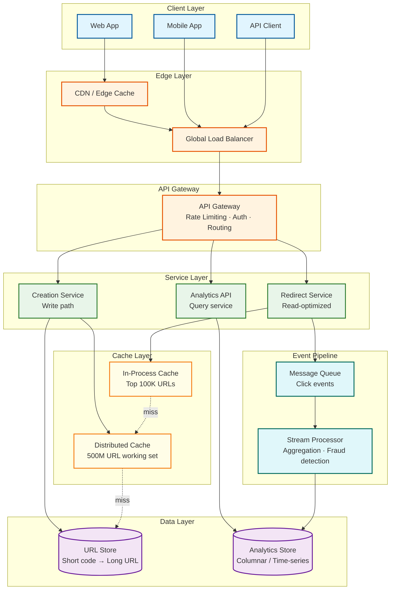
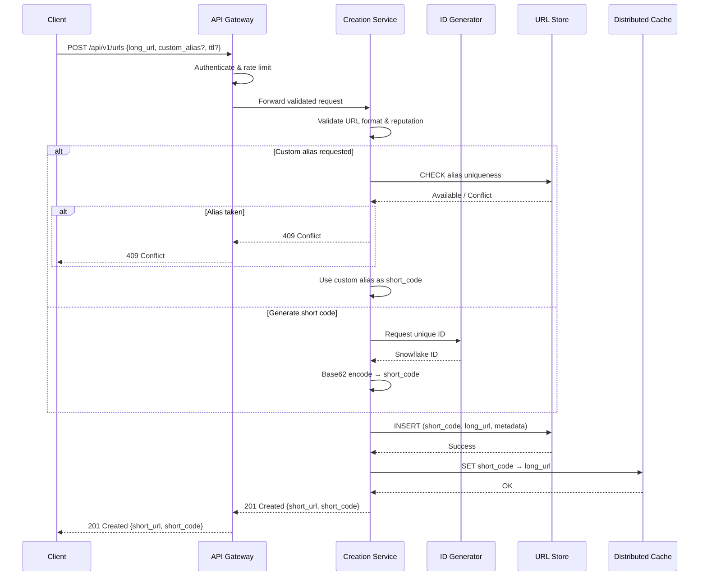
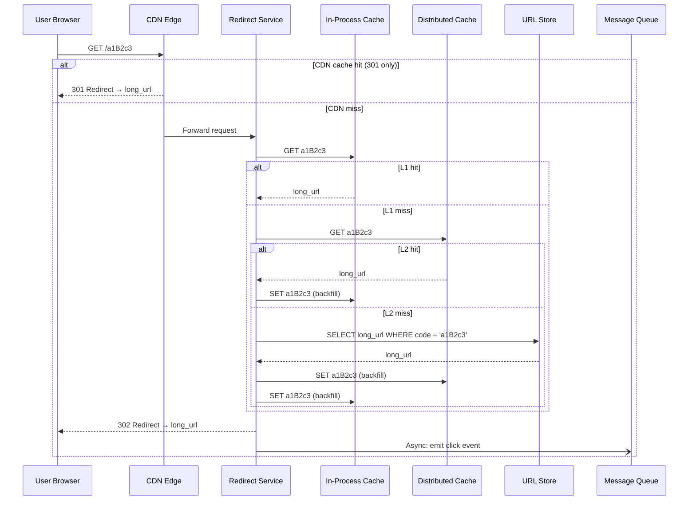
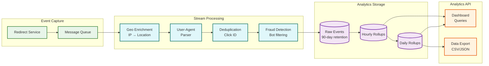

# High-Level Design — URL Shortener

## 1. System Architecture

---

## 2. Data Flow — Write Path (URL Creation)

### 2.1 Flow Description

1. **Client** sends POST request with long URL, optional custom alias, and optional TTL
2. **API Gateway** authenticates the request (API key or OAuth token), applies rate limiting
3. **Creation Service** validates the URL (format, reachability, reputation check)
4. If custom alias requested: check uniqueness in URL Store (strong consistency read)
5. If no custom alias: generate a unique short code via ID Generator → Base62 encode
6. **Write** the mapping (short_code → long_url + metadata) to URL Store
7. **Populate** the distributed cache with the new mapping
8. **Return** the shortened URL to the client

### 2.2 Sequence Diagram

---

## 3. Data Flow — Read Path (URL Redirect)

### 3.1 Flow Description

1. **User** clicks a short URL (e.g., `https://short.ly/a1B2c3`)
2. **DNS** resolves to nearest edge/CDN point of presence
3. **CDN** checks edge cache for 301 redirect (if enabled for this link)
4. On CDN miss: request reaches **API Gateway** → **Redirect Service**
5. **Redirect Service** checks in-process cache (L1) → distributed cache (L2) → URL Store (L3)
6. On any hit: return HTTP 301 or 302 redirect with `Location: <long_url>` header
7. **Asynchronously** emit a click event to the message queue (non-blocking)
8. If short code not found or expired: return 404 Not Found or 410 Gone

### 3.2 Sequence Diagram

---

## 4. Data Flow — Analytics Pipeline

### 4.1 Flow Description

1. **Redirect Service** emits a click event to the message queue (fire-and-forget, non-blocking)
2. **Message Queue** durably stores events with at-least-once delivery guarantee
3. **Stream Processor** consumes events in micro-batches:
   - Enriches with geo-location data (IP → country/city)
   - Parses User-Agent → device, browser, OS
   - Deduplicates using click ID (idempotent processing)
   - Detects fraud signals (bot patterns, click farms)
4. Writes enriched events to **Analytics Store** (columnar database)
5. **Materialized views** maintain pre-aggregated rollups (hourly, daily per URL)
6. **Analytics API** queries pre-aggregated data for dashboard responses

### 4.2 Analytics Data Flow Diagram

---

## 5. Key Architectural Decisions

### 5.1 Synchronous Write, Asynchronous Analytics

| Decision | Synchronous URL creation; asynchronous click analytics |
|---|---|
| **Why** | The write path (URL creation) must return a usable short URL immediately—the user is waiting. Analytics, however, can tolerate seconds of delay without impacting user experience. Decoupling analytics into an async pipeline prevents click processing from adding latency to the redirect hot path. |
| **Trade-off** | Analytics data lags real-time by 1-5 seconds. Click counts shown to users may briefly undercount during traffic spikes. |
| **Alternative** | Synchronous counter increment on redirect (simpler, but adds 2-5ms to every redirect and creates write contention on the counter). |

### 5.2 Three-Tier Cache Architecture

| Decision | In-process (L1) → Distributed cache (L2) → Database (L3) |
|---|---|
| **Why** | The 100:1 read-to-write ratio means caching is the primary scaling mechanism. L1 (in-process) handles the hottest URLs with sub-millisecond latency and zero network hops. L2 (distributed cache) provides a shared, consistent view across all redirect servers. L3 (database) is the source of truth for cold URLs. |
| **Trade-off** | L1 may serve stale data for up to 15 seconds after a URL update. L2 adds a network hop (~1-2ms) but shares state. Three tiers increase operational complexity. |
| **Alternative** | Two-tier (distributed cache + DB) is simpler but sacrifices the sub-millisecond latency of L1 for hot URLs. |

### 5.3 302 as Default Redirect Status

| Decision | Use HTTP 302 (temporary) by default; offer 301 (permanent) as opt-in |
|---|---|
| **Why** | 302 ensures every click passes through the server, enabling accurate analytics, destination URL updates, and link expiration enforcement. 301 is cached by browsers indefinitely, making the short URL "unrevocable" from the user's perspective. |
| **Trade-off** | 302 means every click hits the server (higher infrastructure cost). 301 would reduce server load by 80%+ for repeat visitors but sacrifices analytics and flexibility. |
| **Alternative** | 301 with short `max-age` Cache-Control (e.g., 1 hour) as a compromise—reduces server load while maintaining some analytics granularity. |

### 5.4 Snowflake-Style ID Generation

| Decision | Use distributed Snowflake-style IDs converted to Base62 for short codes |
|---|---|
| **Why** | Snowflake IDs are coordination-free (each worker generates independently), time-ordered (enables efficient range queries), and unique across the cluster. Base62 encoding produces compact, URL-safe short codes. |
| **Trade-off** | Snowflake IDs are 64-bit, producing 11-character Base62 codes. For shorter codes (6-7 chars), can use a counter-based approach with range pre-allocation. |
| **Alternative** | MD5/SHA hash of URL (deterministic, but 128+ bits → longer codes and collision risk requires checking). Counter with Zookeeper coordination (shorter codes, but single point of failure). |

### 5.5 Separate Read and Write Services

| Decision | Split redirect handling and URL creation into separate microservices |
|---|---|
| **Why** | Read (redirect) and write (creation) have vastly different scaling profiles (100:1), latency requirements (5ms vs 200ms), and failure modes. Independent scaling allows provisioning 100x more redirect capacity without wasting resources on creation infrastructure. |
| **Trade-off** | Adds deployment complexity and requires service discovery. A monolith would be simpler for small scale. |
| **Alternative** | Single service with internal read/write separation at the thread pool level (viable up to ~10K QPS). |

---

## 6. Architecture Pattern Checklist

| Pattern | Applied? | Implementation |
|---|---|---|
| **CQRS** | ✅ Yes | Separate read (redirect) and write (creation) services with independent scaling |
| **Event Sourcing** | ⚠️ Partial | Click events are an append-only event log; URL mappings are state-based (not event-sourced) |
| **Cache-Aside** | ✅ Yes | Redirect service checks cache first, falls back to DB, then backfills cache on miss |
| **Write-Through Cache** | ✅ Yes | Creation service writes to DB and cache simultaneously |
| **Async Messaging** | ✅ Yes | Click events are published to message queue for async analytics processing |
| **Circuit Breaker** | ✅ Yes | Between redirect service and database; falls back to cache-only mode if DB is down |
| **Bulkhead** | ✅ Yes | Separate thread pools for redirect, creation, and analytics to prevent cascade |
| **Gateway Aggregation** | ✅ Yes | API gateway handles auth, rate limiting, and routing for all services |
| **Strangler Fig** | ⬜ N/A | Not applicable (greenfield design) |
| **Saga** | ⬜ N/A | No distributed transactions needed; URL creation is a single-service operation |
