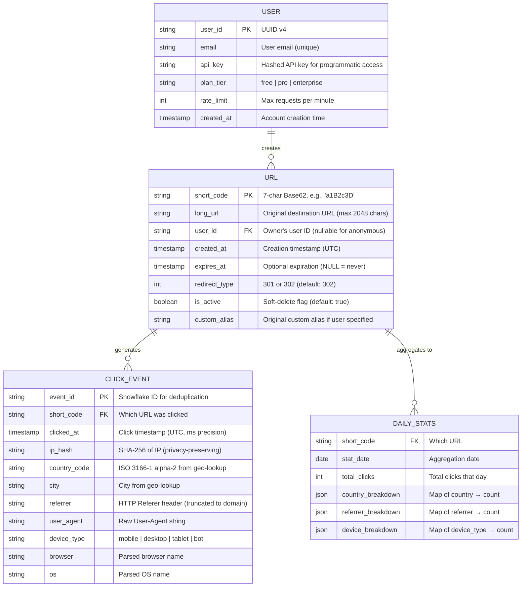

# Low-Level Design — URL Shortener

## 1. Data Model

### 1.1 Entity-Relationship Diagram



### 1.2 Schema Design

#### URL Table (Primary Store)

```
TABLE urls
  short_code    CHAR(7)       PRIMARY KEY    -- Base62 encoded, fixed length
  long_url      VARCHAR(2048) NOT NULL       -- Destination URL
  user_id       UUID          NULLABLE       -- NULL for anonymous shortening
  created_at    TIMESTAMP     NOT NULL       -- UTC, indexed for cleanup
  expires_at    TIMESTAMP     NULLABLE       -- NULL means no expiration
  redirect_type SMALLINT      DEFAULT 302    -- 301 or 302
  is_active     BOOLEAN       DEFAULT TRUE   -- Soft-delete flag
  click_count   BIGINT        DEFAULT 0      -- Denormalized counter (approximate)

INDEXES:
  PRIMARY KEY (short_code)                    -- Hash index for O(1) lookup
  INDEX idx_user_urls (user_id, created_at DESC)  -- User's URL listing
  INDEX idx_expiration (expires_at) WHERE expires_at IS NOT NULL  -- Expiration cleanup
  INDEX idx_long_url (long_url_hash)          -- Deduplication lookup (hash of long URL)
```

#### Why Hash Index on short_code

The redirect path performs a single point lookup: `GET short_code → long_url`. A hash index provides O(1) average-case lookup, which is optimal for this access pattern. B-tree indexes (default in many databases) provide O(log n) lookup with range query support—unnecessary for this use case.

### 1.3 Indexing Strategy

| Index | Columns | Purpose | Type |
|---|---|---|---|
| **Primary** | `short_code` | Redirect lookup (hot path) | Hash |
| **User URLs** | `(user_id, created_at DESC)` | List user's URLs sorted by newest | B-tree |
| **Expiration** | `expires_at` (partial: WHERE NOT NULL) | Background expiration job | B-tree |
| **URL Hash** | `SHA256(long_url)` | Deduplication: check if URL was already shortened | Hash |

### 1.4 Partitioning & Sharding

```
Sharding key: short_code (first 2 characters)

Why short_code prefix:
- Uniform distribution: Base62 characters are roughly uniformly distributed
  in generated codes (Snowflake → Base62 produces uniform distribution)
- Read-path affinity: Every redirect request contains the short_code,
  so the shard can be determined without additional lookups
- No cross-shard queries for core operation (redirect is always single-shard)

Shard count calculation:
- 62^2 = 3,844 possible prefixes → maps to 64-256 physical shards
- Consistent hashing ring maps prefixes to shards
- Each shard holds ~150M-600M URLs at 50B total scale

Custom alias consideration:
- Custom aliases use the same shard mapping (hash of alias → shard)
- Risk: popular prefixes (e.g., 'my', 'go') might cause slight imbalance
- Mitigation: virtual nodes in consistent hashing ring smooth imbalance
```

---

## 2. API Design

### 2.1 URL Creation

```
POST /api/v1/urls
Authorization: Bearer <api_key>

Request Body:
{
  "long_url": "https://example.com/very/long/path?with=params",
  "custom_alias": "my-campaign",       // optional
  "expires_in_seconds": 2592000,       // optional, 30 days
  "redirect_type": 302                 // optional, default 302
}

Response (201 Created):
{
  "short_code": "a1B2c3D",
  "short_url": "https://short.ly/a1B2c3D",
  "long_url": "https://example.com/very/long/path?with=params",
  "created_at": "2026-03-09T10:30:00Z",
  "expires_at": "2026-04-08T10:30:00Z",
  "redirect_type": 302
}

Error Responses:
  400 Bad Request    - Invalid URL format or parameters
  401 Unauthorized   - Missing or invalid API key
  409 Conflict       - Custom alias already taken
  422 Unprocessable  - URL flagged as malicious by reputation check
  429 Too Many Requests - Rate limit exceeded
```

### 2.2 URL Redirect

```
GET /{short_code}

Response (302 Found):
  HTTP/1.1 302 Found
  Location: https://example.com/very/long/path?with=params
  Cache-Control: private, max-age=0

  OR (if configured as 301):

  HTTP/1.1 301 Moved Permanently
  Location: https://example.com/very/long/path?with=params
  Cache-Control: public, max-age=86400

Error Responses:
  404 Not Found    - Short code does not exist
  410 Gone         - Short URL has been deleted or expired
```

### 2.3 Analytics Endpoint

```
GET /api/v1/urls/{short_code}/analytics
Authorization: Bearer <api_key>

Query Parameters:
  start_date    - ISO 8601 date (default: 7 days ago)
  end_date      - ISO 8601 date (default: today)
  granularity   - hour | day | week | month (default: day)
  group_by      - country | referrer | device | browser (optional)

Response (200 OK):
{
  "short_code": "a1B2c3D",
  "total_clicks": 145230,
  "unique_visitors": 89102,
  "time_series": [
    {"date": "2026-03-01", "clicks": 12450, "unique": 8920},
    {"date": "2026-03-02", "clicks": 18230, "unique": 11204}
  ],
  "top_countries": [
    {"country": "US", "clicks": 52000, "percentage": 35.8},
    {"country": "GB", "clicks": 21000, "percentage": 14.5}
  ],
  "top_referrers": [
    {"referrer": "twitter.com", "clicks": 38000, "percentage": 26.2},
    {"referrer": "direct", "clicks": 29000, "percentage": 20.0}
  ],
  "devices": {
    "mobile": 58.2,
    "desktop": 37.1,
    "tablet": 4.7
  }
}
```

### 2.4 URL Management

```
DELETE /api/v1/urls/{short_code}
Authorization: Bearer <api_key>

Response (204 No Content)
  -- Soft-deletes the URL; short code returns 410 Gone on redirect

PATCH /api/v1/urls/{short_code}
Authorization: Bearer <api_key>

Request Body:
{
  "long_url": "https://example.com/updated-destination",
  "expires_in_seconds": 7776000   // extend to 90 days
}

Response (200 OK):
{
  "short_code": "a1B2c3D",
  "short_url": "https://short.ly/a1B2c3D",
  "long_url": "https://example.com/updated-destination",
  "expires_at": "2026-06-07T10:30:00Z"
}

Note: PATCH only works on URLs configured with 302 redirect.
      301 URLs cannot update destination (cached by browsers).
```

---

## 3. Core Algorithms

### 3.1 Base62 Encoding

```
ALGORITHM Base62Encode(numeric_id)
  INPUT: 64-bit unsigned integer
  OUTPUT: String of 7-11 characters from alphabet [0-9a-zA-Z]

  ALPHABET ← "0123456789abcdefghijklmnopqrstuvwxyzABCDEFGHIJKLMNOPQRSTUVWXYZ"
  BASE ← 62
  result ← empty list

  WHILE numeric_id > 0
    remainder ← numeric_id MOD BASE
    result.prepend(ALPHABET[remainder])
    numeric_id ← numeric_id DIV BASE
  END WHILE

  // Pad to minimum 7 characters for uniform length
  WHILE result.length < 7
    result.prepend('0')
  END WHILE

  RETURN result as string

COMPLEXITY: O(log₆₂(n)) ≈ O(1) for 64-bit input (max 11 iterations)
SPACE: O(1) — fixed-size output buffer
```

**Example:**
```
Input:  125,432,917,635
Step 1: 125432917635 % 62 = 29 → 't'    (125432917635 / 62 = 2023079316)
Step 2: 2023079316 % 62 = 4 → '4'       (2023079316 / 62 = 32630311)
Step 3: 32630311 % 62 = 41 → 'F'        (32630311 / 62 = 526134)
Step 4: 526134 % 62 = 10 → 'a'          (526134 / 62 = 8486)
Step 5: 8486 % 62 = 52 → 'Q'            (8486 / 62 = 136)
Step 6: 136 % 62 = 12 → 'c'             (136 / 62 = 2)
Step 7: 2 % 62 = 2 → '2'               (2 / 62 = 0)
Result: "2cQaF4t"
```

### 3.2 Snowflake ID Generation

```
ALGORITHM GenerateSnowflakeID()
  INPUT: None (uses system state)
  OUTPUT: 64-bit unique ID

  STRUCTURE SnowflakeID (64 bits total):
    [1 bit]  - Sign bit (always 0)
    [41 bits] - Timestamp (ms since custom epoch, ~69 years range)
    [10 bits] - Worker ID (1024 workers max)
    [12 bits] - Sequence (4096 IDs per ms per worker)

  current_ms ← NOW() - CUSTOM_EPOCH    // Custom epoch avoids wasting bits

  IF current_ms == last_timestamp
    sequence ← (sequence + 1) AND 0xFFF   // 12-bit mask
    IF sequence == 0
      // Exhausted 4096 IDs in this millisecond, wait for next ms
      current_ms ← WAIT_UNTIL_NEXT_MS(last_timestamp)
    END IF
  ELSE
    sequence ← 0
  END IF

  last_timestamp ← current_ms

  id ← (current_ms << 22) OR (worker_id << 12) OR sequence
  RETURN id

THROUGHPUT: 4,096 IDs/ms × 1,024 workers = 4.19M IDs/sec cluster-wide
UNIQUENESS: Guaranteed without coordination (worker IDs are pre-assigned)
```

### 3.3 Custom Alias Handling

```
ALGORITHM HandleCustomAlias(alias, long_url, user_id)
  INPUT: User-requested alias string, destination URL, user ID
  OUTPUT: Success with short_code, or error

  // Step 1: Validate alias format
  IF NOT MATCHES(alias, "^[a-zA-Z0-9_-]{3,30}$")
    RETURN Error("Alias must be 3-30 alphanumeric characters, hyphens, or underscores")

  // Step 2: Check reserved words
  IF alias IN RESERVED_WORDS   // "api", "admin", "help", "about", etc.
    RETURN Error("Alias is reserved")

  // Step 3: Profanity filter
  IF CONTAINS_PROFANITY(alias)
    RETURN Error("Alias contains prohibited content")

  // Step 4: Atomic uniqueness check and insert
  result ← DB.INSERT_IF_NOT_EXISTS(
    key = alias,
    value = {long_url, user_id, created_at = NOW(), is_custom = TRUE}
  )

  IF result == CONFLICT
    // Check if same user already shortened this URL
    existing ← DB.GET(alias)
    IF existing.user_id == user_id AND existing.long_url == long_url
      RETURN Success(existing)    // Idempotent: return existing mapping
    ELSE
      RETURN Error("Alias already taken")
    END IF
  END IF

  RETURN Success(alias)

KEY DESIGN CHOICE: Use INSERT-IF-NOT-EXISTS (atomic compare-and-swap)
  rather than SELECT-then-INSERT to prevent TOCTOU race conditions.
```

### 3.4 URL Redirect with Cache Hierarchy

```
ALGORITHM ResolveAndRedirect(short_code, request_context)
  INPUT: Short code from URL path, HTTP request context (headers, IP)
  OUTPUT: HTTP redirect response or error

  // L1: In-process cache (sub-millisecond, per-instance)
  url_record ← L1_CACHE.GET(short_code)
  IF url_record != NULL
    metrics.increment("cache.l1.hit")
    GOTO redirect
  END IF
  metrics.increment("cache.l1.miss")

  // L2: Distributed cache (~1-2ms, shared across instances)
  url_record ← L2_CACHE.GET("url:" + short_code)
  IF url_record != NULL
    metrics.increment("cache.l2.hit")
    L1_CACHE.SET(short_code, url_record, TTL = 15 seconds)
    GOTO redirect
  END IF
  metrics.increment("cache.l2.miss")

  // L3: Database (5-20ms, source of truth)
  url_record ← DB.GET(short_code)
  IF url_record == NULL
    RETURN HTTP 404 Not Found
  END IF
  metrics.increment("cache.l3.hit")

  // Backfill caches
  L2_CACHE.SET("url:" + short_code, url_record, TTL = 1 hour)
  L1_CACHE.SET(short_code, url_record, TTL = 15 seconds)

redirect:
  // Check expiration
  IF url_record.expires_at != NULL AND NOW() > url_record.expires_at
    RETURN HTTP 410 Gone
  END IF

  // Check soft-delete
  IF NOT url_record.is_active
    RETURN HTTP 410 Gone
  END IF

  // Emit analytics event (fire-and-forget, non-blocking)
  click_event ← {
    event_id:    GENERATE_SNOWFLAKE_ID(),
    short_code:  short_code,
    clicked_at:  NOW(),
    ip_hash:     SHA256(request_context.ip),
    referrer:    request_context.headers["Referer"],
    user_agent:  request_context.headers["User-Agent"],
    country:     GEO_LOOKUP(request_context.ip)
  }
  MESSAGE_QUEUE.PUBLISH_ASYNC("click-events", click_event)

  // Return redirect
  IF url_record.redirect_type == 301
    RETURN HTTP 301 with Location: url_record.long_url
           and Cache-Control: public, max-age=86400
  ELSE
    RETURN HTTP 302 with Location: url_record.long_url
           and Cache-Control: private, max-age=0

TOTAL LATENCY:
  L1 hit:  < 1ms (no network)
  L2 hit:  1-3ms (one network hop)
  L3 hit:  10-30ms (database query)
  Expected: < 5ms average (95%+ cache hit rate)
```

### 3.5 Link Expiration Background Job

```
ALGORITHM ExpireLinks()
  // Runs periodically (every 60 seconds) as a background job

  BATCH_SIZE ← 1000

  LOOP
    expired_batch ← DB.QUERY(
      "SELECT short_code FROM urls
       WHERE expires_at <= NOW()
         AND is_active = TRUE
       LIMIT {BATCH_SIZE}"
    )

    IF expired_batch is empty
      BREAK
    END IF

    FOR EACH short_code IN expired_batch
      DB.UPDATE(short_code, is_active = FALSE)
      L2_CACHE.DELETE("url:" + short_code)
      // L1 cache will expire naturally via TTL (15s)

      metrics.increment("links.expired")
    END FOR

    // Throttle to avoid overwhelming the database
    SLEEP(100ms)
  END LOOP

NOTE: This is a lazy + active hybrid approach.
  - Active: Background job catches expired links proactively
  - Lazy: Redirect service also checks expires_at on every request
    (catches links that expire between job runs)
```

---

## 4. ID Generation Strategy Comparison

| Strategy | Code Length | Coordination | Collision Risk | Predictability | Throughput |
|---|---|---|---|---|---|
| **Auto-increment + Base62** | 6-7 chars | Needs central counter | None | High (sequential) | Limited by counter |
| **Snowflake + Base62** | 11 chars | Worker ID pre-assignment | None | Medium (time-based) | 4M+/sec |
| **MD5 hash + truncate** | 7 chars (truncated) | None | ~0.01% at 1B URLs | None | Unlimited |
| **Random Base62** | 7 chars | None | ~0.001% at 1B URLs | None | Unlimited |
| **Counter range pre-allocation** | 6-7 chars | Range server | None | Low (ranges are random) | 10K ranges/sec |

### Recommended: Counter Range Pre-Allocation

For shortest possible codes (high-value product feature), use **counter range pre-allocation**:

```
ALGORITHM AllocateCounterRange(worker_id)
  // Range server maintains a global atomic counter
  // Workers request ranges of 10,000 IDs at a time

  range_start ← RANGE_SERVER.FETCH_AND_ADD(10000)
  range_end   ← range_start + 9999
  local_counter ← range_start

  FUNCTION NextShortCode()
    IF local_counter > range_end
      AllocateCounterRange(worker_id)   // Get new range
    END IF
    code ← BASE62_ENCODE(local_counter)
    local_counter ← local_counter + 1
    RETURN code
  END FUNCTION

BENEFITS:
  - Produces shortest possible codes (6-7 chars for first ~3.5T URLs)
  - No coordination per-ID (only per-range, every 10K IDs)
  - Range server is simple (single atomic counter)
  - If range server is down, workers use remaining range allocation

RISKS:
  - Range server is a single point of failure (mitigate with primary-replica)
  - Gaps in sequence if a worker crashes mid-range (acceptable: short codes
    don't need to be contiguous)
  - Slightly predictable (sequential within ranges, but ranges are
    distributed across workers non-sequentially)
```

---

## 5. Data Access Patterns

| Operation | Access Pattern | Expected Latency | Frequency |
|---|---|---|---|
| **Redirect lookup** | Point read by short_code (hash index) | < 5ms (cache), < 20ms (DB) | 115K/sec |
| **URL creation** | Insert by short_code | < 50ms | 1.2K/sec |
| **Custom alias check** | Point read by alias | < 20ms | 100/sec |
| **User URL listing** | Range scan by (user_id, created_at DESC) | < 100ms | 50/sec |
| **Expiration scan** | Range scan by expires_at | < 500ms per batch | Every 60s |
| **Analytics write** | Batch insert to columnar store | < 100ms per batch | Continuous |
| **Analytics query** | Aggregate query with filters | < 500ms | 10/sec |
