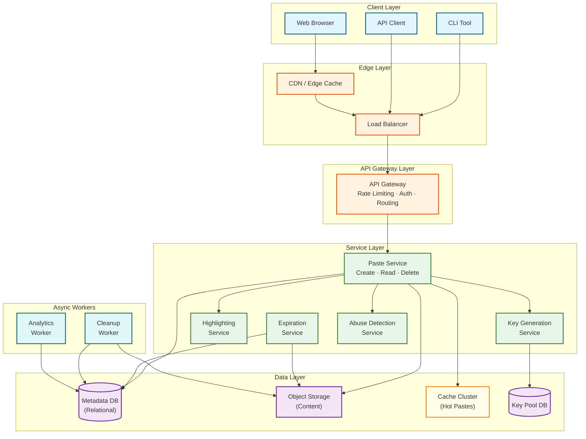
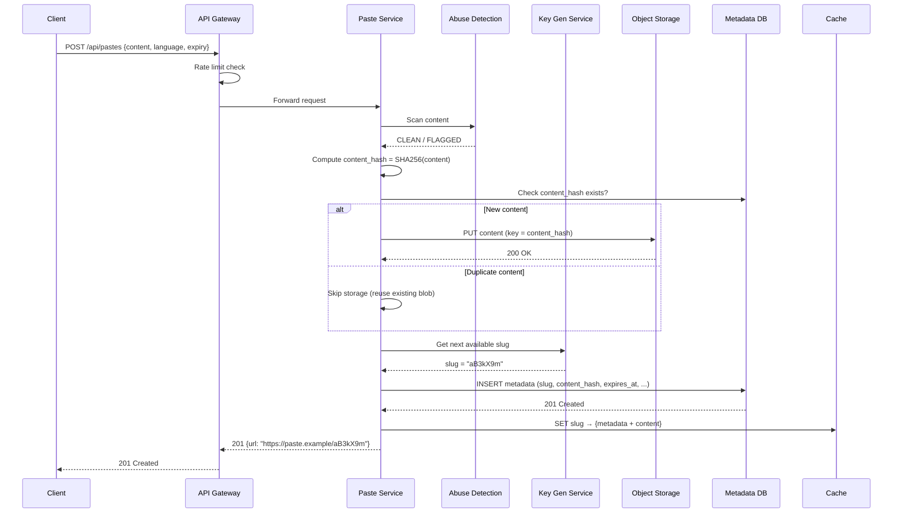
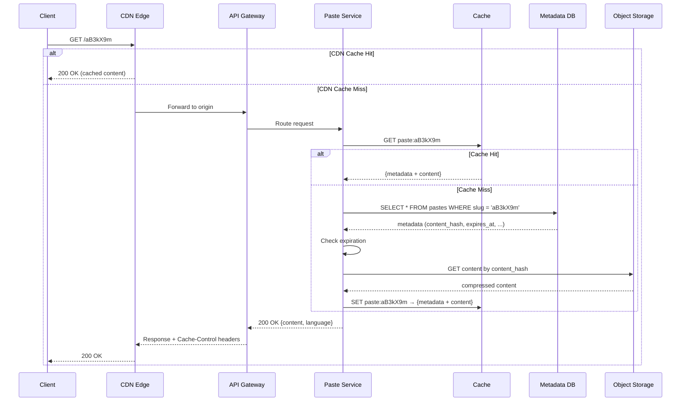

# High-Level Design — Pastebin

## 1. System Architecture



---

## 2. Write Path — Paste Creation

### 2.1 Data Flow

```
1. Client submits paste content + metadata (title, language, expiration, visibility)
2. API Gateway performs:
   a. Rate limit check (per IP / per API key)
   b. Authentication (optional — anonymous pastes allowed)
   c. Request validation (size limits, content-type)
3. Paste Service receives validated request
4. Abuse Detection Service scans content:
   a. Malware signature matching
   b. PII detection (credit cards, SSNs, API keys)
   c. Spam classification
   → If flagged: reject with 422 or queue for manual review
5. Key Generation Service provides a pre-generated unique slug
6. Content hash computed (SHA-256 of raw content)
7. Deduplication check:
   a. Look up content_hash in metadata store
   b. If duplicate exists: reuse existing content blob, create new metadata entry
   c. If unique: store content in Object Storage
8. Metadata written to relational database:
   - slug, content_hash, user_id, created_at, expires_at, language, visibility, size_bytes
9. Cache warmed: metadata + content stored in cache cluster
10. Response: 201 Created with paste URL
```

### 2.2 Sequence Diagram



---

## 3. Read Path — Paste Retrieval

### 3.1 Data Flow

```
1. Client requests paste by URL: GET /aB3kX9m
2. CDN edge cache check:
   a. Cache HIT → Return cached content immediately (with syntax highlighting hints)
   b. Cache MISS → Forward to origin
3. Load Balancer routes to API Gateway
4. API Gateway checks:
   a. Visibility: if private, validate authentication
   b. Password protection: if set, validate password hash
5. Paste Service handles retrieval:
   a. Check application cache (in-memory cache cluster)
   b. Cache HIT → Return content
   c. Cache MISS → Query metadata DB for paste record
6. Expiration check:
   a. If expires_at < now: return 404 (lazy deletion)
   b. Optionally trigger async cleanup
7. Fetch content from Object Storage using content_hash
8. If "burn after reading": mark as viewed, trigger async deletion
9. Increment view count (async, batched)
10. Syntax highlighting:
    a. For web views: return raw content + language hint (client-side rendering)
    b. For embed/iframe: return pre-rendered highlighted HTML
    c. For raw view: return plain text (Content-Type: text/plain)
11. Populate cache with result
12. Return response with appropriate Cache-Control headers
```

### 3.2 Read Path Sequence Diagram



### 3.3 Caching Strategy

```
CDN Edge Cache
├── Cache-Control: public, max-age=300 (public pastes)
├── Cache-Control: private, no-store (private pastes)
├── Vary: Accept (HTML vs plain text)
└── Cache key: slug + format (html/raw/embed)

Application Cache (In-Memory Cluster)
├── Key: paste:{slug}
├── Value: {metadata + content}
├── TTL: 1 hour (configurable)
├── Eviction: LRU
└── Size: ~10 GB (top 20% of accessed pastes)

Bloom Filter (Anti-Thrashing)
├── Tracks slugs that have been accessed at least once
├── New slugs bypass cache on first access
├── Prevents single-access pastes from evicting popular ones
└── False positive rate: 1% (acceptable)
```

---

## 4. Delete Path — Paste Removal

### 4.1 Data Flow

```
1. Authenticated user sends DELETE /api/v1/pastes/{slug}
2. API Gateway validates authentication (Bearer token or API key)
3. Paste Service:
   a. Verify ownership: paste.user_id == authenticated_user.user_id
   b. Soft-delete metadata: SET is_deleted = TRUE
   c. Decrement content blob reference count
   d. If reference_count reaches 0: queue content blob for async deletion
4. Cache invalidation:
   a. Delete from application cache: CACHE.DELETE("paste:{slug}")
   b. Enqueue CDN cache invalidation (async, best-effort)
5. Return 204 No Content
```

### 4.2 Soft Delete vs Hard Delete

```
Why Soft Delete First:
├── Allows undo within a grace period (optional feature)
├── Audit trail for abuse investigations
├── Reference count update is a separate concern from user-facing deletion
├── Hard delete of metadata happens in background sweep (after grace period)
└── Content blob deletion is always async (reference counting must settle)

Hard Delete Schedule:
├── Soft-deleted metadata: Hard-deleted after 30 days (configurable)
├── Orphaned content blobs: Deleted within 1 hour of reference_count reaching 0
├── CDN cache: Invalidated within 5 minutes (CDN TTL as fallback)
└── Application cache: Immediate deletion
```

---

## 5. Key Architectural Decisions

### 5.1 Metadata vs Content Separation

| Decision | Separate metadata (relational DB) from content (object storage) |
|---|---|
| **Why** | Metadata is small, frequently queried, needs indexing (by user, by expiration); content is large, rarely updated, benefits from cheap blob storage |
| **Trade-off** | Two storage systems to manage vs simpler single-store approach |
| **Alternative** | Store everything in a document store (simpler but loses relational query power and cost-efficient blob storage) |
| **Verdict** | Separation wins at scale — metadata in relational DB with indexes, content in object storage with CDN |

### 5.2 Pre-Generated Keys vs On-Demand Generation

| Decision | Use a Key Generation Service (KGS) with pre-generated key pool |
|---|---|
| **Why** | Eliminates collision checking at write time; ensures O(1) key retrieval; avoids retry loops under load |
| **Trade-off** | Additional service to maintain; key pool can be exhausted under extreme load |
| **Alternative** | Hash-based (MD5/SHA → truncate) or counter-based (Base62 encode auto-increment) |
| **Verdict** | KGS provides best latency guarantees and zero-collision writes; hash truncation has collision risk; auto-increment leaks creation order |

### 5.3 Sync Write, Async Cleanup

| Decision | Paste creation is synchronous; expiration and cleanup are asynchronous |
|---|---|
| **Why** | Users need immediate confirmation and URL; cleanup can be batched for efficiency |
| **Trade-off** | Expired pastes may be briefly accessible between expiration time and cleanup |
| **Alternative** | Synchronous expiration checks on every read (adds latency) |
| **Verdict** | Hybrid: lazy deletion on read (check expires_at, return 404) + async background cleanup (actual deletion) |

### 5.4 Client-Side vs Server-Side Syntax Highlighting

| Decision | Client-side highlighting as default; server-side for embeds and crawlers |
|---|---|
| **Why** | Client-side offloads CPU from servers; supports 200+ languages without server compute |
| **Trade-off** | Requires shipping highlighting library to client (~200-500 KB); initial render may flash unstyled content |
| **Alternative** | Full server-side rendering (CPU-intensive at scale) |
| **Verdict** | Hybrid approach: client-side for interactive views, cached server-side for embeds/SEO |

### 5.5 Database Choices

| Component | Choice | Rationale |
|---|---|---|
| **Metadata store** | Relational database (leader-follower) | ACID for writes, rich indexing (by user, by expiration, by visibility), mature tooling |
| **Content store** | Object storage | Unlimited scale, cheap per-GB, built-in replication, CDN integration |
| **Key pool** | Key-value store or relational table | Simple get-and-mark-used semantics; high throughput for sequential reads |
| **Cache** | In-memory store (distributed) | Sub-millisecond reads, LRU eviction, TTL support |
| **Analytics** | Column-oriented store | Aggregate queries over view counts, creation rates, language distribution |

---

## 6. Architecture Pattern Checklist

| Pattern | Applied? | How |
|---|---|---|
| **CQRS** | Partial | Writes go to primary DB; reads served from replicas + cache + CDN |
| **Event Sourcing** | No | Paste creation is a simple write, not an event stream |
| **Saga** | No | No multi-service transactions required |
| **Circuit Breaker** | Yes | Between Paste Service → Object Storage; between Paste Service → Abuse Detection |
| **Bulkhead** | Yes | Separate thread pools for read vs write operations |
| **Cache-Aside** | Yes | Application checks cache first, loads from DB on miss, populates cache |
| **CDN Pull** | Yes | CDN fetches from origin on miss, caches at edge |
| **Bloom Filter** | Yes | Prevents cache pollution from single-access pastes |
| **Content-Addressable Storage** | Yes | Content stored by hash, enabling deduplication |
| **Lazy Deletion** | Yes | Expiration checked at read time; actual deletion is async |

---

## 7. Component Interaction Matrix

```
                    Paste    Key Gen   Highlight  Expiration  Abuse     Metadata  Object    Cache
                    Service  Service   Service    Service     Detection DB        Storage   Cluster
──────────────────────────────────────────────────────────────────────────────────────────────────
Paste Service       —        sync      async      —           sync      sync      sync      sync
Key Gen Service     —        —         —          —           —         sync      —         —
Highlight Service   —        —         —          —           —         —         —         sync
Expiration Service  —        —         —          —           —         sync      sync      sync
Abuse Detection     —        —         —          —           —         —         —         —
Metadata DB         —        —         —          —           —         —         —         —
Object Storage      —        —         —          —           —         —         —         —
Cache Cluster       —        —         —          —           —         —         —         —

sync  = synchronous call (blocking)
async = asynchronous call (non-blocking, fire-and-forget or queued)
—     = no direct interaction
```

---

## 8. Deployment Topology

```
Region: Primary (e.g., US-East)
├── Availability Zone A
│   ├── API Server Pool (3 instances, auto-scaling)
│   ├── Paste Service (3 instances)
│   ├── Key Generation Service (1 instance, with failover)
│   ├── Cache Node (1 primary)
│   └── Metadata DB (primary)
├── Availability Zone B
│   ├── API Server Pool (3 instances, auto-scaling)
│   ├── Paste Service (3 instances)
│   ├── Key Generation Service (1 standby)
│   ├── Cache Node (1 replica)
│   └── Metadata DB (sync replica)
├── Availability Zone C
│   ├── Expiration Worker (2 instances)
│   ├── Cleanup Worker (1 instance)
│   ├── Analytics Worker (1 instance)
│   ├── Cache Node (1 replica)
│   └── Metadata DB (async replica for reads)
└── Cross-Zone
    ├── Object Storage (replicated across AZs automatically)
    ├── CDN (global edge network)
    └── Load Balancer (cross-AZ)

Region: Secondary (e.g., EU-West) — Read-Only Replica
├── CDN edge nodes (serve cached reads)
├── Read-only API servers (proxy to primary for writes)
├── Metadata DB async replica
└── Object Storage replica (cross-region replication)
```
