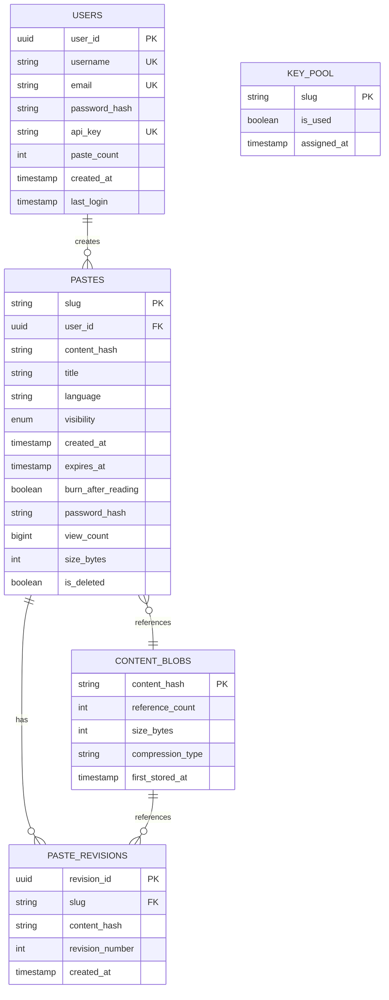

# Low-Level Design — Pastebin

## 1. Data Model

### 1.1 Entity-Relationship Diagram



### 1.2 Paste Metadata Schema

```
Table: pastes

Column              Type            Constraints         Notes
─────────────────────────────────────────────────────────────────
slug                VARCHAR(8)      PRIMARY KEY         Pre-generated from KGS
user_id             UUID            NULLABLE, FK        NULL for anonymous pastes
content_hash        CHAR(64)        NOT NULL            SHA-256 hash (hex)
title               VARCHAR(255)    DEFAULT ''          Optional user-provided title
language            VARCHAR(50)     DEFAULT 'plaintext' Language for syntax highlighting
visibility          ENUM            DEFAULT 'unlisted'  'public', 'unlisted', 'private'
created_at          TIMESTAMP       NOT NULL            UTC, indexed
expires_at          TIMESTAMP       NULLABLE            NULL = never expires; indexed
burn_after_reading  BOOLEAN         DEFAULT FALSE       Delete after first view
password_hash       VARCHAR(255)    NULLABLE            bcrypt hash for password-protected pastes
view_count          BIGINT          DEFAULT 0           Approximate, batched updates
size_bytes          INT             NOT NULL            Raw content size for quota checks
is_deleted          BOOLEAN         DEFAULT FALSE       Soft delete flag
```

**Indexes:**

```
PRIMARY KEY (slug)
INDEX idx_user_pastes (user_id, created_at DESC)     -- User's paste history
INDEX idx_expiration (expires_at) WHERE expires_at IS NOT NULL AND is_deleted = FALSE
    -- Partial index for expiration sweep; only indexes non-deleted pastes with expiration
INDEX idx_public_recent (visibility, created_at DESC) WHERE visibility = 'public'
    -- Public paste listing / recent pastes page
INDEX idx_content_hash (content_hash)                 -- Deduplication lookup
```

### 1.3 Content Storage Schema

```
Object Storage Structure:

Bucket: paste-content
├── Key format: {first-2-chars-of-hash}/{content_hash}
│   Example: a1/a1b2c3d4e5f6...
├── Value: compressed paste content (gzip or zstd)
├── Metadata:
│   ├── Content-Type: application/octet-stream
│   ├── Content-Encoding: gzip
│   └── x-reference-count: 3 (for dedup tracking)
└── Retention: managed by expiration service (not object lifecycle)

The two-character prefix directory structure distributes objects across
storage partitions, avoiding hot-partition issues with lexicographic
key distribution.
```

### 1.4 User Schema

```
Table: users

Column              Type            Constraints         Notes
─────────────────────────────────────────────────────────────────
user_id             UUID            PRIMARY KEY         Generated on registration
username            VARCHAR(32)     UNIQUE, NOT NULL    Display name
email               VARCHAR(255)    UNIQUE, NOT NULL    Login identifier
password_hash       VARCHAR(255)    NOT NULL            bcrypt hash
api_key             VARCHAR(64)     UNIQUE, NOT NULL    Generated on registration; rotatable
paste_count         INT             DEFAULT 0           Maintained via trigger or app logic
default_visibility  ENUM            DEFAULT 'unlisted'  User preference
default_expiration  VARCHAR(10)     DEFAULT '1w'        User preference
created_at          TIMESTAMP       NOT NULL            UTC
last_login          TIMESTAMP       NULLABLE            Updated on login
is_active           BOOLEAN         DEFAULT TRUE        Account status
```

### 1.5 Partitioning & Sharding Strategy

```
Metadata Database Sharding:
  Shard key: slug (first 2 characters provide 62^2 = 3,844 logical partitions)
  Strategy: Range-based sharding on slug prefix
  Rationale: Uniform random distribution (slugs are random Base62)

  Alternative considered: Hash-based sharding on slug
  Rejected because: Range-based already provides uniform distribution
  since slugs themselves are randomly generated

Object Storage:
  Partitioning: Built-in (object storage handles distribution)
  Key prefix: first 2 chars of content_hash for partition spread
  No explicit sharding needed — object storage scales horizontally

Cache Cluster:
  Sharding: Consistent hashing on slug
  Replication: 1 replica per shard for read redundancy
  Node count: 3-5 nodes for mid-scale deployment
```

---

## 2. API Design

### 2.1 Create Paste

```
POST /api/v1/pastes

Headers:
  Content-Type: application/json
  Authorization: Bearer {api_key}    (optional — anonymous creation allowed)
  X-Request-ID: {uuid}               (idempotency key)

Request Body:
{
  "content": "def hello():\n    print('Hello, World!')",
  "title": "My Python Script",           // optional, default: ""
  "language": "python",                   // optional, default: auto-detect
  "expires_in": "1d",                     // optional: "10m", "1h", "1d", "1w", "1M", "6M", "1y", "never"
  "visibility": "unlisted",              // optional: "public", "unlisted", "private"
  "burn_after_reading": false,           // optional, default: false
  "password": "secret123"               // optional, enables password protection
}

Response (201 Created):
{
  "slug": "aB3kX9m",
  "url": "https://paste.example/aB3kX9m",
  "raw_url": "https://paste.example/raw/aB3kX9m",
  "created_at": "2026-03-09T12:00:00Z",
  "expires_at": "2026-03-10T12:00:00Z",
  "visibility": "unlisted",
  "language": "python",
  "size_bytes": 42
}

Error Responses:
  400 Bad Request — Invalid expiration, unsupported language, malformed JSON
  413 Payload Too Large — Content exceeds 512 KB limit
  422 Unprocessable Entity — Content flagged by abuse detection
  429 Too Many Requests — Rate limit exceeded
```

### 2.2 Read Paste

```
GET /api/v1/pastes/{slug}

Headers:
  Accept: application/json              // Returns metadata + content
  Accept: text/html                     // Returns rendered page with syntax highlighting
  Accept: text/plain                    // Returns raw content only

Query Parameters:
  password={string}                     // Required for password-protected pastes

Response (200 OK — application/json):
{
  "slug": "aB3kX9m",
  "title": "My Python Script",
  "content": "def hello():\n    print('Hello, World!')",
  "language": "python",
  "created_at": "2026-03-09T12:00:00Z",
  "expires_at": "2026-03-10T12:00:00Z",
  "visibility": "unlisted",
  "view_count": 42,
  "size_bytes": 42
}

Response Headers:
  Cache-Control: public, max-age=300     // For public/unlisted pastes
  ETag: "content_hash_value"             // For conditional requests
  X-Content-Language: python             // Hint for client-side highlighting

Error Responses:
  401 Unauthorized — Private paste, authentication required
  403 Forbidden — Incorrect password
  404 Not Found — Paste does not exist or has expired
  410 Gone — Paste was explicitly deleted by owner
```

### 2.3 Read Raw Content

```
GET /api/v1/pastes/{slug}/raw

Response (200 OK):
  Content-Type: text/plain; charset=utf-8
  Body: raw paste content (no JSON wrapping, no HTML)

Use case: CLI tools, curl, wget, programmatic access
```

### 2.4 Update Paste Metadata

```
PATCH /api/v1/pastes/{slug}

Headers:
  Authorization: Bearer {api_key}        // Required — must be paste owner

Request Body (partial update):
{
  "title": "Updated Title",
  "language": "javascript",
  "expires_in": "1w",
  "visibility": "private"
}

Note: Content is immutable. To change content, create a new paste (fork).

Response (200 OK):
  Updated paste metadata
```

### 2.5 Delete Paste

```
DELETE /api/v1/pastes/{slug}

Headers:
  Authorization: Bearer {api_key}        // Required — must be paste owner

Response (204 No Content)

Side effects:
  - Metadata soft-deleted (is_deleted = TRUE)
  - CDN cache invalidation triggered (async)
  - Content blob reference count decremented
  - If reference_count reaches 0, content blob queued for deletion
```

### 2.6 List User's Pastes

```
GET /api/v1/users/me/pastes

Headers:
  Authorization: Bearer {api_key}        // Required

Query Parameters:
  page=1&per_page=20                    // Pagination
  sort=created_at:desc                  // Sort order

Response (200 OK):
{
  "pastes": [ ... ],
  "total": 142,
  "page": 1,
  "per_page": 20,
  "has_next": true
}
```

### 2.7 Fork Paste

```
POST /api/v1/pastes/{slug}/fork

Headers:
  Authorization: Bearer {api_key}        // Optional

Response (201 Created):
{
  "slug": "xY7mN2p",
  "url": "https://paste.example/xY7mN2p",
  "forked_from": "aB3kX9m",
  ...
}

Note: Creates a new paste with the same content (same content_hash,
increments reference_count). New metadata entry with new slug.
```

---

## 3. Core Algorithms

### 3.1 Key Generation — Pre-Generated Pool

The Key Generation Service (KGS) pre-generates random Base62 slugs and stores them in a key pool. When the Paste Service needs a slug, it atomically claims one from the pool.

**Slug format:** 8 characters, Base62 (a-z, A-Z, 0-9) → 62^8 = 218 trillion possible keys

**Why 8 characters?**
- 6 characters: 62^6 = 56.8 billion (sufficient for years, but leaves less collision margin)
- 7 characters: 62^7 = 3.5 trillion (comfortable margin)
- 8 characters: 62^8 = 218 trillion (practically inexhaustible)
- At 2M pastes/day, 8-char keys last 298 million years

**Pre-generation pseudocode:**

```
FUNCTION generate_key_batch(batch_size):
    keys = []
    FOR i IN range(batch_size):
        slug = ""
        FOR j IN range(8):
            slug += RANDOM_CHOICE("abcdefghijklmnopqrstuvwxyzABCDEFGHIJKLMNOPQRSTUVWXYZ0123456789")
        keys.APPEND(slug)

    // Bulk insert, ignoring duplicates (extremely rare with 62^8 space)
    INSERT INTO key_pool (slug, is_used) VALUES keys
        ON CONFLICT DO NOTHING

    RETURN count_inserted

// Time complexity: O(batch_size)
// Space complexity: O(batch_size)
```

**Key claiming pseudocode:**

```
FUNCTION claim_key():
    // Atomic claim: SELECT + UPDATE in one transaction
    // Uses SKIP LOCKED to avoid contention between concurrent writers

    BEGIN TRANSACTION
        slug = SELECT slug FROM key_pool
                WHERE is_used = FALSE
                LIMIT 1
                FOR UPDATE SKIP LOCKED

        UPDATE key_pool SET is_used = TRUE, assigned_at = NOW()
            WHERE slug = slug
    COMMIT

    RETURN slug

// Time complexity: O(1) with index on is_used
// Space complexity: O(1)
```

**Pool management:**

```
FUNCTION monitor_key_pool():
    EVERY 60 seconds:
        available = SELECT COUNT(*) FROM key_pool WHERE is_used = FALSE

        IF available < LOW_WATERMARK (e.g., 100,000):
            generate_key_batch(REPLENISH_SIZE)  // e.g., 500,000 keys
            ALERT("Key pool replenished")

        IF available < CRITICAL_THRESHOLD (e.g., 10,000):
            ALERT_CRITICAL("Key pool nearly exhausted")
```

### 3.2 Content Deduplication via Hashing

```
FUNCTION store_content(raw_content):
    // Compute content hash for deduplication
    content_hash = SHA256(raw_content)

    // Check if content already exists
    existing = SELECT reference_count FROM content_blobs
               WHERE content_hash = content_hash

    IF existing IS NOT NULL:
        // Duplicate detected — increment reference count
        UPDATE content_blobs
            SET reference_count = reference_count + 1
            WHERE content_hash = content_hash

        RETURN content_hash  // Reuse existing blob

    // New content — compress and store
    compressed = GZIP_COMPRESS(raw_content)

    // Determine storage key with prefix for partition spread
    storage_key = content_hash[0:2] + "/" + content_hash

    OBJECT_STORAGE.PUT(
        bucket = "paste-content",
        key = storage_key,
        body = compressed,
        metadata = {
            "Content-Encoding": "gzip",
            "original-size": LENGTH(raw_content)
        }
    )

    INSERT INTO content_blobs (content_hash, reference_count, size_bytes, compression_type, first_stored_at)
        VALUES (content_hash, 1, LENGTH(raw_content), "gzip", NOW())

    RETURN content_hash

// Time complexity: O(n) where n = content size (for hashing and compression)
// Space complexity: O(n) for the compressed content
```

### 3.3 Content Deletion with Reference Counting

```
FUNCTION delete_paste(slug, user_id):
    BEGIN TRANSACTION
        paste = SELECT * FROM pastes WHERE slug = slug AND user_id = user_id

        IF paste IS NULL:
            RETURN 404  // Not found or not owned by user

        // Soft-delete the paste metadata
        UPDATE pastes SET is_deleted = TRUE WHERE slug = slug

        // Decrement reference count
        UPDATE content_blobs
            SET reference_count = reference_count - 1
            WHERE content_hash = paste.content_hash

        // Check if content blob is orphaned
        ref_count = SELECT reference_count FROM content_blobs
                    WHERE content_hash = paste.content_hash

        IF ref_count <= 0:
            // Queue content blob for deletion (async)
            ENQUEUE("content-deletion-queue", {
                content_hash: paste.content_hash,
                storage_key: paste.content_hash[0:2] + "/" + paste.content_hash
            })

            DELETE FROM content_blobs WHERE content_hash = paste.content_hash
    COMMIT

    // Async: invalidate CDN cache
    CDN.INVALIDATE("/pastes/" + slug)
    CDN.INVALIDATE("/raw/" + slug)

    // Async: remove from application cache
    CACHE.DELETE("paste:" + slug)

    RETURN 204

// Time complexity: O(1)
// Space complexity: O(1)
```

### 3.4 Expiration Handling — Three-Tier Strategy

```
// TIER 1: Lazy Deletion (on read)
FUNCTION read_paste(slug):
    paste = CACHE.GET("paste:" + slug)

    IF paste IS NULL:
        paste = SELECT * FROM pastes WHERE slug = slug AND is_deleted = FALSE

    IF paste IS NULL:
        RETURN 404

    // Check expiration at read time
    IF paste.expires_at IS NOT NULL AND paste.expires_at < NOW():
        // Paste has expired — treat as not found
        CACHE.DELETE("paste:" + slug)

        // Trigger async cleanup
        ENQUEUE("expiration-cleanup-queue", {slug: slug})

        RETURN 404

    // Check burn-after-reading
    IF paste.burn_after_reading AND paste.view_count > 0:
        CACHE.DELETE("paste:" + slug)
        ENQUEUE("expiration-cleanup-queue", {slug: slug})
        RETURN 404

    // Fetch content and return
    content = fetch_content(paste.content_hash)

    // Async: increment view count (batched)
    VIEW_COUNTER.INCREMENT(slug)

    RETURN {paste, content}


// TIER 2: TTL Index (database-level, for stores that support it)
// Configure TTL index on expires_at column
// Database automatically removes expired documents
// Works well for NoSQL stores; for relational DBs, use Tier 3 instead


// TIER 3: Background Sweep (batch cleanup)
FUNCTION expiration_sweep():
    EVERY 5 minutes:
        // Process in batches to avoid locking
        batch_size = 1000

        LOOP:
            expired_pastes = SELECT slug, content_hash FROM pastes
                             WHERE expires_at < NOW()
                             AND is_deleted = FALSE
                             LIMIT batch_size

            IF expired_pastes IS EMPTY:
                BREAK

            FOR paste IN expired_pastes:
                delete_paste_internal(paste.slug, paste.content_hash)

            // Yield between batches to reduce DB pressure
            SLEEP(100ms)

    // Metrics
    EMIT_METRIC("expiration.sweep.deleted_count", count)
    EMIT_METRIC("expiration.sweep.duration_ms", elapsed)
```

### 3.5 View Count Batching

```
// Buffer view count increments in memory, flush periodically
// Prevents write amplification on hot pastes

VIEW_BUFFER = {}  // In-memory map: slug → count

FUNCTION increment_view(slug):
    ATOMIC:
        IF slug NOT IN VIEW_BUFFER:
            VIEW_BUFFER[slug] = 0
        VIEW_BUFFER[slug] += 1

FUNCTION flush_view_counts():
    EVERY 30 seconds:
        buffer_snapshot = SWAP(VIEW_BUFFER, {})  // Atomic swap

        IF buffer_snapshot IS EMPTY:
            RETURN

        // Batch update in a single query
        BATCH_UPDATE pastes
            SET view_count = view_count + delta
            WHERE slug IN buffer_snapshot.keys()
            VALUES buffer_snapshot

        EMIT_METRIC("view_count.flush.batch_size", LENGTH(buffer_snapshot))

// Time complexity: O(1) per increment; O(n) per flush where n = unique slugs
// Trade-off: View counts are approximate (up to 30s stale), but eliminates
//            per-read database writes
```

---

## 4. Language Auto-Detection

```
FUNCTION detect_language(content):
    // Heuristic-based language detection
    // Check for shebang line
    first_line = content.SPLIT("\n")[0]
    IF first_line.STARTS_WITH("#!"):
        IF "python" IN first_line: RETURN "python"
        IF "node" IN first_line: RETURN "javascript"
        IF "bash" IN first_line OR "sh" IN first_line: RETURN "bash"
        IF "ruby" IN first_line: RETURN "ruby"
        IF "perl" IN first_line: RETURN "perl"

    // Check for common language patterns
    patterns = {
        "python": [r"^import \w+", r"^from \w+ import", r"def \w+\(", r"class \w+:"],
        "javascript": [r"const \w+ =", r"function \w+\(", r"=>", r"require\("],
        "java": [r"public class", r"public static void main", r"import java\."],
        "go": [r"^package \w+", r"func \w+\(", r"import \("],
        "rust": [r"^use \w+", r"fn \w+\(", r"let mut", r"impl \w+"],
        "html": [r"<!DOCTYPE", r"<html", r"<div", r"<head>"],
        "sql": [r"SELECT .+ FROM", r"CREATE TABLE", r"INSERT INTO"],
        "json": [r"^\{", r"^\["],
        "yaml": [r"^\w+:", r"^---"],
        "markdown": [r"^# ", r"^## ", r"^\*\*", r"^\- \["]
    }

    scores = {}
    FOR language, regexes IN patterns:
        score = 0
        FOR regex IN regexes:
            IF REGEX_MATCH(content, regex):
                score += 1
        IF score > 0:
            scores[language] = score

    IF scores IS EMPTY:
        RETURN "plaintext"

    RETURN MAX_BY_VALUE(scores)

// Time complexity: O(n x p) where n = content length, p = number of patterns
// Accuracy: ~70-80% for common languages; user override available
```

---

## 5. Idempotency for Paste Creation

```
FUNCTION create_paste_idempotent(request):
    idempotency_key = request.headers["X-Request-ID"]

    IF idempotency_key IS NOT NULL:
        // Check if this request was already processed
        cached_response = CACHE.GET("idempotency:" + idempotency_key)
        IF cached_response IS NOT NULL:
            RETURN cached_response  // Return same response as before

    // Process normally
    response = create_paste(request)

    // Cache the response for idempotency (24-hour TTL)
    IF idempotency_key IS NOT NULL:
        CACHE.SET("idempotency:" + idempotency_key, response, TTL=86400)

    RETURN response

// Prevents duplicate paste creation on network retries
// Client must generate and send X-Request-ID header
// Same request ID always returns same response (same slug, same URL)
```

---

## 6. Rate Limiting Design

```
Rate Limiting Tiers:

Anonymous users (by IP):
├── Create: 10 pastes per hour
├── Read: 100 reads per minute
└── API: Not available (requires API key)

Authenticated users (by API key):
├── Create: 100 pastes per hour
├── Read: 1,000 reads per minute
└── Bulk: 50 pastes per batch request

Premium users (by API key):
├── Create: 1,000 pastes per hour
├── Read: 10,000 reads per minute
└── Bulk: 500 pastes per batch request


FUNCTION check_rate_limit(identifier, action, tier):
    key = "ratelimit:" + identifier + ":" + action
    window = GET_WINDOW(tier, action)  // e.g., 3600 for hourly
    limit = GET_LIMIT(tier, action)    // e.g., 100 for authenticated create

    // Sliding window counter using sorted set
    now = CURRENT_TIMESTAMP_MS()
    window_start = now - (window * 1000)

    // Remove expired entries
    CACHE.ZREMRANGEBYSCORE(key, 0, window_start)

    // Count current requests in window
    current_count = CACHE.ZCARD(key)

    IF current_count >= limit:
        retry_after = (CACHE.ZRANGE(key, 0, 0)[0] + window * 1000 - now) / 1000
        RETURN {allowed: FALSE, retry_after: retry_after}

    // Add current request
    CACHE.ZADD(key, now, now + ":" + RANDOM())
    CACHE.EXPIRE(key, window)

    RETURN {allowed: TRUE, remaining: limit - current_count - 1}

// Time complexity: O(log n) per check where n = requests in window
// Space complexity: O(n) per identifier per action
```
