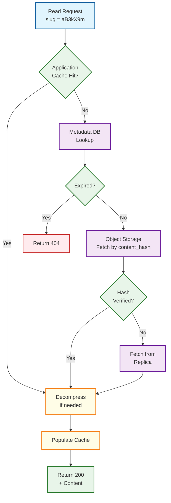
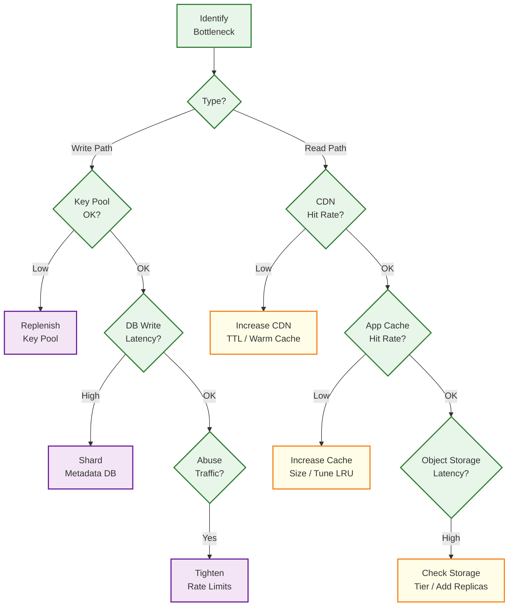

# Deep Dive & Bottlenecks — Pastebin

## 1. Deep Dive: Content Storage Engine

### 1.1 Why This Component Is Critical

The content storage engine is the heart of a pastebin system. It must handle:
- **Write efficiency:** Compress and store paste content with deduplication
- **Read efficiency:** Retrieve and decompress content with sub-100ms latency
- **Cost optimization:** Minimize storage costs for billions of pastes over years
- **Durability:** Ensure zero data loss for non-expired content

The separation of content from metadata is the single most impactful architectural decision. It enables independent scaling (metadata needs fast indexing; content needs cheap bulk storage), independent caching strategies (metadata is tiny and frequently accessed; content varies from bytes to 512 KB), and deduplication (multiple metadata entries can point to the same content blob).

### 1.2 How It Works

#### Storage Tiering

```
Content Storage Tiers:

Hot Tier (0-24 hours after creation):
├── Location: In-memory cache cluster
├── Access pattern: Highest read frequency (newly shared pastes)
├── Compression: None (stored decompressed for fast serving)
└── Eviction: LRU with 1-hour TTL

Warm Tier (1-30 days):
├── Location: Object storage, standard tier
├── Access pattern: Moderate reads, decreasing over time
├── Compression: gzip (level 6, balance of speed and ratio)
└── Lifecycle: Automatic transition based on access frequency

Cold Tier (30+ days):
├── Location: Object storage, infrequent access tier
├── Access pattern: Rare reads, mostly from direct URL sharing
├── Compression: zstd (higher ratio for long-term storage)
├── Cost: ~60% cheaper than standard tier
└── Retrieval: Slightly higher latency (acceptable for cold content)

Archive Tier (expired but retained for compliance):
├── Location: Object storage, archive tier
├── Access pattern: Near-zero reads
├── Compression: zstd (maximum compression)
├── Cost: ~90% cheaper than standard tier
└── Retrieval: Minutes-to-hours latency (bulk restore)
```

#### Compression Strategy

```
FUNCTION choose_compression(content, size_bytes):
    // Small pastes: compression overhead exceeds savings
    IF size_bytes < 256:
        RETURN {algorithm: "none", content: content}

    // Medium pastes: gzip for speed
    IF size_bytes < 50_000:
        compressed = GZIP_COMPRESS(content, level=6)
        ratio = LENGTH(compressed) / size_bytes

        // Only compress if meaningful savings (>20%)
        IF ratio < 0.80:
            RETURN {algorithm: "gzip", content: compressed}
        ELSE:
            RETURN {algorithm: "none", content: content}

    // Large pastes: zstd for better ratio
    compressed = ZSTD_COMPRESS(content, level=3)
    RETURN {algorithm: "zstd", content: compressed}

// Typical compression ratios for code:
// - gzip level 6: 3:1 to 5:1 for source code
// - zstd level 3: 3.5:1 to 6:1 for source code
// - Plain text compresses better than minified code
```

#### Deduplication Flow

```
Content Deduplication Pipeline:

1. Client submits paste content
2. Compute SHA-256 hash of raw content
3. Query content_blobs table for existing hash
   ├── Hit: Increment reference_count, skip object storage write
   │        Cost savings: ~15-30% of storage
   └── Miss: Compress content, write to object storage, insert content_blobs record

Deduplication Statistics (typical):
├── Exact duplicates: 15-20% of all pastes
│   Common sources: default templates, "Hello World" programs,
│   error log pastes, test data, README templates
├── Near-duplicates: 10-15% additional
│   Cannot be deduplicated with exact matching alone
│   Would require similarity hashing (future optimization)
└── Unique content: 65-75% of pastes
```

#### Content Retrieval Pipeline



### 1.3 Failure Modes

| Failure | Impact | Detection | Recovery |
|---|---|---|---|
| **Object storage unavailable** | Reads return metadata but no content (partial failure) | Health check failures, elevated error rates | Circuit breaker → serve from cache if available; return 503 with retry-after |
| **Content hash collision** | Two different contents map to same hash (SHA-256: astronomically unlikely, ~10^-60) | Content verification on read (compare hash of retrieved content) | Use full SHA-256 (no truncation); in the impossible collision case, store both with a version suffix |
| **Reference count drift** | Orphaned content blobs (wasted storage) or premature deletion (data loss) | Periodic reconciliation job comparing metadata references vs blob counts | Weekly reconciliation scan; if ref_count seems wrong, recalculate from actual paste references |
| **Compression corruption** | Decompression failure on read | CRC check on decompress, hash verification | Store uncompressed fallback for critical pastes; re-store from replica |
| **Cold tier retrieval timeout** | Cold pastes load slowly | P99 latency monitoring per storage tier | Pre-warm on first access; promote back to warm tier if paste becomes popular again |

### 1.4 Handling Failures

```
FUNCTION resilient_content_fetch(content_hash):
    // Layer 1: In-memory cache
    content = CACHE.GET("content:" + content_hash)
    IF content IS NOT NULL:
        RETURN decompress(content)

    // Layer 2: Object storage with circuit breaker
    IF CIRCUIT_BREAKER("object-storage").IS_OPEN:
        RETURN ERROR("Service temporarily unavailable", 503)

    TRY:
        storage_key = content_hash[0:2] + "/" + content_hash
        blob = OBJECT_STORAGE.GET("paste-content", storage_key)

        // Verify integrity
        IF SHA256(decompress(blob)) != content_hash:
            EMIT_METRIC("content.integrity_failure", 1)
            LOG_ERROR("Content integrity failure", {hash: content_hash})
            // Try replica
            blob = OBJECT_STORAGE.GET_FROM_REPLICA("paste-content", storage_key)

        content = decompress(blob)

        // Populate cache for subsequent reads
        CACHE.SET("content:" + content_hash, blob, TTL=3600)

        CIRCUIT_BREAKER("object-storage").RECORD_SUCCESS()
        RETURN content

    CATCH StorageException:
        CIRCUIT_BREAKER("object-storage").RECORD_FAILURE()
        RETURN ERROR("Content temporarily unavailable", 503)
```

---

## 2. Deep Dive: Expiration & Cleanup Pipeline

### 2.1 Why This Component Is Critical

At 2M pastes/day with ~50% having expiration set, the system accumulates 1M expired records daily. Without efficient cleanup:
- **Storage costs grow linearly** even though content is no longer needed
- **Database indexes degrade** as the table fills with expired-but-present records
- **Query performance suffers** as scans must skip expired rows
- **Compliance risk** if expired content remains accessible

The challenge is performing cleanup without impacting the live read/write path.

### 2.2 How It Works

#### Three-Tier Expiration Architecture

```
Tier 1: Lazy Deletion (Instant, Per-Request)
┌─────────────────────────────────────────────┐
│ Check expires_at on every read request.     │
│ If expired → return 404, enqueue cleanup.   │
│ Cost: O(1) per read. Zero additional load.  │
│ Gap: Only catches pastes that are READ.     │
│ Unread expired pastes remain in storage.    │
└─────────────────────────────────────────────┘

Tier 2: TTL-Based Database Cleanup (Automatic)
┌─────────────────────────────────────────────┐
│ For databases supporting TTL indexes:       │
│ - Set TTL on expires_at column              │
│ - Database automatically removes expired    │
│   documents after TTL elapses               │
│ Cost: Handled by database engine internally │
│ Gap: Only works for NoSQL stores with TTL;  │
│       relational DBs need Tier 3 instead    │
└─────────────────────────────────────────────┘

Tier 3: Background Sweep Worker (Batch)
┌─────────────────────────────────────────────┐
│ Dedicated worker process runs every 5 min.  │
│ Queries expiration index for expired pastes.│
│ Processes in batches of 1000.               │
│ Deletes metadata + decrements ref counts.   │
│ Queues orphaned content blobs for deletion. │
│ Runs against read replica to avoid          │
│ impacting primary write path.               │
│ Cost: O(batch_size) per sweep cycle.        │
│ Gap: Up to 5-min delay between expiration   │
│       time and actual cleanup.              │
└─────────────────────────────────────────────┘
```

#### Expiration Pipeline Flow

```mermaid
flowchart LR
    subgraph Tier1["Tier 1: Lazy Deletion"]
        READ["Read Request"] --> CHECK{"expires_at<br/>< NOW()?"}
        CHECK -->|Yes| RETURN_404["Return 404"]
        CHECK -->|No| SERVE["Serve Content"]
        RETURN_404 --> ENQUEUE1["Enqueue<br/>Cleanup"]
    end

    subgraph Tier3["Tier 3: Background Sweep"]
        SWEEP["Sweep Worker<br/>Every 5 min"] --> QUERY["Query Expired<br/>Pastes (batch)"]
        QUERY --> SOFT_DEL["Soft Delete<br/>Metadata"]
        SOFT_DEL --> DECREF["Decrement<br/>Ref Count"]
        DECREF --> ORPHAN{"ref_count<br/>= 0?"}
        ORPHAN -->|Yes| BLOB_DEL["Queue Blob<br/>Deletion"]
        ORPHAN -->|No| NEXT["Next Paste"]
    end

    subgraph BlobCleanup["Blob Deletion Worker"]
        BLOB_QUEUE["Deletion<br/>Queue"] --> VERIFY["Verify<br/>ref_count = 0"]
        VERIFY --> DELETE_OBJ["Delete from<br/>Object Storage"]
        DELETE_OBJ --> DELETE_META["Delete from<br/>content_blobs"]
    end

    ENQUEUE1 -.-> SWEEP
    BLOB_DEL -.-> BLOB_QUEUE

    classDef service fill:#e8f5e9,stroke:#2e7d32,stroke-width:2px
    classDef data fill:#f3e5f5,stroke:#6a1b9a,stroke-width:2px
    classDef queue fill:#e0f7fa,stroke:#00695c,stroke-width:2px
    classDef error fill:#ffebee,stroke:#c62828,stroke-width:2px

    class READ,SWEEP,VERIFY service
    class QUERY,SOFT_DEL,DECREF,DELETE_OBJ,DELETE_META data
    class ENQUEUE1,BLOB_QUEUE,BLOB_DEL queue
    class RETURN_404 error
    class CHECK,ORPHAN service
    class SERVE,NEXT service
```



#### Sweep Worker Implementation

```
FUNCTION expiration_sweep_worker():
    WHILE TRUE:
        // Use read replica for scan to avoid loading primary
        expired_batch = REPLICA.QUERY(
            "SELECT slug, content_hash FROM pastes
             WHERE expires_at < NOW() - INTERVAL '5 minutes'
             AND is_deleted = FALSE
             ORDER BY expires_at ASC
             LIMIT 1000"
        )

        IF expired_batch IS EMPTY:
            SLEEP(5 minutes)
            CONTINUE

        FOR paste IN expired_batch:
            TRY:
                // Perform deletion on primary
                PRIMARY.EXECUTE(
                    "UPDATE pastes SET is_deleted = TRUE WHERE slug = ?",
                    paste.slug
                )

                // Decrement reference count
                new_ref_count = PRIMARY.EXECUTE(
                    "UPDATE content_blobs
                     SET reference_count = reference_count - 1
                     WHERE content_hash = ?
                     RETURNING reference_count",
                    paste.content_hash
                )

                IF new_ref_count <= 0:
                    ENQUEUE("blob-deletion-queue", paste.content_hash)

                // Invalidate caches
                CACHE.DELETE("paste:" + paste.slug)
                CDN.INVALIDATE_ASYNC("/" + paste.slug)

                EMIT_METRIC("expiration.paste_cleaned", 1)

            CATCH Exception AS e:
                LOG_ERROR("Expiration cleanup failed", {slug: paste.slug, error: e})
                EMIT_METRIC("expiration.cleanup_error", 1)
                // Continue with next paste; retry on next sweep

        // Rate limit: don't overwhelm the primary
        SLEEP(200ms)

        // Track progress
        EMIT_METRIC("expiration.sweep.batch_completed", 1)
        EMIT_METRIC("expiration.sweep.batch_size", LENGTH(expired_batch))
```

#### Reference Count Reconciliation

```
FUNCTION reconcile_reference_counts():
    // Weekly job to detect and fix reference count drift
    // Runs during lowest-traffic window (e.g., Sunday 3 AM UTC)

    BATCH_SIZE = 5000
    offset = 0
    discrepancies = 0

    LOOP:
        blobs = SELECT content_hash, reference_count
                FROM content_blobs
                ORDER BY content_hash
                LIMIT BATCH_SIZE OFFSET offset

        IF blobs IS EMPTY:
            BREAK

        FOR blob IN blobs:
            actual_count = SELECT COUNT(*) FROM pastes
                           WHERE content_hash = blob.content_hash
                           AND is_deleted = FALSE

            IF actual_count != blob.reference_count:
                discrepancies += 1
                LOG_WARN("Reference count mismatch", {
                    hash: blob.content_hash,
                    stored: blob.reference_count,
                    actual: actual_count
                })

                // Fix the count
                UPDATE content_blobs
                    SET reference_count = actual_count
                    WHERE content_hash = blob.content_hash

                // If actual count is 0, queue for deletion
                IF actual_count = 0:
                    ENQUEUE("blob-deletion-queue", blob.content_hash)

        offset += BATCH_SIZE
        SLEEP(500ms)  // Yield between batches

    EMIT_METRIC("reconciliation.discrepancies", discrepancies)
    EMIT_METRIC("reconciliation.blobs_checked", offset)
```

### 2.3 Failure Modes

| Failure | Impact | Detection | Recovery |
|---|---|---|---|
| **Sweep worker crash** | Expired pastes accumulate; storage grows | Worker heartbeat monitoring, dead letter queue depth | Auto-restart with supervisor; multiple worker instances for redundancy |
| **Primary DB overload from cleanup** | Write latency increases for live traffic | Primary DB CPU/IO metrics spike correlated with sweep timing | Reduce batch size, increase sleep between batches, schedule during off-peak |
| **CDN cache not invalidated** | Expired paste still served from edge | Monitor CDN cache hit rate for expired slugs | CDN invalidation retry queue; short CDN TTL (5 min) as safety net |
| **Reference count underflow** | Content blob deleted while still referenced | Reference count goes negative; integrity check alerts | Reconciliation job recalculates from actual paste references |
| **Clock skew between nodes** | Pastes expire too early or too late | NTP monitoring, clock drift alerts | Use centralized time source; add grace period to expiration checks |

### 2.4 Expiration Edge Cases

```
Edge Case 1: Race Between Read and Expiration
──────────────────────────────────────────────
Scenario: Paste expires at T=100. User requests at T=99.
  Read starts at T=99, fetches metadata (not expired)
  Content fetch takes 200ms (object storage latency)
  Response returned at T=99.2 with valid content

  Is this correct? YES — the paste was valid when the request arrived.
  The read should succeed. Expiration is checked at request start time.


Edge Case 2: Burn-After-Reading Race Condition
──────────────────────────────────────────────
Scenario: Two users request the same burn-after-reading paste simultaneously.

  Solution: Use atomic compare-and-swap on view_count:
    UPDATE pastes SET view_count = 1, is_deleted = TRUE
    WHERE slug = ? AND view_count = 0 AND burn_after_reading = TRUE

  If rows_affected = 0: another reader got there first → return 404
  If rows_affected = 1: this reader wins → return content, trigger cleanup


Edge Case 3: Expired Paste in Search Index
──────────────────────────────────────────
Scenario: Public paste expires but remains in "recent pastes" listing.

  Solution: Recent pastes query includes WHERE expires_at > NOW() OR expires_at IS NULL
  Additional safety: Client-side check of expires_at in response


Edge Case 4: Expiration During Content Fetch
────────────────────────────────────────────
Scenario: Metadata fetch succeeds (not expired), but during the 200ms object
  storage fetch, the paste crosses its expiration time.

  Decision: Serve the content anyway. The user's request was valid at the time
  it was received. The next request will see the paste as expired.
  This matches HTTP semantics: the response is valid for the duration of
  the request processing.


Edge Case 5: Timezone and Daylight Saving Transitions
─────────────────────────────────────────────────────
Scenario: User creates paste at 1:30 AM with "1 hour" expiration.
  Clock springs forward at 2:00 AM (DST). Does the paste expire at 2:30 AM
  (which is now 3:30 AM wall clock)?

  Solution: All timestamps stored and compared in UTC. DST is irrelevant.
  expires_at = created_at + interval, both in UTC. No ambiguity.
```

---

## 3. Deep Dive: Syntax Highlighting at Scale

### 3.1 Why This Component Is Critical

Syntax highlighting transforms raw text into readable, color-coded output. It seems purely cosmetic, but at scale it has significant architectural implications:
- **CPU cost:** Tokenizing and rendering 200+ language grammars is computationally expensive
- **Latency impact:** Server-side highlighting adds 50-200ms to response time for large pastes
- **Bandwidth:** Highlighted HTML is 3-5x larger than raw text
- **Caching:** Highlighted output is format-specific (HTML theme, color scheme)

### 3.2 How It Works

#### Hybrid Rendering Strategy

```
Syntax Highlighting Decision Matrix:

Request Type          Rendering    Rationale
──────────────────────────────────────────────────────
Web browser (HTML)    Client-side  Ship raw text + language hint; browser renders
API (JSON)            None         Return raw text; consumer handles rendering
Raw view              None         Plain text, no highlighting
Embed/iframe          Server-side  Pre-rendered HTML for cross-origin embedding
Crawler/bot           Server-side  Pre-rendered HTML for search indexing (SEO)
PDF export            Server-side  Rendered and converted server-side
```

#### Client-Side Rendering Flow

```
1. Server returns response:
   {
     content: "def hello():\n    print('world')",
     language: "python",
     // NO highlighted HTML — just raw text + language hint
   }

2. Client loads highlighting library (lazy-loaded):
   - Core library: ~50 KB (gzipped)
   - Language grammar: ~2-10 KB per language (loaded on demand)

3. Client tokenizes and renders:
   - Tokenization: ~5ms for typical paste (< 10 KB)
   - DOM update: ~2ms
   - Total client-side time: ~10ms (imperceptible)

4. Benefits:
   - Zero server CPU for highlighting
   - Infinite language support without server changes
   - Theme customization (dark/light) without re-rendering
   - Reduced server bandwidth (raw text vs 3-5x larger HTML)
```

#### Server-Side Rendering for Embeds

```
FUNCTION render_highlighted(content, language):
    // Check render cache first
    cache_key = "highlighted:" + SHA256(content + language + theme)
    cached = CACHE.GET(cache_key)
    IF cached IS NOT NULL:
        RETURN cached

    // Tokenize content
    grammar = LOAD_GRAMMAR(language)
    tokens = TOKENIZE(content, grammar)

    // Generate HTML
    html = "<pre class='highlight'><code>"
    FOR token IN tokens:
        css_class = TOKEN_TYPE_TO_CLASS(token.type)
        html += "<span class='" + css_class + "'>"
        html += HTML_ESCAPE(token.value)
        html += "</span>"
    html += "</code></pre>"

    // Cache rendered output (content is immutable, so cache indefinitely)
    CACHE.SET(cache_key, html, TTL=86400)  // 24-hour TTL

    RETURN html

// Time complexity: O(n) where n = content length
// Space complexity: O(n) for the HTML output (3-5x expansion)
```

### 3.3 Performance Considerations

```
Highlighting Performance by Content Size:

Content Size    Tokenization Time    HTML Size       Strategy
────────────────────────────────────────────────────────────
< 1 KB          < 1ms               3 KB            Client-side (trivial)
1-10 KB         1-5ms               3-50 KB         Client-side (fast)
10-50 KB        5-20ms              30-250 KB       Client-side (acceptable)
50-100 KB       20-50ms             150-500 KB      Client-side with progressive rendering
100-512 KB      50-200ms            300 KB - 2.5 MB Client-side with virtualized viewport
                                                     (only render visible lines)

Server-Side Cost (if used):
├── CPU: ~0.5ms per KB of content
├── At 100 QPS with avg 5 KB paste: 250ms of CPU per second (~25% of one core)
├── At 1000 QPS: 2.5 cores dedicated to highlighting
└── Conclusion: Server-side at scale requires dedicated render workers
```

#### Large Paste Rendering Strategy

```
FUNCTION render_large_paste(content, language, viewport_start, viewport_end):
    // For pastes > 50 KB, use virtualized rendering
    // Only tokenize and render visible lines

    lines = content.SPLIT("\n")
    total_lines = LENGTH(lines)

    // Default viewport: first 100 lines
    IF viewport_start IS NULL:
        viewport_start = 0
    IF viewport_end IS NULL:
        viewport_end = MIN(100, total_lines)

    // Buffer: render 50 lines above and below viewport for smooth scrolling
    buffer_start = MAX(0, viewport_start - 50)
    buffer_end = MIN(total_lines, viewport_end + 50)

    visible_content = JOIN(lines[buffer_start:buffer_end], "\n")
    highlighted = render_highlighted(visible_content, language)

    RETURN {
        html: highlighted,
        total_lines: total_lines,
        rendered_range: [buffer_start, buffer_end],
        // Client uses this to request next viewport on scroll
    }

// Benefit: Rendering 200 lines instead of 10,000
// Latency: ~2ms instead of ~200ms
// Client fetches additional viewports on scroll (lazy rendering)
```

### 3.4 Failure Modes

| Failure | Impact | Detection | Recovery |
|---|---|---|---|
| **Unknown language** | No highlighting (plain text fallback) | Language detection returns "plaintext" | Graceful degradation — display without highlighting |
| **Malformed content** | Tokenizer crash or infinite loop | Timeout on tokenization (100ms max) | Return raw text with warning; log for grammar improvement |
| **Oversized paste** | Browser freezes during client-side rendering | Content size > 100 KB flag | Virtual viewport rendering (only visible lines); line number truncation |
| **Render cache miss storm** | Server CPU spike on many cache misses | CPU utilization spike, render queue depth | Request coalescing (deduplicate concurrent render requests for same content) |

---

## 4. Deep Dive: Key Generation Service

### 4.1 Why This Component Is Critical

Every paste needs a unique, short, URL-safe identifier (slug). The KGS must:
- **Guarantee uniqueness:** No two pastes can share a slug
- **Provide low latency:** Slug generation must not be the bottleneck on the write path
- **Scale horizontally:** Multiple API server instances need slugs concurrently
- **Avoid predictability:** Sequential slugs leak information about creation rate

### 4.2 Approach Comparison

```
Approach 1: Random Generation with Collision Check
───────────────────────────────────────────────────
  Generate random slug → check DB for existence → retry if collision

  Pros: Simple, no additional service
  Cons: Retry loop under load; DB read on every write; collision
        probability increases as keyspace fills (birthday paradox)

  Collision probability with 1B keys in 62^8 space: ~0.00023%
  Still low, but retry logic adds complexity and latency


Approach 2: Hash-Based (Content Hash → Truncate)
─────────────────────────────────────────────────
  slug = BASE62(SHA256(content))[0:8]

  Pros: Deterministic, no storage for key pool
  Cons: Hash collision risk (truncation); same content always gets
        same slug (breaks when two users paste same content with
        different settings); not truly unique per paste


Approach 3: Counter-Based (Auto-Increment → Base62)
────────────────────────────────────────────────────
  slug = BASE62(auto_increment_id)

  Pros: Zero collision, simple, no key pool
  Cons: Predictable (leaks creation order and rate);
        sequential IDs enable enumeration attacks;
        single counter is a scaling bottleneck


Approach 4: Pre-Generated Key Pool (KGS) ← CHOSEN
──────────────────────────────────────────────────
  Pre-generate random slugs → store in pool → claim atomically

  Pros: O(1) claim, zero collision, no retry logic,
        unpredictable slugs, scales with pool size
  Cons: Additional service/storage; pool can be exhausted

  Chosen because: Best combination of uniqueness guarantee,
  low latency, and unpredictability
```

### 4.3 KGS Scaling

```
Single KGS Instance Throughput:
├── Key claim rate: ~5,000/sec (limited by DB transaction rate)
├── Supports: ~430M pastes/day (far exceeds requirements)
└── Bottleneck: DB connection pool, not CPU

Multi-Instance KGS (for redundancy, not scale):
├── Each instance owns a range of pre-generated keys
├── Instance A: generates keys starting with [a-m]
├── Instance B: generates keys starting with [n-z]
├── Or: Each instance generates from full space (pool deduplication on insert)
├── Claim uses SKIP LOCKED: no cross-instance coordination needed
└── If one instance fails, others continue serving

Emergency Fallback:
├── If key pool exhausted: fall back to UUID-based slugs
├── UUID format: Base62(UUIDv7)[0:12] (12 chars for more space)
├── Temporarily longer URLs, but system stays available
└── Alert triggers immediate key pool replenishment
```

---

## 5. Concurrency & Race Conditions

### 5.1 Concurrent Slug Claims

```
Problem: Two paste creation requests claim the same slug from the key pool.
Solution: SKIP LOCKED in the key claim query ensures each transaction gets a unique key.

Without SKIP LOCKED:
  T1: SELECT slug WHERE is_used = FALSE LIMIT 1  → "abc123"
  T2: SELECT slug WHERE is_used = FALSE LIMIT 1  → "abc123" (same!)
  T1: UPDATE SET is_used = TRUE WHERE slug = "abc123"  → Success
  T2: UPDATE SET is_used = TRUE WHERE slug = "abc123"  → Already used! Error!

With SKIP LOCKED:
  T1: SELECT slug WHERE is_used = FALSE LIMIT 1 FOR UPDATE SKIP LOCKED  → "abc123"
  T2: SELECT slug WHERE is_used = FALSE LIMIT 1 FOR UPDATE SKIP LOCKED  → "def456" (skips locked row)
  Both succeed with different slugs.
```

### 5.2 Concurrent Reference Count Updates

```
Problem: Two deletion requests decrement the same content blob's reference count.

  Initial state: reference_count = 2
  T1: UPDATE SET reference_count = reference_count - 1  → count = 1
  T2: UPDATE SET reference_count = reference_count - 1  → count = 0
  T2 sees count = 0, queues blob deletion
  T1 sees count = 1, does nothing

  Result: Correct! The atomic decrement (reference_count - 1) is safe.
  The last transaction to bring count to 0 handles blob deletion.

  Risk: If T2 deletes the blob before T1's transaction commits,
  and T1's transaction rolls back, the count would be 1 but the blob is gone.

  Solution: Blob deletion is async (queued). The deletion worker verifies
  reference_count = 0 before actually deleting the blob.
```

### 5.3 Concurrent Deduplication

```
Problem: Two paste creation requests submit identical content simultaneously.

  T1: SHA256(content) = "abc..."
  T2: SHA256(content) = "abc..." (same content)
  T1: SELECT FROM content_blobs WHERE hash = "abc..."  → NOT FOUND
  T2: SELECT FROM content_blobs WHERE hash = "abc..."  → NOT FOUND
  T1: INSERT INTO content_blobs (hash, ref_count=1)  → Success
  T2: INSERT INTO content_blobs (hash, ref_count=1)  → UNIQUE CONSTRAINT VIOLATION!

  Solution: Use INSERT ... ON CONFLICT:
    INSERT INTO content_blobs (content_hash, reference_count)
    VALUES ("abc...", 1)
    ON CONFLICT (content_hash) DO UPDATE
    SET reference_count = content_blobs.reference_count + 1

  This atomically handles both the "new content" and "duplicate content" cases.
  Both T1 and T2 succeed; reference_count ends up at 2. Correct!
```

### 5.4 Cache Invalidation Race

```
Problem: Paste created → cached → deleted → CDN still serves cached version.

Timeline:
  T=0:   Paste "abc" created, CDN caches with max-age=300
  T=60:  Owner deletes paste "abc"
  T=60:  CDN invalidation request sent (async)
  T=61:  User requests paste "abc" from different CDN edge
  T=61:  CDN edge doesn't have invalidation yet → serves cached version
  T=65:  CDN invalidation propagates to all edges
  T=65+: Subsequent requests return 404

Mitigation:
  - Short CDN TTL (5 minutes max) bounds staleness window
  - CDN invalidation is best-effort; eventual consistency is acceptable
  - For security-sensitive deletions (e.g., leaked credentials),
    use CDN purge API with higher priority
```

---

## 6. Bottleneck Analysis

### 6.1 Top Bottlenecks

| Rank | Bottleneck | Impact | Root Cause | Mitigation |
|---|---|---|---|---|
| **1** | **Key pool exhaustion** | Write path fails entirely (cannot create pastes) | Insufficient key pre-generation or unexpected traffic spike | Monitor pool size with alerts at 20% capacity; auto-scale generation; emergency fallback to UUID-based keys |
| **2** | **Metadata DB write contention** | Increased write latency, failed paste creations | All writes go to single primary; expiration cleanup competes with live writes | Connection pooling, write batching, separate cleanup to off-peak hours, consider multi-primary for extreme scale |
| **3** | **Object storage latency spikes** | Read path P99 degrades from 300ms to 1s+ | Object storage cold tier retrieval, cross-region fetches, provider rate limiting | Multi-layer caching (CDN + app cache), circuit breaker, serve from nearest replica |
| **4** | **CDN cache miss storms** | Origin overwhelmed when CDN cache expires | Synchronized cache expiration (all edges expire at same time) | Jittered TTLs, request coalescing at CDN, origin rate limiting |
| **5** | **Abuse traffic** | Legitimate users rate-limited or service degraded | Spam bots, malware uploaders, credential dumpers consuming resources | ML-based abuse detection, CAPTCHA challenges, progressive rate limiting |

### 6.2 Bottleneck Decision Matrix



### 6.3 Scalability Ceilings

```
Component              Ceiling                    When Hit                  Upgrade Path
────────────────────────────────────────────────────────────────────────────────────────
Metadata DB (single)   ~5K writes/sec             2.5M pastes/day          Sharding by slug prefix
Object Storage         Virtually unlimited         Rarely a bottleneck      Provider SLA manages this
Cache Cluster          ~100K ops/sec per node      Extremely hot pastes     Add nodes, consistent hashing
Key Pool               ~10K claims/sec             5M+ pastes/day          Multiple KGS instances with ranges
API Servers            ~2K req/sec per instance     Peak traffic             Horizontal auto-scaling
CDN                    Provider-dependent           Provider SLA             Multi-CDN strategy
Abuse Detection        ~500 scans/sec               High write volume       Async scanning, sampling
```

### 6.4 Hot Paste Problem

```
Problem: A single paste goes viral (e.g., shared on social media).
Expected traffic: 10,000+ reads/second for a single paste.

Without mitigation:
  - CDN absorbs most traffic (good)
  - But CDN miss for that paste overwhelms origin
  - Single cache key becomes hot (one cache node overloaded)

Mitigation strategy:

1. CDN: Long cache TTL for popular content
   Cache-Control: public, max-age=3600  (for pastes with >1000 views)

2. Application cache: Replicate hot keys
   IF view_count > HOT_THRESHOLD:
       Replicate cache entry to ALL cache nodes (not just consistent hash owner)

3. Origin shielding: Collapse concurrent misses
   IF cache_miss AND concurrent_requests_for_same_slug > 5:
       Only first request fetches from DB
       Remaining requests wait for first to complete
       All get same response (request coalescing)

4. Rate limiting: Per-slug read rate limit (generous)
   MAX_READS_PER_SLUG_PER_SECOND = 100 (at origin level, after CDN)
   Beyond this, return cached stale data or 429
```

---

## 7. Performance Optimization Summary

```
Optimization                     Layer          Impact on P99       Effort
─────────────────────────────────────────────────────────────────────────
CDN edge caching                 Edge           -200ms (reads)      Low
Application cache (hot pastes)   Application    -150ms (reads)      Low
Content compression (gzip/zstd)  Storage        -30% bandwidth      Low
Pre-generated key pool           Write path     -50ms (writes)      Medium
Client-side syntax highlighting  Client         -100ms (reads)      Medium
View count batching              Write path     -80% write load     Medium
Bloom filter (cache anti-trash)  Application    -20% cache misses   Medium
Lazy deletion (read-time expiry) Read path      Zero overhead       Low
Request coalescing               Application    -90% origin load    High
Storage tiering                  Storage        -60% storage cost   High
Content deduplication            Storage        -20% storage cost   Medium
Virtual viewport rendering       Client         -180ms (large)      High
```
