# 12.7 Design a P2P File Sharing Network

## System Overview

A Peer-to-Peer (P2P) File Sharing Network is a fully decentralized content distribution system where every participant acts simultaneously as both client and server, collectively forming a self-scaling overlay network that distributes files as content-addressed chunks across thousands of peers—eliminating single points of failure and enabling aggregate download bandwidth that grows with demand rather than requiring centrally provisioned infrastructure. Modern P2P networks serving millions of concurrent users implement Kademlia-based Distributed Hash Tables (DHT) for trackerless peer discovery using XOR-distance routing across 160-bit node ID spaces, content-addressed piece verification through SHA-256 Merkle trees that detect corruption at 16 KiB block granularity, game-theoretic incentive mechanisms (tit-for-tat choking/unchoking) that reward cooperative bandwidth contribution and penalize free-riding, rarest-first piece selection algorithms that maximize piece diversity across the swarm and prevent last-piece bottlenecks, NAT traversal techniques (UPnP, NAT-PMP, UDP/TCP hole punching) achieving 82-95% direct connectivity success rates, and protocol extensions like Peer Exchange (PEX) and Local Service Discovery (LSD) that accelerate peer acquisition without centralized coordination. These systems achieve download speeds that scale linearly with swarm size, sub-second piece verification latency, 99.9% data integrity through cryptographic hash chains, and resilience to arbitrary peer churn—while the BitTorrent protocol alone accounts for significant global internet traffic.

---

## Key Characteristics

| Characteristic | Description |
|---|---|
| **Architecture Style** | Fully decentralized peer-to-peer overlay network with optional centralized tracker coordination; no single point of failure for data availability |
| **Core Abstraction** | Content-addressed chunk (piece) identified by cryptographic hash; files decomposed into fixed-size pieces distributed across a swarm of peers |
| **Processing Model** | Real-time for piece exchange and peer wire protocol; asynchronous for DHT routing queries; periodic for choking/unchoking decisions (10-second rounds) |
| **Discovery Mechanism** | Multi-layered: centralized tracker (HTTP/UDP announce), Kademlia DHT (distributed), Peer Exchange (protocol-level gossip), Local Service Discovery (LAN multicast) |
| **Verification Model** | Merkle tree hash verification—SHA-256 for v2 protocol; piece-level (256 KiB–4 MiB) and block-level (16 KiB) integrity checking with O(log n) proof paths |
| **Incentive Model** | Tit-for-tat reciprocity with optimistic unchoking; peers preferentially upload to those who upload to them, with periodic random unchoking to bootstrap newcomers |
| **Data Consistency** | Immutable content model—pieces are content-addressed and never updated; the info-hash uniquely identifies a torrent's complete content |
| **Availability Target** | No single point of failure; content available as long as at least one seed exists in the swarm; DHT availability proportional to network size |
| **Latency Targets** | Peer discovery: 2-10 seconds via DHT lookup; piece download: dependent on peer bandwidth; metadata exchange: sub-second on established connections |
| **Scalability Model** | Self-scaling: each new peer adds both demand AND supply bandwidth; DHT lookup scales O(log n) with network size; no centralized bottleneck |

---

## Quick Navigation

| Document | Focus Area |
|---|---|
| [01 - Requirements & Estimations](./01-requirements-and-estimations.md) | Functional/non-functional requirements, capacity planning with P2P-specific math |
| [02 - High-Level Design](./02-high-level-design.md) | Architecture diagrams, torrent lifecycle data flows, overlay network topology |
| [03 - Low-Level Design](./03-low-level-design.md) | Data models, wire protocol, Kademlia routing, piece selection algorithms, pseudocode |
| [04 - Deep Dive & Bottlenecks](./04-deep-dive-and-bottlenecks.md) | DHT internals, swarm dynamics, NAT traversal deep dives, bottleneck analysis |
| [05 - Scalability & Reliability](./05-scalability-and-reliability.md) | P2P self-scaling properties, DHT resilience, seeder incentives, churn handling |
| [06 - Security & Compliance](./06-security-and-compliance.md) | Sybil/eclipse attacks, DHT poisoning, content verification, encryption, compliance |
| [07 - Observability](./07-observability.md) | Swarm health metrics, DHT routing table monitoring, peer connection tracing |
| [08 - Interview Guide](./08-interview-guide.md) | 45-minute pacing, P2P-specific traps, trade-off discussions, meta-commentary |
| [09 - Insights](./09-insights.md) | Key architectural insights on decentralized coordination and incentive design |

---

## What Differentiates This System

| Dimension | Client-Server Architecture | P2P File Sharing Network |
|---|---|---|
| **Bandwidth Source** | Centrally provisioned servers/CDN; cost scales linearly with demand | Every peer contributes upload bandwidth; aggregate capacity grows with demand |
| **Single Point of Failure** | Server outage = complete service unavailability | No SPOF; content survives as long as any seed exists in the swarm |
| **Cost Model** | Provider pays for all egress bandwidth; cost proportional to popularity | Cost distributed across all participants; popular content is cheapest to serve |
| **Discovery** | DNS + load balancer → known server endpoints | DHT (O(log n) lookup), tracker announce, peer exchange, local discovery |
| **Data Integrity** | TLS transport security; trust the server | Zero-trust: every piece cryptographically verified against Merkle tree root hash |
| **Scalability** | Requires provisioning more servers for flash crowds | Self-healing: flash crowds bring more bandwidth, improving download speeds |
| **Content Model** | Mutable; server can update files at will | Immutable content-addressed chunks; any modification changes the info-hash |
| **Incentive Structure** | Provider has commercial incentive to serve | Game-theoretic: tit-for-tat reciprocity rewards uploaders, penalizes free-riders |

---

## What Makes This System Unique

### Decentralized Discovery Without Central Coordination

The Kademlia DHT enables peer discovery without any central server. Each node maintains a routing table of ~160 k-buckets, where each bucket holds up to k=8 nodes at a specific XOR distance range. Lookups converge in O(log n) hops—in a network of 10 million nodes, any peer can be found in ~23 hops. The DHT is self-healing: nodes that go offline are automatically replaced from replacement caches, and the routing table continuously refreshes through normal protocol traffic. This creates a discovery infrastructure that scales logarithmically and has no single point of failure.

### Incentive-Compatible Protocol Design

BitTorrent's tit-for-tat mechanism is one of the most successful real-world applications of game theory in distributed systems. Peers preferentially upload to those who reciprocate, creating a Nash equilibrium where cooperation is the dominant strategy. The optimistic unchoking mechanism (randomly unchoking one peer every 30 seconds) prevents the system from deadlocking and gives new peers without data a chance to prove their worth. This combination ensures that the network remains functional even when individual participants act selfishly—rational self-interest produces collectively beneficial outcomes.

### Self-Scaling Bandwidth Under Load

Unlike client-server architectures where popularity creates load problems, P2P networks exhibit anti-fragile bandwidth characteristics. Each new peer downloading a file also becomes a source of the pieces they have already received. A file with 1,000 seeders serves faster than one with 10—the exact opposite of a traditional server. Flash crowds, which would overwhelm a CDN, actually improve P2P performance. This property emerges naturally from the protocol without any explicit capacity planning.

### Content-Addressed Integrity Without Trust

Every piece in the network is identified and verified by its cryptographic hash. A peer cannot serve corrupted or modified data without detection—the receiving peer simply computes the hash and rejects any piece that doesn't match. In BitTorrent v2, Merkle trees enable block-level (16 KiB) verification, meaning corruption is detected at fine granularity and only the corrupted block needs re-download. This zero-trust verification model means peers can download from completely untrusted strangers with cryptographic certainty of data integrity.

---

## Complexity Rating

| Dimension | Rating | Notes |
|---|---|---|
| **Algorithmic** | ★★★★★ | Kademlia XOR routing, Merkle tree verification, rarest-first piece selection, tit-for-tat game theory |
| **Networking** | ★★★★★ | NAT traversal, UDP hole punching, overlay network management, multi-protocol peer communication |
| **Concurrency** | ★★★★☆ | Concurrent piece downloads from multiple peers, parallel DHT queries, choking round coordination |
| **Security** | ★★★★★ | Sybil attacks, eclipse attacks, DHT poisoning, content poisoning—all without central authority |
| **Scale** | ★★★★★ | 10M+ concurrent DHT nodes, thousands of peers per swarm, global overlay network |
| **Incentive Design** | ★★★★★ | Game-theoretic fairness, free-rider prevention, seeder motivation—rare in system design |

---

## Key Trade-offs at a Glance

| Trade-off | Dimension A | Dimension B | Typical Resolution |
|---|---|---|---|
| **Piece Size vs Overhead** | Small pieces (fine-grained, more metadata overhead) | Large pieces (coarse-grained, less overhead but slower verification) | 256 KiB–4 MiB pieces; 16 KiB blocks for v2 Merkle verification |
| **Tracker vs Trackerless** | Centralized tracker (fast, reliable discovery) | DHT-only (no SPOF, slower initial discovery) | Hybrid: use tracker when available, fall back to DHT + PEX |
| **Seeder Incentive vs Free Content** | Require contribution for access (limits free-riding) | Open access (maximizes content availability) | Tit-for-tat for leechers; seeders contribute voluntarily or via ratio requirements |
| **NAT Traversal vs Connectivity** | Aggressive hole punching (higher success rate, complex) | Accept limited connectivity (simpler, fewer peers) | Layered: UPnP → NAT-PMP → hole punching → relay as last resort |
| **Privacy vs Performance** | Encrypted connections (hide traffic, slight overhead) | Plaintext (faster, but detectable by ISPs) | MSE/PE opportunistic encryption; protocol obfuscation when needed |

---

## Torrent Lifecycle at a Glance

```mermaid
flowchart LR
    subgraph Publish["Content Publishing"]
        A[Create Torrent<br/>Metadata]
        B[Compute Piece<br/>Hashes]
    end

    subgraph Discover["Peer Discovery"]
        C[Announce to<br/>Tracker / DHT]
        D[Peer Exchange<br/>& LSD]
    end

    subgraph Transfer["Data Transfer"]
        E[Piece Selection<br/>Rarest First]
        F[Download from<br/>Multiple Peers]
    end

    subgraph Verify["Verification"]
        G[Hash Verify<br/>Each Piece]
        H[Merkle Proof<br/>Validation]
    end

    subgraph Seed["Seeding"]
        I[Upload to<br/>Requesting Peers]
        J[Tit-for-Tat<br/>Reciprocity]
    end

    A --> B --> C --> D --> E --> F --> G --> H --> I --> J

    classDef publish fill:#e1f5fe,stroke:#01579b,stroke-width:2px
    classDef discover fill:#fff3e0,stroke:#e65100,stroke-width:2px
    classDef transfer fill:#e8f5e9,stroke:#2e7d32,stroke-width:2px
    classDef verify fill:#f3e5f5,stroke:#6a1b9a,stroke-width:2px
    classDef seed fill:#fffde7,stroke:#f57f17,stroke-width:2px

    class A,B publish
    class C,D discover
    class E,F transfer
    class G,H verify
    class I,J seed
```

---

## Scale Reference Points

| Metric | Value | Context |
|---|---|---|
| **Mainline DHT Size** | 15-25 million concurrent nodes | One of the largest distributed systems ever deployed |
| **Daily Node Churn** | 10+ million nodes join/leave per day | DHT must self-heal continuously under massive churn |
| **Peers per Popular Swarm** | 5,000-50,000+ concurrent peers | Each peer both downloads and uploads, multiplying bandwidth |
| **Piece Size (v1)** | 256 KiB–4 MiB (configurable) | Balances metadata overhead vs download granularity |
| **Block Size (v2)** | 16 KiB fixed | Merkle tree leaf size; enables fine-grained corruption detection |
| **Info-hash Size** | 20 bytes (v1 SHA-1) / 32 bytes (v2 SHA-256) | Unique content identifier; basis for all DHT lookups |
| **DHT Lookup Hops** | O(log n) ≈ 20-25 for 10M nodes | Each hop halves the XOR distance to target |
| **Choking Round** | Every 10 seconds (regular), 30 seconds (optimistic) | Periodic bandwidth allocation decisions |
| **Typical Download Bandwidth** | 1-100+ Mbps depending on swarm health | Aggregates bandwidth from dozens of simultaneous peers |
| **NAT Traversal Success** | 82-95% for UDP, ~64% for TCP | Determines percentage of peers directly reachable |

---

## Technology Landscape

| Component | Approaches | Trade-offs |
|---|---|---|
| **Peer Discovery** | Tracker (HTTP/UDP), Kademlia DHT, PEX, LSD, Web Seeds | Tracker = fast but centralized; DHT = decentralized but slower; PEX = fast but requires existing connections |
| **Content Hashing** | SHA-1 (v1), SHA-256 Merkle tree (v2) | SHA-1 has known collision attacks; v2 Merkle enables block-level verification and cross-torrent deduplication |
| **Transport Protocol** | TCP, uTP (LEDBAT-based), WebRTC (browser) | TCP = reliable but no congestion friendliness; uTP = background-friendly; WebRTC = browser-compatible but higher overhead |
| **Encryption** | MSE/PE (obfuscation), Protocol Header Encryption | MSE provides ISP obfuscation but not true security; adds ~2-5% overhead |
| **NAT Traversal** | UPnP, NAT-PMP/PCP, STUN, TURN, UDP/TCP Hole Punching | UPnP = simple but often disabled; hole punching = complex but higher success; TURN = reliable but adds relay latency |
| **Piece Selection** | Rarest-first, random-first (bootstrap), endgame mode | Rarest-first maximizes piece diversity; random-first speeds initial acquisition; endgame prevents last-piece delays |
| **Incentive Mechanism** | Tit-for-tat, proportional share, credit-based | Tit-for-tat = simple, effective; credit-based = fairer but requires persistent identity |

---

## Domain Glossary

| Term | Definition |
|---|---|
| **Swarm** | The set of all peers (seeders and leechers) sharing a particular torrent |
| **Seeder** | A peer that has the complete file and only uploads pieces to others |
| **Leecher** | A peer that is still downloading and simultaneously uploads pieces it has received |
| **Piece** | A fixed-size chunk of the file (typically 256 KiB–4 MiB) identified by its cryptographic hash |
| **Block** | A sub-piece unit (16 KiB) used for wire protocol requests and Merkle tree verification in v2 |
| **Info-hash** | The SHA-1 (v1) or SHA-256 (v2) hash of the torrent's info dictionary; uniquely identifies content |
| **Magnet Link** | A URI containing the info-hash, enabling content discovery via DHT without a .torrent file |
| **Torrent File** | Metadata file containing piece hashes, file structure, and optionally tracker URLs |
| **Tracker** | A centralized server that maintains lists of peers for each torrent and responds to announce requests |
| **DHT (Distributed Hash Table)** | A decentralized key-value store spread across all participating nodes for trackerless peer discovery |
| **Kademlia** | The specific DHT algorithm used by BitTorrent, based on XOR distance metric and k-bucket routing |
| **k-Bucket** | A routing table entry holding up to k (typically 8) nodes at a specific XOR distance range |
| **XOR Distance** | The metric d(a,b) = a ⊕ b used by Kademlia to define "closeness" between node IDs |
| **Choking** | Temporarily refusing to upload to a peer; the primary bandwidth allocation mechanism |
| **Unchoking** | Resuming uploads to a peer; done preferentially for peers who reciprocate (tit-for-tat) |
| **Optimistic Unchoke** | Randomly unchoking one peer every 30 seconds regardless of reciprocity; bootstraps new peers |
| **Rarest First** | Piece selection strategy prioritizing pieces held by the fewest peers in the swarm |
| **Endgame Mode** | Final download phase where remaining pieces are requested from all available peers simultaneously |
| **PEX (Peer Exchange)** | Protocol extension where connected peers share their peer lists with each other |
| **LSD (Local Service Discovery)** | Multicast-based discovery of peers on the same local network |
| **uTP (Micro Transport Protocol)** | UDP-based transport with LEDBAT congestion control; designed to be "background-friendly" |
| **MSE/PE** | Message Stream Encryption / Protocol Encryption; obfuscates BitTorrent traffic from ISP detection |
| **Web Seed** | An HTTP server that can serve piece data, allowing CDN integration with P2P distribution |

---

## Related Systems

| System | Relationship to P2P File Sharing |
|---|---|
| **Content Delivery Network (CDN)** | Complementary distribution mechanism; web seeds bridge CDN and P2P; CDN handles initial seeding |
| **Distributed Key-Value Store** | DHT is a specialized distributed KV store; shares concepts of consistent hashing and replication |
| **Object Storage** | Backend storage for web seeds and initial content hosting before P2P distribution takes over |
| **DNS System** | Tracker discovery uses DNS; DHT bootstrap nodes discovered via DNS; similar hierarchical lookup |
| **Load Balancer** | Tracker infrastructure uses load balancing; conceptually, P2P replaces load balancing with swarm distribution |
| **Message Queue** | Peer wire protocol messages follow request-response patterns similar to message queue semantics |
| **Consistent Hashing Ring** | Kademlia's XOR-based routing is conceptually related to consistent hashing for key distribution |
