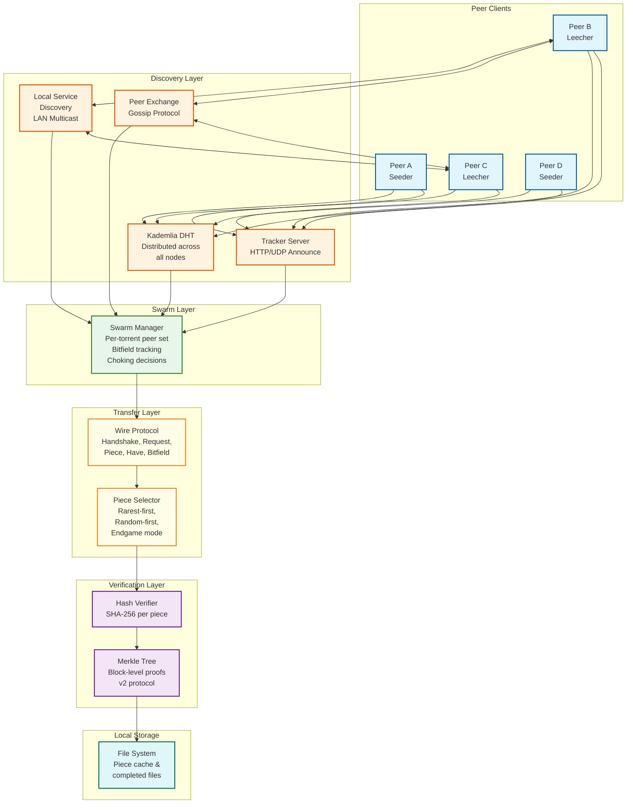
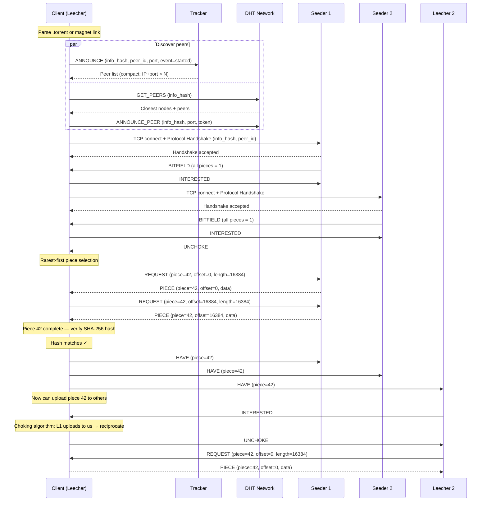
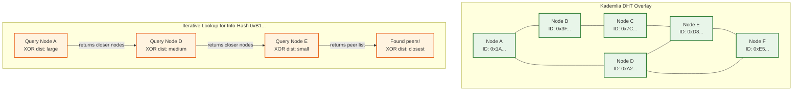
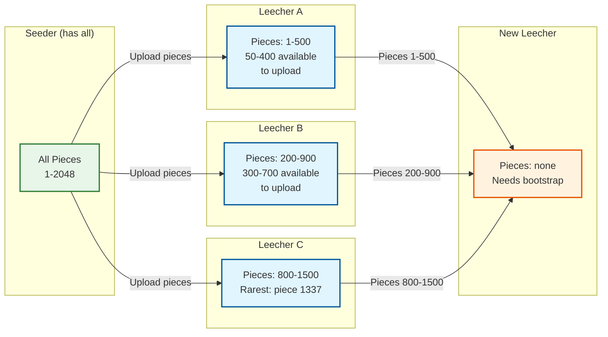
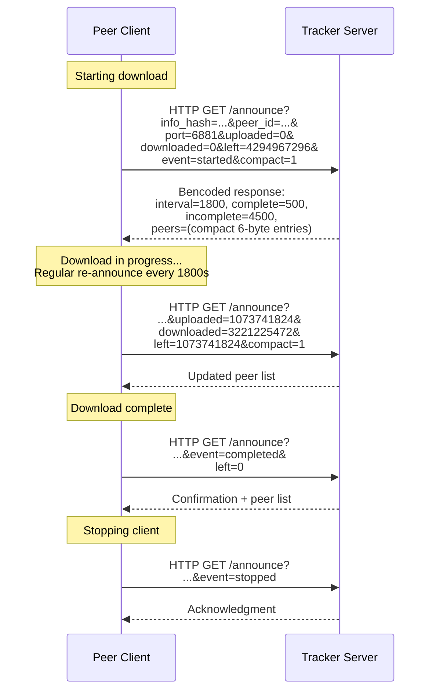
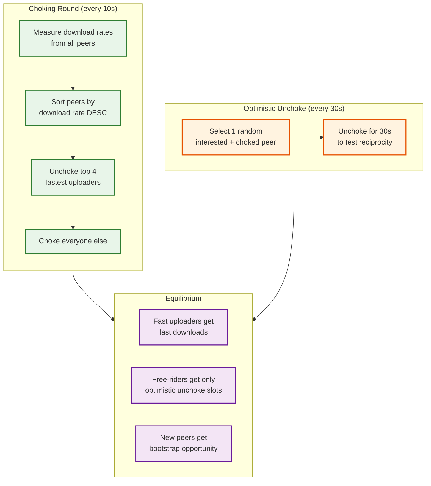

# High-Level Design — P2P File Sharing Network

## System Architecture

The P2P file sharing network operates as a decentralized overlay on top of the internet's physical infrastructure. Unlike client-server systems, there is no central data plane—every participant is both consumer and producer. The architecture consists of four layers: the discovery layer (how peers find each other), the swarm layer (how peers organize around content), the transfer layer (how data moves between peers), and the verification layer (how data integrity is ensured).

---

## Data Flow: File Publishing (Creating a Torrent)

### Step-by-Step Flow

| Step | Action | Details |
|---|---|---|
| 1 | **Read source files** | Client reads all files to be shared from local storage |
| 2 | **Split into pieces** | Files are divided into fixed-size pieces (e.g., 2 MiB each) |
| 3 | **Compute piece hashes** | SHA-256 hash computed for each piece (v2: build Merkle tree with 16 KiB leaves) |
| 4 | **Build torrent metadata** | Create info dictionary: file names, sizes, piece length, piece hashes, and optional file tree |
| 5 | **Compute info-hash** | SHA-256 hash of the bencoded info dictionary — this becomes the torrent's unique identifier |
| 6 | **Generate .torrent file** | Serialize metadata including tracker URLs, DHT nodes, creation date |
| 7 | **Announce to tracker** | HTTP/UDP announce with info-hash, peer ID, port, and "started" event |
| 8 | **Announce to DHT** | Store (info-hash → peer contact info) in DHT nodes closest to the info-hash |
| 9 | **Begin seeding** | Listen for incoming connections from leechers requesting pieces |

### Publishing Latency Breakdown

| Phase | Latency | Bottleneck |
|---|---|---|
| File reading | Proportional to file size; ~1 GiB/s from SSD | Disk I/O |
| Piece hashing | ~500 MiB/s SHA-256 on modern CPU | CPU-bound |
| Torrent file creation | < 100ms | Negligible |
| Tracker announce | 100-500ms | Network RTT |
| DHT announce | 1-3 seconds | Multiple DHT hops |
| **Total for 4 GiB file** | **~10-15 seconds** | Dominated by hashing |

---

## Data Flow: File Downloading (Joining a Swarm)

### Step-by-Step Flow

| Step | Action | Details |
|---|---|---|
| 1 | **Parse torrent / magnet link** | Extract info-hash, tracker URLs, DHT bootstrap nodes |
| 2 | **Fetch metadata (magnet only)** | If magnet link, request metadata from DHT peers via `ut_metadata` extension |
| 3 | **Tracker announce** | Send announce request to tracker with info-hash; receive peer list (up to 200 peers) |
| 4 | **DHT get_peers** | Query DHT with info-hash; iteratively contact nodes closer to the target |
| 5 | **Establish peer connections** | TCP/uTP handshake with discovered peers; exchange protocol handshake with info-hash and peer ID |
| 6 | **Exchange bitfields** | Each peer sends its piece completion bitmap; client learns who has which pieces |
| 7 | **Express interest** | Send INTERESTED message to peers with needed pieces; wait for UNCHOKE |
| 8 | **Piece selection** | Apply rarest-first algorithm (or random-first for initial pieces) |
| 9 | **Request blocks** | Send REQUEST messages for 16 KiB blocks within the selected piece |
| 10 | **Receive & verify** | Receive PIECE messages; when all blocks of a piece received, verify hash |
| 11 | **Announce completion** | Send HAVE messages to all connected peers; update bitfield |
| 12 | **Upload to others** | Serve received pieces to requesting peers based on choking algorithm |
| 13 | **Endgame mode** | When <5 pieces remain, request them from ALL available peers; cancel duplicates |
| 14 | **Completion** | All pieces received and verified; transition from leecher to seeder |

---

## Sequence Diagram: Torrent Download Lifecycle

---

## Key Architectural Decisions

### Decision 1: Tracker vs Trackerless (DHT) Discovery

| Approach | Pros | Cons |
|---|---|---|
| **Centralized Tracker Only** | Fast response (single RTT), reliable peer lists, easy to implement | Single point of failure, can be taken down, requires infrastructure |
| **DHT Only (Trackerless)** | No SPOF, censorship-resistant, no infrastructure cost | Slower discovery (multiple hops), vulnerable to DHT attacks, bootstrap required |
| **Hybrid (Tracker + DHT + PEX)** | Fast initial discovery via tracker, fallback to DHT if tracker unavailable, PEX accelerates peer acquisition | Most complex to implement; must handle inconsistency between sources |

**Decision: Hybrid approach.** Use trackers for fast initial peer discovery, DHT for resilience and trackerless operation, and PEX for rapid peer set expansion once connected. This provides the best combination of speed, reliability, and decentralization.

### Decision 2: Piece Size Selection

| Piece Size | Hash Overhead (4 GiB file) | Pieces | Trade-off |
|---|---|---|---|
| 64 KiB | 2 MiB (65,536 hashes) | 65,536 | Fine granularity, huge metadata, more protocol overhead |
| 256 KiB | 512 KiB (16,384 hashes) | 16,384 | Good granularity, moderate metadata |
| 2 MiB | 64 KiB (2,048 hashes) | 2,048 | Standard choice: balanced overhead and granularity |
| 16 MiB | 8 KiB (256 hashes) | 256 | Low overhead, but coarse verification (bad piece = 16 MiB re-download) |

**Decision: 2 MiB default piece size** with v2 Merkle trees providing 16 KiB block-level verification within each piece. This gives the metadata efficiency of large pieces with the verification granularity of small blocks.

### Decision 3: Transport Protocol

| Protocol | Characteristics | Use Case |
|---|---|---|
| **TCP** | Reliable, ordered delivery; well-understood; aggressive congestion control | Default for compatibility; works through most NATs and firewalls |
| **uTP (LEDBAT)** | UDP-based; delay-sensitive congestion control; "background-friendly" | Preferred for not disrupting other network traffic; lower latency |
| **WebRTC** | Browser-based; requires signaling server; DTLS encrypted | Browser P2P clients; no plugin required |

**Decision: Support TCP and uTP.** uTP preferred for bandwidth-friendly behavior; TCP as fallback. WebRTC supported via separate signaling infrastructure for browser-based clients.

### Decision 4: Choking Algorithm Parameters

| Parameter | Value | Rationale |
|---|---|---|
| Regular unchoke slots | 4 | TCP performs well with 4 simultaneous uploads |
| Regular unchoke interval | 10 seconds | Frequent enough to respond to changing conditions |
| Optimistic unchoke slots | 1 | Enough to bootstrap new peers without wasting bandwidth |
| Optimistic unchoke interval | 30 seconds | Gives each optimistic peer 30 seconds to prove reciprocity |
| Snubbing timeout | 60 seconds | Mark peer as snubbed if no data received for 60 seconds |

---

## Architecture Pattern Checklist

| Pattern | Application in P2P File Sharing |
|---|---|
| **Overlay Network** | Kademlia DHT creates a structured overlay on top of the physical network; peers organized by XOR distance |
| **Content-Addressable Storage** | Pieces identified by hash; enables deduplication, verification, and location-independent retrieval |
| **Gossip Protocol** | PEX propagates peer lists through the network without central coordination |
| **Tit-for-Tat (Game Theory)** | Choking/unchoking algorithm creates incentive-compatible bandwidth sharing |
| **Merkle Tree** | Hierarchical hash verification enabling both coarse (piece) and fine (block) integrity checks |
| **Sharding by Content** | Each torrent is an independent swarm; no coordination needed between different torrents |
| **Idempotent Operations** | Piece downloads are idempotent — re-downloading and re-verifying a piece is harmless |
| **Circuit Breaker** | Peers that consistently send corrupt data are banned; prevents wasting bandwidth on malicious peers |
| **Bulkhead** | Per-torrent swarm isolation — a problem in one swarm doesn't affect others |
| **Retry with Backoff** | Failed DHT lookups and peer connections retried with exponential backoff |

---

## Component Interaction Map

| Component | Interacts With | Protocol/Mechanism |
|---|---|---|
| **Peer Client** | Tracker | HTTP GET/announce or UDP announce protocol |
| **Peer Client** | DHT Network | KRPC protocol over UDP (ping, find_node, get_peers, announce_peer) |
| **Peer Client** | Other Peers | BitTorrent wire protocol over TCP/uTP |
| **Peer Client** | Local Storage | File system I/O for piece storage and retrieval |
| **Tracker** | All Peers | Maintains peer lists per info-hash; responds to announce/scrape requests |
| **DHT Node** | Other DHT Nodes | Kademlia routing protocol; k-bucket management |
| **PEX** | Connected Peers | Extension message (ut_pex) carrying added/dropped peer lists |
| **LSD** | LAN Peers | Multicast UDP on 239.192.152.143:6771 |

---

## Multi-Layer Discovery Architecture

The system employs a defense-in-depth approach to peer discovery, where each layer provides complementary strengths:

| Layer | Mechanism | Latency | Reliability | Peer Quality |
|---|---|---|---|---|
| **Layer 1: Tracker** | Centralized HTTP/UDP announce | 100-500ms | High (while tracker is up) | High (curated, recent peers) |
| **Layer 2: DHT** | Distributed Kademlia lookup | 2-10 seconds | Very high (no SPOF) | Medium (may include stale entries) |
| **Layer 3: PEX** | Gossip via connected peers | < 1 second | Medium (requires existing connections) | High (peers verified by sender) |
| **Layer 4: LSD** | LAN multicast | < 100ms | Low (LAN only) | Very high (same network, zero latency) |
| **Layer 5: Web Seeds** | HTTP/HTTPS URL | < 1 second | Depends on server | N/A (server, not peer) |

Discovery proceeds in parallel across all available layers. The client maintains a target peer count (typically 50-80 connections) and stops active discovery when the target is reached, relying on PEX for passive peer replenishment.

---

## DHT Overlay Network Topology

---

## Piece Distribution Across Swarm

---

## Tracker Announce Protocol Flow

---

## Bandwidth Flow: Tit-for-Tat in Action

