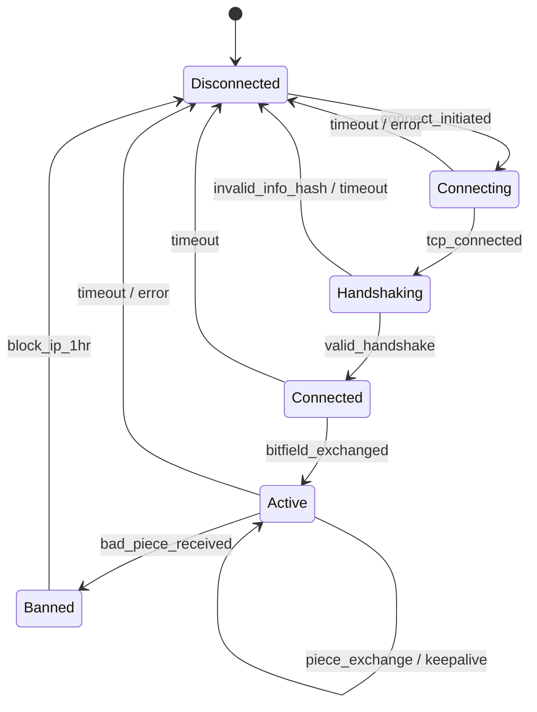
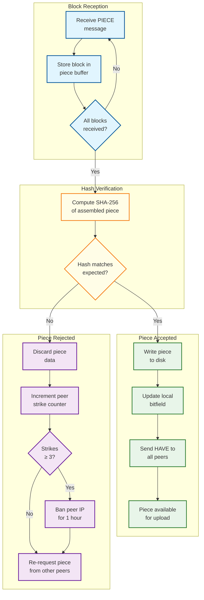
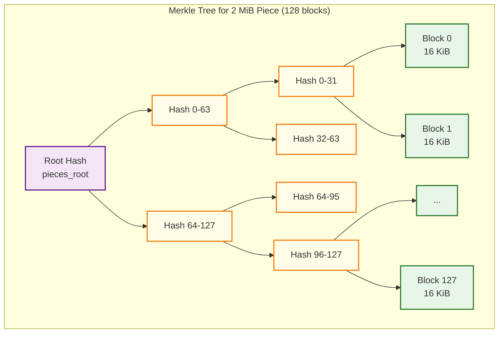

# Low-Level Design — P2P File Sharing Network

## Data Models

### Torrent Metadata (Info Dictionary)

```
TorrentMetadata:
    info_hash           : bytes[32]         // SHA-256 of bencoded info dict (v2)
    name                : string            // Suggested file/directory name
    piece_length        : integer           // Bytes per piece (e.g., 2,097,152 = 2 MiB)
    pieces_root         : bytes[32]         // Merkle root of piece hash tree (v2, per file)
    file_tree           : FileTreeNode      // Hierarchical file structure (v2)
    files               : List<FileEntry>   // Flat file list (v1 compatibility)
    creation_date       : integer           // Unix timestamp
    created_by          : string            // Client identifier
    announce            : string            // Primary tracker URL
    announce_list       : List<List<string>>// Tiered tracker list
    nodes               : List<(host, port)>// DHT bootstrap nodes

FileEntry:
    path                : List<string>      // Path components (e.g., ["dir", "file.txt"])
    length              : integer           // File size in bytes
    pieces_root         : bytes[32]         // Per-file Merkle root (v2)

FileTreeNode:                               // v2 hierarchical structure
    name                : string
    length              : integer           // Present for files, absent for directories
    pieces_root         : bytes[32]         // Present for non-empty files
    children            : Map<string, FileTreeNode>  // Present for directories
```

### Peer State

```
PeerConnection:
    peer_id             : bytes[20]         // Unique peer identifier
    ip_address          : string            // IPv4 or IPv6 address
    port                : integer           // Listening port
    info_hash           : bytes[32]         // Torrent being shared
    am_choking          : boolean           // We are choking this peer (default: true)
    am_interested       : boolean           // We are interested in this peer (default: false)
    peer_choking        : boolean           // Peer is choking us (default: true)
    peer_interested     : boolean           // Peer is interested in us (default: false)
    bitfield            : BitArray          // Pieces this peer has
    download_rate       : float             // Rolling average bytes/sec received from peer
    upload_rate         : float             // Rolling average bytes/sec sent to peer
    pending_requests    : Queue<BlockRequest>// Outstanding block requests to this peer
    max_pending         : integer           // Pipeline depth (typically 5-10)
    last_message_time   : timestamp         // For timeout detection
    snubbed             : boolean           // No data received for 60+ seconds
    connection_type     : enum(TCP, UTP)    // Transport protocol
    supports_extensions : boolean           // BEP 10 extension protocol support

BlockRequest:
    piece_index         : integer
    block_offset        : integer           // Byte offset within piece
    block_length        : integer           // Typically 16,384 (16 KiB)
    request_time        : timestamp         // For timeout tracking
```

### DHT Node State

```
DHTNode:
    node_id             : bytes[20]         // 160-bit node identifier
    routing_table       : List<KBucket>     // 160 k-buckets
    token_store         : Map<IP, Token>    // Announce tokens, TTL 10 minutes
    peer_store          : Map<InfoHash, List<PeerContact>>  // Stored peer announcements

KBucket:
    range_start         : integer           // XOR distance range lower bound
    range_end           : integer           // XOR distance range upper bound
    nodes               : List<NodeContact> // Up to k=8 active nodes
    replacement_cache   : List<NodeContact> // Backup nodes for when active nodes die
    last_changed        : timestamp         // For refresh scheduling

NodeContact:
    node_id             : bytes[20]
    ip_address          : string
    port                : integer
    last_seen           : timestamp
    rtt                 : float             // Round-trip time for latency-based selection

PeerContact:
    ip_address          : string
    port                : integer
    announce_time       : timestamp         // For expiry (typically 30 minutes)
```

### Piece Management State

```
PieceManager:
    total_pieces        : integer
    piece_length        : integer
    bitfield            : BitArray          // Our completion state
    piece_hashes        : List<bytes[32]>   // Expected hash per piece
    piece_availability  : List<integer>     // Count of peers having each piece
    piece_priorities    : List<integer>     // Download priority per piece
    active_pieces       : Map<integer, PieceDownload>  // Currently downloading

PieceDownload:
    piece_index         : integer
    blocks_received     : BitArray          // Which 16 KiB blocks we have
    blocks_requested    : Map<integer, PeerID>  // Which peer each block was requested from
    data_buffer         : bytes[]           // Accumulated block data
    started_at          : timestamp
```

---

## Protocol Design

### BitTorrent Wire Protocol Messages

| Message ID | Name | Payload | Direction | Purpose |
|---|---|---|---|---|
| N/A | **Handshake** | pstrlen(1) + pstr(19) + reserved(8) + info_hash(20) + peer_id(20) | Both | Initiate connection; verify same torrent |
| 0 | **Choke** | (none) | Uploader → Downloader | Stop sending data to this peer |
| 1 | **Unchoke** | (none) | Uploader → Downloader | Resume sending data to this peer |
| 2 | **Interested** | (none) | Downloader → Uploader | Signal desire for pieces this peer has |
| 3 | **Not Interested** | (none) | Downloader → Uploader | No longer want pieces from this peer |
| 4 | **Have** | piece_index(4) | Both | Announce newly completed piece |
| 5 | **Bitfield** | bitfield(variable) | Both (after handshake) | Full piece completion bitmap |
| 6 | **Request** | index(4) + begin(4) + length(4) | Downloader → Uploader | Request a specific block |
| 7 | **Piece** | index(4) + begin(4) + block(variable) | Uploader → Downloader | Deliver requested block data |
| 8 | **Cancel** | index(4) + begin(4) + length(4) | Downloader → Uploader | Cancel a pending request |
| 20 | **Extended** | ext_id(1) + payload(variable) | Both | Extension protocol (PEX, metadata, etc.) |

### Message Framing

```
All messages (except handshake):
    length_prefix       : uint32            // Length of message (excluding this prefix)
    message_id          : uint8             // Message type identifier
    payload             : bytes[length - 1] // Message-specific data

Handshake format:
    pstrlen             : uint8 = 19
    pstr                : "BitTorrent protocol"
    reserved            : bytes[8]          // Extension flags
    info_hash           : bytes[20]         // Torrent identifier
    peer_id             : bytes[20]         // Client identifier
```

### DHT KRPC Protocol

The DHT uses a simple RPC protocol (KRPC) over UDP with bencoded messages:

| RPC Method | Arguments | Response | Purpose |
|---|---|---|---|
| **ping** | sender_id | responder_id | Verify node is alive; update routing table |
| **find_node** | sender_id, target_id | closest_nodes (up to 8) | Find nodes close to a target ID |
| **get_peers** | sender_id, info_hash | peers OR closest_nodes + token | Find peers for a torrent |
| **announce_peer** | sender_id, info_hash, port, token | confirmation | Register as peer for a torrent |

```
KRPC Message Format (bencoded dictionary):
    "t" : transaction_id    // 2-byte identifier for matching responses
    "y" : message_type      // "q" (query), "r" (response), "e" (error)
    "q" : method_name       // For queries: "ping", "find_node", "get_peers", "announce_peer"
    "a" : arguments         // For queries: method-specific arguments
    "r" : return_values     // For responses: method-specific return values
    "e" : [error_code, msg] // For errors: [201, "generic"], [202, "server"], etc.
```

---

## Core Algorithms

### Algorithm 1: Kademlia DHT Lookup

The iterative lookup is the core operation of Kademlia. It finds the k closest nodes to a target ID (for `find_node`) or peers for a given info-hash (for `get_peers`).

```
FUNCTION kademlia_lookup(target_id, query_type):
    // Initialize with closest known nodes
    closest = routing_table.find_closest_nodes(target_id, count=alpha)  // alpha = 3
    queried = empty_set()
    results = empty_sorted_set(key=xor_distance_to(target_id))

    WHILE true:
        // Select alpha unqueried nodes closest to target
        to_query = closest.filter(not in queried).take(alpha)

        IF to_query is empty:
            BREAK  // No more nodes to query

        // Send parallel queries
        responses = parallel_query(to_query, query_type, target_id)
        queried.add_all(to_query)

        FOR each response in responses:
            IF query_type == GET_PEERS AND response.has_peers:
                results.add_peers(response.peers)

            // Add newly discovered nodes
            FOR each node in response.closest_nodes:
                IF node not in queried:
                    closest.insert_sorted(node, key=xor_distance(node.id, target_id))

        // Check termination: have we queried the k closest known nodes?
        k_closest = closest.take(k)  // k = 8
        IF all nodes in k_closest have been queried:
            BREAK

    RETURN results

// Complexity: O(log n) rounds, each with alpha parallel queries
// For 10M nodes: ~24 hops theoretical, ~15-20 in practice
// Latency: 15-20 × 100ms average RTT = 1.5-2.0 seconds
```

### Algorithm 2: XOR Distance and Routing Table Management

```
FUNCTION xor_distance(id_a, id_b):
    RETURN id_a XOR id_b    // Bitwise XOR, interpreted as unsigned integer

// Properties:
// 1. d(a, a) = 0            (identity)
// 2. d(a, b) > 0 if a ≠ b   (positivity)
// 3. d(a, b) = d(b, a)      (symmetry)
// 4. d(a, c) ≤ d(a, b) + d(b, c)  (triangle inequality)
// These make XOR a valid metric, enabling efficient routing

FUNCTION find_bucket_index(node_id):
    distance = xor_distance(self.node_id, node_id)
    RETURN floor(log2(distance))    // Bucket index = position of highest set bit
    // Bucket i contains nodes with distance 2^i ≤ d < 2^(i+1)

FUNCTION update_routing_table(node_contact):
    bucket_idx = find_bucket_index(node_contact.node_id)
    bucket = routing_table[bucket_idx]

    IF node_contact in bucket.nodes:
        // Move to end (most recently seen)
        bucket.nodes.move_to_end(node_contact)
    ELSE IF bucket.nodes.size < k:
        // Bucket not full, add directly
        bucket.nodes.append(node_contact)
    ELSE:
        // Bucket full — ping least recently seen node
        oldest = bucket.nodes.first()
        IF ping(oldest) succeeds:
            // Keep existing node, discard new one
            // (Kademlia prefers long-lived nodes — they are more reliable)
            bucket.replacement_cache.add(node_contact)
        ELSE:
            // Replace dead node with new one
            bucket.nodes.remove(oldest)
            bucket.nodes.append(node_contact)

FUNCTION refresh_buckets():
    FOR each bucket in routing_table:
        IF bucket.last_changed > 15 minutes ago:
            // Generate random ID in bucket's range and look it up
            random_id = generate_random_id_in_range(bucket.range)
            kademlia_lookup(random_id, FIND_NODE)
```

### Algorithm 3: Rarest-First Piece Selection

```
FUNCTION select_next_piece(piece_manager, connected_peers):
    // Phase 1: Random First (first 4 pieces when we have nothing)
    IF piece_manager.completed_count < 4:
        available = get_available_pieces(connected_peers)
        RETURN random_choice(available)

    // Phase 2: Rarest First (normal operation)
    // Count availability of each piece across connected peers
    availability = array[piece_manager.total_pieces] initialized to 0

    FOR each peer in connected_peers:
        IF peer.peer_choking us:
            CONTINUE  // Can't download from choking peers
        FOR each piece_index in peer.bitfield.set_bits():
            IF NOT piece_manager.bitfield.has(piece_index):
                availability[piece_index] += 1

    // Filter to pieces we still need and that at least one unchoked peer has
    needed = filter(availability, where value > 0 AND we don't have it)

    IF needed is empty:
        RETURN null  // Nothing available to download

    // Sort by availability (ascending) — rarest first
    // Break ties randomly to distribute load
    sorted_pieces = sort(needed, key=availability, tiebreaker=random)

    RETURN sorted_pieces.first()

// Why rarest first works:
// 1. Prevents "last piece" problem — rare pieces get replicated early
// 2. Makes us attractive to other peers — we have rare pieces they want
// 3. Maximizes swarm piece diversity — spreads all pieces evenly
// 4. Naturally balances load — popular pieces are deprioritized

// Complexity: O(P × N) where P = peers, N = pieces
// Typically: O(50 × 2048) = O(100,000) — very fast
```

### Algorithm 4: Tit-for-Tat Choking/Unchoking

```
FUNCTION choking_algorithm(connected_peers, am_seeder):
    // Run every 10 seconds (regular unchoke round)

    IF NOT am_seeder:
        // LEECHER MODE: Unchoke peers who upload to us fastest
        interested_peers = filter(connected_peers, where peer.peer_interested == true)

        // Sort by download rate (what we receive FROM them)
        sorted = sort(interested_peers, key=peer.download_rate, descending=true)

        // Unchoke top 4 (reciprocate with fastest uploaders)
        regular_unchokes = sorted.take(4)

        FOR each peer in connected_peers:
            IF peer in regular_unchokes:
                set_choking(peer, false)     // Unchoke
            ELSE IF peer != optimistic_unchoke_peer:
                set_choking(peer, true)      // Choke

    ELSE:
        // SEEDER MODE: Unchoke peers we upload to fastest
        // (Distribute to those who can receive fastest, spreading pieces efficiently)
        interested_peers = filter(connected_peers, where peer.peer_interested == true)
        sorted = sort(interested_peers, key=peer.upload_rate, descending=true)
        regular_unchokes = sorted.take(4)

        FOR each peer in connected_peers:
            IF peer in regular_unchokes:
                set_choking(peer, false)
            ELSE IF peer != optimistic_unchoke_peer:
                set_choking(peer, true)

FUNCTION optimistic_unchoke(connected_peers):
    // Run every 30 seconds
    // Randomly unchoke one interested, choked peer
    // Purpose: Give new peers a chance to prove their worth

    candidates = filter(connected_peers,
                        where peer.peer_interested AND peer.am_choking
                        AND peer NOT in regular_unchokes)

    IF candidates is not empty:
        // Prefer peers we haven't tried recently
        // New connections get 3x selection weight
        weights = [3 if peer.connection_age < 30s else 1 for peer in candidates]
        optimistic_unchoke_peer = weighted_random_choice(candidates, weights)
        set_choking(optimistic_unchoke_peer, false)

// Why tit-for-tat works:
// 1. Cooperating peers get faster downloads (incentive to upload)
// 2. Free-riders get only optimistic unchoke slots (1/5 of bandwidth)
// 3. New peers get bootstrap chance via optimistic unchoke
// 4. Nash equilibrium: cooperation is dominant strategy
```

### Algorithm 5: Endgame Mode

```
FUNCTION enter_endgame_mode(piece_manager):
    // Triggered when all remaining pieces have been requested
    // (all missing pieces have pending block requests)

    remaining_blocks = get_unreceived_blocks(piece_manager)

    // Request every remaining block from ALL peers who have it
    FOR each block in remaining_blocks:
        FOR each peer in connected_peers:
            IF peer.bitfield.has(block.piece_index) AND NOT peer.peer_choking:
                send_request(peer, block)

    // When a block is received, cancel it from all other peers
    ON block_received(piece_index, block_offset, data):
        FOR each peer in connected_peers:
            IF peer != sender AND has_pending_request(peer, piece_index, block_offset):
                send_cancel(peer, piece_index, block_offset)

// Why endgame mode exists:
// Without it, the last few pieces depend on a single slow peer
// Endgame requests from ALL peers, so the fastest responder wins
// CANCEL messages prevent wasting bandwidth on duplicate data
// Only activates for the final ~1% of the download
```

### Algorithm 6: Merkle Tree Verification (v2)

```
FUNCTION build_merkle_tree(file_data, block_size=16384):
    // Build from 16 KiB leaf blocks
    leaves = []
    FOR i = 0 TO len(file_data) STEP block_size:
        block = file_data[i : i + block_size]
        IF len(block) < block_size:
            block = pad_with_zeros(block, block_size)
        leaves.append(sha256(block))

    // Pad to next power of 2
    WHILE len(leaves) is not power of 2:
        leaves.append(sha256(zeros(block_size)))

    // Build tree bottom-up
    tree = [leaves]
    current_level = leaves
    WHILE len(current_level) > 1:
        next_level = []
        FOR i = 0 TO len(current_level) STEP 2:
            parent = sha256(current_level[i] + current_level[i+1])
            next_level.append(parent)
        tree.append(next_level)
        current_level = next_level

    root = current_level[0]
    RETURN tree, root

FUNCTION verify_block(block_data, block_index, merkle_proof, expected_root):
    // Verify a single 16 KiB block against the Merkle root
    hash = sha256(block_data)

    FOR each (sibling_hash, direction) in merkle_proof:
        IF direction == LEFT:
            hash = sha256(sibling_hash + hash)
        ELSE:
            hash = sha256(hash + sibling_hash)

    RETURN hash == expected_root

// Proof size: O(log n) hashes
// For a 2 MiB piece with 16 KiB blocks: 128 blocks → 7 hashes in proof
// Each hash = 32 bytes → proof overhead = 224 bytes per block verification
```

---

## Peer Connection Lifecycle

```
STATE MACHINE: PeerConnection

    DISCONNECTED
        → on connect_initiated → CONNECTING

    CONNECTING
        → on tcp_connected → HANDSHAKING
        → on timeout (30s) → DISCONNECTED
        → on error → DISCONNECTED

    HANDSHAKING
        → on valid_handshake_received → CONNECTED
        → on invalid_info_hash → DISCONNECTED
        → on timeout (10s) → DISCONNECTED

    CONNECTED
        → on bitfield_exchanged → ACTIVE
        → on timeout (30s) → DISCONNECTED

    ACTIVE
        // Normal operation: downloading/uploading pieces
        → on no_message_received (120s) → send keepalive
        → on no_response (180s) → DISCONNECTED
        → on peer_sends_bad_piece → BANNED
        → on peer_error → DISCONNECTED

    BANNED
        // Peer sent data that failed hash verification
        → block peer IP for 1 hour
        → DISCONNECTED
```

---

## Connection State Diagram



---

## Request Pipeline Optimization

```
FUNCTION manage_request_pipeline(peer):
    // Maintain a pipeline of N outstanding requests per peer
    // to keep the connection saturated despite network latency

    optimal_pipeline_depth = calculate_pipeline_depth(peer)

    WHILE peer.pending_requests.size < optimal_pipeline_depth:
        block = select_next_block(peer)
        IF block is null:
            BREAK
        send_request(peer, block)
        peer.pending_requests.add(block)

FUNCTION calculate_pipeline_depth(peer):
    // Pipeline depth = (bandwidth × RTT) / block_size
    // This ensures the pipe is always full

    bandwidth = peer.download_rate           // bytes/sec
    rtt = peer.round_trip_time               // seconds
    block_size = 16384                       // 16 KiB

    depth = ceiling((bandwidth * rtt) / block_size)

    // Clamp to reasonable range
    RETURN clamp(depth, min=2, max=250)

// Example:
// bandwidth = 1 MiB/s, RTT = 50ms
// depth = (1,048,576 × 0.05) / 16,384 = 3.2 → 4 requests
//
// bandwidth = 10 MiB/s, RTT = 100ms
// depth = (10,485,760 × 0.1) / 16,384 = 64 requests
```

---

## Compact Peer Encoding

```
// Tracker responses use compact peer representation
// Each peer encoded as exactly 6 bytes (IPv4) or 18 bytes (IPv6)

FUNCTION encode_compact_peers(peer_list):
    result = empty_bytes()
    FOR each peer in peer_list:
        IF peer.is_ipv4:
            result.append(peer.ip_as_4_bytes)    // Network byte order
            result.append(peer.port_as_2_bytes)  // Network byte order (big-endian)
        // Total: 6 bytes per peer
    RETURN result

FUNCTION decode_compact_peers(data):
    peers = []
    FOR i = 0 TO len(data) STEP 6:
        ip = format_ipv4(data[i:i+4])
        port = big_endian_uint16(data[i+4:i+6])
        peers.append(PeerContact(ip, port))
    RETURN peers

// For 200 peers: 200 × 6 = 1,200 bytes
// vs. non-compact (IP string + port): ~200 × 25 = 5,000 bytes
// Compact encoding saves ~75% bandwidth in tracker responses
```

---

## Bencoding Format

```
// All BitTorrent metadata and DHT messages use Bencoding

ENCODING RULES:
    Integers:    i<number>e           // i42e → 42, i-3e → -3
    Strings:     <length>:<data>      // 4:spam → "spam"
    Lists:       l<items>e            // l4:spam4:eggse → ["spam", "eggs"]
    Dicts:       d<key-value pairs>e  // d3:cow3:moo4:spam4:eggse → {"cow":"moo","spam":"eggs"}
                                      // Keys must be strings, sorted lexicographically

// Info-hash computation:
// 1. Extract the bencoded info dictionary from .torrent file
// 2. info_hash = SHA-256(bencoded_info_dict)    // v2
// 3. This hash is used EVERYWHERE: tracker announce, DHT lookup, handshake
```

---

## Piece Verification Flow



---

## Merkle Tree Structure (v2)



---

## Complexity Analysis Summary

| Operation | Time Complexity | Space Complexity | Notes |
|---|---|---|---|
| DHT Lookup | O(log n) rounds | O(k × log n) per query | n = DHT nodes, k = 8, α = 3 parallel |
| Piece Hash Verification | O(piece_size) | O(1) | Single SHA-256 pass |
| Merkle Block Verification | O(log n) | O(log n) proof | n = blocks per piece |
| Rarest-First Selection | O(P × N) | O(N) | P = peers, N = pieces |
| Choking Decision | O(P log P) | O(P) | Sort peers by rate |
| Bitfield Exchange | O(N / 8) | O(N / 8) | N bits, one per piece |
| XOR Distance | O(1) | O(1) | Fixed 160-bit operation |
| k-Bucket Lookup | O(1) | O(k) | Direct index by log2(distance) |
| Compact Peer Encoding | O(P) | O(6P) | 6 bytes per IPv4 peer |
| Torrent Creation (hashing) | O(file_size) | O(pieces) | CPU-bound SHA-256 |
