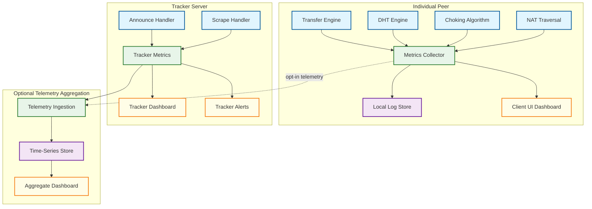

# Observability — P2P File Sharing Network

## Overview

Observability in a P2P file sharing network is fundamentally different from client-server systems. There is no central control plane that observes all traffic. Each peer has only a local view — its own connections, its own DHT routing table, its own download state. "System-wide" observability requires aggregating local metrics across thousands of independent peers, each with partial knowledge. For tracker operators, observability is more traditional but covers only the discovery layer, not the data transfer layer.

This document covers observability from three perspectives:
1. **Per-client observability** — what an individual peer can monitor about its own operation
2. **Tracker-side observability** — what a centralized tracker operator can observe
3. **Network-wide observability** — aggregate metrics that require coordination to collect

---

## Metrics

### Client-Side Metrics

#### Swarm Health Metrics

| Metric | Type | Description | Alert Threshold |
|---|---|---|---|
| `swarm.peers.connected` | Gauge | Number of currently connected peers per torrent | < 5 → Warn; 0 → Critical |
| `swarm.peers.seeders` | Gauge | Connected peers that have complete file | 0 → Warn (no seeders) |
| `swarm.peers.leechers` | Gauge | Connected peers still downloading | Informational |
| `swarm.pieces.available` | Gauge | Number of pieces available from at least one connected peer | < total_pieces → Warn |
| `swarm.pieces.rarest_count` | Gauge | Availability count of the rarest piece | 1 → Warn (single point of failure); 0 → Critical |
| `swarm.health_score` | Gauge (0-100) | Composite: f(seeder_ratio, piece_availability, peer_count) | < 30 → Critical |

#### Transfer Metrics

| Metric | Type | Description | Alert Threshold |
|---|---|---|---|
| `transfer.download_rate` | Gauge (bytes/s) | Current aggregate download rate across all peers | Informational |
| `transfer.upload_rate` | Gauge (bytes/s) | Current aggregate upload rate across all peers | Informational |
| `transfer.download_total` | Counter (bytes) | Total bytes downloaded this session | Informational |
| `transfer.upload_total` | Counter (bytes) | Total bytes uploaded this session | Informational |
| `transfer.ratio` | Gauge | upload_total / download_total | < 0.5 → Consider seeding more |
| `transfer.waste_rate` | Counter (bytes) | Bytes received that failed hash verification | > 1% of download → Warn |
| `transfer.pieces.completed` | Counter | Pieces successfully downloaded and verified | Informational |
| `transfer.pieces.failed` | Counter | Pieces that failed hash verification | > 0 → Investigate peer |
| `transfer.eta` | Gauge (seconds) | Estimated time to completion based on current rate | Informational |

#### Choking/Unchoking Metrics

| Metric | Type | Description | Alert Threshold |
|---|---|---|---|
| `choking.unchoked_peers` | Gauge | Number of peers we've unchoked | Should be 4 (regular) + 1 (optimistic) |
| `choking.interested_peers` | Gauge | Peers interested in our data | 0 → We have nothing others want |
| `choking.choking_us` | Gauge | Peers currently choking us | All peers → No downloads possible |
| `choking.optimistic_rotations` | Counter | Number of optimistic unchoke rotations | Informational (should increment every 30s) |
| `choking.snubbed_peers` | Gauge | Peers from whom we've received no data for 60s+ | High count → Slow peers or choking issues |

#### Piece Selection Metrics

| Metric | Type | Description | Alert Threshold |
|---|---|---|---|
| `pieces.availability_distribution` | Histogram | Distribution of piece availability counts | Highly skewed → Swarm diversity problem |
| `pieces.endgame_active` | Boolean | Whether endgame mode is active | Informational |
| `pieces.endgame_duplicates` | Counter | Duplicate blocks received during endgame | > 5% of endgame blocks → Excessive waste |
| `pieces.selection_time` | Histogram (ms) | Time to select next piece (rarest-first computation) | p99 > 100ms → Too many pieces or peers |

### DHT Metrics

| Metric | Type | Description | Alert Threshold |
|---|---|---|---|
| `dht.routing_table.nodes` | Gauge | Total nodes in routing table | < 50 → Poorly connected; > 1000 → Unusual |
| `dht.routing_table.buckets_used` | Gauge | Non-empty k-buckets | < 20 → Sparse table |
| `dht.routing_table.good_nodes` | Gauge | Nodes that responded to ping within last 15 min | < 50% of total → Stale table |
| `dht.lookup.duration` | Histogram (ms) | Time to complete a DHT lookup | p99 > 10s → Network issues |
| `dht.lookup.hops` | Histogram | Number of hops per lookup | Avg > 25 → Routing inefficiency |
| `dht.lookup.success_rate` | Gauge (%) | Lookups that found at least one peer | < 80% → DHT health issue |
| `dht.messages.sent` | Counter | KRPC messages sent (by type) | Informational |
| `dht.messages.received` | Counter | KRPC messages received (by type) | Informational |
| `dht.messages.timeout` | Counter | KRPC queries that timed out | > 30% → Network connectivity issue |
| `dht.announce.success_rate` | Gauge (%) | Announce operations that succeeded | < 90% → Token/routing issues |
| `dht.tokens.expired` | Counter | Announce attempts that failed due to expired token | Rising → Increase token validity or announce faster |

### NAT Traversal Metrics

| Metric | Type | Description | Alert Threshold |
|---|---|---|---|
| `nat.type_detected` | Label | Detected NAT type (full cone, restricted, symmetric) | Symmetric → Warn user of limited connectivity |
| `nat.upnp.success` | Boolean | UPnP port mapping active | Informational |
| `nat.hole_punch.attempts` | Counter | UDP/TCP hole punch attempts | Informational |
| `nat.hole_punch.success_rate` | Gauge (%) | Successful hole punches / attempts | < 50% → NAT type may be problematic |
| `nat.relay.active` | Gauge | Number of connections using relay | High count → NAT traversal failing |
| `nat.external_ip` | Label | Detected external IP address | Change → IP rotation detected |
| `nat.port_mapping.active` | Gauge | Number of active UPnP/NAT-PMP mappings | 0 when UPnP requested → Mapping failed |

### Tracker-Side Metrics

| Metric | Type | Description | Alert Threshold |
|---|---|---|---|
| `tracker.announces_per_second` | Gauge | Incoming announce request rate | > 80% capacity → Scale horizontally |
| `tracker.scrapes_per_second` | Gauge | Incoming scrape request rate | Informational |
| `tracker.unique_info_hashes` | Gauge | Number of distinct torrents tracked | Informational |
| `tracker.total_peers` | Gauge | Sum of all peer entries across all torrents | Memory usage indicator |
| `tracker.response_latency` | Histogram (ms) | Time to process announce/scrape requests | p99 > 50ms → Performance degradation |
| `tracker.peer_churn_rate` | Gauge | Peers added - peers expired per minute | Informational |
| `tracker.compact_response_size` | Histogram (bytes) | Size of compact peer lists in responses | Informational |
| `tracker.error_rate` | Gauge (%) | Proportion of requests returning errors | > 1% → Investigate |
| `tracker.memory_usage` | Gauge (bytes) | Memory consumed by peer store | > 80% capacity → Scale or prune |

---

## Logging

### Client-Side Log Events

| Event | Level | Fields | Purpose |
|---|---|---|---|
| `peer.connected` | INFO | peer_id, ip, port, client_type, connection_type | Track peer connections |
| `peer.disconnected` | INFO | peer_id, reason, duration, bytes_exchanged | Track peer lifecycle |
| `peer.banned` | WARN | peer_id, ip, reason, hash_failures | Detect malicious peers |
| `piece.completed` | DEBUG | piece_index, download_time, sources_count | Track download progress |
| `piece.failed_verification` | WARN | piece_index, expected_hash, actual_hash, source_peer | Detect corruption/attack |
| `torrent.started` | INFO | info_hash, file_size, piece_count, tracker_count | Session start |
| `torrent.completed` | INFO | info_hash, total_time, avg_speed, peers_used | Session completion |
| `dht.lookup.completed` | DEBUG | target_hash, hops, peers_found, duration_ms | DHT performance tracking |
| `dht.node.added` | DEBUG | node_id, bucket_index, source | Routing table changes |
| `dht.node.evicted` | DEBUG | node_id, bucket_index, reason | Routing table maintenance |
| `nat.traversal.attempt` | INFO | technique, target_ip, target_port | NAT traversal tracking |
| `nat.traversal.result` | INFO | technique, success, fallback_used | NAT traversal outcome |
| `choking.round` | DEBUG | unchoked_peers, optimistic_peer, interested_count | Choking algorithm execution |
| `tracker.announce.response` | DEBUG | tracker_url, peers_received, interval, status | Tracker interaction |
| `endgame.activated` | INFO | remaining_pieces, remaining_blocks | Transition to endgame mode |

### Log Sampling Strategy

| Log Level | Sampling | Rationale |
|---|---|---|
| ERROR / WARN | 100% (no sampling) | All errors and warnings are captured |
| INFO | 100% for lifecycle events; 10% for routine events | Lifecycle events (connect/disconnect) are always logged |
| DEBUG | 1% or on-demand (configurable) | Per-piece and per-block events are extremely high volume |

### Structured Log Format

```
EXAMPLE LOG ENTRIES:

[INFO] peer.connected | peer_id="-TR3000-xxxx" ip=203.0.113.50 port=51413
       client="Transmission/3.0" conn_type=uTP torrent=a1b2c3...

[WARN] piece.failed_verification | piece=1042 expected=5f8a3b... actual=9c2d1e...
       source_peer="-qB4500-yyyy" ip=198.51.100.20 failures_from_peer=3

[INFO] dht.lookup.completed | target=d4e5f6... hops=18 peers_found=12
       duration_ms=2340 nodes_queried=54

[WARN] peer.banned | peer_id="-XX0000-zzzz" ip=192.0.2.100
       reason="5 consecutive hash failures" ban_duration=3600s
```

---

## Tracing

### Peer Connection Trace

Trace a complete peer connection lifecycle:

```
TRACE SPAN: peer_connection (duration: 45 minutes)
│
├── SPAN: tcp_connect (12ms)
│   └── destination: 203.0.113.50:51413
│
├── SPAN: protocol_handshake (8ms)
│   ├── info_hash: a1b2c3d4...
│   ├── peer_id: -TR3000-xxxx
│   └── extensions: [ut_pex, ut_metadata]
│
├── SPAN: bitfield_exchange (2ms)
│   ├── our_pieces: 1042/2048
│   └── their_pieces: 2048/2048 (seeder)
│
├── SPAN: piece_downloads (repeating)
│   ├── SPAN: piece_1043 (320ms)
│   │   ├── blocks_requested: 128
│   │   ├── blocks_received: 128
│   │   ├── hash_verified: true
│   │   └── source: single_peer
│   ├── SPAN: piece_899 (450ms)
│   │   ├── blocks_requested: 128
│   │   ├── blocks_received: 128
│   │   ├── hash_verified: true
│   │   └── source: single_peer
│   └── ... (more pieces)
│
├── SPAN: choking_rounds (periodic, every 10s)
│   ├── round_42: unchoked=true, download_rate=2.1 MiB/s
│   ├── round_43: unchoked=true, download_rate=1.8 MiB/s
│   └── round_44: unchoked=false (choked — found faster peers)
│
└── SPAN: disconnect
    ├── reason: torrent_completed
    ├── bytes_downloaded: 423 MiB
    ├── bytes_uploaded: 156 MiB
    └── ratio: 0.37
```

### DHT Lookup Trace

Trace a complete Kademlia lookup:

```
TRACE SPAN: dht_lookup (duration: 2340ms)
│
├── target: d4e5f6a7... (info_hash for torrent)
├── query_type: get_peers
│
├── SPAN: round_1 (parallel α=3 queries)
│   ├── query → node_A (distance: 2^155): 98ms → returned 8 closer nodes
│   ├── query → node_B (distance: 2^153): 120ms → returned 8 closer nodes
│   └── query → node_C (distance: 2^154): timeout (500ms)
│
├── SPAN: round_2
│   ├── query → node_D (distance: 2^148): 85ms → returned 8 closer nodes
│   ├── query → node_E (distance: 2^146): 110ms → returned 4 peers + 4 nodes
│   └── query → node_F (distance: 2^147): 95ms → returned 8 closer nodes
│
├── ... (rounds 3-8 continue converging)
│
├── SPAN: round_9
│   ├── query → node_X (distance: 2^5): 90ms → returned 12 peers
│   ├── query → node_Y (distance: 2^4): 105ms → returned 8 peers
│   └── query → node_Z (distance: 2^6): 88ms → returned 10 peers
│
├── SPAN: result_dedup
│   ├── total_peers_received: 30
│   ├── unique_peers_after_dedup: 22
│   └── peers_already_connected: 5
│
└── result: 17 new peers discovered, 9 rounds, 27 queries sent
```

### Piece Exchange Trace

```
TRACE SPAN: piece_exchange (piece #1042)
│
├── SPAN: selection (0.5ms)
│   ├── algorithm: rarest_first
│   ├── availability: 3 (lowest in swarm)
│   └── peers_with_piece: [peer_A, peer_C, peer_F]
│
├── SPAN: request_blocks
│   ├── peer_selected: peer_A (fastest unchoked with piece)
│   ├── blocks_requested: 128 (2 MiB / 16 KiB)
│   ├── pipeline_depth: 8
│   └── first_request_at: t=0ms
│
├── SPAN: receive_blocks (320ms total)
│   ├── block_0: received at t=40ms (16 KiB)
│   ├── block_1: received at t=42ms
│   ├── ...
│   └── block_127: received at t=320ms
│
├── SPAN: hash_verification (0.3ms)
│   ├── algorithm: SHA-256
│   ├── expected: 5f8a3b7c...
│   ├── actual: 5f8a3b7c...
│   └── result: MATCH
│
├── SPAN: announce_have
│   ├── HAVE message sent to 47 connected peers
│   └── duration: 0.1ms
│
└── result: piece #1042 completed in 320ms, verified, announced
```

---

## Alerting

### Alert Definitions

| Alert | Severity | Condition | Action |
|---|---|---|---|
| **No seeders in swarm** | Critical | `swarm.peers.seeders == 0` for > 5 minutes | Download may stall; check if collective swarm has all pieces |
| **Piece extinction** | Critical | `swarm.pieces.available < total_pieces` | One or more pieces unavailable; wait for new seed or web seed |
| **High hash failure rate** | Warning | `transfer.pieces.failed / transfer.pieces.completed > 1%` | Likely content poisoning attack; ban offending peers |
| **DHT routing table degraded** | Warning | `dht.routing_table.good_nodes < 50` | Routing table thinning; may affect lookup speed |
| **All peers choking** | Warning | `choking.choking_us == swarm.peers.connected` for > 2 min | Not reciprocating enough; upload more or wait for optimistic unchoke |
| **Download stalled** | Warning | `transfer.download_rate == 0` for > 5 minutes AND not complete | Check connectivity, peer availability, choking state |
| **NAT traversal failure** | Info | `nat.hole_punch.success_rate < 30%` | User may have symmetric NAT; suggest UPnP or VPN |
| **Tracker unreachable** | Warning | `tracker.announce.response.status == error` for > 3 consecutive attempts | Fall back to DHT; check tracker URL |
| **Excessive protocol overhead** | Warning | `transfer.waste_rate / transfer.download_rate > 5%` | Endgame mode generating too many duplicates; or corrupt peer |

### Alert Routing

| Severity | Response | Notification |
|---|---|---|
| **Critical** | Automatic mitigation attempted; user notification | In-app alert, system notification |
| **Warning** | Log and display in client UI | Status bar indicator |
| **Info** | Log only | Tooltip or detail panel |

---

## Dashboards

### Client Dashboard: Torrent Overview

| Panel | Visualization | Data Source |
|---|---|---|
| Download/Upload Speed | Line chart (real-time) | transfer.download_rate, transfer.upload_rate |
| Peer Connections | Stacked bar (seeders vs leechers) | swarm.peers.seeders, swarm.peers.leechers |
| Piece Completion | Progress bar with color-coded availability | pieces.completed, pieces.available |
| Piece Availability Heatmap | Grid visualization (color = availability count) | pieces.availability_distribution |
| Per-Peer Bandwidth | Table sorted by download rate | Per-peer transfer metrics |
| Choking State | Table with choke/interest indicators | choking.* metrics |
| DHT Routing Table | Bucket fill visualization | dht.routing_table.* |
| Global Ratio | Gauge | transfer.ratio |

### Tracker Dashboard: Operator View

| Panel | Visualization | Data Source |
|---|---|---|
| Announce Rate | Line chart (requests/sec) | tracker.announces_per_second |
| Total Peers | Line chart (over time) | tracker.total_peers |
| Top Torrents | Table (by peer count) | Per-torrent peer counts |
| Error Rate | Line chart | tracker.error_rate |
| Response Latency | Histogram | tracker.response_latency |
| Memory Usage | Gauge | tracker.memory_usage |
| Peer Churn | Line chart (joins/leaves per minute) | tracker.peer_churn_rate |
| Geographic Distribution | World map with peer density | Peer IP geolocation |

---

## Health Check Framework

### Per-Client Health Checks

```
FUNCTION compute_client_health():
    scores = {}

    // Connectivity health (0-100)
    scores["connectivity"] = (connected_peers / target_peers) * 100

    // DHT health (0-100)
    good_nodes = dht.routing_table.good_nodes
    scores["dht"] = min(100, (good_nodes / 100) * 100)

    // Swarm health (0-100)
    IF total_pieces > 0:
        scores["swarm"] = (pieces_available / total_pieces) * 100

    // Transfer health (0-100)
    IF am_downloading:
        expected_rate = estimate_available_bandwidth()
        actual_rate = transfer.download_rate
        scores["transfer"] = min(100, (actual_rate / expected_rate) * 100)
    ELSE:
        scores["transfer"] = 100  // Seeding, no download expected

    // NAT health (0-100)
    IF nat.upnp.success OR nat.external_ip.reachable:
        scores["nat"] = 100
    ELSE IF nat.hole_punch.success_rate > 50%:
        scores["nat"] = 70
    ELSE:
        scores["nat"] = 30

    overall = weighted_average(scores, weights={
        "connectivity": 0.3, "dht": 0.15, "swarm": 0.25,
        "transfer": 0.2, "nat": 0.1
    })

    RETURN overall, scores
```

### Swarm-Level Health Aggregation

```
FUNCTION compute_swarm_health(peer_reports):
    // Aggregate individual peer health reports (if telemetry available)

    total_bandwidth = SUM(peer.upload_rate FOR peer IN peer_reports)
    unique_pieces = UNION(peer.piece_set FOR peer IN peer_reports)
    complete_peers = COUNT(peer FOR peer IN peer_reports WHERE peer.is_seeder)

    health = {
        "total_bandwidth": total_bandwidth,
        "piece_completeness": LENGTH(unique_pieces) / total_pieces,
        "seeder_count": complete_peers,
        "leecher_count": LENGTH(peer_reports) - complete_peers,
        "avg_piece_availability": MEAN(piece.availability FOR piece IN unique_pieces),
        "min_piece_availability": MIN(piece.availability FOR piece IN unique_pieces)
    }

    // Swarm is healthy if all pieces exist and there's at least one seeder
    health["is_healthy"] = (health["piece_completeness"] == 1.0
                            AND health["seeder_count"] >= 1)

    RETURN health
```

---

## Anomaly Detection

### Content Poisoning Detection

```
FUNCTION detect_content_poisoning(peer_stats):
    // Track hash failures per peer
    FOR EACH peer IN connected_peers:
        failure_rate = peer.pieces_failed / peer.pieces_received

        IF failure_rate > 0.5 AND peer.pieces_received > 10:
            // More than half of pieces from this peer fail verification
            ban_peer(peer, reason="suspected content poisoning",
                     duration=3600)
            LOG WARN "peer.banned" peer_id=peer.id failure_rate=failure_rate

        ELSE IF failure_rate > 0.1 AND peer.pieces_received > 50:
            // Persistent low-level corruption
            deprioritize_peer(peer)
            LOG WARN "peer.deprioritized" peer_id=peer.id failure_rate=failure_rate

    // Detect coordinated poisoning (multiple peers sending same bad data)
    bad_hashes = GROUP_BY(failed_pieces, key=actual_hash)
    FOR EACH hash, pieces IN bad_hashes:
        IF LENGTH(pieces) > 3:
            // Multiple failures with same wrong hash → coordinated attack
            source_peers = UNIQUE(piece.source_peer FOR piece IN pieces)
            FOR EACH peer IN source_peers:
                ban_peer(peer, reason="coordinated poisoning", duration=86400)
            LOG CRITICAL "poisoning.coordinated_attack_detected"
                         bad_hash=hash peer_count=LENGTH(source_peers)
```

### DHT Eclipse Detection

```
FUNCTION detect_dht_eclipse():
    // Monitor routing table diversity
    ip_prefixes = {}
    FOR EACH node IN routing_table.all_nodes():
        prefix = node.ip[:16]  // /16 subnet
        ip_prefixes[prefix] = ip_prefixes.get(prefix, 0) + 1

    max_concentration = MAX(ip_prefixes.values()) / routing_table.size()

    IF max_concentration > 0.3:
        // More than 30% of routing table from same /16 subnet
        LOG WARN "dht.eclipse_risk" subnet=most_common_prefix
                  concentration=max_concentration

        // Mitigation: force refresh from diverse bootstrap nodes
        trigger_routing_table_refresh(force_diverse_sources=true)

    // Monitor lookup convergence
    recent_lookups = get_recent_lookups(last_minutes=5)
    FOR EACH lookup IN recent_lookups:
        unique_responders = UNIQUE(node.ip_prefix FOR node IN lookup.responders)
        IF LENGTH(unique_responders) < 3:
            LOG WARN "dht.lookup_diversity_low" lookup_id=lookup.id
                      unique_subnets=LENGTH(unique_responders)
```

### Bandwidth Anomaly Detection

```
FUNCTION detect_bandwidth_anomalies(history):
    // Detect sudden drops in download rate
    current_rate = transfer.download_rate
    avg_rate = MEAN(history.download_rate, last_minutes=10)

    IF current_rate < avg_rate * 0.2 AND avg_rate > 0:
        // Rate dropped to less than 20% of recent average

        // Check if it's a peer issue
        disconnected_recently = COUNT(peers_disconnected, last_seconds=60)
        IF disconnected_recently > 5:
            LOG WARN "transfer.mass_disconnect" count=disconnected_recently

        // Check if it's a choking issue
        choking_count = choking.choking_us
        IF choking_count == swarm.peers.connected:
            LOG WARN "transfer.fully_choked" peer_count=choking_count

        // Check if it's a network issue
        dht_timeouts = dht.messages.timeout.rate(last_minutes=1)
        IF dht_timeouts > 0.5:
            LOG WARN "network.connectivity_degraded" timeout_rate=dht_timeouts
```

---

## Observability Architecture



---

## Key Observability Challenges in P2P

### Challenge 1: No Global View

In a client-server system, the server sees all requests. In P2P, no single entity sees all traffic. Aggregate metrics (total swarm bandwidth, global piece distribution) require either:
- **Tracker estimation**: The tracker knows how many peers announce but not their transfer rates.
- **Opt-in telemetry**: Peers voluntarily report metrics to a collection service.
- **Sampling via DHT**: Periodically query random nodes to estimate network-wide statistics.

### Challenge 2: Peer Identity Is Ephemeral

Peers have no persistent identity. A peer_id changes per session, IP addresses rotate, and there's no authentication. This means:
- Per-peer metrics cannot be tracked across sessions.
- Banning a peer by IP may ban innocent users (shared NAT).
- Reputation systems require external identity (private tracker accounts).

### Challenge 3: Metrics Volume Scales With Peer Count

Each peer connection generates metrics. A peer with 80 connections produces 80x the per-peer metrics. At the block level (16 KiB blocks in a 2 MiB piece = 128 blocks), a single piece download generates 128 block-level events. Aggressive sampling and aggregation are essential to prevent the observability system from consuming more resources than the file transfer itself.

### Challenge 4: Clock Skew Across Peers

Peers have unsynchronized clocks. Correlating events across peers (e.g., "peer A sent piece at time T, peer B received it at time T+delta") requires either:
- Ignoring absolute timestamps and using relative ordering.
- Using logical clocks (Lamport timestamps) for causal ordering.
- Accepting imprecise correlation with wall-clock timestamps.
